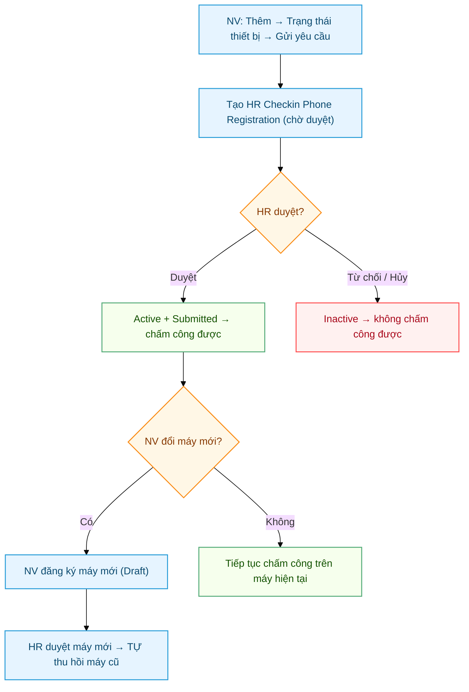

# HR Checkin Phone Registration — Duyệt thiết bị nhân viên

> Mỗi nhân viên cần được duyệt **1 thiết bị** (đúng máy đang dùng) trước khi có thể chấm công. Submittable doctype.
> Tự động được tạo khi nhân viên mở PWA `/my-workspace` lần đầu trên một máy chưa đăng ký.
>
> **Định danh bằng khóa thiết bị (cập nhật 2026-06):** mỗi máy sinh **cặp khóa ECDSA P-256 non-extractable** trong trình duyệt (IndexedDB); `device_id` = SHA-256(public key) là **khóa ổn định** — thay cho `device_fingerprint` (băm user-agent) vốn dễ đổi khi trình duyệt cập nhật → trước đây gây "1 nhân viên nhiều device ID". Mỗi lần chấm công, máy **ký challenge** của server bằng private key → chống giả mạo & replay. Chi tiết [§7](#7-cơ-chế-device_id--ký-challenge).
>
> **Device-aware**: "đã đăng ký" tính theo **đúng máy hiện tại** (device_id, fallback fingerprint cho máy cũ), không phải "nhân viên có máy nào đó đã duyệt". Đăng nhập máy mới chưa duyệt → bị đẩy sang trang đăng ký, kể cả khi máy cũ vẫn Active.

---

## Sơ đồ quy trình thiết bị (đăng ký / duyệt / đổi / hủy)



---

## Mục lục

1. [Tại sao cần](#1-tại-sao-cần)
2. [Cách mở](#2-cách-mở)
3. [Các field](#3-các-field)
4. [Quy trình duyệt](#4-quy-trình-duyệt)
5. [Đổi phone — re-register](#5-đổi-phone--re-register)
6. [Audit khi nghi cheat](#6-audit-khi-nghi-cheat)
7. [Cơ chế device_id + ký challenge](#7-cơ-chế-device_id--ký-challenge)

---

## 1. Tại sao cần

Để **chống share tài khoản + chấm công hộ**. Nhân viên đã đăng ký máy X → chỉ máy X mới chấm công được. Login máy khác → `device_id` khác → server reject. Quan trọng hơn: mỗi lần chấm công máy phải **ký challenge** bằng private key (không rời máy) → **không thể giả mạo** kể cả khi biết device_id.

Mỗi nhân viên có **1 thiết bị Active** tại một thời điểm. Khi HR duyệt máy mới, hệ thống **tự thu hồi (cancel) máy Active cũ** (`on_submit`) → không cần thao tác tay, luôn đúng 1 active.

**Device-aware**: PWA gửi `device_id` (+ `device_fingerprint` để audit) qua arg hoặc header `X-Device-Id` / `X-Device-Fingerprint`. API `get_phone_registration_status` / `get_attendance_info` tính `phone_registered` theo **đúng máy hiện tại** — khớp `device_id` **HOẶC** fingerprint (fallback cho máy legacy chưa có key):
- Máy hiện tại có record Active → `phone_registered = true`.
- Chưa có (hoặc còn Draft) → `phone_registered = false` → PWA đẩy sang trang đăng ký, **dù** nhân viên có máy khác đang Active.
- Có máy Active khác → cờ `other_active = true` để UI nhắc.

> ⚠️ Match theo "device_id HOẶC fingerprint" là cố ý: user **máy cũ (legacy, chưa key) mở app phiên bản mới** vẫn được nhận là "đã đăng ký" (khớp bằng fingerprint) → **không bị bắt đăng ký lại đồng loạt**. Xem [§7](#7-cơ-chế-device_id--ký-challenge).

---

## 2. Cách mở

- Desk → search "HR Checkin Phone Registration"
- URL: `/app/hr-checkin-phone-registration`
- Filter status=Draft để xem queue chờ duyệt

---

## 3. Các field

### `name` (Random hash)

Auto-gen. Không sửa được.

### `employee` (Link → Employee, **bắt buộc**)

Nhân viên đăng ký. Phải link đến `Employee` có `user_id` = user đang login.

PWA tự fill khi nhân viên mở app lần đầu → user thường không tự sửa field này.

### `device_id` (Data, read-only) — **khóa chính nhận diện máy**

SHA-256 hex của **public key** (SPKI) của cặp khóa thiết bị. **Ổn định** suốt vòng đời khóa (không đổi khi trình duyệt cập nhật). PWA tự sinh. Server dùng làm khóa get-or-create đăng ký (hết tình trạng tạo trùng do fingerprint đổi). *Trống ở các đăng ký legacy tạo trước 2026-06 → xem [§7](#7-cơ-chế-device_id--ký-challenge).*

### `public_key` (Code, read-only)

Public key (SPKI base64) của thiết bị. Server lưu để **verify chữ ký challenge** khi chấm công. Private key tương ứng **non-extractable**, nằm trong IndexedDB của máy, không bao giờ rời máy. PWA tự sinh, HR không nhập tay.

### `device_fingerprint` (Data, **bắt buộc**, read-only) — *audit*

SHA256 hex (64 ký tự) băm từ thuộc tính trình duyệt (userAgent, screen, timezone, language). **Trước đây là khóa nhận diện** nhưng **không ổn định** (đổi theo bản trình duyệt / cửa mở app) → nay **giáng xuống chỉ để audit + fallback cho máy legacy**. Khóa chính là `device_id`.

### `user_agent` (Small Text, read-only)

User-Agent string của browser. Vd:
```
Mozilla/5.0 (iPhone; CPU iPhone OS 18_2) AppleWebKit/...
```

Giúp HR Manager nhận diện phone (iPhone? Samsung? Brand nào?) trước khi duyệt.

### `status` (Select)

| Value | Ý nghĩa |
|---|---|
| Active | Phone đang được phép chấm công |
| Inactive | Phone bị tạm khóa (nhân viên xin nghỉ, đổi máy) |

Sau khi submit (docstatus=1), status mặc định = Active. Đổi sang Inactive khi cần khóa.

### `docstatus` (built-in)

| Value | Ý nghĩa |
|---|---|
| 0 | Draft — vừa tạo, chờ HR duyệt |
| 1 | Submitted — đã active, phone chấm công được |
| 2 | Cancelled — đã hủy, phone không chấm được nữa |

---

## 4. Quy trình duyệt

### Bước 1: Nhân viên tạo (tự động)

1. Nhân viên mở PWA `/my-workspace` trên máy chưa đăng ký → login Frappe
2. PWA sinh cặp khóa (nếu chưa có) → gửi `POST phone_device.register_phone` với `device_id` + `public_key` (+ `device_fingerprint` audit). Server kiểm `device_id == SHA-256(public_key)` (chống ghép bừa).
3. Server **get-or-create theo `device_id`**: đã có đăng ký cùng device_id (chờ/đã duyệt) → trả `status=exists` (idempotent, **hết tạo trùng do race / fingerprint đổi**); chưa có → tạo record **Draft** (docstatus=0).
4. PWA hiển thị "Thiết bị đang chờ HR duyệt"

### Bước 2: HR Manager duyệt

1. Mở danh sách `HR Checkin Phone Registration`, filter docstatus=0 (Draft)
2. Click record → kiểm tra:
   - `employee` đúng nhân viên không?
   - `user_agent` có vẻ là phone của nhân viên đó không (iPhone với username Apple, Samsung với username Samsung, etc.)?
   - Trùng `device_id` (hoặc fingerprint) với nhân viên khác không? (filter xem có record của người khác cùng máy — nếu có, **không duyệt** vì có thể share phone)
3. Nếu OK → click **Submit** (status auto = Active). Nếu nhân viên đã có máy Active cũ → hệ thống **tự thu hồi máy cũ** (không cần làm tay).
4. Nếu không OK → click **Delete** (xóa record draft)

### Bước 3: Nhân viên check lại PWA

PWA tự re-check status mỗi lần mở (theo đúng fingerprint máy hiện tại). Khi máy hiện tại thành Active → cho phép tap "Chấm công".

---

## 5. Đổi phone / đổi browser — re-register

Khi nào dùng:
- Nhân viên mua phone mới
- Phone cũ hỏng/mất
- Đổi sang browser khác (Safari → Chrome → fingerprint khác)
- Đăng ký nhầm thiết bị test

### Quy trình chuẩn

**Bước 1: Nhân viên đăng ký máy mới (làm trước, không cần đợi HR)**

1. Mở PWA `/my-workspace` trên máy/browser mới → login Frappe
2. PWA detect `device_id` khác máy cũ → máy mới chưa duyệt → đẩy sang trang đăng ký, **tự tạo record mới ở Draft**
3. PWA hiển thị "Đang chờ HR duyệt" (cờ `other_active` báo còn máy cũ Active).

→ Lúc này: 1 record CŨ Active (docstatus=1) + 1 record MỚI Draft (docstatus=0).

**Bước 2: HR Manager Submit record mới → tự thu hồi máy cũ**

1. Mở record MỚI (Draft) → review `user_agent` có vẻ là máy của nhân viên đó không
2. Click **Submit** → docstatus=1, status=Active
3. `on_submit` **tự cancel máy Active cũ** (docstatus=2 + status=Inactive). **Không cần deactivate tay.**

**Bước 3: Nhân viên refresh PWA** → thấy Active → chấm công được.

> 💡 **Khác bản cũ:** trước đây HR phải tự đổi máy cũ sang Inactive trước, không thì bị chặn (throw "đã có phone Active"). Nay **duyệt máy mới = máy cũ tự thu hồi** — gọn hơn, luôn đảm bảo đúng 1 active/nhân viên.

### Khi nào Cancel thay vì Inactive?

| Action | Khi nào dùng | Hệ quả |
|---|---|---|
| **(Tự động) Cancel khi duyệt máy mới** | Nhân viên đổi máy | `on_submit` máy mới tự cancel máy cũ (docstatus=2 + Inactive). HR không phải làm gì. |
| **Set status=Inactive** (tay) | **Tạm khóa** máy mà KHÔNG duyệt máy thay thế (vd NV nghỉ tạm) | docstatus vẫn = 1, badge Inactive. Reactivate lại được (đổi Active). |
| **Cancel** (tay, docstatus=2) | Record nhập sai cần xóa hẳn | Khó trace lại, không reactivate. |

**Khuyến nghị**: đổi máy thì cứ duyệt máy mới (tự thu hồi cũ); chỉ dùng Inactive tay khi muốn tạm khóa mà chưa có máy thay.

### Test flow này nhanh (dev)

Tận dụng 2 browser khác nhau làm 2 phone:

1. Chrome → `/my-workspace` → đăng ký → HR submit → chấm công OK
2. Mở **Firefox** (hoặc Chrome Incognito) → `/my-workspace` → đăng ký lần 2 → Draft mới (device_id khác)
3. Desk: record Firefox → **Submit** → record Chrome **tự bị cancel** (Inactive)
4. Firefox refresh → chấm công được; Chrome → bị đẩy về trang đăng ký

---

## 6. Audit khi nghi cheat

### Case 1: Nhân viên báo "không chấm được"

1. Mở record của nhân viên đó
2. Check docstatus:
   - 0 (Draft) → chưa duyệt, submit nếu hợp lệ
   - 1 (Submitted) + status=Active → đáng lẽ work, check log server
   - 1 + status=Inactive → đổi sang Active
   - 2 (Cancelled) → phone đã bị hủy. Hỏi nhân viên có đổi phone không, làm quy trình ở [phần 5](#5-đổi-phone--re-register)

### Case 2: Nghi nhân viên share phone

1. Filter danh sách `HR Checkin Phone Registration` theo `device_id` (hoặc `device_fingerprint`) của nhân viên A
2. Nếu thấy 2+ record cùng `device_id`/fingerprint khác nhân viên → **đây là share phone** (hoặc anh em ruột chung phone)
3. Điều tra:
   - Mở các `Employee Checkin` của 2 nhân viên đó
   - So sánh timestamp + GPS + selfie
   - Nếu cùng giờ + cùng GPS + ảnh là cùng 1 người → confirm cheat

### Case 3: Phone không khớp với checkin

1. Mở 1 `Employee Checkin` đáng nghi
2. Lấy `custom_phone_device_fingerprint` của bản ghi đó
3. So sánh với `device_fingerprint` của `HR Checkin Phone Registration` của nhân viên đó
4. Khác nhau = **chấm từ phone không phải phone đăng ký** → cheat hoặc sự cố kỹ thuật

> 💡 Với cơ chế ký challenge ([§7](#7-cơ-chế-device_id--ký-challenge)), máy đã có key thì check-in giả/replay **bị chặn ngay tại server** (sai chữ ký → reject) → loại gian lận này gần như không còn với máy đã nâng key.

---

---

## 7. Cơ chế device_id + ký challenge

> Cập nhật 2026-06. Vá 2 điểm yếu của cơ chế fingerprint cũ: (1) `device_fingerprint` (băm user-agent) **không ổn định** — đổi khi trình duyệt cập nhật / mở qua Chrome vs in-app browser (Zalo, FB) → 1 nhân viên đẻ nhiều device ID + đăng ký trùng; (2) fingerprint **giả được** — gửi lại chuỗi là qua.

### 7.1 Khóa thiết bị (device-bound key)

- PWA sinh **cặp khóa ECDSA P-256 non-extractable** lưu trong **IndexedDB** (`mw-device`). Private key **không rút ra được** kể cả bằng JS → không clone sang máy khác.
- `device_id` = **SHA-256(public key SPKI)** — ổn định suốt vòng đời khóa.
- Public key (SPKI base64) lưu ở field `public_key`.
- Khóa chỉ mất khi user **xóa dữ liệu site / chế độ ẩn danh** → sinh khóa mới = thiết bị mới, cần HR duyệt (hiếm).

### 7.2 Ký challenge khi chấm công (chống giả & replay)

```
máy --(xin challenge: get_checkin_challenge)--> server --(nonce ngẫu nhiên)--> máy
máy ký(nonce) bằng private key --(signature)--> server: verify bằng public_key đã lưu
```

- Nonce **dùng-một-lần**, hết hạn ~120s (cache). Dùng xong huỷ → chữ ký cũ vô dụng (**chống replay**).
- `checkin` / `checkin_wfh` → `_require_registered_phone`: tìm đăng ký Active theo `device_id` (fallback fingerprint); nếu đăng ký **có `public_key`** → **bắt buộc** chữ ký hợp lệ mới cho chấm công.
- Biết `device_id` mà không có private key → **không ký được** → bị chặn. (TLS bảo vệ chữ ký trên đường truyền; nonce one-time chặn replay.)

### 7.3 Grandfather + tự nâng cấp fleet legacy (KHÔNG bắt đăng ký lại)

- Đăng ký **legacy** (trước 2026-06, chưa `public_key`) vẫn chấm công bằng fingerprint (**grandfather**) → deploy không gãy ai.
- User mở app bản mới + có **đúng 1 đăng ký Active chưa key** → `get_attendance_info` trả `device_needs_key=true` → PWA gọi `ensure_device_key` → server **gắn key vào đăng ký hiện có tại chỗ** (KHÔNG tạo bản mới, KHÔNG cần HR duyệt lại). Từ đó máy bắt đầu ký challenge.
- Sau khi đã có key, **máy MỚI về sau vẫn phải qua HR duyệt** (không bypass vĩnh viễn).

### 7.4 Ép chữ ký cứng (`enforce_device_signature`)

Checkbox **Enforce Device Signature** trên **HR Policy** (mỗi Company một flag, tab Attendance → Feature Flags). Mặc định **TẮT** (grandfather).

- **Tắt** (mặc định): đăng ký chưa key vẫn chấm công bằng fingerprint; đăng ký có key thì bắt chữ ký.
- **Bật**: bắt chữ ký cho **mọi** check-in. Đăng ký nào **chưa có `public_key`** → từ chối (`DEVICE_KEY_REQUIRED`, báo "đăng ký lại thiết bị") → buộc nốt máy sót lên key → đóng đường giả-bằng-fingerprint.

**Khi nào bật:** sau khi theo dõi gần như mọi đăng ký Active đã có key. Kiểm độ sẵn sàng:
```
chưa key = count(HR Checkin Phone Registration WHERE status='Active' AND docstatus=1 AND public_key IS NULL)
```
Về gần 0 → bật flag cho Company đó (các máy sót sẽ được nhắc đăng ký lại). Nhờ `ensure_device_key` tự nâng key lúc mở app, đa số máy đã có key trước khi bật nên ít bị chặn.

### 7.5 Field & endpoint liên quan

| Field | Vai trò |
|---|---|
| `device_id` | Khóa nhận diện máy (ổn định) |
| `public_key` | Verify chữ ký challenge |
| `device_fingerprint` | Audit + fallback legacy |

Endpoint: `register_phone(device_fingerprint, device_id, public_key)` · `ensure_device_key(...)` · `get_checkin_challenge(device_id)` · `checkin/checkin_wfh(..., device_id, signature)`.

---

## Liên quan

- [HR Office Location](HR-Office-Location.html)
- [HR Policy](HR-Policy.html)
- [Tổng quan & Setup](Cham-Cong-Tong-Quan.html)
