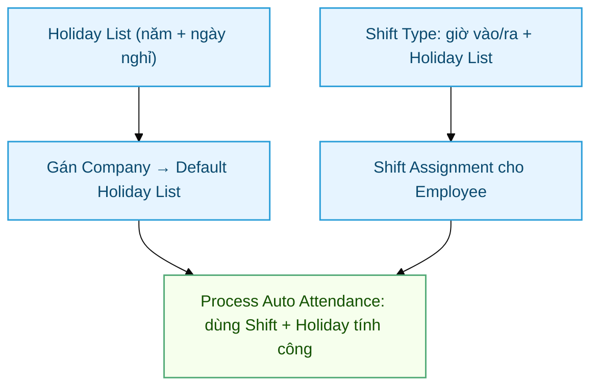

# Holiday & Shift Type — Cấu hình HRMS chuẩn

> Đối tượng: **HR Manager**, **System Manager**. Cobe **không code** 2 phần này — chỉ cấu hình HRMS chuẩn. Doc dùng cho onboarding HR mới.

## Sơ đồ quy trình setup

## Mục lục

1. [Tại sao cần cấu hình](#1-tại-sao-cần-cấu-hình)
2. [Holiday List](#2-holiday-list)
3. [Shift Type](#3-shift-type)
4. [Shift Assignment](#4-shift-assignment)
5. [Gán Holiday + Shift cho Employee](#5-gán-holiday--shift-cho-employee)
6. [Kết nối với chấm công Cobe](#6-kết-nối-với-chấm-công-cobe)

---

## 1. Tại sao cần cấu hình

Hệ thống chấm công Cobe **phụ thuộc** vào 2 master data chuẩn của HRMS:

| Doctype HRMS | Vai trò trong Cobe |
|---|---|
| **Holiday List** | Xác định ngày lễ + ngày nghỉ hàng tuần. Auto-attendance bỏ qua không mark Absent. OT request auto-detect `day_type = Holiday` |
| **Shift Type** | Định nghĩa ca làm việc (giờ start/end). Auto-attendance dùng để tính `working_hours`, late_entry, early_exit. `Attendance.before_save` của Cobe dùng để fill working_hours khi WFH/On Duty không có log |
| **Shift Assignment** | Gán Employee + Shift + khoảng thời gian. Quyết định ngày nào NV có ca → notify quên check chỉ áp dụng cho ngày có Shift |

---

## 2. Holiday List

### Tạo Holiday List

1. Desk → search "Holiday List" → New
2. Điền:
   - `Holiday List Name`: vd "Cobe 2026 — Office Vietnam"
   - `From Date / To Date`: 2026-01-01 → 2026-12-31
3. Bấm **Get Weekly Off Dates**:
   - Chọn `Weekly Off = Sunday` (Chủ nhật)
   - → Tự generate 52 records "Sunday" vào child table Holidays
4. Add manual các ngày lễ Việt Nam:
   - 01/01 Tết Dương lịch
   - Tết Âm lịch (vd 17-23/02/2026)
   - 30/04 Giải phóng + 01/05 Quốc tế Lao động
   - 02/09 Quốc khánh
   - ... (theo Luật LĐ + nội bộ Cobe)
5. **Save**.

### Nhiều Holiday List cho từng nhóm

Theo mindmap Cobe: KTV / Office có Holiday List khác nhau nếu cần.

- KTV làm việc 6 ngày/tuần (chỉ nghỉ CN): tạo `Cobe 2026 — KTV` với `Weekly Off = Sunday`
- Office làm việc 5 ngày/tuần (T7+CN): tạo `Cobe 2026 — Office` với `Weekly Off = Saturday, Sunday`. Frappe support multi-weekly-off qua: tạo 2 lần Get Weekly Off Dates với 2 weekday khác nhau

### Set Default Holiday List

Setup → Settings → **HR Settings** → `Default Holiday List`: chọn 1 cái phổ biến nhất. Nhân viên không có Holiday List trên hồ sơ sẽ fallback về cái này.

---

## 3. Shift Type

### Tạo Shift Type

Mỗi nhóm NV (KTV / Office / Tư vấn) cần 1 Shift Type.

1. Desk → search "Shift Type" → New
2. Điền:
   - `Shift Type Name`: vd "Office 8h-17h"
   - `Start Time`: 08:00:00
   - `End Time`: 17:00:00
3. Section **Auto Attendance**:
   - `Enable Auto Attendance`: ✓
   - `Determine Check-in and Check-out`: chọn `Strictly based on Log Type in Employee Checkin` (vì PWA Cobe set `log_type` rõ ràng)
   - `Working Hours Calculation Based On`: **bắt buộc chọn `First Check-in and Last Check-out`** nếu Company bật lunch break auto-deduction (xem [HR Policy → Lunch Break](HR-Policy.html#33-lunch-break)). Combo `Every Valid` sẽ double-trừ break
   - `Working Hours Threshold for Half Day`: 4 (giờ)
   - `Working Hours Threshold for Absent`: 1 (giờ — quá ngắn = Absent)
   - `Process Attendance After`: dd/mm/yyyy ngày bắt đầu auto-attendance
4. Section **Late Entry / Early Exit** (optional):
   - `Enable Late Entry Marking`: ✓ nếu cần track đi muộn
   - `Late Entry Grace Period`: 10 (phút)
5. Section **Lunch Break (Cobe custom)** — optional override:
   - `Lunch Start Time (override)`: vd 12:00:00 — đè HR Policy default
   - `Lunch Break Minutes (override)`: vd 0 (KTV không break) / 90 (tư vấn break dài) — đè HR Policy default
   - Để trống = dùng HR Policy của Company
6. **Save**.

### Mẫu Shift cho Cobe

| Shift Type | Start | End | Use case |
|---|---|---|---|
| Office 8h-17h | 08:00 | 17:00 | Văn phòng Office |
| KTV 8h-17h | 08:00 | 17:00 | KTV làm việc + có Service Appointment chính |
| Tư vấn 9h-18h | 09:00 | 18:00 | Tư vấn / Sales |

---

## 4. Shift Assignment

Gán Employee + Shift Type cho 1 khoảng thời gian:

1. Desk → search "Shift Assignment" → New
2. Điền:
   - `Employee`: chọn NV
   - `Shift Type`: chọn ca đã tạo
   - `Start Date`: ngày bắt đầu áp dụng
   - `End Date`: để trống = áp dụng vô thời hạn (cho đến khi tạo Assignment mới hoặc cancel)
   - `Status`: Active
3. **Save** → **Submit**.

### Bulk assignment

- Desk → Shift Assignment → Tools → **Shift Assignment Tool**
- Filter Department / Designation → chọn Shift → Apply.

---

## 5. Gán Holiday + Shift cho Employee

Mỗi Employee cần:

1. Mở Employee record
2. Tab **Attendance & Leave Details**:
   - `Default Shift`: chọn Shift Type chính (HRMS fallback khi không có Shift Assignment cụ thể)
   - `Holiday List`: chọn Holiday List phù hợp (KTV / Office)
3. **Save**.

---

## 6. Kết nối với chấm công Cobe

Sau khi cấu hình 2 phần trên, hệ thống Cobe hoạt động:

### Khi NV check-in từ PWA

1. API `attendance.checkin` insert Employee Checkin (raw log, không có shift info)
2. Scheduled job HRMS `Process Auto Attendance` chạy (mỗi 15 phút)
3. Job nhóm Employee Checkin theo (employee, shift, ngày) → tạo / update `Attendance` record
4. Hook `Attendance.before_save` của Cobe chạy:
   - Nếu `working_hours = 0` + status WFH/On Duty + có Shift → fill working_hours = giờ ca chuẩn
   - Set `hr_warning_type = "Không có ca"` cho:
     + KTV whitelist không có FS Service Appointment hôm đó
     + Office non-whitelist không có Shift gắn

### Khi NV xin nghỉ qua Leave Application

1. NV submit Leave Application (workflow 2-step Cobe — xem [HR-Leave-Setup](HR-Leave-Setup.html))
2. Sau approve, HRMS tự tạo Attendance status "On Leave" cho khoảng ngày + skip working_hours
3. Holiday List ngày lễ → HRMS không mark Absent

### Khi notify quên check (job 21:00)

1. Job quét Employee có Shift Assignment hôm nay
2. Không có Employee Checkin nào → notify "Quên chấm công"
3. Có IN nhưng không có OUT → notify "Quên check-out"

→ Bắt buộc Shift Assignment để NV được vào danh sách quét. NV không có Shift Assignment sẽ bị bỏ qua (không notify, nhưng có thể bị mark Absent nếu Process Auto Attendance config thế).

---

## Liên quan

- [HR Policy](HR-Policy.html) — feature flag + whitelist
- [HR Leave Setup](HR-Leave-Setup.html) — workflow 2 bước + Earned Leave
- [Tổng quan Chấm công](Cham-Cong-Tong-Quan.html)
