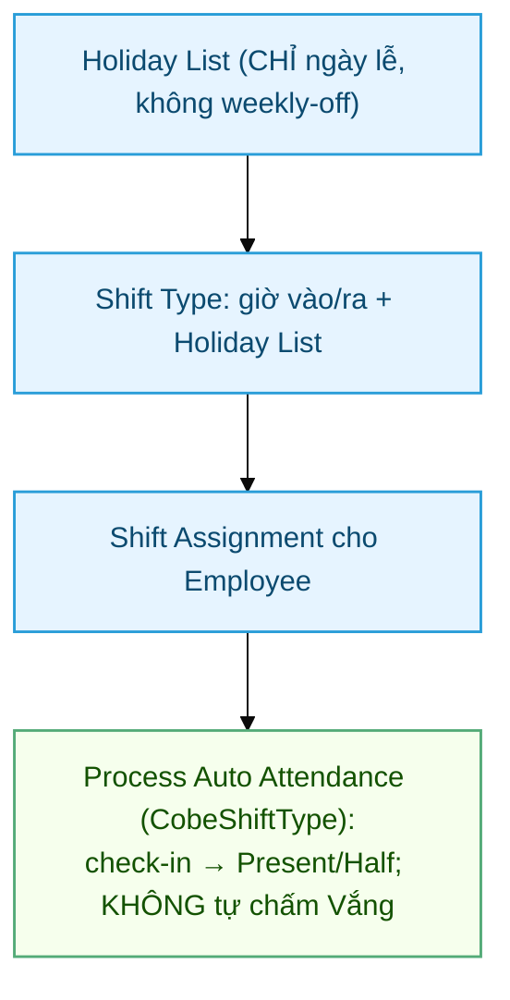

# Holiday & Shift Type — Cấu hình chấm công (presence-based)

> Đối tượng: **HR Manager**, **System Manager**. Doc dùng cho onboarding HR mới.

> **Mô hình presence-based (quan trọng):** Cobe **KHÔNG mã hoá ngày nghỉ tuần** vào
> Holiday List (cuối tuần tùy biến theo từng người/phòng). **Holiday List chỉ chứa
> ngày lễ.** Dùng **Attendance để ghi nhận ngày ĐI LÀM** (Present/Half tạo từ
> check-in); ngày không có check-in để **trống = nghỉ**, KHÔNG bị chấm Vắng.
>
> Để làm được, Cobe override `Shift Type` (class `CobeShiftType`) **vô hiệu phần tự
> chấm Vắng** của HRMS. Vắng thật (trốn làm, không xin phép) bắt bằng job "quên chấm
> công" 21h + xử lý thủ công / Leave. Nửa ngày T7 tự ra theo ngưỡng half-day.

## Sơ đồ quy trình setup

## Mục lục

1. [Tại sao cần cấu hình](#1-tại-sao-cần-cấu-hình)
2. [Holiday List](#2-holiday-list)
3. [Shift Type](#3-shift-type)
4. [Shift Assignment](#4-shift-assignment)
5. [Gán Holiday + Shift cho Employee](#5-gán-holiday--shift-cho-employee)
6. [Kết nối với chấm công Cobe](#6-kết-nối-với-chấm-công-cobe)

---

## 1. Tại sao cần cấu hình

Hệ thống chấm công Cobe **phụ thuộc** vào 2 master data chuẩn của HRMS:

| Doctype HRMS | Vai trò trong Cobe |
|---|---|
| **Holiday List** | **CHỈ ngày lễ** (không weekly-off). Auto-attendance bỏ qua không tính công ngày lễ. OT request auto-detect `day_type = Holiday` |
| **Shift Type** | Định nghĩa ca làm việc (giờ start/end) + ngưỡng half-day (nửa ngày T7). Auto-attendance tính `working_hours`, late_entry, early_exit. Override `CobeShiftType` chặn tự chấm Vắng. `Attendance.before_save` của Cobe fill working_hours khi WFH/On Duty không có log |
| **Shift Assignment** | Gán Employee + Shift + khoảng thời gian. Quyết định ngày nào NV có ca → notify quên check chỉ áp dụng cho ngày có Shift |

---

## 2. Holiday List (chỉ lễ — KHÔNG weekly-off)

> ⚠️ **KHÔNG bấm Get Weekly Off Dates.** Mô hình presence-based không mã hoá nghỉ
> tuần. Holiday List chỉ chứa **ngày lễ**. Chỉ cần **1 list duy nhất** dùng chung 3
> công ty.

### Tạo Holiday List

1. Desk → search "Holiday List" → New
2. Điền:
   - `Holiday List Name`: `Cobe 2026 — Lễ VN`
   - `From Date / To Date`: 2026-01-01 → 2026-12-31
3. Mục **Add to Holidays**: chọn `Country = Vietnam` → bấm **Get Local Holidays**
   → tự thêm các ngày lễ VN 2026 (Tết 16–20/02, Giỗ Tổ 26–27/04, 30/04, 01/05,
   01–02/09).
4. **Save**.

> **Seed nhanh không cần bấm tay:** xem `scripts/setup_shifts.py` (chạy qua
> `bench console`, local) — tạo sẵn list lễ + Shift Type. Trên cloud không shell:
> tạo Holiday List bằng UI như trên + import Shift Type bằng CSV
> (`scripts/shift_type_import.csv`).

### Set Default Holiday List

Setup → Settings → **HR Settings** → `Default Holiday List` = `Cobe 2026 — Lễ VN`.
Nhân viên không có Holiday List trên hồ sơ sẽ fallback về cái này.

---

## 3. Shift Type

### Tạo Shift Type

Mỗi nhóm NV (KTV / Office / Tư vấn) cần 1 Shift Type.

1. Desk → search "Shift Type" → New
2. Điền:
   - `Shift Type Name`: vd "Office 8h-17h"
   - `Start Time`: 08:00:00
   - `End Time`: 17:00:00
3. Section **Auto Attendance**:
   - `Enable Auto Attendance`: ✓
   - `Determine Check-in and Check-out`: chọn `Strictly based on Log Type in Employee Checkin` (vì PWA Cobe set `log_type` rõ ràng)
   - `Working Hours Calculation Based On`: **bắt buộc chọn `First Check-in and Last Check-out`** nếu Company bật lunch break auto-deduction (xem [HR Policy → Lunch Break](HR-Policy.html#33-lunch-break)). Combo `Every Valid` sẽ double-trừ break
   - `Working Hours Threshold for Half Day`: vd **6** (ca 8h–17h30) — ai làm < 6h
     (vd **sáng T7 ~4h**) → tự thành **Half Day = 0.5 công**; ≥ 6h → Present
   - `Working Hours Threshold for Absent`: **1** (chỉ áp cho ngày CÓ check-in quá
     ngắn; ngày KHÔNG check-in **không** bị chấm Vắng nhờ override `CobeShiftType`)
   - `Holiday List`: `Cobe 2026 — Lễ VN`
   - `Process Attendance After`: ngày bắt đầu auto-attendance (vd 2026-01-01)
4. Section **Late Entry / Early Exit** (optional):
   - `Enable Late Entry Marking`: ✓ nếu cần track đi muộn
   - `Late Entry Grace Period`: 10 (phút)
5. Section **Lunch Break (Cobe custom)** — optional override:
   - `Lunch Start Time (override)`: vd 12:00:00 — đè HR Policy default
   - `Lunch Break Minutes (override)`: vd 0 (KTV không break) / 90 (tư vấn break dài) — đè HR Policy default
   - Để trống = dùng HR Policy của Company
6. **Save**.

### Mẫu Shift cho Cobe (theo GIỜ)

> Off-day không mã hoá nên **không tách ca theo phòng/chi nhánh** — chỉ theo giờ làm.
> Nửa ngày T7 tự ra theo ngưỡng half-day, không cần ca riêng.
>
> **Ca đặc biệt cần xử tay:**
> - **Marketing "sáng T7 mặc định 0.5 công"** = được 0.5 công T7 **dù không đi làm** →
>   presence-based không tạo công khi không check-in → đây là **luật lương riêng**,
>   HR **cấp tay** (hoặc cần code riêng nếu muốn tự động). Không nhét vào Shift Type được.
> - **SR tỉnh off T2** (Cần Thơ/VT/BD/ĐN, làm T3–CN): off T2 = ngày không check-in =
>   tự động nghỉ, không cần ca/holiday riêng.

| Shift Type | Start | End | Half-day < | Lunch | Use case |
|---|---|---|---|---|---|
| Văn phòng 8h–17h30 | 08:00 | 17:30 | 6h | 90' | Nhân sự, Bảo dưỡng, Marketing, Kho, Kỹ thuật, TGĐG/TGLT, Fujiiryoki, Team KD |
| Kế toán 8h–17h | 08:00 | 17:00 | 6h | 60' | Kế toán |
| Migunlife 7h–17h | 07:00 | 17:00 | 5h | 60' | Migunlife |
| Akanwa ca sáng 8h–14h | 08:00 | 14:00 | 3h | 0' | Akanwa (ca xoay) |
| Akanwa ca chiều 14h–20h | 14:00 | 20:00 | 3h | 0' | Akanwa (ca xoay) |

### Override chặn tự chấm Vắng (CobeShiftType)

Code: `hr_for_cobegroup/overrides/shift_type.py` + `override_doctype_class` trong
hooks. Override `mark_absent_for_dates_with_no_attendance` + `mark_absent_for_half_day_dates`
thành **no-op** → auto attendance vẫn tạo Present/Half từ check-in nhưng **không tự
chấm Vắng** ngày không có check-in.

> ⚠️ **Thứ tự deploy:** phải deploy override **TRƯỚC** khi Shift Type bật auto
> attendance chạy lần đầu, kẻo cuối tuần bị chấm Vắng oan.

---

## 4. Shift Assignment

Gán Employee + Shift Type cho 1 khoảng thời gian:

1. Desk → search "Shift Assignment" → New
2. Điền:
   - `Employee`: chọn NV
   - `Shift Type`: chọn ca đã tạo
   - `Start Date`: ngày bắt đầu áp dụng
   - `End Date`: để trống = áp dụng vô thời hạn (cho đến khi tạo Assignment mới hoặc cancel)
   - `Status`: Active
3. **Save** → **Submit**.

### Bulk assignment

- Desk → Shift Assignment → Tools → **Shift Assignment Tool**
- Filter Department / Designation → chọn Shift → Apply.

---

## 5. Gán Holiday + Shift cho Employee

Mỗi Employee cần:

1. Mở Employee record
2. Tab **Attendance & Leave Details**:
   - `Default Shift`: chọn Shift Type chính (HRMS fallback khi không có Shift Assignment cụ thể)
   - `Holiday List`: `Cobe 2026 — Lễ VN` (dùng chung, vì chỉ chứa ngày lễ)
3. **Save**.

---

## 6. Kết nối với chấm công Cobe

Sau khi cấu hình 2 phần trên, hệ thống Cobe hoạt động:

### Khi NV check-in từ PWA

1. API `attendance.checkin` insert Employee Checkin (raw log, không có shift info)
2. Scheduled job HRMS `Process Auto Attendance` chạy (mỗi 15 phút)
3. Job nhóm Employee Checkin theo (employee, shift, ngày) → tạo / update `Attendance` record
4. Hook `Attendance.before_save` của Cobe chạy:
   - Nếu `working_hours = 0` + status WFH/On Duty + có Shift → fill working_hours = giờ ca chuẩn
   - Set `hr_warning_type = "Không có ca"` cho:
     + KTV whitelist không có FS Service Appointment hôm đó
     + Office non-whitelist không có Shift gắn

### Khi NV xin nghỉ qua Leave Application

1. NV submit Leave Application (workflow 2-step Cobe — xem [HR-Leave-Setup](HR-Leave-Setup.html))
2. Sau approve, HRMS tự tạo Attendance status "On Leave" cho khoảng ngày + skip working_hours
3. Holiday List ngày lễ → HRMS không tạo công ngày lễ

### Vắng (Absent) — KHÔNG tự chấm

Mô hình presence-based: ngày không có check-in **để trống = nghỉ** (cuối tuần tùy
biến), **không** bị chấm Vắng (nhờ override `CobeShiftType`). Bảng công tháng chỉ có
Present / Half Day / On Leave. Vắng thật bắt qua job "quên chấm công" + xử lý thủ công.

### Khi notify quên check (job 21:00)

1. Job quét Employee có Shift Assignment hôm nay
2. Không có Employee Checkin nào → notify "Quên chấm công"
3. Có IN nhưng không có OUT → notify "Quên check-out"

→ Bắt buộc Shift Assignment để NV được vào danh sách quét. NV không có Shift Assignment sẽ bị bỏ qua.

---

## Liên quan

- [HR Policy](HR-Policy.html) — feature flag + whitelist
- [HR Leave Setup](HR-Leave-Setup.html) — workflow 2 bước + Earned Leave
- [Tổng quan Chấm công](Cham-Cong-Tong-Quan.html)
