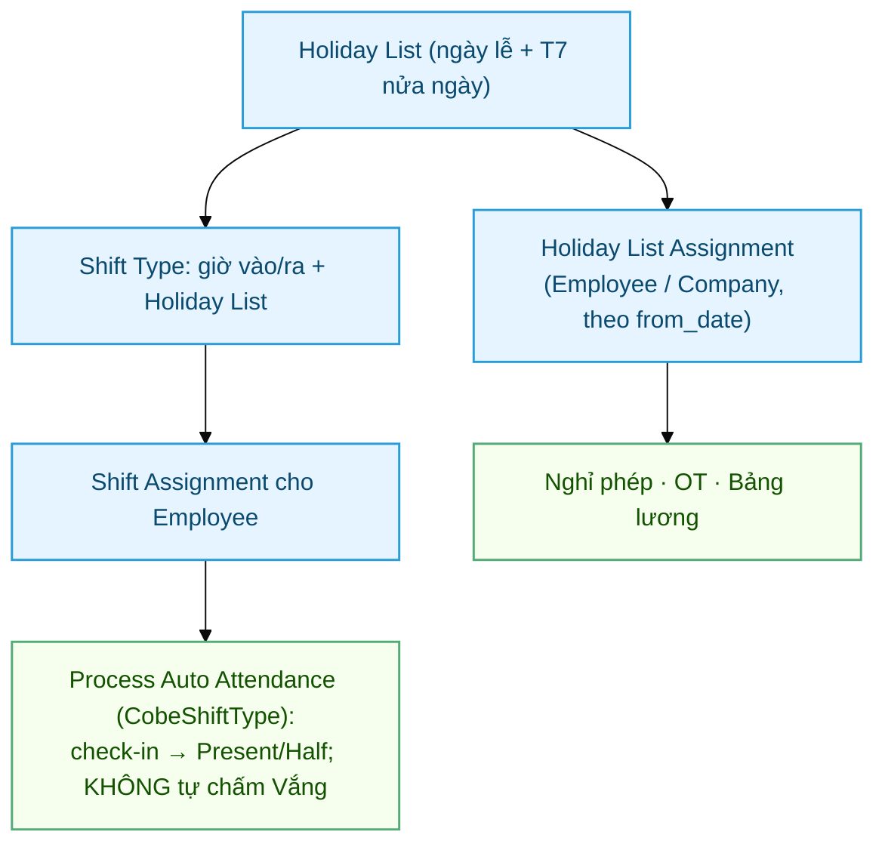

# Holiday & Shift — Cấu hình ca làm việc và ngày nghỉ

> Đối tượng: **HR Manager**, **System Manager**. Doc dùng cho onboarding HR mới và
> cho các thao tác định kỳ: gán ca NV mới, đổi ca NV cũ, chuyển năm.

> **Mô hình presence-based (quan trọng):** Cobe **KHÔNG mã hoá ngày nghỉ tuần** vào
> Holiday List (cuối tuần tùy biến theo từng người/phòng). Dùng **Attendance để ghi
> nhận ngày ĐI LÀM** (Present/Half tạo từ check-in); ngày không có check-in để
> **trống = nghỉ**, KHÔNG bị chấm Vắng.
>
> Để làm được, Cobe override `Shift Type` (class `CobeShiftType`) **vô hiệu phần tự
> chấm Vắng** của HRMS. Vắng thật (trốn làm, không xin phép) bắt bằng job "quên chấm
> công" 21h + xử lý thủ công / Leave.
>
> **Ngoại lệ duy nhất:** thứ 7 nửa ngày của khối văn phòng ĐƯỢC mã hoá — bằng
> `is_half_day = 1`, **không** phải weekly-off. Xem [mục 2](#2-holiday-list).

## Sơ đồ quy trình setup



## Mục lục

1. [Ba nguồn dữ liệu phải đồng bộ](#1-ba-nguồn-dữ-liệu-phải-đồng-bộ)
2. [Holiday List](#2-holiday-list)
3. [Holiday List Assignment](#3-holiday-list-assignment)
4. [Shift Type](#4-shift-type)
5. [Gán ca + ngày nghỉ cho NV mới](#5-gán-ca--ngày-nghỉ-cho-nv-mới)
6. [Đổi ca cho NV đang làm](#6-đổi-ca-cho-nv-đang-làm)
7. [Chuyển năm (rollover)](#7-chuyển-năm-rollover)
8. [Kết nối với chấm công Cobe](#8-kết-nối-với-chấm-công-cobe)
9. [Ô `holiday_list` trên hồ sơ Employee](#9-ô-holiday_list-trên-hồ-sơ-employee)

---

## 1. Ba nguồn dữ liệu phải đồng bộ

Từ **29/07/2026**, ô `holiday_list` trên **mọi Shift Type đã được xoá trống**. Lý do:
nhiều nhóm nhân viên **dùng chung một ca nhưng lịch nghỉ khác nhau** (KTV làm thứ 7
nguyên ngày, khối tỉnh nghỉ thứ 2 làm Chủ nhật) — gắn lịch nghỉ vào ca thì không diễn
đạt nổi. Ngày nghỉ giờ **resolve hoàn toàn qua Holiday List Assignment**.

Thứ tự resolve: **HLA của Employee** (bản `from_date` ≤ ngày đang xét, mới nhất) →
**HLA của Company** → không có thì coi như không có ngày nghỉ nào.

Ba nguồn phải luôn trỏ về **cùng một Holiday List** cho mỗi nhân viên:

| Nguồn | Nhánh nào đọc | Sai thì hậu quả |
|---|---|---|
| **Holiday List Assignment** (HLA) | Chấm công tự động, nghỉ phép (số ngày bị trừ), OT (`is_rest_day`), Salary Slip | Thứ 7 không được chia đôi ngưỡng → **Half Day oan**; ngày lễ bị **trừ vào phép năm**; OT ngày lễ áp sai trần |
| **`Employee.holiday_list`** (field trên hồ sơ NV) | **Chỉ** Payroll Entry — đếm ngày lễ cho cảnh báo *unmarked attendance* (khi tick `validate_attendance`), trống thì lùi về list công ty | Cảnh báo "chưa chấm công" đếm sai; **không** ảnh hưởng tiền |
| **`Company.default_holiday_list`** | Fallback cuối của report và của `is_rest_day` | Chỉ ảnh hưởng khi 2 nguồn trên trống |

> ⚠️ **Đừng gắn lại `holiday_list` vào Shift Type.** Nó **đè lên HLA** ở nhánh chấm
> công (`ShiftType.get_holiday_list` ưu tiên ô trên ca) trong khi nghỉ phép và lương
> vẫn đọc HLA → hai nhánh tính theo hai lịch khác nhau, sai âm thầm tới kỳ lương.

> ✅ Report *Bảng chấm công Cobe* đã đọc theo HLA từ 29/07/2026 — cột *Tổng giờ chuẩn*
> và ký hiệu H/WO tra list của **từng nhân viên theo từng ngày**, nên hai người cùng ca
> mà khác lịch nghỉ vẫn ra đúng, và report không lệch với bảng công.

---

## 2. Holiday List

> Holiday List chứa **ngày lễ** (nghỉ trọn) và **thứ 7 nửa ngày** (`is_half_day = 1`)
> cho khối văn phòng. **KHÔNG** bấm *Get Weekly Off Dates* — nút đó tạo dòng
> `weekly_off = 1` nghỉ TRỌN, phá mô hình presence-based.

### Ba list đang dùng (2026)

| Holiday List | Nội dung | Dùng cho nhóm |
|---|---|---|
| `HL - Lễ VN - CN - 2026` | 51 Chủ nhật `weekly_off` + 12 ngày lễ = **63** | KTV · Kho · Migunlife · AKW Sáng/Chiều |
| `HL - Lễ VN - CN Và Nửa Ngày Thứ 7 - 2026` | như trên + **52 thứ 7 `is_half_day`** = **115** | Office · Office Kế Toán · Management |
| `HL - Lễ VN - Thứ 2 - 2026` | 50 thứ 2 `weekly_off` + 12 ngày lễ = **62** | Khối tỉnh làm **T3–CN**, nghỉ thứ 2 |

List thứ 2 **không chứa Chủ nhật** (nhóm này làm Chủ nhật), và 2 ngày lễ rơi đúng thứ 2
(16/02 Giao thừa, 27/04 Giỗ Tổ nghỉ bù) được ghi là **ngày lễ** chứ không phải nghỉ tuần —
để report hiện `H` thay vì `WO` và không bị các hàm "bỏ qua weekly-off" loại mất.

Vì sao dùng `is_half_day` mà không dùng weekly-off: `is_holiday()` của ERPNext lọc
`is_half_day = 0`, nên thứ 7 **không** bị coi là ngày nghỉ trọn (chấm công vẫn chạy
bình thường); còn `is_half_holiday()` thì bắt được nó để **chia đôi ngưỡng giờ công**
→ NV làm 4h sáng thứ 7 vẫn ra Present thay vì Half Day.

### Tạo / sửa Holiday List

1. Desk → search "Holiday List" → New (hoặc mở list có sẵn).
2. `Holiday List Name` + `From Date` / `To Date` (01/01 → 31/12 của năm).
3. Bảng **Holidays** → Add Row → điền `Date`, `Description`, tích `Is Half Day` nếu
   chỉ nghỉ nửa buổi → ESC → Save.
4. Ngày lễ VN có thể lấy nhanh: `Country = Vietnam` → **Get Local Holidays**.

> Holiday List **không submittable** → sửa thoải mái. Nhưng thêm ngày nằm ngoài
> khoảng `From Date`–`To Date` sẽ bị chặn → muốn nối dài sang năm sau thì **nới
> `To Date` trước**.

---

## 3. Holiday List Assignment

Doctype `Holiday List Assignment` (HLA) là cách HRMS gắn Holiday List **theo thời
gian**. Đây là thứ trả lời câu hỏi "sang năm mới thì đổi ở đâu".

| Field | Ý nghĩa |
|---|---|
| `applicable_for` | `Employee` hoặc `Company` |
| `assigned_to` | NV hoặc công ty |
| `holiday_list` | List áp dụng |
| `from_date` | **Ngày bắt đầu hiệu lực** — bản có `from_date` lớn nhất mà ≤ ngày đang xét sẽ thắng |

Đặc tính cần nhớ:

- **Submittable, không sửa được sau khi Submit** (không field nào `allow_on_submit`).
  Muốn đổi → **tạo bản mới với `from_date` mới**, KHÔNG cancel bản cũ. Cancel bản cũ
  = xoá lịch sử → tính lại công/lương/phép của giai đoạn cũ sẽ sai.
- **1 NV chỉ được 1 HLA cho mỗi `from_date`** (`validate_existing_assignment`).
- `from_date` **phải nằm trong** khoảng `From Date`–`To Date` của Holiday List
  (`validate_assignment_start_date`) → tạo Holiday List trước, HLA sau.
- HLA của Employee thắng HLA của Company. Cả 3 công ty đều đã có HLA nên NV thiếu HLA
  vẫn có lưới đỡ — nhưng lưới đó là list **không có T7 nửa ngày**.

Xem/tạo: Desk → search **"Holiday List Assignment"**, hoặc workspace **Leaves** →
mục *Holiday List Assignment*.

### 3.1 Gán cho một người (trên Desk)

1. `/app/holiday-list-assignment/new`
2. `Applicable For` = **Employee** → chọn nhân viên.
3. Chọn **Holiday List**.
4. ⚠️ **Sửa lại `From Date`.** Khi chọn Holiday List, hệ thống **tự điền `From Date`
   = ngày bắt đầu của list** (01/01). Phải sửa thành ngày áp dụng thật (vd 01/08/2026),
   không thì trùng mốc với bản cũ → báo *Duplicate Assignment*.
5. **Save → Submit.** Không Submit là bản đó vô hiệu, hệ thống không nhìn thấy.

### 3.2 Gán hàng loạt

HRMS **không có tool bulk cho HLA** (chỉ Shift Assignment mới có tool). Hai cách:

**Cách A — Server Script (khuyên dùng, tự suy danh sách theo ca).**
Script: `hr_for_cobegroup/scripts/assign_holiday_list_serverscript.py`. Dựng một lần:
Desk → New Server Script · Script Type = **API** · API Method Name =
`cobe_assign_holiday_list` · dán toàn bộ nội dung file.

```
/api/method/cobe_assign_holiday_list?action=check   → SOI TRƯỚC (chỉ đọc)
/api/method/cobe_assign_holiday_list?action=run     → THỰC THI
```

Tham số phụ, nối bằng `&`, danh sách ngăn bằng dấu phẩy:

| Tham số | Tác dụng |
|---|---|
| `employees=HR-EMP-0018,HR-EMP-0272` | **chỉ** xử lý những người này (bỏ trống = mọi NV Active) |
| `list=<tên Holiday List>` | ép list cho cả đợt, bỏ qua suy theo ca (nhớ URL-encode) |
| `from_date=2026-09-01` | đổi mốc hiệu lực (mặc định 01/08/2026) |

Cách script chọn list, ưu tiên trên xuống: `list=` ép cứng → danh sách nghỉ thứ 2 →
map theo ca (Office / Office Kế Toán / Management → list có T7 nửa ngày; ca khác →
list CN). **NV không có ca thì script KHÔNG đoán** — nó liệt kê riêng để mình tự
quyết bằng `employees=...&list=...`, tránh gán nhầm lịch nghỉ cho người thật.

Script chỉ tạo HLA cho ai có list mong muốn **khác** list đang hiệu lực, đồng bộ luôn
`Employee.holiday_list`, và **không bao giờ đè** bản đã tồn tại ở cùng mốc — gặp thì
liệt kê vào mục "đụng độ" để xử tay.

Ví dụ gán nhóm tỉnh làm T3–CN:
```
...?action=check&employees=HR-EMP-0018,HR-EMP-0272&list=HL%20-%20L%E1%BB%85%20VN%20-%20Th%E1%BB%A9%202%20-%202026
```

**Cách B — Data Import** (khi đã có sẵn danh sách mã NV):
Desk → Data Import → New · Document Type = `Holiday List Assignment` · Import Type =
*Insert New Records* · tick **Submit After Import**. Cột cần có:

| applicable_for | assigned_to | holiday_list | from_date |
|---|---|---|---|
| Employee | HR-EMP-0009 | HL - Lễ VN - CN - 2026 | 2026-08-01 |

`naming_series` có default nên không cần cột.

### 3.3 Kiểm tra sau khi gán

```sql
-- (a) NV Active thiếu HLA hiệu lực — kỳ vọng 0
SELECT COUNT(*) FROM tabEmployee e WHERE e.status='Active' AND NOT EXISTS (
  SELECT 1 FROM `tabHoliday List Assignment` h WHERE h.assigned_to=e.name
    AND h.applicable_for='Employee' AND h.docstatus=1 AND h.from_date<=CURDATE());

-- (b) Employee.holiday_list lệch HLA — kỳ vọng 0
SELECT COUNT(*) FROM tabEmployee e WHERE e.status='Active'
  AND IFNULL(e.holiday_list,'') <> IFNULL((SELECT h.holiday_list
    FROM `tabHoliday List Assignment` h WHERE h.assigned_to=e.name
      AND h.applicable_for='Employee' AND h.docstatus=1 AND h.from_date<=CURDATE()
    ORDER BY h.from_date DESC LIMIT 1),'');

-- (c) Ca × list đang hiệu lực — soi xem nhóm nào đang dùng list nào
SELECT sa.shift_type, (SELECT h.holiday_list FROM `tabHoliday List Assignment` h
    WHERE h.assigned_to=sa.employee AND h.applicable_for='Employee' AND h.docstatus=1
      AND h.from_date<=CURDATE() ORDER BY h.from_date DESC LIMIT 1) lst, COUNT(*)
FROM `tabShift Assignment` sa JOIN tabEmployee e ON e.name=sa.employee AND e.status='Active'
WHERE sa.docstatus=1 AND sa.status='Active'
  AND (sa.end_date IS NULL OR sa.end_date>=CURDATE()) GROUP BY 1,2;

-- (d) Ca còn sót holiday_list — kỳ vọng 0 dòng
SELECT name, holiday_list FROM `tabShift Type` WHERE IFNULL(holiday_list,'')<>'';
```

Câu (c) là câu quan trọng nhất: một ca ra **nhiều list** thì hoặc là cố ý (nhóm tỉnh
nằm chung ca với người khác), hoặc là sót người — phải giải thích được từng dòng.

### 3.4 Thời điểm chạy — tránh đụng lương

Salary Slip resolve holiday list theo **ngày hôm nay**, không theo kỳ lương
(`salary_slip.py` gọi `get_holiday_list_for_employee` không truyền `as_on`). Nên nếu
đổi HLA rồi mới **tính lại** phiếu lương của kỳ trước, nó sẽ dùng list MỚI.

→ **Chốt xong lương kỳ trước rồi mới chạy gán HLA.** Chấm công, nghỉ phép, OT không
dính vì đều truyền đúng ngày đang xét.

---

## 4. Shift Type

### Cấu hình hiện tại (8 ca đang bật auto attendance)

| Shift Type | Giờ | Ngưỡng half-day | Nghỉ trưa | `holiday_list` |
|---|---|---|---|---|
| ST - Office | 08:00–17:30 | 7,5h | 90' | **trống** |
| ST - Office Kế Toán | 08:00–17:00 | 7,5h | 60' | **trống** |
| ST - Management | 08:00–17:30 | 7,5h | 90' | **trống** |
| ST - KTV | 08:00–17:30 | 7,5h | 90' | **trống** |
| ST - Kho | 08:00–17:30 | 7,5h | 90' | **trống** |
| ST - Migunlife | 07:00–17:00 | 7,0h | 60' | **trống** |
| ST - AKW Sáng | 08:00–14:00 | 5,0h | 0' | **trống** |
| ST - AKW Chiều | 14:00–20:00 | 5,0h | 0' | **trống** |

Ô `holiday_list` để trống là **cố ý** — ngày nghỉ đi theo từng nhân viên qua HLA, không
theo ca ([mục 1](#1-ba-nguồn-dữ-liệu-phải-đồng-bộ)). Điền lại vào đây là làm hai nhánh
tính theo hai lịch khác nhau.

`ST - Office` và `ST - KTV` giờ giấc **giống hệt nhau**; chúng tách nhau chỉ để phân
nhóm và để report tách dòng, còn khác biệt thật nằm ở Holiday List Assignment.

Cấu hình chung: `Enable Auto Attendance` ✓ · `Determine Check-in and Check-out` =
**Strictly based on Log Type in Employee Checkin** (PWA Cobe set `log_type` rõ ràng) ·
`Working Hours Threshold for Absent` = 0 (không tự chấm Vắng) · `Process Attendance
After` = 2026-07-01.

### Sửa giờ ca — cảnh báo

`Start Time` / `End Time` của Shift Type ảnh hưởng **mọi NV đang gán ca đó, kể cả
quá khứ**. Muốn nhóm nào đó có giờ khác → **tạo Shift Type mới** rồi chuyển ca cho họ
([mục 6](#6-đổi-ca-cho-nv-đang-làm)), đừng sửa ca đang chạy.

Nếu bắt buộc phải sửa: làm **ngoài giờ làm việc**, sau khi mọi người đã check-out và
auto attendance đã xử lý xong ngày đó. Sửa giữa ngày sẽ làm log sáng và log chiều mang
hai mốc ca khác nhau → Attendance ra Half Day 0h rồi log bị `skip_auto_attendance`
vĩnh viễn (sự cố 22/07/2026, 89 log phải gỡ tay). Override `get_employee_checkins`
đã vá phần lệch mốc này, nhưng đừng thử lại.

### Luật riêng của Cobe (CobeShiftType)

Code: `hr_for_cobegroup/overrides/shift_type.py`, khai báo qua `override_doctype_class`.

| Override | Tác dụng |
|---|---|
| `mark_absent_for_dates_with_no_attendance` | **no-op** → không tự chấm Vắng ngày trống |
| `is_half_holiday` | Mở rộng: ngày có **đơn nghỉ nửa ngày đã duyệt** cũng chia đôi ngưỡng |
| `get_attendance` | Ngày lễ/Chủ nhật → ép Present (để OT native trả tiền) |
| `get_employee_checkins` | Giữ trọn nhóm IN/OUT khi cửa sổ ca đổi giữa ngày |

> **Đi trễ KHÔNG còn hạ nửa ngày công** (gỡ 30/07/2026). Trạng thái công chỉ còn
> phụ thuộc số giờ làm thực so với `working_hours_threshold_for_half_day`. Cờ
> `late_entry` vẫn được ghi để app hiện tag *Đi trễ* và báo cáo đọc, nhưng không
> đụng tới công nữa — kể cả khi Shift Type bật `Enable Late Entry Marking`.
> Chi tiết + 12 bản ghi cũ bị ảnh hưởng: [Chính sách chấm công §7](Desk-Admin-Policy.html#7-đi-trễ-không-còn-bị-trừ-nửa-ngày-công).

> **Ngày NỬA BUỔI (Thứ 7 văn phòng) không phải ngày nghỉ.** `is_rest_day` lọc
> `is_half_day` từ 29/07/2026, nên Thứ 7 đi qua ngưỡng đã **chia đôi** như một
> ngày làm bình thường: làm trọn buổi sáng (4h) vượt ngưỡng 3,75h → **Present**
> = 0,5 công. Giờ làm vượt quá nửa buổi tính OT — xem
> [Duyệt làm thêm §6](Duyet-Lam-Them.html#6-làm-thêm-vào-thứ-7-nửa-buổi).

> ⚠️ **Thứ tự deploy:** phải deploy override **TRƯỚC** khi bật auto attendance lần
> đầu, kẻo cuối tuần bị chấm Vắng oan.

---

## 5. Gán ca + ngày nghỉ cho NV mới

**Ba món, không phải hai.** Làm thiếu món nào cũng không có thông báo lỗi — sai sẽ
lòi ra ở kỳ lương.

| # | Việc | Thao tác |
|---|---|---|
| 1 | **Shift Assignment** | New → Employee + Shift Type + `Start Date` = ngày vào làm, để trống `End Date` → **Submit** |
| 2 | **Holiday List Assignment** | New → `applicable_for = Employee`, `assigned_to` = NV, `holiday_list` = list **của nhóm NV đó** (bảng [mục 2](#2-holiday-list)), `from_date` = ngày vào làm → **Submit**. Nhớ sửa lại `From Date` sau khi chọn list ([mục 3.1](#31-gán-cho-một-người-trên-desk)) |

Chỉ **2 món**. Ô `Holiday List` trên hồ sơ Employee **đã khoá read-only** — không còn
món thứ 3 nào phải làm tay (xem [mục 9](#9-ô-holiday_list-trên-hồ-sơ-employee)).

Quên món nào thì sao:

- **Quên Shift Assignment** → check-in vẫn lưu nhưng **không ra Attendance**, NV bị
  gắn cờ "Không có ca".
- **Quên HLA** → rơi về HLA của công ty = `HL - Lễ VN - CN - 2026` (**không có T7 nửa
  ngày**). NV văn phòng sẽ bị **Half Day mỗi thứ 7**; NV kỹ thuật/kho thì vô hại; NV
  khối tỉnh làm T3–CN thì sai cả hai đầu (thứ 2 tính là ngày làm, Chủ nhật tính là nghỉ).

Vì ngày nghỉ **không còn suy ra từ ca**, món 2 là bắt buộc cho mọi NV mới — không có
chuyện "gán ca là xong".

> **Không cần** điền `Default Shift` trên hồ sơ Employee. Toàn bộ 141 NV Active hiện
> để trống field này — Shift Assignment là nguồn ca duy nhất. Điền vào chỉ tạo ca "ma"
> cho những ngày hở Shift Assignment.

---

## 6. Đổi ca cho NV đang làm

Gọi **X** = ngày ca mới bắt đầu có hiệu lực. **X phải từ ngày mai trở đi** — không
đổi ca có hiệu lực trong hôm nay, và không backdate.

### Bước 1 — Đóng ca cũ

Mở Shift Assignment đang chạy (Submitted, `Status = Active`, `End Date` trống) →
sửa **`End Date` = X trừ 1 ngày** → Update.

`End Date` và `Status` là hai field duy nhất sửa được sau khi Submit, nên **không
cần** cancel hay amend.

### Bước 2 — Tạo ca mới

New Shift Assignment → Employee + Shift Type mới + `Start Date` = X, `End Date` để
trống → **Submit**.

Phải làm **đúng thứ tự này**. Tạo bản mới trước khi đóng bản cũ sẽ bị chặn với lỗi
*Overlapping Shifts* / *Multiple Shift Assignments*.

### Bước 3 — Ngày nghỉ (chỉ khi đổi **nhóm** ca)

Nếu ca mới thuộc nhóm Holiday List khác (VD `ST - KTV` → `ST - Office`):

Tạo **HLA mới**: `from_date` = X, `holiday_list` = list của nhóm mới → Submit.
**Không** sửa, **không** cancel HLA cũ. Hết — không phải đụng gì trên hồ sơ Employee.

Đổi ca **trong cùng nhóm** (VD `ST - Office` → `ST - Office Kế Toán`) thì bỏ qua
bước này.

### Những việc KHÔNG được làm

| Việc | Vì sao |
|---|---|
| Sửa `Shift Type` trên Shift Assignment đã Submit | Field không sửa được sau Submit → phải cancel + amend, mà `on_cancel` chặn ngay khi đã có Employee Checkin hoặc Attendance trong khoảng đó. Ép được cũng là viết lại lịch sử: Attendance cũ vẫn giữ ca cũ |
| Cancel / xoá Shift Assignment cũ thay vì set `End Date` | Như trên. Cancel chỉ dành cho bản **tạo nhầm, chưa ai check-in** |
| Đổi ca có hiệu lực **hôm nay / giữa ngày** | Employee Checkin đóng dấu mốc ca ngay lúc tạo log → log sáng và log chiều lệch mốc → Attendance sai, log bị skip vĩnh viễn |
| Backdate Shift Assignment để sửa công quá khứ | Không sinh lại Attendance. Vá công quá khứ bằng **Attendance Request** hoặc sửa Attendance tay |
| Đổi ca mà quên HLA | Không có cảnh báo nào. Thứ 7 sai âm thầm đến kỳ lương |

---

## 7. Chuyển năm (rollover)

Holiday List có thời hạn theo năm, nên **cuối mỗi năm phải làm 3 việc**. Nên làm
trong tháng 12, **sau khi đã chốt lương tháng 12** (xem [mục 3.4](#34-thời-điểm-chạy--tránh-đụng-lương)).

| # | Việc | Ghi chú |
|---|---|---|
| 1 | Tạo **3 Holiday List** của năm mới | `... CN - <năm>` · `... CN Và Nửa Ngày Thứ 7 - <năm>` · `... Thứ 2 - <năm>`. From/To = 01/01–31/12. Bơm 12 ngày lễ VN vào **cả ba**; list 2 thêm mọi thứ 7 `Is Half Day` ✓; list 3 thêm mọi thứ 2 `Weekly Off` ✓ và **không** có Chủ nhật |
| 2 | Tạo **HLA mới** `from_date = 01/01/<năm>` | Cho **3 công ty** + **từng NV Active**, trỏ list đúng nhóm. HLA cũ giữ nguyên, không cancel |
| 3 | Cập nhật `Company.default_holiday_list` | Sang list năm mới. `Employee.holiday_list` **không** phải đụng — đã khoá, script gán hàng loạt tự đồng bộ |

**Không còn bước đổi Holiday List trên Shift Type** — ô đó đã bỏ trống hẳn từ 29/07/2026.

Bước 2 làm tay 140+ bản là không thực tế → chạy
`scripts/assign_holiday_list_serverscript.py` với `&from_date=<năm>-01-01`
([mục 3.2](#32-gán-hàng-loạt)). Nhớ sửa 3 hằng số tên list ở đầu file sang tên của năm
mới, rồi `check` trước, `run` sau.

### Nếu quên rollover

Không có lỗi nào hiện ra, hệ thống chạy tiếp với list năm cũ:

- **Nặng nhất:** 52 ngày thứ 7 nửa buổi biến mất → NV văn phòng làm ~4h thứ 7 bị đem
  so với ngưỡng cả ngày (7,5h) → **Half Day oan hàng tuần cho ~120 người**.
- Ngày lễ không được nhận → OT ngày lễ áp trần/hệ số ngày thường (thiệt tiền NV).
- Đơn nghỉ vắt qua Tết bị trừ cả ngày lễ vào phép năm.

### Kiểm tra sau rollover

1. Chạy 4 câu SQL ở [mục 3.3](#33-kiểm-tra-sau-khi-gán) — (a) (b) (d) phải ra 0, câu
   (c) phải giải thích được từng dòng.
2. Mở một NV mỗi nhóm → xem HLA hiệu lực có đúng list của năm mới.
3. Thử tạo nháp một Leave Application vắt qua ngày lễ → số ngày trừ phải bỏ qua ngày lễ.
4. Với NV khối tỉnh: đơn nghỉ vắt qua **thứ 2** không bị trừ, vắt qua **Chủ nhật** thì bị trừ.

---

## 8. Kết nối với chấm công Cobe

### Khi NV check-in từ PWA

1. API `attendance.checkin` insert Employee Checkin (log thô), đóng dấu ca tại thời
   điểm tạo log.
2. Scheduled job `Process Auto Attendance` chạy định kỳ.
3. Job nhóm log theo (employee, ca, ngày) → tạo/cập nhật `Attendance`.
4. Hook `Attendance.before_save` của Cobe: fill `working_hours` khi WFH/On Duty không
   có log; cắt giờ theo giờ tan ca (trừ ngày nghỉ); trừ nghỉ trưa; set
   `hr_warning_type`.

### Khi NV xin nghỉ

Leave Application duyệt xong → HRMS tạo Attendance "On Leave". Số ngày bị trừ tính
theo **HLA**, nên HLA sai là phép năm sai.

**Ngày `is_half_day` = nửa ngày phép** (vá 03/08/2026, `utils/leave_days.py`). HRMS gốc
không đọc cờ `is_half_day` — nó đếm mọi dòng Holiday là ngày nghỉ TRỌN, nên nghỉ đúng
thứ 7 ra 0 ngày phép và bị chặn bằng *"The day(s) on which you are applying for leave
are holidays"*; đơn vắt qua thứ 7 thì trừ thiếu 0,5. Bản vá cộng bù 0,5 cho mỗi ngày
nửa buổi, áp cho **mọi loại phép** kể cả loại `include_holiday = 1`.

Quy ước: **0,5 ngày phép = 4 giờ làm việc tuyệt đối**, không phải "một nửa của ngày
đó". Ngày nửa buổi có **hai** buổi 4 giờ — buổi sáng 08:00–12:00 (giờ chuẩn) và ca
trực chiều 13:30–17:30 (luân phiên, khai qua đơn Làm thêm giờ) — nên **cả hai đều trừ
0,5**. Cờ `half_day` trên ngày này vì vậy không còn nghĩa "trừ bao nhiêu" mà là "nghỉ
buổi nào":

| Khai | Ý nghĩa | Trừ | Ghi chú |
|---|---|---|---|
| không tick | nghỉ buổi làm chính (sáng) | 0,5 | Attendance "On Leave" |
| tick + buổi **Chiều** | nghỉ **ca trực chiều** | 0,5 | được miễn kiểm "đã chấm công buổi sáng" |
| tick + buổi Sáng | = nghỉ buổi làm chính | 0,5 | cờ tự bị bỏ cho gọn |

PWA đổi nhãn ô thành **"Nghỉ ca trực buổi chiều"** khi ngày đơn nằm trong danh sách
`api.leave.get_half_workdays`.

### Bảng: nhánh nào biết `is_half_day`, nhánh nào không

`Holiday.is_half_day` là field gốc của ERPNext, nhưng **chỉ ShiftType của HRMS đọc nó**
(qua `is_half_holiday()`, để chia đôi ngưỡng giờ công). Mọi nhánh khác đi qua
`get_holiday_dates_between*` — hàm chỉ trả danh sách NGÀY nên cờ nửa buổi rụng mất, và
Cobe phải chặn ở từng chỗ:

| Nhánh | Cobe đè bằng gì |
|---|---|
| Ngưỡng Present / Half Day / Absent | `CobeShiftType.is_half_holiday` |
| Đánh Vắng tự động | không cần — Cobe tắt hẳn auto-Vắng |
| OT: cách đo + trần giờ | `attendance/overtime.py` (`is_rest_day` lọc `is_half_day=0`) |
| OT: hệ số ×2 / ×3 | `CobeOvertimeSlip.get_holiday_map` |
| Số ngày trừ phép | gán đè `get_number_of_leave_days` (`utils/leave_days.py`) |
| Đơn phép tạo/xoá chấm công | `CobeLeaveApplication.update_attendance` |
| Bảng công tháng | report tự tính giờ chuẩn = ½ ca |
| **Ngày công + LWP trên phiếu lương** | `CobeSalarySlip.get_holidays_for_employee` + `get_working_days_details` |

Mỗi lần HRMS lên phiên bản và thêm chỗ đọc Holiday là thêm một lỗ tiềm tàng — không
có test upstream nào bảo vệ khái niệm nửa buổi ngoài `ShiftType`.

> Ba chế độ thứ 7 chạy song song (nửa buổi / làm cả ngày / nghỉ thứ 2) nên mọi chỗ đều
> phải tra `Holiday.is_half_day` của HLA hiệu lực **tại đúng ngày đó**, không suy theo
> thứ trong tuần và không dùng list hiện tại cho đơn tháng trước.

### Vắng (Absent) — KHÔNG tự chấm

Ngày không có check-in để **trống = nghỉ**. Bảng công tháng chỉ có Present / Half Day
/ On Leave. Vắng thật bắt qua job "quên chấm công" 21h + xử lý thủ công.

### Job nhắc quên chấm công (21:00)

Chỉ quét NV **có Shift Assignment** hôm nay. NV không có ca sẽ bị bỏ qua hoàn toàn.

---

## 9. Ô `holiday_list` trên hồ sơ Employee

**Từ 05/08/2026: ô này là BẢN SAO, hệ thống tự ghi.** Khoá read-only + đổi nhãn thành
*"Holiday List (tự đồng bộ từ Holiday List Assignment)"* (patch `v0_032`).

Quy tắc chốt, không có ngoại lệ:

```
Employee.holiday_list  =  HLA riêng của NV đang hiệu lực HÔM NAY
NV không có HLA riêng  →  để TRỐNG (Payroll Entry tự lùi về list công ty)
```

Ba chỗ giữ quy tắc đó (`utils/holiday_sync.py`):

| Cơ chế | Bắt trường hợp |
|---|---|
| `doc_events` on_submit / on_cancel của HLA | Gán hoặc huỷ có hiệu lực **ngay** |
| Job **01:05 hằng ngày** | HLA gán **trước**, hiệu lực **sau** — hook lúc submit không thấy được |
| Patch `v0_033` | Backfill một lần cho tồn đọng (45 NV lúc chạy) |

Không còn phải chạy script dò lệch bằng tay nữa.

### Vì sao phải làm vậy

Hai bảng **không đồng bộ chiều nào cả**:

- Submit một HLA mới **không** ghi ngược vào `Employee.holiday_list` — controller
  `HolidayListAssignment` chỉ có `validate`, không có `on_submit` và không đụng Employee.
- Sửa `Employee.holiday_list` **không** đẻ ra HLA — HRMS không có doc_event nào trên
  Employee làm việc đó.

HRMS chỉ đồng bộ đúng **một lần**, ở patch một chiều `v16_0/create_holiday_list_assignments`
(đẻ HLA từ giá trị cũ lúc nâng cấp), rồi hai bên trôi tự do. Đo ngày 05/08/2026: **38/40**
NV được gán HLA "T7 làm cả ngày" hiệu lực 01/08 vẫn còn ô này trỏ list nửa buổi; dọn tay
xong lại lòi thêm **6** NV nhóm nghỉ Thứ 2 — đợt gán hôm đó có 2 nhóm, script chỉ quét 1.
Đó là lý do bỏ hẳn cách "dò rồi chạy script", chuyển sang để code tự đồng bộ.

Nguy hiểm không nằm ở con số lệch, mà ở chỗ HR mở form Employee, đổi ô đó, Save, và
tưởng đã đổi lịch nghỉ — trong khi **không có gì thay đổi và cũng không có cảnh báo nào**.

### Nó còn tác dụng gì không

Đúng **một** chỗ đọc, trong toàn bộ HRMS + ERPNext + Cobe:

`PayrollEntry.get_employees_with_unmarked_attendance()` — đếm ngày nghỉ để **cảnh báo**
"NV này còn ngày chưa chấm công", chỉ chạy khi tick `Validate Attendance`, và tự lùi về
`Company.default_holiday_list` nếu ô trống. Cảnh báo, **không dính tới số tiền**.

Ngoài ra không nhánh nào đọc: chấm công, nghỉ phép, OT, Salary Slip, report bảng công
Cobe — tất cả đi qua `get_holiday_list_for_employee` (chỉ tra HLA) hoặc tra HLA trực tiếp.

### Vẫn ghi được từ code

`read_only` là ràng buộc **giao diện**. `holiday_sync` và Server Script gán hàng loạt
(`cobe_assign_holiday_list`, [mục 3.2](#32-gán-hàng-loạt)) vẫn ghi bình thường.

---

## Liên quan

- [Ca làm việc & gán ca (thao tác)](Desk-Admin-Shift.html) — bản ngắn cho HR
- [Ngày lễ (thao tác)](Desk-Admin-Holiday.html)
- [HR Policy](HR-Policy.html) — feature flag + whitelist
- [HR Leave Setup](HR-Leave-Setup.html) — workflow 2 bước + Earned Leave
- [Tổng quan Chấm công](Cham-Cong-Tong-Quan.html)
