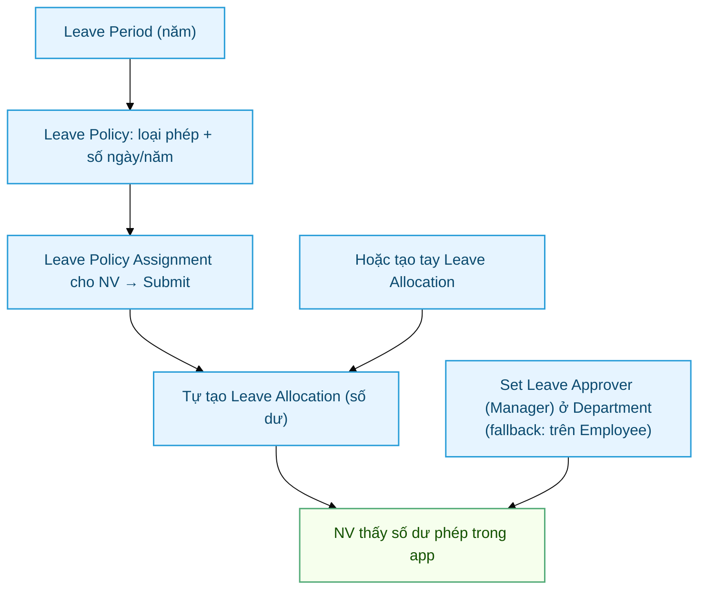
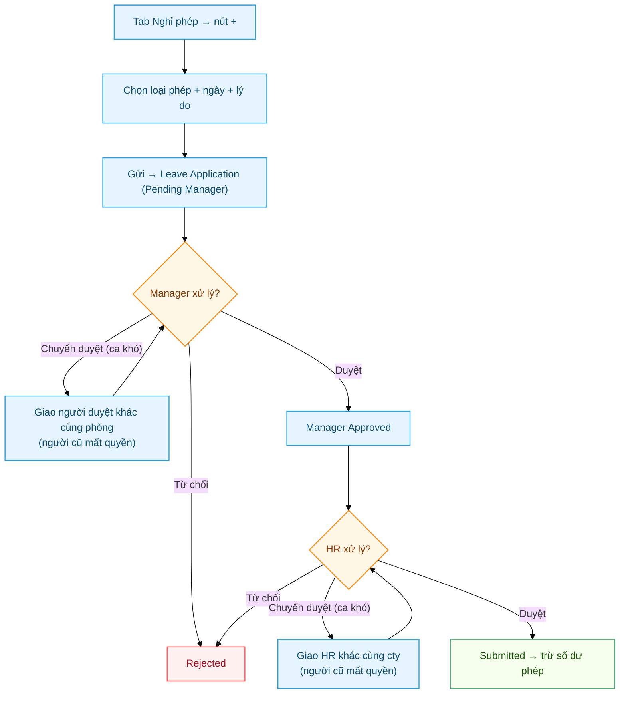

# Phép — Cấu hình + Cấp quỹ phép (Earned Leave) + Workflow 2 bước + HR tổng phép

> Đối tượng: **HR Manager**, **System Manager**, **Manager phòng ban**.

Cobe dùng cơ chế phép chuẩn HRMS, gồm 2 phần TÁCH BIỆT:
1. **Cấp quỹ phép năm (Leave Allocation)** — cấp số dư phép cho NV. Cobe dùng **HRMS Earned Leave native**: Leave Type bật `is_earned_leave` + Leave Policy Assignment → hệ thống tự cộng số dư cuối mỗi kỳ theo lịch, **KHÔNG qua duyệt**, không tạo "leave nháp".
2. **Đơn xin nghỉ (Leave Application)** — NV xin nghỉ, trừ vào số dư. Chạy **Workflow 2 bước**: Manager → HR Manager (Frappe Workflow fixture). Mỗi cấp có thể **chuyển duyệt (forward)** ca khó sang người khác — xem [§3](#3-workflow-2-bước-manager--hr).

> **Lưu ý quan trọng — phân biệt 2 khái niệm:**
> - **Cấp quỹ phép (Earned Leave)** = cộng số dư, tự động theo lịch, **không có bước duyệt**.
> - **Đơn xin nghỉ (Leave Application)** = tiêu số dư, **có workflow 2 bước duyệt**.
>
> Cơ chế cũ "cấp phép theo số ngày chấm công" (field `leave_auto_*` trên HR Policy + scheduled job `auto_allocate_leave`) **đã được GỠ BỎ** (patch `v0_009`). Không còn dùng nữa.

---

## Sơ đồ quy trình

**A. Cấp quỹ phép (HR):**



**B. Đơn xin nghỉ — workflow 2 bước:**



---

## Mục lục

1. [Cấu hình lần đầu](#1-cấu-hình-lần-đầu)
2. [Cấp quỹ phép năm (Earned Leave)](#2-cấp-quỹ-phép-năm-earned-leave)
3. [Workflow 2 bước Manager → HR](#3-workflow-2-bước-manager--hr)
4. [HR top-up phép tồn (manual)](#4-hr-top-up-phép-tồn-manual)
5. [Số dư phép & báo cáo](#5-số-dư-phép--báo-cáo)
6. [Edge case + FAQ](#6-edge-case--faq)

---

## 1. Cấu hình lần đầu

### 1.1. Verify Leave Type "Annual Leave"

> 📘 Giải thích đầy đủ các flag của Leave Type (`is_lwp`, `is_earned_leave`, carry forward, compensatory…) xem **[Leave Type — Loại nghỉ phép](HR-Leave-Type.html)**.

Desk → search "Leave Type" → kiểm tra có record `Annual Leave` chưa.

Nếu chưa có (site mới chưa setup):
1. New → `Leave Type Name = Annual Leave`
2. `Max Leaves Allowed` = 12 (hoặc theo policy Company, vd 14)
3. `Is Carry Forward` = ✓ (cho phép cộng dồn sang năm sau)
4. `Is Leave Without Pay` = ✗
5. **Save**.

> Để hệ thống tự cấp quỹ phép năm, bật thêm `Is Earned Leave` — xem [mục 2](#2-cấp-quỹ-phép-năm-earned-leave).

### 1.2. Verify Workflow Leave Approval

Sau khi `bench --site <site> migrate`, fixture `HR Leave Approval 2-Step` tự load. Verify:

- Desk → search "Workflow" → mở `HR Leave Approval 2-Step`
- `Document Type = Leave Application`, `Is Active = 1`
- States: `Pending Manager`, `Manager Approved`, `Submitted`, `Rejected`
- Transitions: 4 records (Manager Approve / Manager Reject / Submit / HR Reject)

Nếu workflow chưa tồn tại → chạy lại `bench migrate`.

---

## 2. Cấp quỹ phép năm (Earned Leave)

> Đây là cơ chế **cấp số dư phép** cho NV. Hoàn toàn tách biệt với Đơn xin nghỉ — **KHÔNG qua bước duyệt nào**, hệ thống tự cộng số dư theo lịch.

Cobe dùng **HRMS Earned Leave native** (không còn job custom cấp theo chấm công). Hệ thống tự cộng số dư vào cuối mỗi kỳ (phẳng theo lịch, **không tính thâm niên / không prorate**).

### Cơ chế

- Leave Type bật `Is Earned Leave` → HRMS có scheduler job native cộng dần số dư.
- Tần suất cộng = `Earned Leave Frequency` (Cobe dùng **Monthly** → cuối mỗi tháng cộng phần phép tương ứng).
- NV được cấp khi có **Leave Policy Assignment** (gán Leave Policy chứa Leave Type earned đó cho NV trong kỳ).
- Hệ thống tự cộng `new_leaves_allocated` vào Leave Allocation của NV cuối kỳ — **không tạo bản nháp, không cần ai duyệt**.

### Config

1. Desk → **Leave Type** → mở (vd `Annual Leave`):
   - `Is Earned Leave` = ✓
   - `Earned Leave Frequency` = **Monthly**
   - `Max Leaves Allowed` = tổng quỹ năm (vd 12)
   - (Tùy chọn) `Allocate on Day`, `Rounding` theo nhu cầu
2. Desk → **Leave Policy** → tạo policy gồm các Leave Type + số ngày/năm.
3. Desk → **Leave Policy Assignment** → gán Leave Policy cho NV (hoặc bulk theo nhóm) với `Effective From / Effective To` = kỳ phép (vd năm tài chính).
   - Khi assign, HRMS tạo Leave Allocation gốc cho kỳ; với earned leave, số dư bắt đầu thấp rồi **tự tăng dần theo từng kỳ** (Monthly).

### Lưu ý

- Earned Leave native cấp **phẳng theo lịch** — mọi NV có cùng policy nhận như nhau theo tần suất, không phụ thuộc số ngày chấm công, không scale theo thâm niên.
- **Không có leave nháp / không có bước approve** ở bước cấp quỹ. Side-effect duy nhất là số dư tăng lên.
- Muốn cấp thêm/bù ngoài lịch → dùng [HR top-up manual](#4-hr-top-up-phép-tồn-manual).

---

## 3. Workflow 2 bước Manager → HR

### Luồng

```
NV submit Leave Application
  ↓ workflow_state = "Pending Manager", docstatus = 0, status = Open
  ↓
Manager (Leave Approver: Department mặc định → fallback Employee.leave_approver) action:
  - "Manager Approve" → workflow_state = "Manager Approved"
                       docstatus = 0 (vẫn Draft), status = Approved
                       → NV thấy đã được Manager duyệt nhưng balance phép CHƯA trừ
  - "Manager Reject"  → workflow_state = "Rejected", docstatus = 1, status = Rejected
  ↓
HR Manager action:
  - "Submit"   → workflow_state = "Submitted", docstatus = 1, status = Approved
                 → HRMS tự tạo Attendance status=On Leave + trừ Leave Balance
  - "HR Reject"→ workflow_state = "Rejected", docstatus = 1, status = Rejected
```

**Khác biệt 2 cấp**:
- **Manager Approve** → xác nhận duyệt về mặt nghiệp vụ (status field hiện "Approved" cho NV thấy), nhưng đơn vẫn Draft (chưa ghi nhận chính thức, balance phép chưa thay đổi)
- **HR Submit** → submit chính thức (docstatus=1), HRMS trigger toàn bộ side-effect (Attendance, Balance, Email...)

→ Đây là pattern "Manager nghiệp vụ + HR vận hành" — Manager không cần care side-effect technical, HR chốt sổ cuối.

### NV submit Leave Application

**Cách 1: Qua PWA `/my-workspace/leave`** (recommend cho NV)

1. Mở PWA → tab "Nghỉ phép" → tap nút **+** (FloatButton)
2. Modal "Tạo đơn xin nghỉ":
   - **Loại phép** (Select có hiện balance: vd "Annual Leave (còn 12.5 ngày)")
   - **Khoảng ngày** (RangePicker DD/MM/YYYY)
   - **Lý do** (TextArea)
3. Tap **Gửi đơn** → POST `api/leave.create_leave_application` → workflow_state = "Pending Manager"

> **Danh sách loại phép trong PWA** = các loại NV **đã được cấp** (có Leave Allocation
> hiệu lực) **+ luôn có "Leave Without Pay"**. Mỗi loại hiển thị **số ngày còn lại**
> (chip số dư). LWP không cần cấp phép (số dư 0) và khi duyệt sẽ **trừ lương** những
> ngày nghỉ. Nếu NV **chưa được cấp phép nào** thì chỉ thấy LWP → muốn có phép có lương
> phải cấp **Leave Allocation** (mục 2 hoặc 4).
>
> **Bắt buộc có Leave Approver (Manager) — quản theo Department:** mọi đơn (kể cả LWP)
> cần xác định được người duyệt bước 1. Hệ thống lấy theo **chuỗi ưu tiên**:
> 1. `Employee.leave_approver` (override cá nhân, nếu set) →
> 2. **fallback** approver mặc định của **Department** (`Department.leave_approvers`, dòng đầu) →
> 3. cả 2 trống → báo lỗi "Chưa có người duyệt phép".
>
> → **Khuyến nghị: set `Leave Approver` ở từng Department** (Desk → Department → mục
> *Leave Approvers*). NV thuộc phòng tự thừa hưởng, khỏi set từng người; chỉ set
> `Employee.leave_approver` khi cần ngoại lệ. Người được chọn làm approver phải có
> **role `Leave Approver`** (chạy seed_roles) + đúng Department để dùng được Forward.
4. Toast "Đã gửi đơn xin nghỉ. Chờ trưởng bộ phận duyệt."
5. List "Đơn xin nghỉ" refresh hiện đơn mới với badge "Chờ Manager" (gold)

**Cách 2: Qua Desk** (cho HR / Manager tạo hộ)

1. Desk → New → Leave Application
2. Điền `From Date / To Date`, `Leave Type`, `Reason`
3. Save → workflow_state tự set `Pending Manager`

### Manager duyệt bước 1

1. Manager nhận notification (Bell icon)
2. Mở Leave Application
3. Top right có button workflow action:
   - **Manager Approve** → status = Approved (NV thấy đã duyệt), workflow_state = Manager Approved, vẫn Draft
   - **Manager Reject** → đóng đơn ngay (docstatus=1, status=Rejected)

### HR Manager duyệt bước 2

1. HR Manager filter Leave Application với `workflow_state = Manager Approved`
2. Verify policy (vd NV còn phép, kỳ phép hợp lệ)
3. Click:
   - **Submit** → docstatus=1, status=Approved → HRMS tự tạo Attendance status=On Leave + trừ Leave Balance
   - **HR Reject** → docstatus=1, status=Rejected

### Permission

Workflow fixture định nghĩa role được phép action:
- `Manager Approve` / `Manager Reject`: role `Leave Approver`
- `Submit` / `HR Reject`: role `HR Manager`

Đảm bảo User của Manager có role `Leave Approver` (gán qua User permissions).

### `allow_self_approval` ở bước HR

HR Manager có thể tự duyệt đơn của chính mình (`allow_self_approval = 1`) — vì HR Manager có thẩm quyền cuối. Manager (Leave Approver) **không** được self-approve (`allow_self_approval = 0`).

### Chuyển duyệt (Forward) — ca khó

Thực tế mỗi cấp duyệt có thể có **người thứ 2**: người duyệt đầu thường tự quyết, gặp **ca khó** thì **chuyển** sang người khác duyệt. Áp dụng cho **cả cấp Manager lẫn cấp HR**.

**Cách dùng (trên PWA, tab "Cần duyệt"):**
1. Mở đơn → bấm **Chuyển duyệt**.
2. Chọn người nhận + nhập lý do (tuỳ chọn) → **Chuyển**.
3. Đơn rời inbox của người chuyển, hiện trong inbox người nhận với nhãn tím **"Chuyển từ X"**.

**Nguyên tắc:**
- **Chuyển hẳn quyền**: sau khi chuyển, **người cũ chỉ còn xem** (không Approve/Reject được); chỉ người nhận quyết. (System Manager là cửa thoát hiểm admin.)
- **Danh sách người nhận**: cấp Manager → user có role *Leave Approver* **cùng phòng** (fallback cùng cty nếu NV không có phòng); cấp HR → role *HR Manager* **cùng công ty**.
- **Qua cấp là reset**: khi Manager duyệt xong (lên cấp HR), chỉ định "chuyển" của cấp Manager được xoá → cấp HR bắt đầu lại với người HR mặc định.
- **Thông báo**: người nhận được Assignment (ToDo) + push notification.

**Kỹ thuật:** không thêm state workflow — "chuyển" chỉ set field `custom_forwarded_to` trên đơn để đổi người duyệt của cấp hiện tại. Inbox & quyền duyệt (`api/approval.py`) ưu tiên `custom_forwarded_to` nếu có, ngược lại dùng `Employee.leave_approver` (Manager) / role HR (HR). Lịch sử lưu ở `custom_forward_log`.

---

## 4. HR top-up phép tồn (manual)

Trường hợp:
- NV mới join, HR cấp manual phép initial
- NV chuyển công ty, mang phép tồn từ Company cũ
- Bù phép ngoài lịch Earned Leave
- Điều chỉnh cuối năm

### Cách làm

1. Desk → **Leave Allocation** → New
2. Điền:
   - `Employee`
   - `Leave Type` (vd Annual Leave)
   - `From Date / To Date`: khoảng hiệu lực
   - `New Leaves Allocated`: số ngày cộng (vd 5)
   - `Description`: lý do (vd "Bù phép tháng 4/2026 — điều chỉnh thủ công")
3. Save → Submit

Allocation cộng dồn — NV nhận tổng new_leaves_allocated từ tất cả allocation active trong kỳ. Đây là cấp quỹ phép thủ công, không qua workflow duyệt.

### Audit ai cấp phép tồn

Leave Allocation có field `Owner` + `Modified By` chuẩn Frappe → biết ai tạo allocation. Lọc theo `employee` / `leave_type` / kỳ `from_date` để rà soát.

---

## 5. Số dư phép & báo cáo

### Số dư phép tính thế nào

PWA gọi **hàm native HRMS** `get_leave_details()` / `get_leave_balance_on()` — **không tự SUM SQL**.
- PWA chỉ hiển thị các loại phép NV **được cấp** (có Leave Allocation trong kỳ).
- `balance` hiển thị = `remaining_leaves`: đã trừ phép đã dùng + đơn đang chờ duyệt + carry-forward hết hạn.
- Vì dùng đúng hàm native nên số dư hiển thị khớp 100% với validate lúc HRMS submit đơn.

### Xem lịch sử cấp quỹ theo NV

- Desk → Leave Allocation → Filter `employee`
- Cột: leave_type, from_date, to_date, new_leaves_allocated, description

### Báo cáo Leave Balance

- Desk → search "Leave Balance Report" — báo cáo built-in của HRMS
- Hiển thị tổng phép cấp, đã dùng, còn lại

### Earned Leave job (native HRMS)

Việc cộng số dư Earned Leave do scheduler **native của HRMS** thực hiện (không phải job custom của app). Verify scheduler đang chạy:
```bash
bench --site cobe.cc doctor
```
Log: Desk → **Scheduled Job Log**, hoặc `sites/<site>/logs/scheduler.log`.

---

## 6. Edge case + FAQ

### Cấp quỹ phép có cần duyệt không?

**KHÔNG.** Earned Leave (mục 2) tự cộng số dư theo lịch, không tạo bản nháp, không qua ai duyệt. Chỉ **Đơn xin nghỉ** mới có workflow 2 bước.

### NV nghỉ phép cả tháng → kỳ đó có được cộng phép không?

Có. Earned Leave native cấp **phẳng theo lịch**, không phụ thuộc số ngày chấm công. Mọi NV có cùng Leave Policy Assignment đều được cộng như nhau theo tần suất (Monthly).

### NV làm OT nhiều → có được cộng thêm phép không?

**KHÔNG.** Earned Leave không scale theo số ngày làm / OT / thâm niên. Muốn thưởng thêm phép → HR [top-up manual](#4-hr-top-up-phép-tồn-manual).

### Cơ chế cũ "cấp phép theo chấm công" còn dùng không?

**KHÔNG.** Field `leave_auto_*` trên HR Policy và job `auto_allocate_leave` đã được gỡ bỏ (patch `v0_009`). Toàn bộ cấp quỹ phép năm nay dùng Earned Leave native.

### NV đổi Company / Leave Policy giữa kỳ?

Earned Leave cộng theo Leave Policy Assignment đang hiệu lực. Khi NV đổi policy, tạo Leave Policy Assignment mới với `Effective From` phù hợp; phần đã cộng trước đó giữ nguyên. Lệch lịch → HR top-up manual.

### Workflow không trigger khi Manager click action

Check:
1. Workflow `Is Active = 1` chưa?
2. Manager có role `Leave Approver` chưa? (User → User permissions)
3. `Employee.leave_approver` đã set đúng user của Manager chưa?
4. Refresh trang sau khi action — không tự refresh.

### Bypass Workflow cho cấp Director

Director có thể không cần qua workflow. Workaround:
- Tạo role `Workflow Override` + gán cho Director
- Edit workflow → cho phép skip transition cho role này
- Hoặc Director submit qua Frappe API trực tiếp (bypass workflow_state validation)

---

## Liên quan

- [HR Policy — tab Leave](HR-Policy.html#4-tab-leave)
- [Holiday & Shift Setup](HR-Holiday-Shift-Setup.html)
- [Tổng quan Chấm công](Cham-Cong-Tong-Quan.html)
