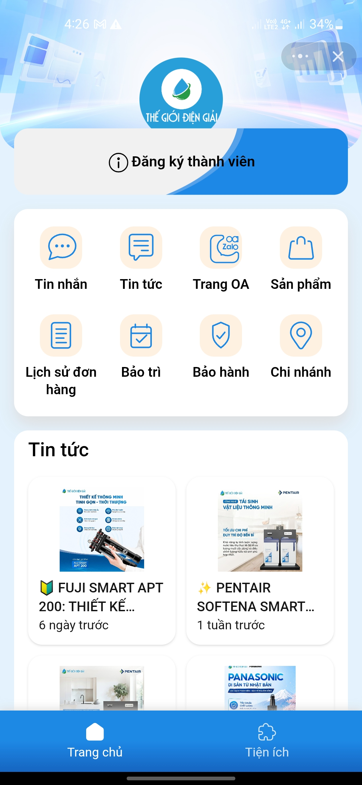
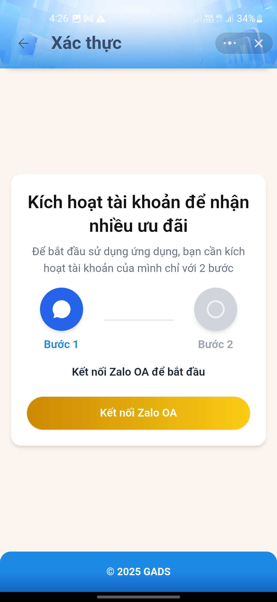
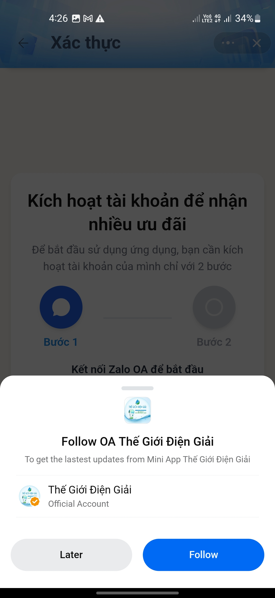
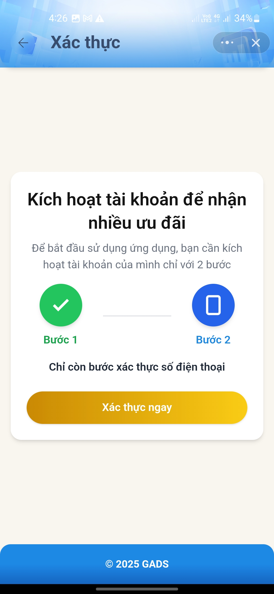
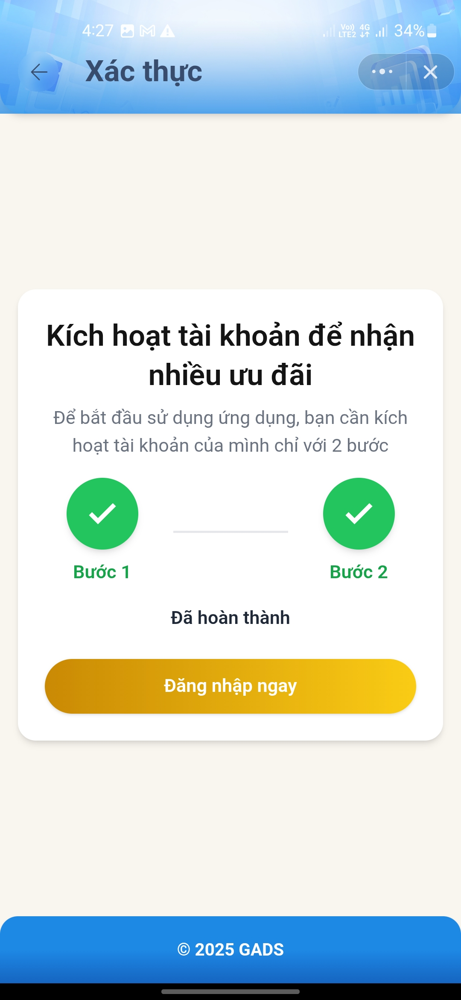
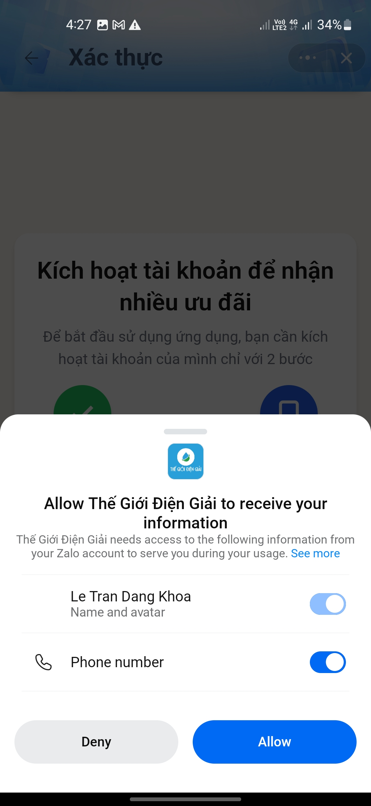
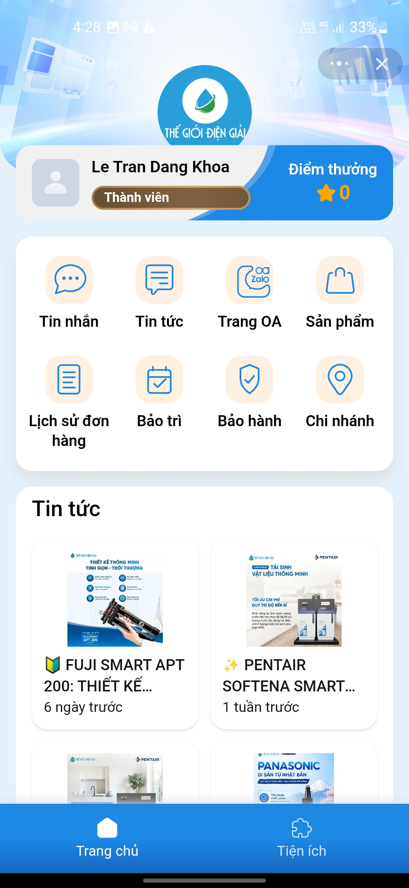

# Hướng dẫn sử dụng Zalo Mini App — Thế Giới Điện Giải

Tài liệu dành cho khách hàng, hướng dẫn cách mở và sử dụng đầy đủ các tính năng
của Mini App "Thế Giới Điện Giải" trên Zalo.

> Mọi thông tin (đơn hàng, bảo hành, điểm tích lũy…) đều tra cứu theo **số điện
> thoại Zalo** mà bạn đang dùng. Hãy dùng đúng số đã mua hàng / đăng ký để thấy
> đầy đủ thông tin.

---

## 1. Mở Mini App

Có nhiều cách vào, dùng cách nào cũng được:

### Cách 1 — Bấm link (nhanh nhất)

Bấm vào link sau trên điện thoại đã cài Zalo:

**https://zalo.me/s/1465908914723570318**

Zalo sẽ tự mở Mini App "Thế Giới Điện Giải".

### Cách 2 — Quét mã QR

1. Mở **Zalo** → bấm biểu tượng **QR** ở góc trên (cạnh ô tìm kiếm).
2. Quét mã QR của Mini App (dán trên hóa đơn / standee / website cửa hàng).

### Cách 3 — Vào qua Official Account (OA)

1. Mở Zalo → tìm OA **"Thế Giới Điện Giải"**.
2. Vào trang OA → bấm vào **menu / banner / nút** dẫn tới Mini App.

> Sau lần đầu mở, Mini App được lưu vào mục **"Gần đây"** trong phần Mini App /
> Tiện ích của Zalo — lần sau bấm thẳng vào, không cần tìm lại.

### Đăng ký thành viên (nếu chưa có)

Nếu bạn chưa là thành viên (số điện thoại chưa có trong hệ thống), hãy đăng ký
để sử dụng đầy đủ tính năng và tích điểm:

1. Tại màn hình chính, chọn **"Đăng ký thành viên"** (hoặc app tự hiện khi chưa
   nhận diện được số điện thoại của bạn).
2. Điền thông tin theo yêu cầu: **họ tên**, **số điện thoại**…
3. Bấm **Đăng ký** để xác nhận.

Sau khi đăng ký, bạn có thể tra cứu đơn hàng, bảo hành, bảo trì và tích điểm theo
số điện thoại đã đăng ký.

### Cấp quyền số điện thoại

Lần đầu mở, app có thể xin quyền lấy **số điện thoại Zalo** của bạn. Hãy đồng ý —
đây là số dùng để tra cứu toàn bộ thông tin của bạn trong hệ thống cửa hàng.

---

## 2. Các tính năng

### 2.1. Lịch sử đơn hàng

Xem lại các đơn đã mua tại Thế Giới Điện Giải:

- Ngày mua, tổng tiền, trạng thái đơn.
- Danh sách sản phẩm trong từng đơn.
- Với đơn có **lắp đặt / thi công**: xem được trạng thái công việc và **hình ảnh
  thực tế** do kỹ thuật viên chụp lại.
- Các **đơn đang yêu cầu / chờ xử lý** (chưa chốt) cũng hiển thị tại đây.

### 2.2. Lịch bảo trì đến hạn

App nhắc các thiết bị sắp tới hạn bảo trì:

- Sản phẩm cần bảo trì.
- Ngày dự kiến đến hạn.

Giúp bạn chủ động đặt lịch, tránh quên bảo trì định kỳ.

### 2.3. Thông tin bảo hành

Tra cứu tình trạng bảo hành của sản phẩm đã mua. Mỗi linh kiện hiển thị:

- Ngày bắt đầu bảo hành.
- Ngày hết hạn bảo hành.
- Thời hạn bảo hành.

Biết được sản phẩm/linh kiện nào còn hay đã hết bảo hành.

### 2.4. Danh sách sản phẩm

Duyệt các sản phẩm đang bán:

- Lọc theo nhóm sản phẩm.
- Xem **giá**, **hình ảnh**, mô tả.
- Tình trạng **còn hàng / hết hàng**.

### 2.5. Đặt hàng / Gửi yêu cầu

Từ danh sách sản phẩm:

1. Chọn sản phẩm và số lượng muốn mua.
2. Gửi yêu cầu.
3. Hệ thống ghi nhận và tạo đơn yêu cầu → **nhân viên sẽ liên hệ lại** để tư vấn
   và xác nhận đơn.

### 2.6. Tìm chi nhánh

Xem danh sách cửa hàng / chi nhánh:

- Lọc theo tỉnh / phường.
- Địa chỉ, giờ mở cửa, ghi chú.
- **Bản đồ chỉ đường** tới chi nhánh.

### 2.7. Điểm tích lũy (Loyalty)

Xem số điểm tích lũy hiện có theo số điện thoại của bạn, dùng để hưởng ưu đãi
theo chương trình khách hàng thân thiết của cửa hàng.

---

## 3. Câu hỏi thường gặp

**Không thấy đơn hàng / bảo hành / điểm tích lũy của tôi?**
Thường do số điện thoại mua hàng khác với số Zalo đang dùng để mở app. Vui lòng
liên hệ cửa hàng để cập nhật / hợp nhất số điện thoại.

**Thông tin có cập nhật theo thời gian thực không?**
Có. Dữ liệu đồng bộ trực tiếp từ hệ thống quản lý của cửa hàng.

**Tôi đặt hàng trên app thì đã mua thành công chưa?**
Chưa. Đặt hàng trên app là **gửi yêu cầu**; nhân viên sẽ liên hệ lại để xác nhận
và hoàn tất đơn.

**Mở link mà không vào được app?**
Hãy chắc chắn điện thoại đã cài **Zalo** và đang đăng nhập. Sau đó mở lại link
**https://zalo.me/s/1465908914723570318**.

---

## 4. Hỗ trợ

Nếu cần hỗ trợ, vui lòng liên hệ trực tiếp cửa hàng hoặc nhắn qua Official
Account **"Thế Giới Điện Giải"** trên Zalo.
