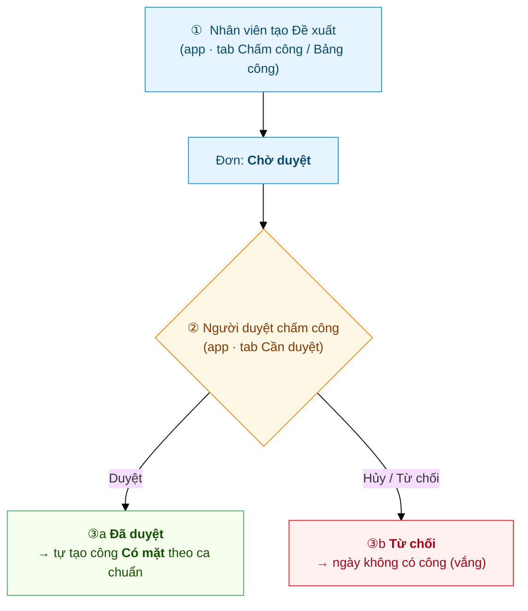
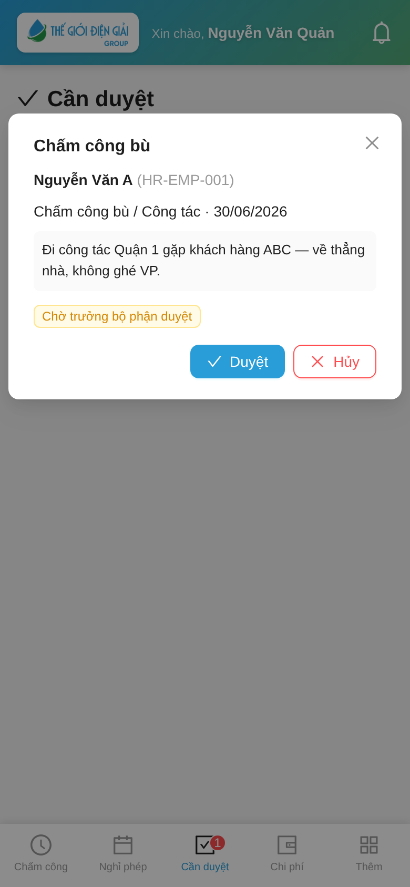

# Hành trình một Đề xuất chấm công bù
{: .no_toc }

**Theo chân 1 đề xuất từ lúc gửi đến lúc ngày được tính công** · Nhân viên → Người duyệt chấm công
{: .fs-3 .text-grey-dk-000 }

> Trang này kể **toàn cảnh** một Đề xuất chấm công bù / công tác — khác đơn nghỉ phép, loại này
> **duyệt đúng 1 BƯỚC** và không trừ gì của ai. Ví dụ dùng xuyên suốt: anh **Nguyễn Văn A** đi công
> tác Quận 1 gặp khách **cả ngày 30/06**, không ghé văn phòng nên không chấm công được → gửi đề xuất
> để ngày đó vẫn tính **Có mặt**.

  
Mục lục

{: .text-delta }
1. TOC
{:toc}

---

## Toàn cảnh

| Bước | Ai làm | Ở đâu | Kết quả |
|---|---|---|---|
| ① Tạo đề xuất | Nhân viên / KTV | App → **Chấm công** hoặc **Bảng công** | Đơn ở **Chờ duyệt** |
| ② Duyệt (bước duy nhất) | **Người duyệt chấm công** (`Shift Request Approver`) | App → **Cần duyệt** *hoặc* Desk | **Đã duyệt** → tự tạo công / **Từ chối** → không công |

> 👥 **Người duyệt ở đây KHÔNG phải người duyệt nghỉ phép.** Đơn chấm công bù về khe
> **Shift Request Approver** (HR gán trên Employee hoặc Department) — tách khỏi **Leave Approver**.
> Không có bước HR; nhưng HR Manager luôn duyệt thay / hủy được.

---

## ① Nhân viên tạo Đề xuất

Anh A đang ở chỗ khách, mở app. Có **2 lối** cùng mở 1 form:

- **Tab Chấm công:** bấm dòng **"Đi công tác / làm ngoài? Đề xuất chấm công bù"** ngay dưới nút chấm
  công — hoặc khi bấm Check-in bị chặn *"Ngoài vùng văn phòng"*, app hỏi luôn **"Tạo đề xuất?"**.
- **Tab Bảng công:** bấm nút tròn **➕ Đề xuất** góc dưới phải.

Điền form: **Loại đề xuất** (Chấm công bù / Công tác — hoặc WFH nếu công ty bật), **Khoảng ngày**
(30/06), **Lý do** ghi rõ để duyệt nhanh → bấm **Gửi đề xuất**.

Đơn xuất hiện trên **Bảng công** với nhãn **Đề xuất chấm bù · Chờ duyệt** (vàng):

> 💡 Có đơn rồi (kể cả **chưa duyệt**), ngày đó anh A đã **chấm công ngoài VP được ngay** — hệ thống
> tự cho qua kiểm tra vị trí. Nhưng công ngày này **không tính theo giờ chấm** mà chờ đơn duyệt
> (xem bước ③). Chi tiết: [Chấm công ngoài VP & Đề xuất chấm công bù](Guide-NhanVien-ChamCongNgoai.html).

---

## ② Người duyệt chấm công duyệt (1 bước duy nhất)

Người duyệt (được gán **Shift Request Approver** cho anh A hoặc cho phòng) nhận **thông báo đẩy** +
badge đỏ trên tab **Cần duyệt**. Mở đơn thấy đủ: tên, loại, ngày, lý do → chọn:

- **Duyệt** → xong ngay, **không có bước 2**.
- **Hủy / Từ chối** → ngày đó không có công. **Bắt buộc nhập lý do** mới từ chối được; nhân viên
  **nhận được lý do** đó để biết đường gửi lại đơn.

💻 **Trên Desk** (dồn nhiều phiếu cuối tuần/cuối tháng): HR lọc **Attendance Request · Draft** → tick
chọn → **Actions → Submit** — duyệt hàng loạt một phát. Chi tiết:
[Duyệt chấm công bù — từng phiếu & hàng loạt](Duyet-Cham-Cong-Bu.html).

---

## ③ Kết quả

**Được duyệt** → hệ thống **tự tạo công "Có mặt" theo ca chuẩn** cho ngày 30/06 — anh A không phải
làm gì thêm. Đơn biến mất khỏi danh sách chờ, thay bằng dòng công trên Bảng công; không có cảnh báo
*đi trễ / về sớm / quên ra* cho ngày này:

**Bị từ chối** → đơn chuyển nhãn **Từ chối** (đỏ), ngày đó **không có công** (để trống = vắng) — kể
cả khi anh A đã check-in ngoài VP dựa trên đơn. Nếu thực tế có đi làm: hỏi lại người duyệt, **gửi
đơn mới** với lý do/bằng chứng rõ hơn, hoặc nhờ HR chỉnh công tay.

---

## Nhãn trạng thái — đối chiếu nhanh

| Nhân viên thấy (Bảng công) | Nghĩa | Tác động lên công |
|---|---|---|
| 🟡 **Chờ duyệt** | Đơn đang nằm chờ người duyệt | Chưa tính công; ngày tạm chưa có kết quả |
| 🟢 *(đơn biến mất, hiện dòng công)* | **Đã duyệt** | Ngày tính **Có mặt (P)** / WFH / Nửa ngày theo ca chuẩn |
| 🔴 **Từ chối** | Đơn bị đóng | Ngày **không có công** — gửi lại đơn mới nếu cần |

---

## So với đơn nghỉ phép

| | **Nghỉ phép / Nghỉ bù** | **Đề xuất chấm công bù** |
|---|---|---|
| Số bước duyệt | **2** (Manager → HR) | **1** |
| Người duyệt | Leave Approver → HR Manager | **Shift Request Approver** |
| Kết quả | Trừ số dư phép, ngày = On Leave | Tự tạo công **Có mặt** theo ca chuẩn |
| Toàn cảnh | [Hành trình một đơn nghỉ phép](Hanh-Trinh-Nghi-Phep.html) | *(trang này)* |

---

## Liên quan
- 👤 [Chấm công ngoài VP & Đề xuất chấm công bù](Guide-NhanVien-ChamCongNgoai.html) — thao tác chi tiết phía nhân viên
- 🔧 [KTV hiện trường: Chấm công ngoài VP](Guide-KTV-ChamCong.html) — KTV dùng đề xuất cho ngày đi thẳng công trình
- ✅ [Duyệt chấm công bù — từng phiếu & hàng loạt](Duyet-Cham-Cong-Bu.html) — phía người duyệt + bulk trên Desk
- ⚙️ [Cấp phép & gán người duyệt → B2](Desk-HR-CapPhep.html) — HR gán Shift Request Approver
- 🔧 Kỹ thuật: [Attendance Request](HR-Attendance-Request.html)
