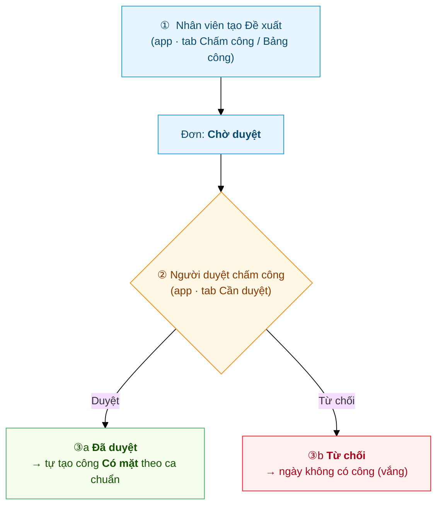

# Hành trình một Đề xuất chấm công bù
{: .no_toc }

**Theo chân 1 đề xuất từ lúc gửi đến lúc ngày được tính công** · Nhân viên → Người duyệt chấm công
{: .fs-3 .text-grey-dk-000 }

> Trang này kể **toàn cảnh** một Đề xuất chấm công bù / công tác — hiện **duyệt 1 BƯỚC** và không trừ
> gì của ai (công ty có thể bật **duyệt 2 cấp** như đơn nghỉ phép — xem
> [cuối trang](#khi-công-ty-bật-duyệt-2-cấp)). Ví dụ dùng xuyên suốt: anh **Nguyễn Văn A** đi công
> tác Quận 1 gặp khách **cả ngày 30/06**, không ghé văn phòng nên không chấm công được → gửi đề xuất
> để ngày đó vẫn tính **Có mặt**.

  
Mục lục

{: .text-delta }
1. TOC
{:toc}

---

## Toàn cảnh

| Bước | Ai làm | Ở đâu | Kết quả |
|---|---|---|---|
| ① Tạo đề xuất | Nhân viên / KTV | App → **Chấm công** hoặc **Bảng công** | Đơn ở **Chờ duyệt** |
| ② Duyệt | **Người duyệt chấm công** (`Shift Request Approver`) | App → **Cần duyệt** *hoặc* Desk | **Đã duyệt** → tự tạo công / **Từ chối** → không công |

> 👥 **Người duyệt ở đây KHÔNG phải người duyệt nghỉ phép.** Đơn chấm công bù về khe
> **Shift Request Approver** (HR gán trên Employee hoặc Department) — tách khỏi **Leave Approver**.
> HR duyệt thay trên Desk (Submit) và là người huỷ được đơn đã duyệt — trên app, HR chỉ thấy đơn
> khi chính mình là người duyệt chấm công của nhân viên.

---

## ① Nhân viên tạo Đề xuất

### Hai loại đơn, hai luật khác nhau

Cùng một biểu mẫu, nhưng **ngày được chọn** quyết định đơn thuộc loại nào:

| | Đơn xin chấm công ngoài văn phòng | Đơn khai bù |
|---|---|---|
| Ngày chọn | Hôm nay hoặc ngày tới | Ngày đã qua |
| Dùng khi | Sáng mai đi thẳng tới nhà khách; hôm nay ra ngoài và sẽ chấm công tại đó | Ngày trước có đi làm nhưng quên chấm công, hoặc máy không chấm được |
| Tác dụng | **Mở quyền chấm công ngoài vùng văn phòng** cho ngày đó | **Cấp công** cho ngày đó |
| Bị hạn mức tháng | Không | Có |
| Điều kiện để ngày đó có công | **Phải có ít nhất một lần chấm công thật trong ngày** | Người duyệt đồng ý |

Nói gọn: đơn cho hôm nay hoặc ngày tới là **giấy phép chấm công ở ngoài**, không phải giấy xin
công. Tạo đơn rồi mà cả ngày không chấm công lần nào thì ngày đó **không có công**: sáng hôm sau
hệ thống gỡ ngày công đó và gửi thông báo ghi rõ ngày. Muốn tính công cho một ngày đã qua thì gửi
**đơn khai bù** — và đơn khai bù mới là loại bị hạn mức tháng.

Anh A đang ở chỗ khách, mở app. Có **2 lối** cùng mở 1 form:

- **Tab Chấm công:** bấm dòng **"Đi công tác / làm ngoài? Đề xuất chấm công bù"** ngay dưới nút chấm
  công — hoặc khi bấm Check-in bị chặn *"Ngoài vùng văn phòng"*, app hỏi luôn **"Tạo đề xuất?"**.
- **Tab Bảng công:** bấm nút tròn **➕ Đề xuất** góc dưới phải.

Điền form: **Loại đề xuất** (Chấm công bù / Công tác — hoặc WFH nếu công ty bật), **Khoảng ngày**
(30/06), **Lý do** ghi rõ để duyệt nhanh → bấm **Gửi đề xuất**.

Đơn xuất hiện trên **Bảng công** với nhãn **Đề xuất chấm bù · Chờ duyệt** (vàng):

> 💡 Có đơn rồi (kể cả **chưa duyệt**), ngày đó anh A đã **chấm công ngoài VP được ngay** — hệ thống
> tự cho qua kiểm tra vị trí. Nhưng công ngày này **không tính theo giờ chấm** mà chờ đơn duyệt
> (xem bước ③). Và đơn chỉ mở quyền chấm công: **vẫn phải chấm công** thì ngày đó mới có công. Chi tiết: [Chấm công ngoài VP & Đề xuất chấm công bù](Guide-NhanVien-ChamCongNgoai.html).

### Hạn mức số ngày khai bù mỗi tháng

Công ty có thể đặt **số ngày khai bù tối đa mỗi tháng** cho cả công ty, cho từng **bộ phận**,
hoặc cho **riêng một người**, **tính riêng cho từng loại đơn**. Khi có hạn mức, form hiện sẵn *tháng này đã khai bao
nhiêu trên bao nhiêu ngày* ngay lúc chọn khoảng ngày, kèm số ngày đơn đang điền sẽ tiêu, và
chặn khi vượt:

> Hạn mức khai bù Chấm công bù tháng 10/2026 là 5 ngày. Tháng đó bạn đã khai 4 ngày (tính cả
> đơn đang chờ duyệt), đơn này xin thêm 2 ngày. Ngày chưa qua tại lúc nộp đơn thì không bị hạn
> mức. Cần thêm thì liên hệ HR.

Năm điều cần biết:

- **Đếm ngày, không đếm đơn.** Một đơn phủ ba ngày thì tiêu ba suất.
- **Chỉ những ngày ĐÃ QUA tại lúc nộp đơn mới bị đếm.** Ngày **hôm nay hoặc ngày tới** —
  phần xin phép trước để được chấm công ngoài văn phòng, ví dụ sáng mai đi thẳng tới nhà
  khách — không bị đếm và không bao giờ bị chặn.
- **Đơn đang chờ duyệt cũng tính**, không riêng đơn đã duyệt. Đơn bị từ chối hoặc đã huỷ thì
  không tính.
- Đơn vắt qua hai tháng thì **mỗi ngày tính vào tháng của chính nó**.
- Đơn **Làm việc tại nhà** (WFH) có **hạn mức riêng** — không trừ chung với Chấm công bù,
  nhưng cũng bị giới hạn nếu công ty đặt số cho loại đó.

Hết hạn mức mà vẫn còn việc chính đáng thì liên hệ HR — HR nhập thay được, hoặc nâng hạn mức
cho tháng đó. Chưa đặt hạn mức cho một loại = loại đó không giới hạn, đúng như trước nay.

---

## ② Người duyệt chấm công duyệt

Người duyệt (được gán **Shift Request Approver** cho anh A hoặc cho phòng) nhận **thông báo đẩy** +
badge đỏ trên tab **Cần duyệt**. Mở đơn thấy đủ: tên, loại, ngày, lý do → chọn:

- **Duyệt** → xong ngay.
- **Từ chối** → ngày đó không có công. **Bắt buộc nhập lý do** mới từ chối được; nhân viên
  **nhận được lý do** đó để biết đường gửi lại đơn.

💻 **Trên Desk** (dồn nhiều phiếu cuối tuần/cuối tháng): HR lọc **Attendance Request · Draft** → tick
chọn → **Actions → Submit** — duyệt hàng loạt một phát. Chi tiết:
[Duyệt chấm công bù — từng phiếu & hàng loạt](Duyet-Cham-Cong-Bu.html).

---

## ③ Kết quả

**Được duyệt** → hệ thống **tự tạo công "Có mặt" theo ca chuẩn** cho ngày 30/06 — anh A không phải
làm gì thêm. Riêng đơn nộp cho **hôm nay hoặc ngày tới**, ngày công này chỉ giữ được nếu trong
ngày anh A **có chấm công ít nhất một lần** (ở đâu cũng được, kể cả ngoài văn phòng); không có lần
chấm công nào thì sáng hôm sau hệ thống gỡ ngày công và báo cho anh A, khi đó muốn tính công phải
gửi **đơn khai bù**. Đơn biến mất khỏi danh sách chờ, thay bằng dòng công trên Bảng công; không có cảnh báo
*đi trễ / về sớm / quên ra* cho ngày này:

**Bị từ chối** (ở bước nào cũng vậy) → đơn **bị xoá, biến mất khỏi danh sách**; anh A nhận thông báo
kèm lý do. Ngày đó **không có công**
(để trống = vắng) — kể cả khi anh A đã check-in ngoài VP dựa trên đơn: lần chấm công đó dựa vào đơn,
đơn mất thì nó cũng mất căn cứ (công đã lỡ sinh cũng bị thu hồi, và anh A nhận thông báo ghi rõ ngày
nào bị rút công). Ngày anh A **có ghé văn phòng
quẹt** thì vẫn tính công như thường — hệ thống đối chiếu toạ độ lần quẹt, không chỉ nhìn nhãn; nhóm
được mở quyền **quẹt mọi nơi** (KTV / Sales) cũng không bị ảnh hưởng. Nếu thực tế có đi làm: hỏi
lại người duyệt, **gửi đơn mới** với lý do/bằng chứng rõ hơn, hoặc nhờ HR chỉnh công thủ công.

> 🏠 **Đơn WFH** đi y hệt: duyệt xong thì nút **chấm công WFH** mở cho ngày đó.

---

## Nhãn trạng thái — đối chiếu nhanh

| Nhân viên thấy (Bảng công) | Nghĩa | Tác động lên công |
|---|---|---|
| 🟡 **Chờ duyệt** | Đơn đang nằm chờ người duyệt | Chưa tính công; ngày tạm chưa có kết quả |
| 🔵 **Chờ HR duyệt** | *(chỉ khi bật 2 cấp)* Trưởng bộ phận đã duyệt, đang chờ HR | **Vẫn chưa tính công** |
| 🟢 *(đơn biến mất, hiện dòng công)* | **Đã duyệt** | Ngày tính **Có mặt (P)** / WFH / Nửa ngày theo ca chuẩn |
| *(đơn biến mất, không có dòng công)* | **Bị từ chối** — kèm thông báo có lý do | Ngày **không có công** — gửi lại đơn mới nếu cần |
| 🔴 **Từ chối** | Đơn **đã duyệt rồi bị HR huỷ** | Công của ngày đó bị gỡ |

---

## Khi công ty bật duyệt 2 cấp

HR có thể bật **Duyệt 2 cấp** cho đơn chấm công bù (xem
[Duyệt chấm công bù — mục E](Duyet-Cham-Cong-Bu.html#e-bật--tắt-duyệt-2-cấp-hr--quản-trị)). Khi đó
đơn của anh A đi **hai bước** như đơn nghỉ phép:

1. **Trưởng bộ phận** duyệt → đơn chuyển nhãn **Chờ HR duyệt** (xanh dương), ngày 30/06 **vẫn chưa có
   công**.
2. **HR** (người duyệt cuối) duyệt → mới có công **Có mặt**. Đơn WFH cũng chỉ mở chấm công WFH ở bước
   này.

Từ chối ở bước nào cũng vậy: đơn bị đóng, anh A nhận lý do.

---

## So với đơn nghỉ phép

| | **Nghỉ phép / Nghỉ bù** | **Đề xuất chấm công bù** |
|---|---|---|
| Số bước duyệt | **2** (Manager → HR) | **1** *(hiện tại — bật được 2 cấp)* |
| Người duyệt | Leave Approver → HR Manager | **Shift Request Approver** |
| Kết quả | Trừ số dư phép, ngày = On Leave | Tự tạo công **Có mặt** theo ca chuẩn |
| Toàn cảnh | [Hành trình một đơn nghỉ phép](Hanh-Trinh-Nghi-Phep.html) | *(trang này)* |

---

## Liên quan
- 👤 [Chấm công ngoài VP & Đề xuất chấm công bù](Guide-NhanVien-ChamCongNgoai.html) — thao tác chi tiết phía nhân viên
- 🔧 [KTV hiện trường: Chấm công ngoài VP](Guide-KTV-ChamCong.html) — KTV dùng đề xuất cho ngày đi thẳng công trình
- ✅ [Duyệt chấm công bù — từng phiếu & hàng loạt](Duyet-Cham-Cong-Bu.html) — phía người duyệt + bulk trên Desk
- ⚙️ [Cấp phép & gán người duyệt → B2](Desk-HR-CapPhep.html) — HR gán Shift Request Approver
- 🚦 HR: [Hạn mức ngày khai bù theo tháng](Desk-HR-HanMucChamCongBu.html) — cách đặt và miễn trừ
- 🔧 Kỹ thuật: [Attendance Request](HR-Attendance-Request.html)
