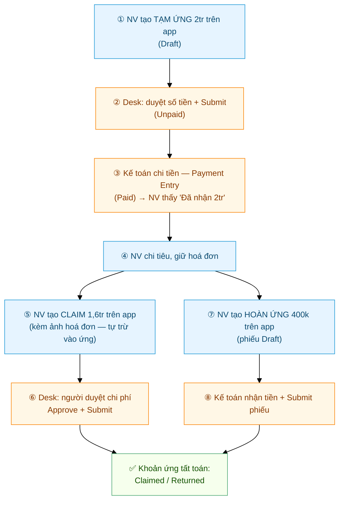

# Hành trình một yêu cầu chi phí
{: .no_toc }

**Theo chân tiền tạm ứng từ lúc xin đến lúc quyết toán** · Nhân viên (app) → Người duyệt & Kế toán (Desk)
{: .fs-3 .text-grey-dk-000 }

> Chi phí có **3 loại phiếu** móc nối nhau: **Tạm ứng** (xin tiền trước) → **Claim** (kê chi phí đã chi,
> trừ vào tiền ứng) → **Hoàn ứng** (trả lại phần dư). Nhân viên **tạo trên app my-workspace**; việc
> **duyệt và chi/nhận tiền làm trên Desk** (khác nghỉ phép / chấm công bù vốn duyệt ngay trên app).

  
Mục lục

{: .text-delta }
1. TOC
{:toc}

---

## Toàn cảnh — 1 chuyến công tác điển hình

Anh Bình (KTV) đi lắp đặt xa, xin ứng **2.000.000đ** mua vật tư. Thực tế chi **1.600.000đ**,
còn dư **400.000đ** trả lại công ty:

| Vai trò | Làm gì | Ở đâu |
|---|---|---|
| **Nhân viên** | Tạo Tạm ứng / Claim / Hoàn ứng, theo dõi trạng thái, chụp hoá đơn | App **my-workspace → tab Chi phí** |
| **Người duyệt chi phí** | Duyệt số tiền ứng, duyệt Claim (Approve / Reject) | **Desk** (`/app`) |
| **Kế toán** | Chi tiền ứng (Payment Entry), nhận tiền hoàn (Submit phiếu hoàn), thanh toán phần vượt ứng | **Desk** (`/app`) |

> ⚠️ **Chi phí KHÔNG hiện trong tab "Cần duyệt" trên app** (tab đó chỉ có nghỉ phép + chấm công bù).
> Người duyệt / kế toán xử lý phiếu chi phí trên **Desk**.

---

## Giai đoạn ① — NV xin tạm ứng (app)

Tab **Chi phí** → nút **➕** góc dưới phải → **Tạm ứng** → form **"Tạo yêu cầu tạm ứng"**:

| Trường | Ghi gì |
|---|---|
| **Số tiền đề nghị (đ)** | Số muốn ứng — vd 2.000.000 |
| **Mục đích** | Vd *"Mua vật tư sửa chữa máy lạnh — công trình ABC"* |
| **Work Order / Service Appointment** *(tuỳ chọn, cho KTV)* | Gắn phiếu vào đúng job để kế toán đối chiếu chi phí theo công trình |

Gửi xong, phiếu nằm ở tab **Tạm ứng** với trạng thái **Draft** — lúc này quản lý/kế toán **chưa thấy
tiền đi đâu cả**, phiếu chỉ mới là đề nghị.

### Trạng thái khoản tạm ứng (nhãn trên app)

| Nhãn | Nghĩa | Ai đang cầm bóng |
|---|---|---|
| `Draft` | Mới gửi, chưa duyệt | Người duyệt (Desk) |
| `Unpaid` | Đã duyệt số tiền, **chưa chi** | Kế toán (Desk) |
| `Paid` | **Đã nhận tiền** — app hiện *"Đã nhận: …đ"* | Nhân viên (đi chi tiêu) |
| `Claimed` | Đã kê claim hết số ứng | — (xong) |
| `Returned` | Đã hoàn lại toàn bộ | — (xong) |
| `Partly Claimed and Returned` | Vừa claim một phần, vừa hoàn phần dư | — (xong) |

> 💡 Người duyệt có thể **hạ số tiền** so với đề nghị (app lưu riêng "số xin" và "số duyệt") — nhận
> được bao nhiêu nhìn dòng *"Đã nhận"*.

---

## Giai đoạn ② — Duyệt & chi tiền (Desk)

1. **Duyệt:** mở **Employee Advance** (Desk) → kiểm tra mục đích / công trình → chỉnh **Advance Amount**
   nếu cần → **Submit**. Phiếu sang `Unpaid`.
2. **Chi tiền:** kế toán bấm **Create → Payment Entry** ngay trên phiếu → chọn quỹ (tiền mặt /
   chuyển khoản) → Submit Payment Entry. Phiếu sang `Paid`.

> 🔑 **Điều kiện hệ thống** (thiếu là app báo *"chưa cấu hình"* ngay khi mở tab Chi phí):
> tài khoản **Employee Advance Account** (gán trên hồ sơ NV, hoặc default của Company),
> **Default Payable Account** của Company, và **ít nhất 1 Expense Claim Type**.

---

## Giai đoạn ③ — NV kê chi phí: Claim (app)

Sau khi chi tiêu, NV kê lại để quyết toán. Có 2 lối vào:

- Tab **Tạm ứng** → dòng khoản ứng đang `Paid` có nút **Claim** kèm số *"Có thể claim: …đ"*, hoặc
- Nút **➕ → Claim**.

Form **"Tạo yêu cầu chi phí"**:

| Trường | Ghi gì |
|---|---|
| **Các dòng chi phí** | Mỗi dòng = **Loại chi phí** (chọn từ danh mục) + **Số tiền** + mô tả. Thêm được nhiều dòng |
| **Ảnh hoá đơn** | Chụp / tải ảnh hoá đơn đính kèm — nên có đủ để duyệt nhanh |
| **Work Order / Service Appointment** *(tuỳ chọn)* | Gắn đúng job như lúc ứng |

App **tự động trừ claim vào các khoản ứng còn dư** (khoản ứng cũ trừ trước — không phải chọn tay) và
hiện trước phần phân bổ. Claim vượt tổng ứng → phần chênh thành **công ty phải trả thêm** cho bạn.

### Trạng thái Claim (nhãn trên app)

| Nhãn | Nghĩa |
|---|---|
| `Draft` | Chờ duyệt trên Desk |
| `Unpaid` | Đã duyệt — còn phần công ty phải trả thêm (chờ kế toán chi) |
| `Paid` | Đã duyệt và thanh toán xong |
| `Từ chối` (đỏ) | Người duyệt Reject — xem lại hoá đơn/lý do, tạo claim mới nếu cần |

**Phía Desk:** người duyệt chi phí mở **Expense Claim** → xem hoá đơn đính kèm → set
**Approval Status = Approved** (hoặc Rejected) → **Submit**. Có phần phải trả thêm thì kế toán tạo
**Payment Entry** trả nốt.

---

## Giai đoạn ④ — NV hoàn phần dư: Hoàn ứng (app)

Khi tiền ứng còn dư sau khi claim (dòng khoản ứng hiện **"Cần hoàn: …đ"** màu cam):

1. Bấm nút **Hoàn ứng** ngay trên dòng đó (hoặc **➕ → Hoàn ứng** rồi chọn khoản ứng).
2. Điền **Số tiền hoàn** (app chặn không cho hoàn quá số dư) + **Hình thức hoàn**: **Tiền mặt**
   hoặc **Chuyển khoản**.
3. Gửi → sinh **phiếu hoàn ứng (Draft)** nằm ở tab **Hoàn ứng**.
4. NV **đưa tiền / chuyển khoản** cho công ty; kế toán nhận đủ tiền → mở phiếu (Journal Entry) trên
   Desk → **Submit** → khoản ứng chuyển `Returned` / `Partly Claimed and Returned`.

> ⚠️ Phiếu hoàn ứng ở trạng thái Draft nghĩa là **kế toán chưa xác nhận đã nhận tiền** — chưa
> Submit thì khoản ứng vẫn treo "Cần hoàn".

---

## Đối chiếu nhanh: 3 loại phiếu

| | **Tạm ứng** | **Claim** | **Hoàn ứng** |
|---|---|---|---|
| Bản chất | Xin tiền **trước** | Kê chi phí **đã chi** | Trả lại tiền **dư** |
| NV tạo ở | ➕ → Tạm ứng | ➕ → Claim, hoặc nút Claim trên khoản ứng | Nút Hoàn ứng trên khoản ứng |
| Ai duyệt | Người duyệt + kế toán chi tiền | Người duyệt chi phí (Approve/Reject) | Kế toán xác nhận nhận tiền |
| Duyệt ở đâu | Desk | Desk | Desk |
| Tiền đi hướng nào | Cty → NV | Trừ vào ứng; phần vượt: Cty → NV | NV → Cty |

---

## ⚠️ Lỗi thường gặp

| Tình huống | Cách xử |
|---|---|
| Mở tab Chi phí báo **"chưa cấu hình"** | Thiếu Advance Account / Payable Account / Expense Claim Type — báo Kế toán/HR cấu hình (xem Giai đoạn ②) |
| Gửi tạm ứng lâu rồi vẫn `Draft` | Người duyệt chưa xử lý trên Desk — phiếu chi phí **không có** trong tab Cần duyệt trên app, nhắc trực tiếp |
| `Unpaid` mãi không thấy tiền | Đã duyệt nhưng kế toán chưa làm Payment Entry — hỏi kế toán |
| Claim bị **Từ chối** | Xem lại hoá đơn / loại chi phí / mô tả; tạo claim mới đầy đủ chứng từ hơn |
| Không claim được vào khoản ứng | Khoản ứng phải đang `Paid` và còn số dư *"Có thể claim"*; ứng `Draft`/`Unpaid` chưa trừ được |
| Hoàn ứng rồi mà vẫn hiện "Cần hoàn" | Kế toán chưa Submit phiếu nhận tiền — đưa tiền xong nhắc kế toán xác nhận |
| Số nhận được ít hơn số xin | Người duyệt hạ số tiền khi duyệt — xem dòng *"Đã nhận"* trên khoản ứng |

---

## Liên quan

- 👤 [Chi phí: tạm ứng / hoàn ứng / claim](Guide-NhanVien-ChiPhi.html) — thao tác từng form trên app
- 🗺️ [Hành trình một đơn nghỉ phép](Hanh-Trinh-Nghi-Phep.html) — flow duyệt trên app (khác chi phí)
- 👤 [Cài app & Chấm công](Guide-NhanVien-ChamCong.html)
