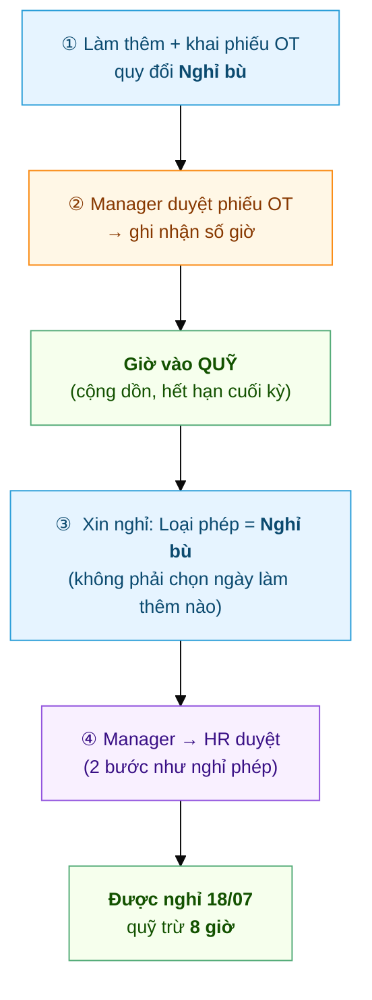

# Hành trình một ngày Nghỉ bù
{: .no_toc }

**Kiếm giờ → tiêu giờ** · Làm thêm đổi lấy ngày nghỉ, thay vì nhận tiền
{: .fs-3 .text-grey-dk-000 }

> Nghỉ bù **không phải một loại đơn riêng lẻ** — nó là **2 đơn nối nhau**: (1) một phiếu **Làm thêm
> giờ** quy đổi *Nghỉ bù* để **kiếm giờ**, rồi (2) một đơn **Nghỉ phép loại Nghỉ bù** để **tiêu giờ**
> đó thành ngày nghỉ. Trang này nối cả hai. Ví dụ: anh **Nguyễn Văn An** làm thêm buổi tối
> **11/07**, đổi lấy **nghỉ ngày 18/07**.

> 🆕 **Từ 09/2026: giờ làm thêm vào một QUỸ GIỜ.** Trước đây mỗi ngày làm thêm là một "vé"
> dùng đúng một lần, giờ lẻ không đủ 4h coi như mất. Nay mọi giờ được duyệt quy đổi *Nghỉ bù*
> **cộng dồn vào một quỹ**, xin nghỉ thì **trừ quỹ**: **4 giờ = 0,5 ngày**, **8 giờ = 1 ngày**.
> Hai buổi lẻ 2h và 3h của hai ngày khác nhau nay gộp lại đổi được 0,5 ngày nghỉ, và phần dư
> ở lại quỹ cho lần sau.

  
Mục lục

{: .text-delta }
1. TOC
{:toc}

> 🧭 **Đây là mô hình chuẩn cho "về sớm / thiếu giờ → làm bù".** Thiếu giờ hôm nay thì **làm thêm
> buổi khác** rồi khai OT quy đổi *Nghỉ bù* để cấn qua — không có đơn "xin về sớm" riêng.

---

## Toàn cảnh

| Bước | Ai làm | Ở đâu | Kết quả |
|---|---|---|---|
| ① Kiếm giờ | Nhân viên | App → **Làm thêm giờ**, quy đổi **Nghỉ bù** | Phiếu OT **Chờ duyệt** |
| ② Duyệt OT | Trưởng Bộ Phận (`Shift Request Approver`) | App → **Cần duyệt** | Phiếu **Đã duyệt** → giờ vào **quỹ** |
| ③ Tiêu giờ | Nhân viên | App → **Nghỉ phép**, loại **Nghỉ bù** | Đơn nghỉ **Chờ Manager** |
| ④ Duyệt nghỉ | Trưởng Bộ Phận → HR | App / Desk | **Được nghỉ**, quỹ trừ 4h (nửa ngày) hoặc 8h (cả ngày) |

> ⚠️ **Phải có bước ①② TRƯỚC.** Quỹ không đủ giờ thì **bước ③ bị chặn ngay lúc gửi**. Nghỉ bù
> không tự sinh ra từ đâu — chỉ giờ làm thêm đã được duyệt quy đổi *Nghỉ bù* mới vào quỹ, và
> chỉ khi **ngày làm thêm đã qua**.

---

## ① Kiếm giờ — khai phiếu OT, chọn quy đổi "Nghỉ bù"

Anh An ở lại làm thêm tối 11/07. Hôm sau anh khai phiếu như [làm thêm bình thường](Hanh-Trinh-OT.html),
nhưng ở **Hình thức quy đổi** chọn **Nghỉ bù** thay vì *Tiền lương*:

Sau khi Manager duyệt, **số giờ được duyệt trên phiếu cộng vào quỹ Nghỉ bù** của anh An. Giờ chỉ
vào quỹ khi **ngày làm thêm đã qua** — phiếu khai trước cho ngày chưa tới vẫn nằm chờ.

> 📘 Chi tiết cơ chế khai-sau, đối chiếu, trần giờ: [Hành trình một phiếu Làm thêm giờ](Hanh-Trinh-OT.html).

---

## ② + ③ Tiêu giờ — xin nghỉ loại "Nghỉ bù"

Vào tab **Nghỉ phép** → **➕** → **Loại phép = Nghỉ bù**. Màn hình hiện **quỹ giờ đang có**, kèm
từng lô giờ và hạn dùng của nó. Chọn **ngày muốn nghỉ** (18/07) + lý do → **Gửi đơn**. **Không phải
chọn ngày làm thêm nào** — hệ thống tự trừ lô giờ **sắp hết hạn trước**.

Hệ thống **kiểm tra ngay lúc gửi**, chặn nếu **quỹ không đủ giờ**:

| Xin nghỉ | Quỹ phải có |
|---|---|
| 0,5 ngày | **4 giờ** |
| 1 ngày | **8 giờ** |
| 2 ngày | **16 giờ** |

Ví dụ: quỹ còn 6h thì xin được 0,5 ngày (trừ 4h, còn 2h), chưa xin được cả ngày. Làm thêm ngày
thường bị trần 4h/ngày nên thường phải gom hai buổi mới đủ một ngày nghỉ; ngày lễ/cuối tuần trần
8h thì một buổi là đủ. Trường hợp đặc biệt (mất bằng chứng chấm công, phiếu cũ) liên hệ HR — HR
có thể **điều chỉnh quỹ** bằng chứng từ *HR Comp Leave Adjustment* trên Desk.

Qua được kiểm tra, đơn đi tiếp **2 bước Manager → HR** y như [đơn nghỉ phép thường](Hanh-Trinh-Nghi-Phep.html).

---

## ④ Kết quả — được nghỉ, quỹ giờ trừ đi

Duyệt xong, ngày 18/07 tính **On Leave** (nghỉ có phép) và quỹ trừ **8 giờ**. Thẻ **Nghỉ bù** trên
màn hình Nghỉ phép hiện **số ngày đổi được kèm số giờ còn lại**, ví dụ *"Nghỉ bù: 1.5 ngày (12.00h)"*.

> 💡 **Quỹ này không phải phép năm.** Nghỉ bù **không trừ quỹ phép, không trừ lương** — nó là giờ
> bạn đã làm thêm, đổi lấy ngày nghỉ. Trên Desk, loại *Nghỉ bù* vẫn hiện số dư **âm** vì nó không
> dùng cơ chế cấp phép của HRMS; con số âm ở đó nghĩa là *"đã nghỉ bù bấy nhiêu ngày"*, không phải
> bạn đang nợ.

---

## Nghỉ bù có HẠN DÙNG

> ⏳ **Dùng trong kỳ, đừng để dành lâu.** Mỗi lô giờ hết hạn ở **cuối kỳ chứa ngày làm thêm** —
> **30/06** hoặc **31/12**. Đến mốc đó, phần giờ **còn dư chưa nghỉ** bị cắt và phiếu OT tương ứng
> chuyển trạng thái **"Hết hạn" (Expired)**; phiếu đã dùng hết giờ thì giữ nguyên *Đã duyệt*.
> Hệ thống **nhắc trước** vào 15 và 24 của tháng 6 và tháng 12, kèm số giờ sắp mất.
>
> Làm thêm **đúng ngày cắt** (30/06 hoặc 31/12) thì giờ đó sống sang kỳ sau — hôm đó bạn còn đang
> làm, chưa kịp xin nghỉ.

---

## Hạn NỘP đơn (khi công ty bật)

> Công ty có thể đặt **hạn nộp đơn nghỉ sau khi đã nghỉ** (bảng *Hạn khai theo ngày hiệu
> lực* trong `HR Policy`). Với Nghỉ bù, đồng hồ tính trễ chạy từ **mốc muộn hơn** giữa
> **ngày bắt đầu nghỉ** và **lúc quỹ gom đủ giờ** cho đơn đó — thời gian chờ Manager duyệt
> phiếu OT **không bị tính** vào hạn, còn quỹ đã đủ từ trước rồi để dành mới xin nghỉ thì
> tính từ ngày nghỉ như phép thường. Chi tiết & ví dụ:
> [Hạn nộp phiếu & ràng buộc](HR-Filing-Deadline.html).

---

## So với các nhánh khác

| | **Nghỉ bù** *(trang này)* | **Làm thêm → Tiền** | **Nghỉ phép năm** |
|---|---|---|---|
| Bắt đầu từ | Phiếu OT quy đổi **Nghỉ bù** | Phiếu OT quy đổi **Tiền lương** | (có quỹ cấp sẵn) |
| Đơn vị | **Giờ** (4h = 0,5 ngày) | Giờ × hệ số | Ngày |
| Kết quả | **Ngày nghỉ** (trừ quỹ giờ) | **Tiền** vào lương | Ngày nghỉ (trừ quỹ) |
| Hết hạn | **Có** — cuối kỳ 30/06 & 31/12 | Không (đã thành tiền) | Theo chính sách phép năm |
| Số bước xin nghỉ | 2 (Manager → HR) | — | 2 (Manager → HR) |

---

## Sự cố hay gặp

| Tình huống | Nguyên nhân / cách xử |
|---|---|
| *"Quỹ Nghỉ bù còn …h, chưa đủ để nghỉ … ngày"* | Quỹ thiếu giờ — làm thêm tiếp (bước ①②), hoặc xin **0,5 ngày** thay vì cả ngày |
| Làm thêm rồi mà quỹ vẫn 0 | Phiếu OT quy đổi **Tiền lương** chứ không phải Nghỉ bù; hoặc **chưa được duyệt**; hoặc **ngày làm thêm chưa tới** |
| Quỹ ít hơn số giờ đã khai | Phiếu bị **trần 4h/8h** cắt; hoặc lô giờ kỳ trước **đã hết hạn** |
| Quỹ Nghỉ bù bỗng về 0 / mất | Đã qua **cuối kỳ** — giờ dư bị cắt. Lần sau xin nghỉ trong kỳ, để ý thông báo nhắc giữa tháng 6/12 |
| Số dư âm trên Desk, tưởng bị phạt | Âm ở Desk là **đúng thiết kế** — không trừ lương, không trừ quỹ phép; xem quỹ thật ở màn hình Nghỉ phép trên app |
| *"Đơn Nghỉ bù từ ngày … đã quá hạn nộp"* | Nộp trễ quá hạn công ty đặt (tính từ ngày nghỉ hoặc lúc quỹ đủ giờ, mốc muộn hơn) → liên hệ HR tạo thủ công |
| *"Attendance … is already marked …"* khi xin nghỉ bù | Hôm đó **đã chấm công**. Rất hay gặp vì nghỉ bù thường xin ngay trong ngày: làm sáng → trưa xin nghỉ chiều. Tích **Nghỉ nửa ngày** là gửi được (buổi đã làm vẫn tính công). Xin **cả ngày** cho hôm đã đi làm thì không được |

---

## Liên quan
- 🔁 [Hành trình một phiếu Làm thêm giờ](Hanh-Trinh-OT.html) — bước ①②, cơ chế khai-sau & đối chiếu
- 🌴 [Hành trình một đơn nghỉ phép](Hanh-Trinh-Nghi-Phep.html) — bước ③④ chạy y hệt
- 👤 [Nhân viên: Xin làm thêm giờ](Guide-NhanVien-LamThem.html) · [Xin nghỉ phép & nghỉ bù](Guide-NhanVien-NghiPhep.html)
- 🔧 HR: [Quỹ giờ Nghỉ bù](Desk-HR-QuyNghiBu.html) — xem quỹ, điều chỉnh tay, hết hạn cuối kỳ
- 🔧 HR: [Loại phép & cấu hình](HR-Leave-Type.html) · [Cấu hình Overtime](HR-Overtime-Settings.html)
