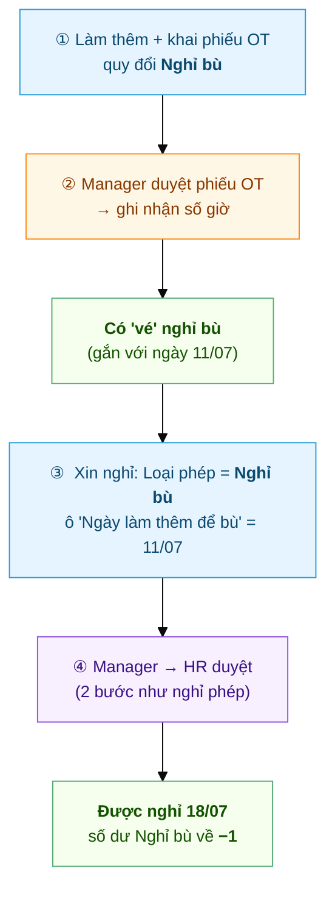
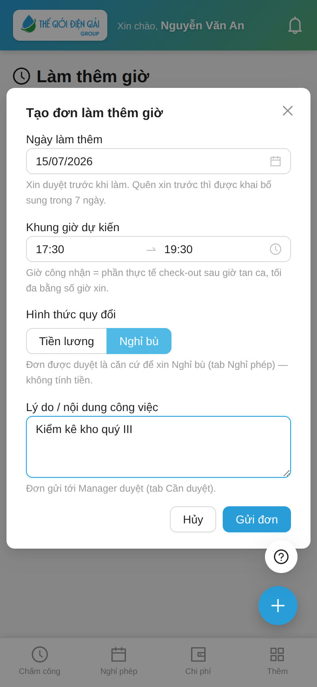

# Hành trình một ngày Nghỉ bù
{: .no_toc }

**Kiếm giờ → tiêu giờ** · Làm thêm đổi lấy ngày nghỉ, thay vì nhận tiền
{: .fs-3 .text-grey-dk-000 }

> Nghỉ bù **không phải một loại đơn riêng lẻ** — nó là **2 đơn nối nhau**: (1) một phiếu **Làm thêm
> giờ** quy đổi *Nghỉ bù* để **kiếm giờ**, rồi (2) một đơn **Nghỉ phép loại Nghỉ bù** để **tiêu giờ**
> đó thành ngày nghỉ. Trang này nối cả hai. Ví dụ: anh **Nguyễn Văn An** làm thêm buổi tối
> **11/07**, đổi lấy **nghỉ ngày 18/07**.

  
Mục lục

{: .text-delta }
1. TOC
{:toc}

> 🧭 **Đây là mô hình chuẩn cho "về sớm / thiếu giờ → làm bù".** Thiếu giờ hôm nay thì **làm thêm
> buổi khác** rồi khai OT quy đổi *Nghỉ bù* để cấn qua — không có đơn "xin về sớm" riêng.

---

## Toàn cảnh

| Bước | Ai làm | Ở đâu | Kết quả |
|---|---|---|---|
| ① Kiếm giờ | Nhân viên | App → **Làm thêm giờ**, quy đổi **Nghỉ bù** | Phiếu OT **Chờ duyệt** |
| ② Duyệt OT | Trưởng Bộ Phận (`Shift Request Approver`) | App → **Cần duyệt** | Phiếu **Đã duyệt** = "vé" nghỉ bù |
| ③ Tiêu giờ | Nhân viên | App → **Nghỉ phép**, loại **Nghỉ bù** | Đơn nghỉ **Chờ Manager** |
| ④ Duyệt nghỉ | Trưởng Bộ Phận → HR | App / Desk | **Được nghỉ**, số dư Nghỉ bù âm |

> ⚠️ **Phải có bước ①② TRƯỚC.** Không có phiếu OT (quy đổi Nghỉ bù) đã duyệt cho đúng ngày thì
> **bước ③ bị chặn ngay lúc gửi**. Nghỉ bù không tự sinh ra từ đâu.

---

## ① Kiếm giờ — khai phiếu OT, chọn quy đổi "Nghỉ bù"

Anh An ở lại làm thêm tối 11/07. Hôm sau anh khai phiếu như [làm thêm bình thường](Hanh-Trinh-OT.html),
nhưng ở **Hình thức quy đổi** chọn **Nghỉ bù** thay vì *Tiền lương*:

Sau khi Manager duyệt và hệ thống đối chiếu chấm công, phiếu **ghi nhận số giờ** — đây chính là
"vé" để xin nghỉ bù, **gắn với ngày 11/07**.

> 📘 Chi tiết cơ chế khai-sau, đối chiếu, trần giờ: [Hành trình một phiếu Làm thêm giờ](Hanh-Trinh-OT.html).

---

## ② + ③ Tiêu giờ — xin nghỉ loại "Nghỉ bù"

Vào tab **Nghỉ phép** → **➕** → **Loại phép = Nghỉ bù**. Form hiện thêm ô **"Ngày làm thêm để bù"** —
chọn **đúng ngày trong phiếu OT** (11/07), rồi chọn **ngày muốn nghỉ** (18/07) + lý do → **Gửi đơn**:

Hệ thống **kiểm tra ngay lúc gửi**, chặn nếu:
- Ngày làm thêm đó **không có phiếu OT đã duyệt** (quy đổi Nghỉ bù) → *"Ngày … không có đơn Làm thêm giờ đã duyệt…"*.
- Ngày làm thêm đó **đã dùng để bù rồi** → mỗi ngày làm thêm chỉ đổi được **1 lần**.

Qua được kiểm tra, đơn đi tiếp **2 bước Manager → HR** y như [đơn nghỉ phép thường](Hanh-Trinh-Nghi-Phep.html).

---

## ④ Kết quả — được nghỉ, số dư về âm

Duyệt xong, ngày 18/07 tính **On Leave** (nghỉ có phép). Trên danh sách, loại **Nghỉ bù** hiện số dư
**âm** — đó là **bình thường**:

> 💡 **Vì sao số dư âm?** Nghỉ bù **không có quỹ cấp trước** như Phép năm. Mỗi ngày nghỉ bù kéo số
> dư xuống 1; con số âm = *"đã nghỉ bao nhiêu ngày bù"*. **Không trừ quỹ phép, không trừ lương.**

---

## Nghỉ bù có HẠN DÙNG

> ⏳ **Dùng trong kỳ, đừng để dành lâu.** Cuối mỗi kỳ (**30/06** và **31/12**) hệ thống **dọn** số dư
> nghỉ bù: phiếu OT quy đổi Nghỉ bù còn dư mà **chưa xin nghỉ** sẽ chuyển trạng thái **"Hết hạn"
> (Expired)** và **không dùng được nữa**. Làm thêm để bù thì tranh thủ **xin nghỉ trong cùng kỳ**.

---

## Hạn NỘP đơn (khi công ty bật)

> Công ty có thể đặt **hạn nộp đơn nghỉ sau khi đã nghỉ** (bảng *Hạn khai theo ngày hiệu
> lực* trong `HR Policy`). Với Nghỉ bù, đồng hồ tính trễ chạy từ **mốc muộn hơn** giữa
> **ngày bắt đầu nghỉ** và **ngày phiếu OT được duyệt** — phiếu OT duyệt chậm thì thời gian
> chờ duyệt **không bị tính** vào hạn, còn phiếu duyệt sớm rồi để dành ngày bù thì tính từ
> ngày nghỉ như phép thường. Chi tiết & ví dụ:
> [Hạn nộp phiếu & ràng buộc](HR-Filing-Deadline.html).

---

## So với các nhánh khác

| | **Nghỉ bù** *(trang này)* | **Làm thêm → Tiền** | **Nghỉ phép năm** |
|---|---|---|---|
| Bắt đầu từ | Phiếu OT quy đổi **Nghỉ bù** | Phiếu OT quy đổi **Tiền lương** | (có quỹ cấp sẵn) |
| Kết quả | **Ngày nghỉ** (số dư âm) | **Tiền** vào lương | Ngày nghỉ (trừ quỹ) |
| Hết hạn | **Có** — cuối kỳ 30/06 & 31/12 | Không (đã thành tiền) | Theo chính sách phép năm |
| Số bước xin nghỉ | 2 (Manager → HR) | — | 2 (Manager → HR) |

---

## Sự cố hay gặp

| Tình huống | Nguyên nhân / cách xử |
|---|---|
| *"Ngày … không có đơn Làm thêm giờ đã duyệt"* | Chưa có phiếu OT (quy đổi **Nghỉ bù**) đã duyệt cho đúng ngày — làm bước ①② trước |
| Chọn được ngày làm thêm nhưng vẫn báo lỗi | Phiếu OT ngày đó quy đổi **Tiền lương**, không phải Nghỉ bù — huỷ, khai lại đúng loại |
| *"đã dùng để bù rồi"* | Mỗi ngày làm thêm chỉ đổi **1 ngày nghỉ** — dùng ngày làm thêm khác |
| Số dư Nghỉ bù bỗng về 0 / mất | Đã qua **cuối kỳ** — phiếu chưa dùng bị **Hết hạn**. Lần sau xin nghỉ trong kỳ |
| Số dư âm, tưởng bị phạt | Âm là **đúng thiết kế** — không trừ lương, không trừ quỹ phép |
| *"Đơn Nghỉ bù từ ngày … đã quá hạn nộp"* | Nộp trễ quá hạn công ty đặt (tính từ ngày nghỉ hoặc ngày duyệt phiếu OT, mốc muộn hơn) → liên hệ HR tạo thủ công |
| *"Attendance … is already marked …"* khi xin nghỉ bù | Hôm đó **đã chấm công**. Rất hay gặp vì nghỉ bù thường xin ngay trong ngày: làm sáng → trưa xin nghỉ chiều. Tích **Nghỉ nửa ngày** là gửi được (buổi đã làm vẫn tính công). Xin **cả ngày** cho hôm đã đi làm thì không được |

---

## Liên quan
- 🔁 [Hành trình một phiếu Làm thêm giờ](Hanh-Trinh-OT.html) — bước ①②, cơ chế khai-sau & đối chiếu
- 🌴 [Hành trình một đơn nghỉ phép](Hanh-Trinh-Nghi-Phep.html) — bước ③④ chạy y hệt
- 👤 [Nhân viên: Xin làm thêm giờ](Guide-NhanVien-LamThem.html) · [Xin nghỉ phép & nghỉ bù](Guide-NhanVien-NghiPhep.html)
- 🔧 HR: [Loại phép & cấu hình](HR-Leave-Type.html) · [Cấu hình Overtime](HR-Overtime-Settings.html)
