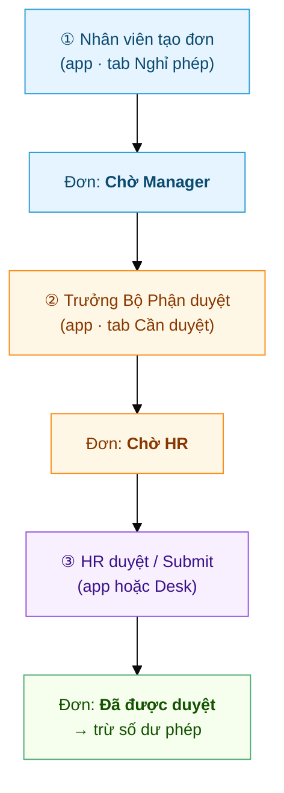
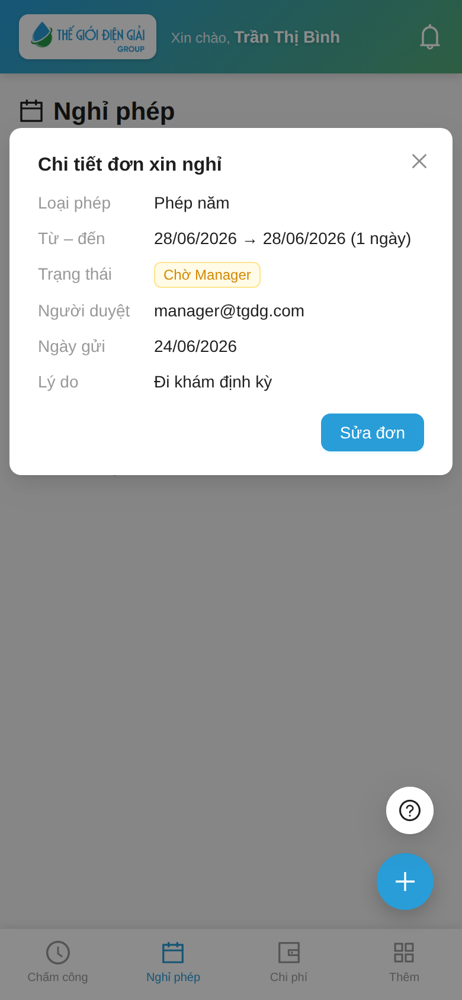
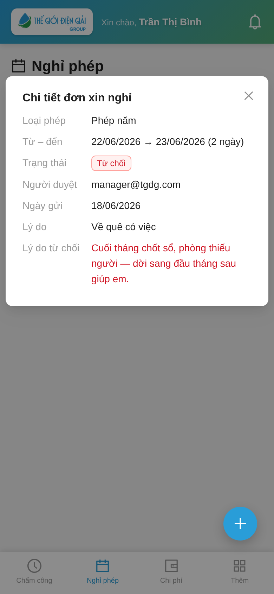

# Hành trình một đơn nghỉ phép
{: .no_toc }

**Theo chân 1 đơn từ lúc tạo đến lúc được duyệt** · Nhân viên → Trưởng Bộ Phận → HR
{: .fs-3 .text-grey-dk-000 }

> Trang này kể **toàn cảnh** một đơn nghỉ phép đi qua **2 bước duyệt**. Cần thao tác chi tiết theo
> vai trò thì bấm vào link ở mỗi bước. Ví dụ dùng xuyên suốt: chị **Trần Thị Bình** xin nghỉ
> **nửa ngày sáng 20/06** để đi khám.

  
Mục lục

{: .text-delta }
1. TOC
{:toc}

---

## Toàn cảnh

| Bước | Ai làm | Ở đâu | Kết quả |
|---|---|---|---|
| ① Tạo đơn | Nhân viên | App → **Nghỉ phép** | Đơn ở **Chờ Manager** |
| ② Duyệt bước 1 | Trưởng Bộ Phận (`Leave Approver`) | App → **Cần duyệt** | Đơn lên **Chờ HR** |
| ③ Duyệt bước 2 | HR (`HR Manager`) | App → **Cần duyệt** *hoặc* Desk | Đơn **Đã được duyệt**, trừ phép |

> ⚠️ Đơn **chỉ chính thức & trừ phép** sau bước ③ (HR). Manager duyệt xong, đơn vẫn còn "chờ".

> 🔀 **Một số loại phép đi tắt — gửi THẲNG HR, bỏ qua bước ①②.** Loại phép **chế độ / BHXH / WFH**
> (HR đánh dấu) và **người là quản lý** (được whitelist / đang là người duyệt của nhân viên khác)
> **không qua Trưởng Bộ Phận** — đơn vào thẳng HR (chỉ **1 bước**). Xem [Trường hợp đặc biệt](#trường-hợp-đặc-biệt-đơn-gửi-thẳng-hr) cuối trang.

---

## ① Nhân viên tạo đơn

Mở app → tab **Nghỉ phép** → bấm nút **➕** → điền **Loại phép · Khoảng ngày · (Nửa ngày) · Lý do**
→ **Gửi đơn**.

> 💡 Form ghi rõ **"Đơn gửi đi sẽ qua duyệt 2 bước: Quản lý → HR"**. Tick **Nghỉ nửa ngày** + chọn
> **Buổi sáng/chiều** nếu chỉ nghỉ 0,5 ngày.
> Chi tiết: [Nhân viên — Xin nghỉ phép](Guide-NhanVien-NghiPhep.html).

Gửi xong, đơn xuất hiện trong danh sách của nhân viên với nhãn **Chờ Manager** (vàng):

> ✏️ **Lỡ điền sai? Sửa được khi còn "Chờ Manager".** Mở đơn → bấm **Sửa đơn** để đổi loại phép /
> ngày / lý do rồi gửi lại — khỏi phải huỷ tạo mới. Qua bước Manager duyệt rồi thì **không sửa được nữa**.

---

## ② Trưởng Bộ Phận duyệt (bước 1)

Người duyệt nhận **thông báo đẩy** + badge đỏ trên tab **Cần duyệt**. Mở đơn của Trần Thị Bình → bấm
**Duyệt (Trưởng bộ phận)**.

- **Duyệt (Trưởng bộ phận)** → đơn chuyển sang **Chờ HR duyệt**.
- **Từ chối** → đơn bị đóng. **Bắt buộc nhập lý do** mới từ chối được; lý do này **gửi lại cho nhân viên** (xem cuối trang).
- **Chuyển duyệt** → giao cho người khác (ca khó / đi vắng).

> ⏳ **Bấm 1 lần rồi đợi**: màn hiện **"Đang xử lý…"** rồi báo kết quả. Đừng bấm nhiều lần — lỡ bấm
> lại chỉ báo *"Đơn này đã được xử lý"*, không duyệt/từ chối hai lần. *(Áp dụng cho cả bước HR.)*

💻 **Trên Desk:** mở đơn (trạng thái *Pending Manager*) → bấm **Actions** → chọn **Manager Approve** (hoặc *Manager Reject*).

> 📘 Chi tiết: [Trưởng Bộ Phận — Phê duyệt](Guide-TruongBoPhan-Duyet.html) ·
> [Duyệt nghỉ phép (Manager + HR)](Duyet-Nghi-Phep.html).

---

## ③ HR duyệt (bước 2 — bước cuối)

Đơn đã qua Manager hiện ở **Chờ HR duyệt**. HR mở trong tab **Cần duyệt** (hoặc trên Desk) → bấm
**Duyệt (HR)**.

- **Duyệt (HR)** → đơn **chính thức được duyệt** và **trừ số dư phép**.
- **Từ chối** → đơn bị đóng.

💻 **Trên Desk** (xem chi tiết, lọc trạng thái, xử lý hàng loạt): mở `/app/leave-application` → đơn ở *Manager Approved* → bấm **Actions** → chọn **Submit** (hoặc *HR Reject*).

> 📘 Lọc danh sách + cột trạng thái workflow trên Desk: xem [Duyệt nghỉ phép (Manager + HR) → phần B](Duyet-Nghi-Phep.html#b-hr-duyệt-trên-desk-app).

---

## Kết quả: đơn được duyệt, phép bị trừ

Nhân viên thấy đơn chuyển nhãn **Đã được duyệt** (xanh) và **số dư phép giảm** đúng số ngày đã nghỉ
(ở đây Phép năm **7,5 → 7,0** vì nghỉ 0,5 ngày).

---

## Nếu bị từ chối — nhân viên biết lý do

Bị từ chối ở bước ① hoặc ②, đơn chuyển nhãn **Từ chối** (đỏ). Mở đơn ra, nhân viên thấy đúng
**Lý do từ chối** người duyệt đã ghi — biết đường điều chỉnh rồi **gửi đơn mới**:

> ✍️ Người duyệt **không thể từ chối trống** — hệ thống bắt nhập lý do. Nhờ vậy nhân viên luôn
> có phản hồi cụ thể, không bị "đơn biến mất mà không rõ vì sao".

---

## Nhãn trạng thái — đối chiếu nhanh

| Nhân viên thấy | Người duyệt thấy | Nghĩa |
|---|---|---|
| 🟡 **Chờ Manager** | Chờ trưởng bộ phận duyệt | Đang chờ bước ① Trưởng Bộ Phận |
| 🔵 **Manager đã duyệt** | Chờ HR duyệt | Đã qua bước ②, đang chờ HR |
| 🟢 **Đã được duyệt** | *(đã rời inbox)* | Hoàn tất bước ③, đã trừ phép |
| 🔴 **Từ chối** | *(đã rời inbox)* | Bị từ chối ở bước ① hoặc ② |

---

## Trường hợp đặc biệt: đơn gửi thẳng HR

Không phải đơn nào cũng đi qua Trưởng Bộ Phận. Có **2 nhóm đi tắt — chỉ 1 bước (HR)**, hệ thống
**tự nhận biết**, nhân viên không phải chọn gì:

**① Theo LOẠI phép** — *chế độ · BHXH · WFH* (HR đánh dấu sẵn). Chọn đúng loại này, form đổi ngay:
báo **"gửi THẲNG lên HR (bỏ qua Quản lý)"** và **bắt buộc đính kèm hình chứng từ** (giấy chế độ,
đơn thuốc…) mới gửi được:

**② Theo NGƯỜI** — nếu nhân viên **chính là quản lý** (đang là người duyệt của người khác, hoặc
được HR whitelist), thì **mọi đơn** của họ vào thẳng HR — **không cần đính kèm**.

Cả hai đều gửi xong hiện **"Đã gửi đơn. Chờ HR duyệt."** thay vì "Chờ Manager". Từ đó chỉ còn
**bước ③ (HR)** như trên; kết quả trừ phép y hệt.

> 💡 Muốn thêm/bớt loại phép đi thẳng HR, hay whitelist một người: xem
> [Cấp phép & gán người duyệt](Desk-HR-CapPhep.html).

---

## Liên quan
- 👤 [Nhân viên: Xin nghỉ phép](Guide-NhanVien-NghiPhep.html)
- 🔁 [Hành trình một ngày Nghỉ bù](Hanh-Trinh-Nghi-Bu.html) — nhánh làm thêm → đổi ngày nghỉ
- ✅ [Duyệt nghỉ phép & nghỉ bù (Manager + HR)](Duyet-Nghi-Phep.html) — hướng dẫn duyệt đầy đủ + Desk
- ⚙️ [Cấp phép & gán người duyệt](Desk-HR-CapPhep.html) · 🔧 [Leave Setup & Workflow (kỹ thuật)](HR-Leave-Setup.html)
