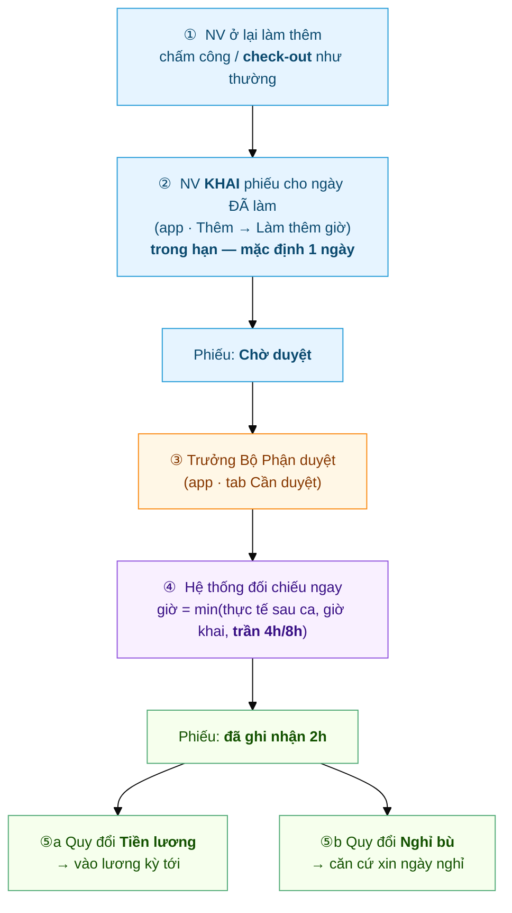
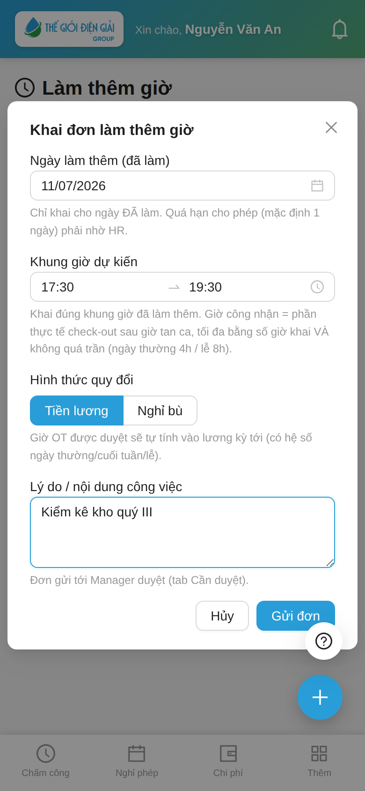
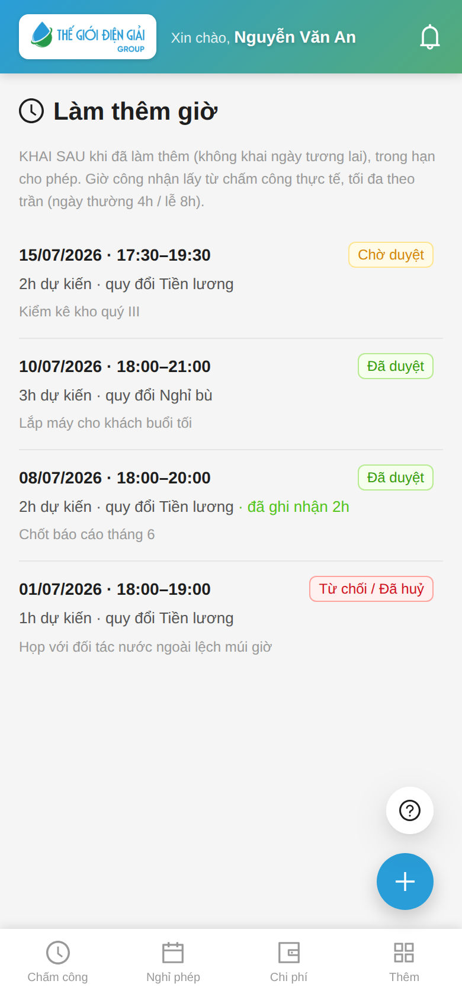
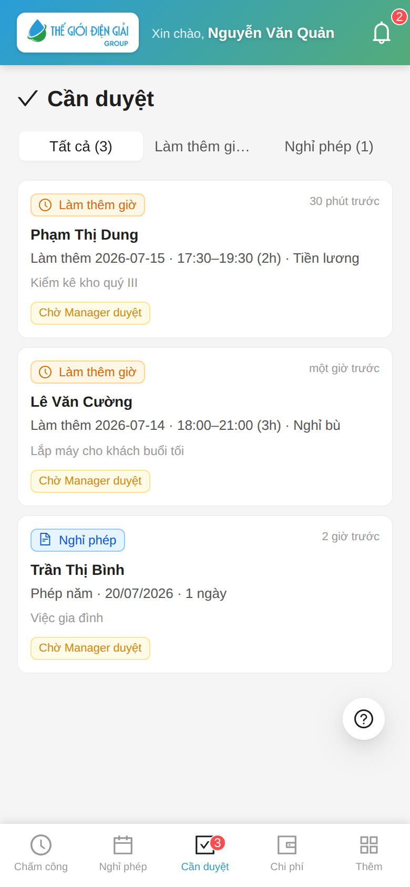
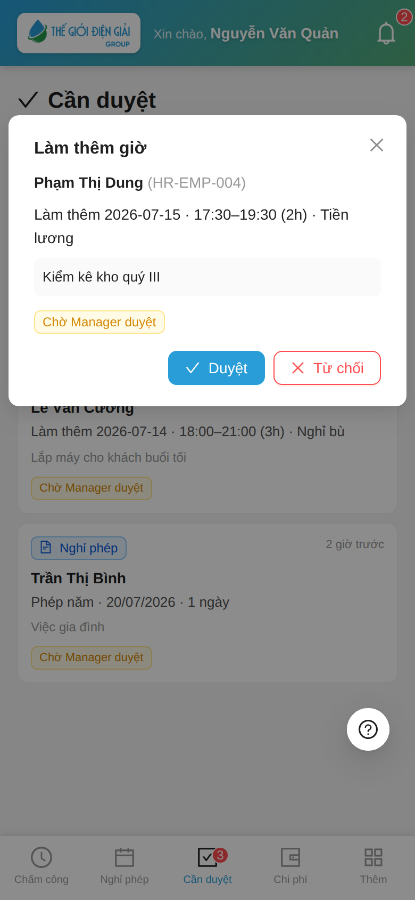
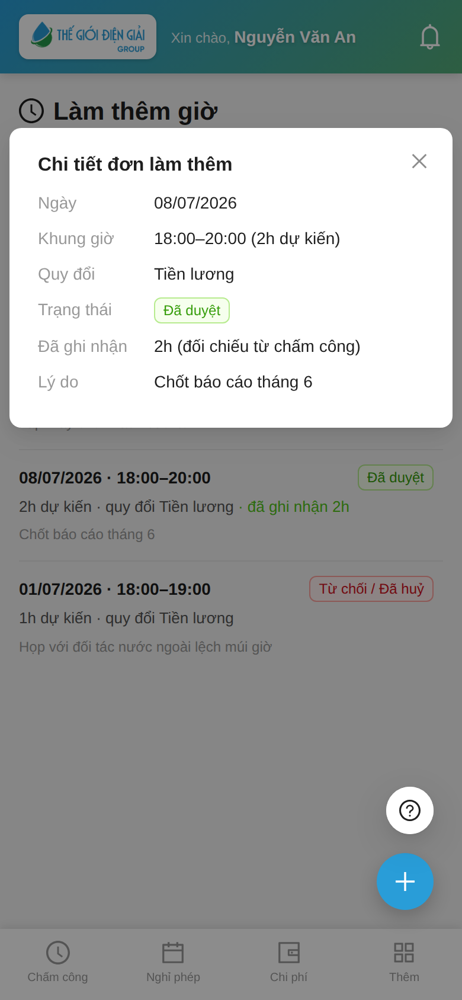

# Hành trình một phiếu Làm thêm giờ
{: .no_toc }

**Theo chân 1 phiếu OT từ lúc khai đến lúc thành tiền / thành ngày nghỉ bù** · Nhân viên → Trưởng Bộ Phận → Chấm công
{: .fs-3 .text-grey-dk-000 }

> Trang này kể **toàn cảnh** một phiếu làm thêm giờ. Có **2 điểm khác** mọi loại đơn khác:
> (1) phiếu OT **khai SAU khi đã làm** — làm thêm trước, chấm công như thường, rồi mới khai;
> (2) phiếu duyệt xong **chưa chắc đủ giờ** — hệ thống còn **đối chiếu với chấm công thực tế**.
> Ví dụ dùng xuyên suốt: anh **Nguyễn Văn An** ở lại làm thêm **17:30–19:30 ngày 11/07** để chốt
> báo cáo tháng, **hôm sau (12/07) mới khai** phiếu.

<details open markdown="block">
  <summary>Mục lục</summary>
{: .text-delta }
1. TOC
{:toc}
</details>

---

## Toàn cảnh



| Bước | Ai làm | Ở đâu | Kết quả |
|---|---|---|---|
| ① Làm thêm | Nhân viên | Chấm công như thường (nhớ **check-out**) | Có giờ check-out thực tế |
| ② Khai phiếu | Nhân viên | App → **Thêm → Làm thêm giờ** | Phiếu **Chờ duyệt** |
| ③ Duyệt | Trưởng Bộ Phận (`Shift Request Approver`) | App → **Cần duyệt** | Phiếu **Đã duyệt** |
| ④ Đối chiếu | **Hệ thống** (tự động, ngay lúc duyệt) | — | Phiếu có **số giờ công nhận** |
| ⑤ Quy đổi | HR (lương) / Nhân viên (nghỉ bù) | Payroll / App → Nghỉ phép | Thành tiền **hoặc** ngày nghỉ |

> ⚠️ **Khai SAU, không khai trước.** App **chặn khai cho ngày trong tương lai** — chưa làm thì
> chưa có gì để khai. Và **phiếu duyệt xong CHƯA chắc là đủ giờ** — giờ chốt sau bước ④, khi
> đã đối chiếu với chấm công thực tế. Duyệt ≠ trả tiền.

---

## ① Làm thêm + chấm công như thường

Hôm 11/07 anh An ở lại tới 19:30. Anh **không phải khai gì trước** — cứ **check-out** lúc về như
mọi ngày. Chính giờ check-out này là **bằng chứng** để hệ thống tính giờ OT ở bước ④.

> 🔒 **Ở lại muộn KHÔNG tự thành giờ làm thêm.** Nếu không có phiếu OT đã khai + duyệt, hệ thống
> ghi nhận **0 giờ OT** — dù chấm công cho thấy về lúc 19:30. Muốn được tính, **phải khai phiếu**
> (bước ②).
>
> ⚠️ **Quên check-out = mất bằng chứng.** Không có giờ về thì bước ④ tính 0h, dù phiếu đã duyệt.

---

## ② Nhân viên KHAI phiếu — SAU khi đã làm

Hôm sau (12/07) anh An mở app → tab **Thêm** → **Làm thêm giờ** → bấm **➕** → điền **Ngày làm thêm
(đã làm) · Khung giờ · Hình thức quy đổi · Lý do** → **Gửi đơn**.



Form nói rõ luật khai-sau:

> ⏱️ **Chỉ khai cho ngày ĐÃ làm** — ô ngày **không cho chọn ngày mai trở đi**.
> **Trong hạn — mặc định 1 ngày:** làm hôm nay thì khai chậm nhất **hôm sau**. Quá hạn → app báo
> *"Chỉ được khai làm thêm trong vòng N ngày sau khi làm. Quá hạn liên hệ HR."* → nhờ HR khai tay.
> *(N = cấu hình `HR Policy.overtime_declaration_deadline_days`, mặc định 1.)*

Gửi xong, phiếu nằm trong danh sách với nhãn **Chờ duyệt** (vàng):



📘 Chi tiết thao tác: [Nhân viên — Xin làm thêm giờ](Guide-NhanVien-LamThem.html) 🎬 *(có video)*

---

## ③ Trưởng Bộ Phận duyệt

Người duyệt nhận **thông báo đẩy** ngay + badge đỏ tab **Cần duyệt**. Phiếu OT có thẻ 🟠
**Làm thêm giờ**, nằm chung hộp duyệt với nghỉ phép và chấm công bù.



Bấm vào phiếu → xem ngày, khung giờ, **hình thức quy đổi**, lý do → **Duyệt** hoặc **Từ chối**.



> 💡 **Duyệt không sợ "hớ".** Số giờ trong phiếu là **mức trần**, không phải số tiền chốt.
> Nhân viên khai 2h nhưng thực tế chỉ ở lại 1h → hệ thống chỉ tính **1h**. Ngoài ra còn **trần
> cứng**: ngày thường tối đa **4h**, ngày lễ/nghỉ tối đa **8h** — khai quá cũng bị cắt về trần.

> ✍️ **Từ chối phải ghi lý do.** Khi bấm Từ chối, app bắt nhập lý do; nhân viên **nhận được lý do
> đó** trên phiếu (dòng đỏ *"Lý do từ chối"*) để biết đường xử lý.

**Ai là người duyệt?** `Shift Request Approver` (người duyệt chấm công) — **không phải**
người duyệt nghỉ phép. HR Manager luôn duyệt thay được.

📘 Chi tiết: [Duyệt đơn làm thêm giờ](Duyet-Lam-Them.html) 🎬 *(có video)*

---

## ④ Hệ thống tự đối chiếu — ngay lúc duyệt

Vì phiếu **khai sau khi đã làm**, chấm công của ngày đó **đã có sẵn**. Nên **ngay khi bấm Duyệt**,
hệ thống đối chiếu luôn — không cần chờ thêm:

```
Giờ công nhận  =  min( giờ thực tế check-out SAU giờ tan ca ,  giờ khai ,  trần 4h/8h )
```

Ví dụ anh An (ca tan 17:30, khai OT 2 tiếng cho ngày thường → trần 4h):

| Thực tế check-out | Giờ dôi sau ca | Giờ khai | **Được tính** | Vì sao |
|---|---|---|---|---|
| 19:30 | 2h | 2h | **2h** | Làm đúng như khai |
| 20:30 | 3h | 2h | **2h** | Cap theo phiếu — khai 2 thì tính 2 |
| 18:30 | 1h | 2h | **1h** | Làm ít hơn khai → tính theo thực tế |
| 17:30 (về đúng giờ) | 0h | 2h | **0h** | Không ở lại → không có OT |
| *(quên check-out)* | — | 2h | **0h** | Không có bằng chứng giờ về |

> 🔒 **Trần cứng bao trùm tất cả:** dù thực tế lẫn giờ khai đều cao, ngày thường **không quá 4h**,
> ngày lễ/nghỉ **không quá 8h** (cấu hình per công ty tại `HR Policy`).

Nhân viên mở phiếu ra là thấy kết quả — dòng xanh **"đã ghi nhận 2h"**:



Bên phía chấm công, giờ này cũng được ghi vào **bảng công** của ngày hôm đó (HR xem trên
Desk: Attendance → mục *Overtime*). Giờ làm thêm **không cộng vào `working_hours`** của
ngày công — nó là khoản riêng, để không bị tính 2 lần.

---

## ⑤ Quy đổi — rẽ 2 nhánh tuỳ lựa chọn lúc khai phiếu

### ⑤a — Chọn **Tiền lương**

Giờ OT đã ghi nhận tự chảy vào kỳ lương, nhân hệ số theo quy định:

| Ngày làm thêm | Hệ số |
|---|---|
| Ngày thường | **×1.5** (150%) |
| Cuối tuần | **×2.0** (200%) |
| Ngày lễ | **×3.0** (300%) |

Nhân viên **không phải làm gì thêm**. HR chạy lương là có dòng **"Lương làm thêm giờ"**
trên phiếu lương.

> 🔧 HR: xem [Cấu hình Overtime](HR-Overtime-Settings.html) — cần bật *Payroll Settings →
> `create_overtime_slip`* để payroll tự gom. **Nếu công ty không tính lương trên hệ thống**,
> bỏ qua phần này — số giờ vẫn nằm đủ trong phiếu để làm căn cứ tính tay
> (Desk → *HR Overtime Request*, lọc **Đã duyệt** theo tháng, cột **Số giờ công nhận**).

### ⑤b — Chọn **Nghỉ bù**

Phiếu OT đã duyệt (quy đổi **Nghỉ bù**) trở thành **"vé"** để xin nghỉ bù. Nhân viên vào tab
**Nghỉ phép** → tạo đơn → **Loại phép = Nghỉ bù** → ô **"Ngày làm thêm để bù"** chọn **đúng ngày
trong phiếu OT**.


Hệ thống **tự kiểm tra**, chặn ngay lúc gửi nếu:
- Ngày đó **không có phiếu OT đã duyệt** (quy đổi Nghỉ bù) → *"Ngày … không có đơn Làm thêm giờ đã duyệt…"*
- Ngày làm thêm đó **đã dùng để bù rồi** → mỗi ngày chỉ bù **1 lần**.

Đơn nghỉ bù sau đó đi qua **2 bước duyệt Quản lý → HR** như nghỉ phép thường.

> ⏳ **Nghỉ bù có hạn dùng.** Số dư nghỉ bù được **dọn cuối mỗi kỳ** (30/06 và 31/12): phiếu OT
> quy đổi Nghỉ bù còn dư mà chưa nghỉ sẽ chuyển **"Hết hạn" (Expired)** — nên tranh thủ xin nghỉ
> trong kỳ.

> 💡 Nghỉ bù **không trừ quỹ phép, không trừ lương**. Số dư loại "Nghỉ bù" hiện **âm** là
> bình thường — âm bao nhiêu = đã nghỉ bù bấy nhiêu ngày.

📘 Toàn cảnh riêng cho nhánh này: [Hành trình một ngày Nghỉ bù](Hanh-Trinh-Nghi-Bu.html).

---

## Nhãn trạng thái — đối chiếu nhanh

| Nhân viên thấy | Nghĩa | Làm gì tiếp |
|---|---|---|
| 🟡 **Chờ duyệt** | Đang chờ Trưởng Bộ Phận | Chờ; đổi ý thì bấm **Huỷ đơn** |
| 🟢 **Đã duyệt** + *"đã ghi nhận Xh"* | Xong — giờ đã được chốt (đối chiếu ngay lúc duyệt) | Không phải làm gì (hoặc đi xin nghỉ bù nếu chọn nhánh ⑤b) |
| 🟢 **Đã duyệt** + *ghi nhận 0h* | Duyệt rồi nhưng ngày đó **không có giờ dôi / quên check-out** | Tạo [Đề xuất chấm công bù](Hanh-Trinh-Cham-Cong-Bu.html) để có lại giờ về, rồi nhờ duyệt lại |
| 🔴 **Từ chối / Đã huỷ** | Quản lý từ chối (kèm **lý do**), hoặc bạn tự huỷ | Đọc lý do từ chối; tạo phiếu mới nếu cần |

---

## Sự cố hay gặp

| Tình huống | Nguyên nhân / cách xử |
|---|---|
| Ở lại làm thêm mà không có giờ OT nào | Ngày đó **chưa khai phiếu** — phải khai (trong hạn) rồi được duyệt |
| Không chọn được ngày làm thêm trong lịch | App **chặn ngày tương lai** — chỉ khai cho ngày **đã làm** |
| *"Chỉ được khai … trong vòng N ngày sau khi làm"* | Khai quá hạn (mặc định **1 ngày**) → nhờ HR khai tay |
| Phiếu duyệt rồi, ghi nhận **0h** | Quên check-out, hoặc check-out **trước** giờ tan ca |
| Giờ ghi nhận **ít hơn** thực tế làm | Bị cap theo giờ khai **hoặc** trần cứng 4h/8h — khai đúng số giờ đã làm |
| *"Đã có đơn làm thêm giờ ngày…"* | Mỗi ngày chỉ **1 phiếu**. Huỷ phiếu cũ nếu muốn đổi khung giờ |
| *"Chưa có Manager duyệt làm thêm giờ"* | HR chưa gán **Shift Request Approver** cho phòng bạn |

---

## Liên quan
- 👤 [Nhân viên: Xin làm thêm giờ](Guide-NhanVien-LamThem.html) 🎬 — thao tác chi tiết
- ✅ [Duyệt đơn làm thêm giờ](Duyet-Lam-Them.html) 🎬 — dành cho Trưởng Bộ Phận
- 🔁 [Hành trình một ngày Nghỉ bù](Hanh-Trinh-Nghi-Bu.html) — nhánh ⑤b, kiếm giờ → tiêu giờ
- 🌴 [Xin nghỉ phép & nghỉ bù](Guide-NhanVien-NghiPhep.html)
- 🔧 HR: [Cấu hình Overtime](HR-Overtime-Settings.html) · [HR Overtime Request (dữ liệu)](HR-Overtime-Request.html)
