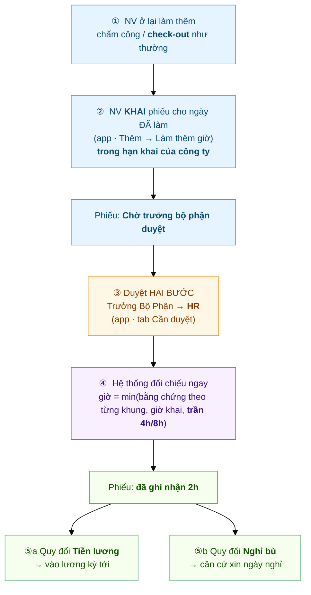

# Hành trình một phiếu Làm thêm giờ
{: .no_toc }

**Theo chân 1 phiếu OT từ lúc khai đến lúc thành tiền / thành ngày nghỉ bù** · Nhân viên → Trưởng Bộ Phận → HR → Chấm công
{: .fs-3 .text-grey-dk-000 }

> Trang này kể **toàn cảnh** một phiếu làm thêm giờ. Có **2 điểm khác** mọi loại đơn khác:
> (1) phiếu OT **khai SAU khi đã làm** — làm thêm trước, chấm công như thường, rồi mới khai;
> (2) phiếu duyệt xong **chưa chắc đủ giờ** — hệ thống còn **đối chiếu với chấm công thực tế**.
> Ví dụ dùng xuyên suốt: anh **Nguyễn Văn An** ở lại làm thêm **17:30–19:30 ngày 11/07** để chốt
> báo cáo tháng, **hôm sau (12/07) mới khai** phiếu.

<details open markdown="block">
  <summary>Mục lục</summary>
{: .text-delta }
1. TOC
{:toc}
</details>

---

## Toàn cảnh



| Bước | Ai làm | Ở đâu | Kết quả |
|---|---|---|---|
| ① Làm thêm | Nhân viên | Chấm công như thường (nhớ **check-out**) | Có giờ check-out thực tế |
| ② Khai phiếu | Nhân viên | App → **Thêm → Làm thêm giờ** | Phiếu **Chờ trưởng bộ phận duyệt** |
| ③a Duyệt bước 1 | Trưởng Bộ Phận (`Shift Request Approver`) | App → **Cần duyệt** | Phiếu **Chờ HR duyệt** — chưa có hiệu lực |
| ③b Duyệt bước cuối | HR (người duyệt cuối ở HR Policy) | App → **Cần duyệt** | Phiếu **Đã duyệt** |
| ④ Đối chiếu | **Hệ thống** (tự động, ngay lúc HR duyệt) | — | Phiếu có **số giờ công nhận** |
| ⑤ Quy đổi | HR (lương) / Nhân viên (nghỉ bù) | Payroll / App → Nghỉ phép | Thành tiền **hoặc** ngày nghỉ |

> ⚠️ **Khai trước hay khai sau đều được** (khai trước như đơn nghỉ; khai bù trong hạn cấu
> hình). Nhưng **phiếu duyệt xong CHƯA chắc là đủ giờ** — giờ chốt sau bước ④, khi đã đối
> chiếu với chấm công thực tế của ngày làm thêm. Duyệt ≠ trả tiền.
>
> 💡 **Một ngày làm thêm nhiều lần** (ví dụ làm xuyên trưa rồi tối lại ở thêm) thì khai
> **nhiều khung giờ trong cùng một phiếu** — nút *Thêm khung giờ* trên form. Mỗi ngày vẫn
> chỉ một phiếu.

---

## ① Làm thêm + chấm công như thường

Hôm 11/07 anh An ở lại tới 19:30. Anh **không phải khai gì trước** — cứ **check-out** lúc về như
mọi ngày. Chính giờ check-out này là **bằng chứng** để hệ thống tính giờ OT ở bước ④.

> 🔒 **Ở lại muộn KHÔNG tự thành giờ làm thêm.** Nếu không có phiếu OT đã khai + duyệt, hệ thống
> ghi nhận **0 giờ OT** — dù chấm công cho thấy về lúc 19:30. Muốn được tính, **phải khai phiếu**
> (bước ②).
>
> ⚠️ **Quên check-out = mất bằng chứng.** Không có giờ về thì bước ④ tính 0h, dù phiếu đã duyệt.

---

## ② Nhân viên KHAI phiếu — SAU khi đã làm

Hôm sau (12/07) anh An mở app → tab **Thêm** → **Làm thêm giờ** → bấm **➕** → điền **Ngày làm thêm
(đã làm) · Khung giờ · Hình thức quy đổi · Lý do** → **Gửi đơn**.


Form nói rõ luật khai-sau:

> ⏱️ **Chỉ khai cho ngày ĐÃ làm** — ô ngày **không cho chọn ngày mai trở đi**.
> **Trong hạn:** quá hạn → app báo *"Chỉ được khai làm thêm trong vòng N ngày sau khi làm.
> Quá hạn liên hệ HR."* → nhờ HR khai thủ công.
> *(N = cột "Hạn khai làm thêm" trong bảng **Hạn khai theo ngày hiệu lực** của `HR Policy`,
> xét theo NGÀY LÀM THÊM — xem [Hạn nộp phiếu & ràng buộc](HR-Filing-Deadline.html).)*

Gửi xong, phiếu nằm trong danh sách với nhãn **Chờ trưởng bộ phận duyệt** (vàng):


📘 Chi tiết thao tác: [Nhân viên — Xin làm thêm giờ](Guide-NhanVien-LamThem.html) 🎬 *(có video)*

---

## ③ Duyệt hai bước: Trưởng Bộ Phận → HR

Giống đơn nghỉ phép, phiếu làm thêm đi qua **hai người duyệt**:

1. **Trưởng Bộ Phận** nhận **thông báo đẩy** ngay khi phiếu được gửi + badge đỏ tab **Cần duyệt**,
   bấm **Duyệt (Trưởng bộ phận)**. Phiếu chuyển sang **Chờ HR duyệt**.
2. **HR** (người có tên trong danh sách người duyệt cuối ở HR Policy) nhận thông báo, bấm
   **Duyệt (HR)**. Chỉ từ lúc này phiếu mới **có hiệu lực**.

Phiếu OT có thẻ 🟠 **Làm thêm giờ**, nằm chung hộp duyệt với nghỉ phép và chấm công bù.


Bấm vào phiếu → xem ngày, khung giờ, **hình thức quy đổi**, lý do → **Duyệt** hoặc **Từ chối** (ở
bước nào cũng từ chối được, và phải ghi lý do).


> 💡 **Duyệt không sợ "hớ".** Số giờ trong phiếu là **mức trần**, không phải số tiền chốt.
> Nhân viên khai 2h nhưng thực tế chỉ ở lại 1h → hệ thống chỉ tính **1h**. Ngoài ra còn **trần
> cứng**: ngày thường tối đa **4h**, ngày lễ/nghỉ tối đa **8h** — khai quá cũng bị cắt về trần.

> ✍️ **Từ chối phải ghi lý do.** Khi bấm Từ chối, app bắt nhập lý do; nhân viên **nhận được lý do
> đó** trên phiếu (dòng đỏ *"Lý do từ chối"*) để biết đường xử lý.

**Ai là người duyệt?** Bước 1: `Shift Request Approver` (người duyệt chấm công) — **không phải**
người duyệt nghỉ phép; HR Manager bước vào thay được. Bước cuối: HR Manager có tên trong danh sách
người duyệt cuối của công ty — cùng danh sách với đơn nghỉ phép.

> ⚙️ Hai bước này là cấu hình hiện tại của công ty — HR có thể chuyển về **1 bước** (trưởng bộ phận
> duyệt là xong).

> ⏳ **Trưởng Bộ Phận duyệt xong, phiếu CHƯA có hiệu lực.** Chưa đối chiếu giờ, chưa vào lương,
> chưa cộng quỹ Nghỉ bù, ngày nghỉ chưa được tính công — cho tới khi HR duyệt. Trong lúc chờ,
> bạn vẫn **tự huỷ phiếu** được và **không khai được phiếu thứ hai** cho cùng ngày.

📘 Chi tiết: [Duyệt đơn làm thêm giờ](Duyet-Lam-Them.html) 🎬 *(có video)*

---

## ④ Hệ thống tự đối chiếu — ngay lúc HR duyệt

Vì phiếu **khai sau khi đã làm**, chấm công của ngày đó **đã có sẵn**. Nên **ngay khi HR bấm Duyệt**,
hệ thống đối chiếu luôn — không cần chờ thêm:

```
Giờ công nhận  =  min( giờ có bằng chứng theo TỪNG KHUNG ,  giờ khai ,  trần 4h/8h )
```

- **Khung sau giờ tan ca** (làm tối): bằng chứng = giờ check-out thực tế sau `end_time` của ca.
- **Khung xuyên trưa** (khai đích danh trong giờ nghỉ trưa, ví dụ 12:00–13:30): máy không đo
  được giờ trưa (giờ nghỉ trưa được trừ tự động khỏi giờ công), nên bằng chứng = **có mặt cả
  ngày** (check-in/check-out phủ khung trưa) + **chữ ký người duyệt**; tối đa bằng độ dài giờ
  nghỉ trưa.

Ví dụ anh An (ca tan 17:30, khai OT khung tối 2 tiếng cho ngày thường → trần 4h):

| Thực tế check-out | Giờ dôi sau ca | Giờ khai | **Được tính** | Vì sao |
|---|---|---|---|---|
| 19:30 | 2h | 2h | **2h** | Làm đúng như khai |
| 20:30 | 3h | 2h | **2h** | Cap theo phiếu — khai 2 thì tính 2 |
| 18:30 | 1h | 2h | **1h** | Làm ít hơn khai → tính theo thực tế |
| 17:30 (về đúng giờ) | 0h | 2h | **0h** | Không ở lại → không có OT |
| *(quên check-out)* | — | 2h | **0h** | Không có bằng chứng giờ về |

Nếu anh An khai thêm **khung trưa 12:00–13:30** (làm xuyên trưa): có mặt cả ngày (vào 07:55,
ra 17:30) → được tính **1,5h** cho khung trưa, kể cả khi về đúng giờ tan ca. Bằng chứng buổi
tối không cộng thay cho khung trưa và ngược lại.

> 🔒 **Trần cứng bao trùm tất cả:** dù thực tế lẫn giờ khai đều cao, ngày thường **không quá 4h**,
> ngày lễ/nghỉ **không quá 8h** (cấu hình per công ty tại `HR Policy`).

Nhân viên mở phiếu ra là thấy kết quả — dòng xanh **"đã ghi nhận 2h"**:


Bên phía chấm công, giờ này cũng được ghi vào **bảng công** của ngày hôm đó (HR xem trên
Desk: Attendance → mục *Overtime*). Giờ làm thêm **không cộng vào `working_hours`** của
ngày công — nó là khoản riêng, để không bị tính 2 lần.

---

## ⑤ Quy đổi — rẽ 2 nhánh tuỳ lựa chọn lúc khai phiếu

### ⑤a — Chọn **Tiền lương**

Giờ OT đã ghi nhận tự chảy vào kỳ lương, nhân hệ số theo quy định:

| Ngày làm thêm | Hệ số |
|---|---|
| Ngày thường | **×1.5** (150%) |
| Cuối tuần | **×2.0** (200%) |
| Ngày lễ | **×3.0** (300%) |

Nhân viên **không phải làm gì thêm**. HR chạy lương là có dòng **"Lương làm thêm giờ"**
trên phiếu lương.

> 🔧 HR: xem [Cấu hình Overtime](HR-Overtime-Settings.html) — cần bật *Payroll Settings →
> `create_overtime_slip`* để payroll tự gom. **Nếu công ty không tính lương trên hệ thống**,
> bỏ qua phần này — số giờ vẫn nằm đủ trong phiếu để làm căn cứ tính tay
> (Desk → *HR Overtime Request*, lọc **Đã duyệt** theo tháng, cột **Số giờ công nhận**).

### ⑤b — Chọn **Nghỉ bù**

Giờ trên phiếu OT đã duyệt (quy đổi **Nghỉ bù**) **cộng dồn vào quỹ giờ Nghỉ bù** của nhân viên.
Muốn nghỉ thì vào tab **Nghỉ phép** → tạo đơn → **Loại phép = Nghỉ bù** → chọn ngày muốn nghỉ.
**Không phải chọn ngày làm thêm nào** — hệ thống tự trừ lô giờ sắp hết hạn trước.

**Tỷ giá: 4 giờ = 0,5 ngày nghỉ · 8 giờ = 1 ngày.** Hệ thống chặn ngay lúc gửi nếu quỹ không đủ
giờ (*"Quỹ Nghỉ bù còn …h, chưa đủ để nghỉ … ngày"*). Vì ngày thường bị trần 4h, thường phải gom
hai buổi làm thêm mới đủ một ngày nghỉ; giờ lẻ không mất, nó nằm lại quỹ chờ đủ.

Đơn nghỉ bù sau đó đi qua **2 bước duyệt Quản lý → HR** như nghỉ phép thường.

> ⏳ **Quỹ Nghỉ bù có hạn dùng.** Mỗi lô giờ hết hạn ở cuối kỳ chứa ngày làm thêm (**30/06** hoặc
> **31/12**): phần giờ còn dư bị cắt, phiếu OT tương ứng chuyển **"Hết hạn" (Expired)**. Hệ thống
> nhắc trước vào 15 và 24 của tháng 6 và tháng 12.

> 💡 Nghỉ bù **không trừ quỹ phép, không trừ lương**. Trên Desk, số dư loại "Nghỉ bù" hiện **âm**
> là bình thường — âm bao nhiêu = đã nghỉ bù bấy nhiêu ngày; quỹ giờ thật xem trên app.

📘 Toàn cảnh riêng cho nhánh này: [Hành trình một ngày Nghỉ bù](Hanh-Trinh-Nghi-Bu.html).

---

## Nhãn trạng thái — đối chiếu nhanh

| Nhân viên thấy | Nghĩa | Làm gì tiếp |
|---|---|---|
| 🟡 **Chờ trưởng bộ phận duyệt** | Đang chờ bước 1 | Chờ; đổi ý thì bấm **Huỷ đơn** |
| 🔵 **Trưởng bộ phận đã duyệt · chờ HR** | Qua bước 1, đang chờ HR. **Chưa có hiệu lực** | Chờ; đổi ý vẫn bấm **Huỷ đơn** được |
| 🟢 **Đã duyệt** + *"đã ghi nhận Xh"* | Xong — giờ đã được chốt (đối chiếu ngay lúc duyệt) | Không phải làm gì (hoặc đi xin nghỉ bù nếu chọn nhánh ⑤b) |
| 🟢 **Đã duyệt** + *ghi nhận 0h* | Duyệt rồi nhưng ngày đó **không có giờ dôi / quên check-out** | Tạo [Đề xuất chấm công bù](Hanh-Trinh-Cham-Cong-Bu.html) để có lại giờ về, rồi nhờ duyệt lại |
| 🔴 **Từ chối / Đã huỷ** | Trưởng bộ phận hoặc HR từ chối (kèm **lý do**), hoặc bạn tự huỷ | Đọc lý do từ chối; tạo phiếu mới nếu cần |

---

## Sự cố hay gặp

| Tình huống | Nguyên nhân / cách xử |
|---|---|
| Ở lại làm thêm mà không có giờ OT nào | Ngày đó **chưa khai phiếu** — phải khai (trong hạn) rồi được duyệt |
| *"Chỉ được khai … trong vòng N ngày sau khi làm"* | Khai quá hạn (N theo bảng **Hạn khai theo ngày hiệu lực** của công ty) → nhờ HR khai thủ công |
| Phiếu duyệt rồi, ghi nhận **0h** | Quên check-out (mọi loại khung đều cần bằng chứng chấm công), hoặc chỉ khai khung tối mà check-out **trước** giờ tan ca |
| Làm xuyên trưa mà không được tính giờ | Chưa khai **khung trưa đích danh** (ví dụ 12:00–13:30) — khung gộp lẫn giờ làm chính thức không được tính phần trưa |
| Giờ ghi nhận **ít hơn** thực tế làm | Bị cap theo giờ khai **hoặc** trần cứng 4h/8h — khai đúng số giờ đã làm |
| *"Đã có đơn làm thêm giờ ngày…"* | Mỗi ngày chỉ **1 phiếu** — làm thêm nhiều lần trong ngày thì **thêm khung giờ** trong cùng phiếu; muốn đổi khung thì huỷ phiếu cũ khai lại |
| *"Chưa có người duyệt làm thêm giờ"* | HR chưa gán **Shift Request Approver** cho phòng bạn |

---

## Liên quan
- 👤 [Nhân viên: Xin làm thêm giờ](Guide-NhanVien-LamThem.html) 🎬 — thao tác chi tiết
- ✅ [Duyệt đơn làm thêm giờ](Duyet-Lam-Them.html) 🎬 — dành cho Trưởng Bộ Phận
- 🔁 [Hành trình một ngày Nghỉ bù](Hanh-Trinh-Nghi-Bu.html) — nhánh ⑤b, kiếm giờ → tiêu giờ
- 🌴 [Xin nghỉ phép & nghỉ bù](Guide-NhanVien-NghiPhep.html)
- 🔧 HR: [Cấu hình Overtime](HR-Overtime-Settings.html) · [HR Overtime Request (dữ liệu)](HR-Overtime-Request.html)
