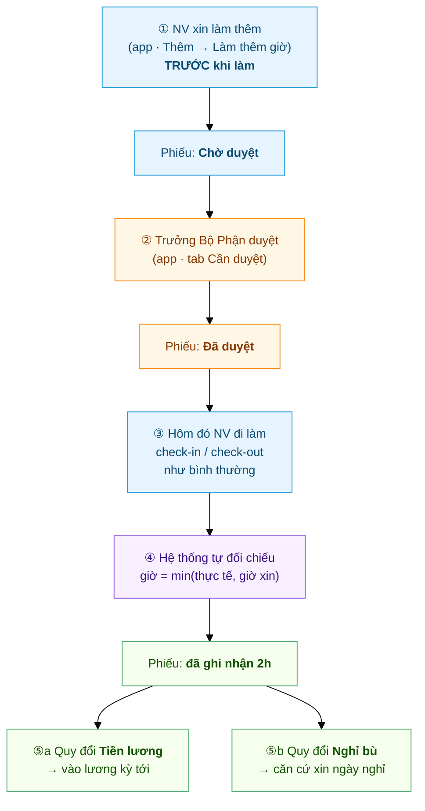

# Hành trình một phiếu Làm thêm giờ
{: .no_toc }

**Theo chân 1 phiếu OT từ lúc xin đến lúc thành tiền / thành ngày nghỉ bù** · Nhân viên → Trưởng Bộ Phận → Chấm công
{: .fs-3 .text-grey-dk-000 }

> Trang này kể **toàn cảnh** một phiếu làm thêm giờ. Điểm khác mọi loại đơn khác:
> phiếu OT **không kết thúc ở lúc được duyệt** — nó còn một bước nữa là **đối chiếu
> chấm công thực tế**. Ví dụ dùng xuyên suốt: anh **Nguyễn Văn An** xin làm thêm
> **2 tiếng (18:00–20:00) ngày 08/07** để chốt báo cáo tháng.

<details open markdown="block">
  <summary>Mục lục</summary>
{: .text-delta }
1. TOC
{:toc}
</details>

---

## Toàn cảnh



| Bước | Ai làm | Ở đâu | Kết quả |
|---|---|---|---|
| ① Xin làm thêm | Nhân viên | App → **Thêm → Làm thêm giờ** | Phiếu **Chờ duyệt** |
| ② Duyệt | Trưởng Bộ Phận (`Shift Request Approver`) | App → **Cần duyệt** | Phiếu **Đã duyệt** |
| ③ Đi làm | Nhân viên | Chấm công như thường | Có giờ check-out thực tế |
| ④ Đối chiếu | **Hệ thống** (tự động) | — | Phiếu có **số giờ công nhận** |
| ⑤ Quy đổi | HR (lương) / Nhân viên (nghỉ bù) | Payroll / App → Nghỉ phép | Thành tiền **hoặc** ngày nghỉ |

> ⚠️ **Phiếu duyệt xong CHƯA phải là có giờ.** Giờ chỉ được ghi nhận sau bước ④ —
> tức là sau khi nhân viên thực sự đi làm và **check-out**. Duyệt ≠ trả tiền.

---

## ① Nhân viên xin làm thêm — TRƯỚC khi làm

Mở app → tab **Thêm** → **Làm thêm giờ** → bấm **➕** → điền **Ngày · Khung giờ dự kiến ·
Hình thức quy đổi · Lý do** → **Gửi đơn**.


Đây là điểm **khác hẳn** các hệ thống chấm công thông thường:

> 🔒 **Check-out muộn KHÔNG tự thành giờ làm thêm.** Ở lại công ty tới 20h mà không có
> phiếu đã duyệt → hệ thống ghi nhận **0 giờ OT**. Muốn được tính, phải có phiếu.
> (Quên xin trước? Được khai bổ sung **trong 7 ngày**.)

Gửi xong, phiếu nằm trong danh sách với nhãn **Chờ duyệt** (vàng):


📘 Chi tiết thao tác: [Nhân viên — Xin làm thêm giờ](Guide-NhanVien-LamThem.html) 🎬 *(có video)*

---

## ② Trưởng Bộ Phận duyệt

Người duyệt nhận **thông báo đẩy** ngay + badge đỏ tab **Cần duyệt**. Phiếu OT có thẻ 🟠
**Làm thêm giờ**, nằm chung hộp duyệt với nghỉ phép và chấm công bù.


Bấm vào phiếu → xem ngày, khung giờ, **hình thức quy đổi**, lý do → **Duyệt** hoặc **Từ chối**.


> 💡 **Duyệt không sợ "hớ".** Số giờ trong phiếu là **mức trần**, không phải số tiền chốt.
> Nhân viên xin 2h nhưng thực tế chỉ ở lại 1h → hệ thống chỉ tính **1h**.

**Ai là người duyệt?** `Shift Request Approver` (người duyệt chấm công) — **không phải**
người duyệt nghỉ phép. HR Manager luôn duyệt thay được.

**Duyệt muộn có sao không?** Không. Nếu nhân viên đã làm thêm xong rồi bạn mới duyệt,
hệ thống **đối chiếu ngược ngay lúc bấm Duyệt** — giờ vẫn được ghi nhận đủ.

📘 Chi tiết: [Duyệt đơn làm thêm giờ](Duyet-Lam-Them.html) 🎬 *(có video)*

---

## ③ + ④ Hôm làm thêm: chấm công như thường, hệ thống tự đối chiếu

Nhân viên **không phải khai thêm gì cả**. Cứ check-in buổi sáng, check-out lúc về như
mọi ngày. Hệ thống tự làm phần còn lại:

```
Giờ công nhận  =  min( giờ thực tế check-out SAU giờ tan ca ,  giờ xin trong phiếu )
```

Ví dụ anh An (ca tan 17:30, xin OT 2 tiếng):

| Thực tế check-out | Giờ dôi sau ca | Giờ xin | **Được tính** | Vì sao |
|---|---|---|---|---|
| 19:30 | 2h | 2h | **2h** | Làm đúng như xin |
| 20:30 | 3h | 2h | **2h** | Cap theo phiếu — xin 2 thì tính 2 |
| 18:30 | 1h | 2h | **1h** | Làm ít hơn xin → tính theo thực tế |
| 17:30 (về đúng giờ) | 0h | 2h | **0h** | Không ở lại → không có OT |
| *(quên check-out)* | — | 2h | **0h** | Không có bằng chứng giờ về |

Nhân viên mở phiếu ra là thấy kết quả — dòng xanh **"đã ghi nhận 2h"**:


> ⚠️ **Quên check-out = mất giờ OT.** Đây là lỗi hay gặp nhất. Phiếu vẫn "Đã duyệt"
> nhưng ghi nhận 0h. Nếu lỡ quên: tạo **[Đề xuất chấm công bù](HR-Attendance-Request.html)**
> cho ngày đó để có lại giờ check-out, hệ thống sẽ đối chiếu lại.

Bên phía chấm công, giờ này cũng được ghi vào **bảng công** của ngày hôm đó (HR xem trên
Desk: Attendance → mục *Overtime*). Giờ làm thêm **không cộng vào `working_hours`** của
ngày công — nó là khoản riêng, để không bị tính 2 lần.

---

## ⑤ Quy đổi — rẽ 2 nhánh tuỳ lựa chọn lúc tạo phiếu

### ⑤a — Chọn **Tiền lương**

Giờ OT đã ghi nhận tự chảy vào kỳ lương, nhân hệ số theo quy định:

| Ngày làm thêm | Hệ số |
|---|---|
| Ngày thường | **×1.5** (150%) |
| Cuối tuần | **×2.0** (200%) |
| Ngày lễ | **×3.0** (300%) |

Nhân viên **không phải làm gì thêm**. HR chạy lương là có dòng **"Lương làm thêm giờ"**
trên phiếu lương.

> 🔧 HR: xem [Cấu hình Overtime](HR-Overtime-Settings.html) — cần bật *Payroll Settings →
> `create_overtime_slip`* để payroll tự gom. **Nếu công ty không tính lương trên hệ thống**,
> bỏ qua phần này — số giờ vẫn nằm đủ trong phiếu để làm căn cứ tính tay
> (Desk → *HR Overtime Request*, lọc **Đã duyệt** theo tháng, cột **Số giờ công nhận**).

### ⑤b — Chọn **Nghỉ bù**

Phiếu OT đã duyệt trở thành **"vé"** để xin nghỉ bù. Nhân viên vào tab **Nghỉ phép** →
tạo đơn → **Loại phép = Nghỉ bù** → ô **"Ngày làm thêm để bù"** chọn **đúng ngày trong
phiếu OT**.


Hệ thống **tự kiểm tra**, chặn ngay lúc gửi nếu:
- Ngày đó **không có phiếu OT đã duyệt** (quy đổi Nghỉ bù) → *"Ngày … không có đơn Làm thêm giờ đã duyệt…"*
- Ngày làm thêm đó **đã dùng để bù rồi** → mỗi ngày chỉ bù **1 lần**.

Đơn nghỉ bù sau đó đi qua **2 bước duyệt Quản lý → HR** như nghỉ phép thường
(xem [Hành trình một đơn nghỉ phép](Hanh-Trinh-Nghi-Phep.html)).

> 💡 Nghỉ bù **không trừ quỹ phép, không trừ lương**. Số dư loại "Nghỉ bù" hiện **âm** là
> bình thường — âm bao nhiêu = đã nghỉ bù bấy nhiêu ngày.

---

## Nhãn trạng thái — đối chiếu nhanh

| Nhân viên thấy | Nghĩa | Làm gì tiếp |
|---|---|---|
| 🟡 **Chờ duyệt** | Đang chờ Trưởng Bộ Phận | Chờ; đổi ý thì bấm **Huỷ đơn** |
| 🟢 **Đã duyệt** + *"Chưa đối chiếu"* | Đã duyệt nhưng **chưa có giờ** | Nhớ **check-in/out** đúng thực tế hôm làm thêm |
| 🟢 **Đã duyệt** + *"đã ghi nhận Xh"* | Xong — giờ đã được chốt | Không phải làm gì (hoặc đi xin nghỉ bù nếu chọn nhánh ⑤b) |
| 🔴 **Từ chối / Đã huỷ** | Quản lý từ chối, hoặc bạn tự huỷ | Hỏi lại Quản lý; tạo phiếu mới nếu cần |

---

## Sự cố hay gặp

| Tình huống | Nguyên nhân / cách xử |
|---|---|
| Ở lại làm thêm mà không có giờ OT nào | Ngày đó **không có phiếu đã duyệt** — đúng thiết kế, phải xin trước |
| Phiếu duyệt rồi, ghi nhận **0h** | Quên check-out, hoặc check-out **trước** giờ tan ca |
| Giờ ghi nhận **ít hơn** thực tế làm | Bị cap theo số giờ xin — lần sau xin đúng số giờ dự kiến |
| *"Đã có đơn làm thêm giờ ngày…"* | Mỗi ngày chỉ **1 phiếu**. Huỷ phiếu cũ nếu muốn đổi khung giờ |
| *"Chỉ được khai bổ sung trong vòng 7 ngày"* | Phiếu cho ngày quá khứ quá 7 ngày → nhờ HR xử lý tay |
| *"Chưa có Manager duyệt làm thêm giờ"* | HR chưa gán **Shift Request Approver** cho phòng bạn |

---

## Liên quan
- 👤 [Nhân viên: Xin làm thêm giờ](Guide-NhanVien-LamThem.html) 🎬 — thao tác chi tiết
- ✅ [Duyệt đơn làm thêm giờ](Duyet-Lam-Them.html) 🎬 — dành cho Trưởng Bộ Phận
- 🌴 [Xin nghỉ phép & nghỉ bù](Guide-NhanVien-NghiPhep.html) — nhánh ⑤b
- 🔧 HR: [Cấu hình Overtime](HR-Overtime-Settings.html) · [HR Overtime Request (dữ liệu)](HR-Overtime-Request.html)
