# Hành trình một phiếu lương
{: .no_toc }

**Theo chân đúng 1 nhân viên, từ ngày nhập hồ sơ lương đến lúc phiếu tháng được chốt và xuất bảng lương**
{: .fs-3 .text-grey-dk-000 }

> Trang này kể **toàn cảnh** một phiếu lương ra đời như thế nào: ai nhập gì, lúc nào,
> con số nào chảy từ đâu về đâu. Cần thao tác chi tiết từng màn hình thì xem
> [Tính lương tháng (Payroll VN)](Payroll-Tinh-Luong-Thang.html).
>
> **Nhân vật:** chị **Lê Thị Hồng Demo** (mã **0995**, phòng Sales, công ty THẾ GIỚI ĐIỆN GIẢI) —
> lương cơ bản 30.000.000, đủ 4 phụ cấp, 1 người phụ thuộc. **Kỳ lương: tháng 07/2026.**
> Trong tháng chị nghỉ **không lương 1 ngày**, **làm thêm 2 giờ**, được **thưởng 1 triệu**
> và bị **trừ tạm ứng 2 triệu**.
>
> *Mọi ảnh và mọi con số trong bài là dữ liệu chạy thật trên hệ thống với nhân viên demo —
> không vẽ tay, không dựng số.*

<details open markdown="block">
  <summary>Mục lục</summary>
{: .text-delta }
1. TOC
{:toc}
</details>

---

## Toàn cảnh: 3 chặng

<a href="images/svg/payroll/01-toan-canh.svg" title="Bấm để phóng to">
  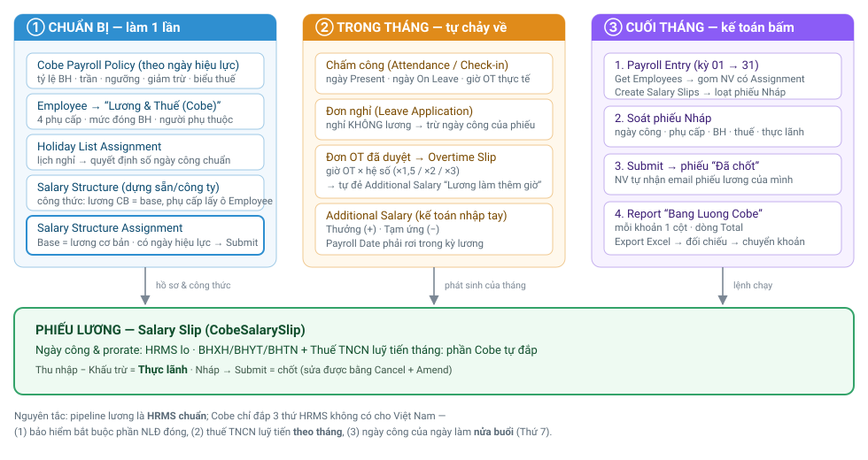
</a>

| Chặng | Khi nào | Ai làm | Kết quả |
|---|---|---|---|
| ① **Chuẩn bị** | 1 lần lúc nhận việc (và mỗi khi tăng lương) | Kế toán lương (`Payroll Officer`) + HR | Nhân viên "đủ điều kiện" để máy tính được lương |
| ② **Trong tháng** | rải rác cả tháng | Nhân viên · Quản lý · HR · Kế toán | Đơn nghỉ, chấm công, OT, thưởng/tạm ứng — nguyên liệu của phiếu |
| ③ **Cuối tháng** | ngày 1–3 tháng sau | Kế toán lương | Phiếu lương chốt + bảng lương Excel + email cho NV |

> ⚠️ **Thứ tự là bắt buộc.** Phiếu lương chỉ "chụp ảnh" dữ liệu tại **lúc tạo phiếu**.
> Duyệt đơn nghỉ / đơn OT **sau khi** đã tạo phiếu thì phiếu **không tự đổi số** —
> phải xoá phiếu nháp tạo lại (xem [Vòng đời phiếu](#vòng-đời-một-phiếu--và-chỗ-duy-nhất-sửa-được)).

---

## ① Chặng chuẩn bị — làm 1 lần

Năm món dưới đây thiếu **một** món là phiếu lương hoặc không tạo được, hoặc tạo ra số sai.

### 1.1. Cấp quyền `Payroll Officer`

Mở **User** của kế toán lương → thêm role **`Payroll Officer`**. Đây là role **duy nhất** thấy
được tiền của từng người: HR Manager / HR User / System Manager **cố tình không có**
(xem [Ai thấy gì](#ai-thấy-gì--dữ-liệu-lương-tách-hẳn-khỏi-hr)).

### 1.2. Nơi chứa "luật" — 2 chỗ, đừng lẫn

| Ở đâu | Chứa gì | Khi nào đụng |
|---|---|---|
| **Cobe Payroll Settings** (Single) | đúng **2 công tắc**: *Tính bảo hiểm* · *Tính thuế TNCN* | hầu như không bao giờ |
| **Cobe Payroll Policy** | **mọi ngưỡng**: tỷ lệ BH, trần đóng, ngưỡng ngày công, giảm trừ gia cảnh, mức miễn thuế ăn giữa ca, biểu thuế 7 bậc — **mỗi bản một NGÀY HIỆU LỰC** | mỗi khi luật đổi |

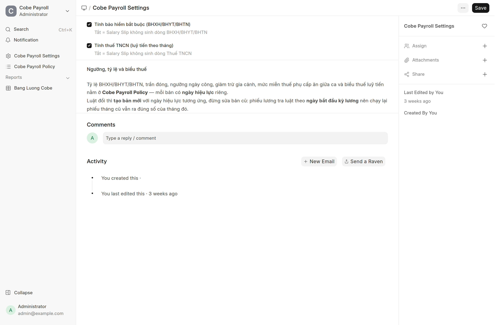

Tắt công tắc nào thì phiếu không sinh dòng tương ứng (dùng khi chạy thử, hoặc công ty
chưa áp dụng).

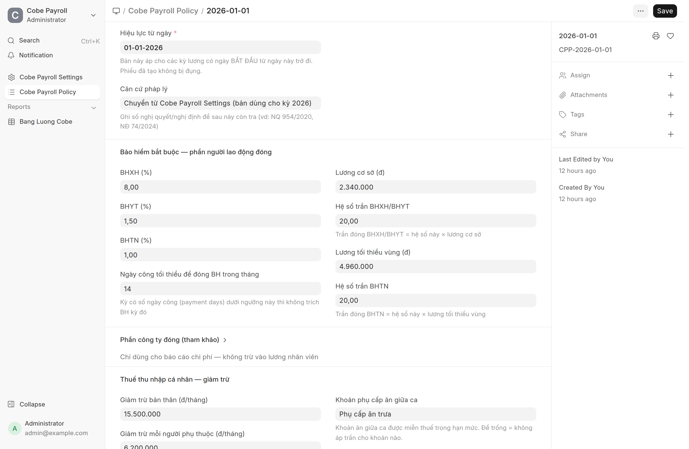

- **Tỷ lệ NLĐ đóng**: BHXH **8%** · BHYT **1,5%** · BHTN **1%**.
- **Trần đóng**: BHXH/BHYT tối đa trên **hệ số 20 × lương cơ sở** (2.340.000 → trần 46,8tr);
  BHTN tối đa trên **20 × lương tối thiểu vùng** (4.960.000 → trần 99,2tr). Cả hệ số lẫn
  mức lương đều là ô nhập — nghị định đổi số nào sửa số đó.
- **Ngày công tối thiểu 14** — kỳ nào nhân viên làm **dưới 14 công** thì **không trích BH**
  kỳ đó. Đây là lý do người vào làm cuối tháng có phiếu mà BH = 0.

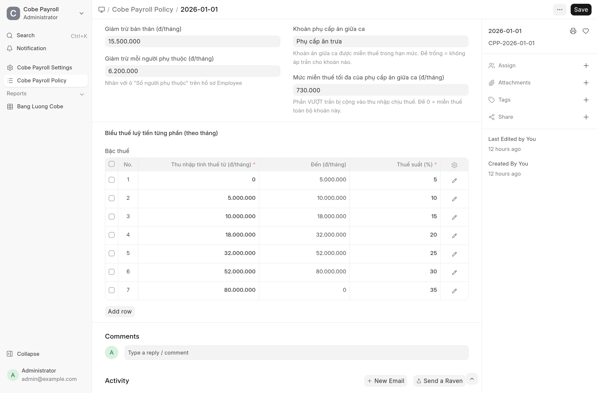

- **Giảm trừ bản thân 15.500.000/tháng**, **mỗi người phụ thuộc 6.200.000/tháng**.
- **Phụ cấp ăn giữa ca miễn thuế tối đa 730.000/tháng** — trả cao hơn thì **phần vượt**
  tự cộng vào thu nhập chịu thuế (để 0 = miễn toàn bộ).
- **Biểu thuế luỹ tiến từng phần 7 bậc** (5% → 35%).

> 🗓️ **Luật đổi thì TẠO BẢN MỚI, đừng sửa bản cũ.** Ví dụ giảm trừ đổi từ 01/01/2027:
> tạo Policy `effective_from = 01/01/2027`. Phiếu tra luật theo **ngày bắt đầu kỳ lương**,
> nên bản mới khai trước cũng không đụng kỳ đang chạy, và chạy lại (Cancel + Amend) phiếu
> tháng cũ vẫn ra **đúng số của tháng đó**.

### 1.3. Hồ sơ lương trên Employee (tab **Salary**)

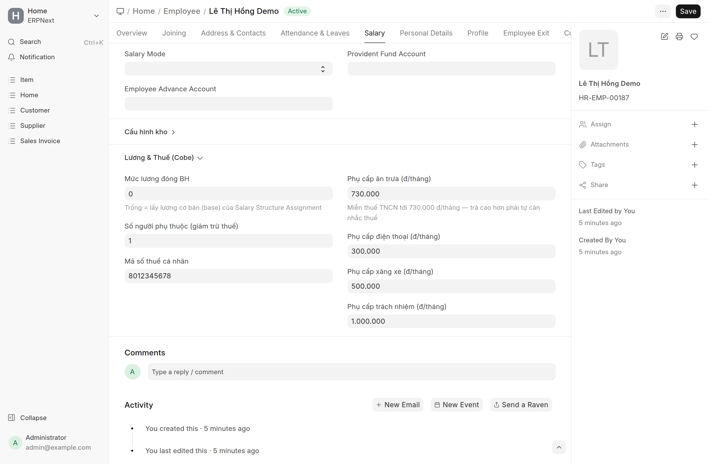

| Ô | Của chị Hồng | Ý nghĩa |
|---|---|---|
| **Mức lương đóng BH** | *(trống)* | Lương làm căn cứ trích BH. **Trống = lấy đúng Base** của Assignment (ở đây 30tr). Khai số khác khi lương đóng BH thấp hơn lương thực nhận. |
| **Số người phụ thuộc** | **1** | Nhân 6,2tr để giảm trừ thuế. Quên cập nhật là nhân viên đóng thừa thuế. |
| **Mã số thuế cá nhân** | 8012345678 | Chỉ để tra cứu/khai thuế, không tham gia tính toán. |
| **Phụ cấp ăn trưa** | 730.000 | **Miễn thuế tới 730k/tháng** — trả đúng 730k là tối ưu. Prorate theo ngày công. |
| **Phụ cấp điện thoại** | 300.000 | Khoán, **miễn thuế**, **không** prorate. |
| **Phụ cấp xăng xe** | 500.000 | **Chịu thuế**, prorate. |
| **Phụ cấp trách nhiệm** | 1.000.000 | **Chịu thuế**, prorate. |

> Ô nào để 0 thì phiếu lương **tự ẩn** dòng đó — không có dòng rác 0 đồng.
> Mục này chỉ `Payroll Officer` nhìn thấy; HR mở đúng form này sẽ không thấy mục "Lương & Thuế (Cobe)".

### 1.4. Lịch nghỉ — Holiday List Assignment ⚠️

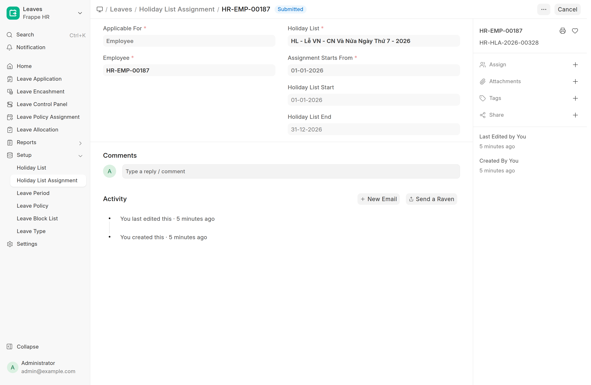

Đây là món **hay bị quên nhất** mà lại quyết định **mẫu số ngày công**:

- **Nguồn thật là Holiday List Assignment (HLA)**, không phải ô *Holiday List* trên form Employee
  (ô đó chỉ là **bản sao** cho dễ nhìn).
- Không gán HLA riêng cho nhân viên → hệ thống rơi về **HLA của công ty**. Người thuộc nhóm
  **nửa ngày Thứ 7** mà rơi về lịch "chỉ nghỉ Chủ Nhật" sẽ có công chuẩn **27** thay vì **25** →
  mỗi ngày nghỉ không lương bị trừ **hụt ~8%**, và mọi khoản prorate đều lệch.
- HLA có **From Date** nên giữ được lịch sử: đổi lịch giữa năm thì phiếu tháng cũ vẫn tính theo
  lịch tháng đó.

Chị Hồng dùng lịch **"HL - Lễ VN - CN Và Nửa Ngày Thứ 7 - 2026"** → tháng 7/2026 có **25 công chuẩn**.

### 1.5. Salary Structure — khung công thức (đã dựng sẵn)

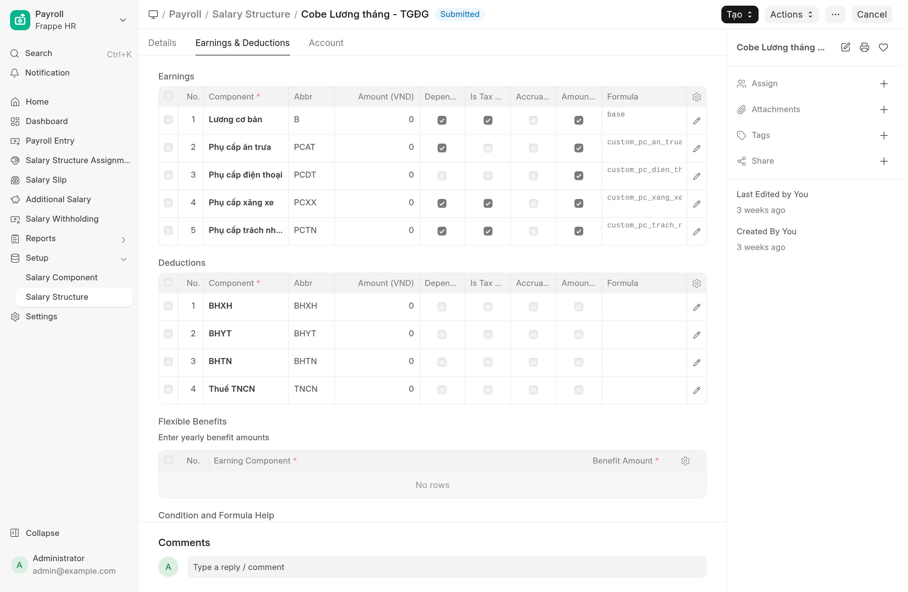

Mỗi công ty có sẵn một khung **"Cobe Lương tháng - \<Cty\>"**, **không cần sửa**, chỉ cần hiểu:

- **Earnings**: `Lương cơ bản = base` (lấy từ Assignment) + 4 phụ cấp đọc thẳng từ ô trên Employee
  (`custom_pc_an_trua`…). Cột **Depends on Payment Days** ✓ = khoản đó **prorate theo ngày công**.
- **Deductions**: BHXH / BHYT / BHTN / Thuế TNCN khai sẵn **amount = 0** — số thật do máy tự tính
  lúc tạo phiếu. **Đừng sửa số ở đây**, sửa cũng không ăn.

### 1.6. Salary Structure Assignment — gán mức lương

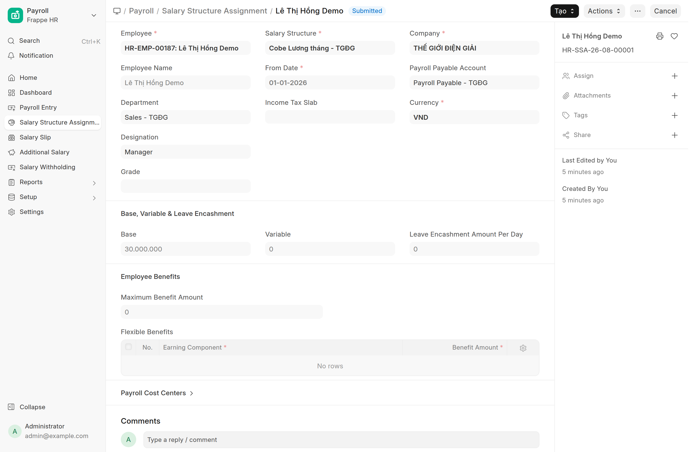

Chọn nhân viên + khung lương đúng công ty, điền **From Date** (ngày bắt đầu áp dụng) và
**Base** (lương cơ bản thoả thuận) → **Submit**.

> 💡 **Tăng lương thì tạo Assignment MỚI** với From Date mới — đừng sửa cái cũ, sửa là mất lịch sử.
>
> ⏱️ Phiếu lương chỉ nhận Assignment có **From Date ≤ ngày đầu kỳ** (chính xác hơn: ≤ ngày
> nhân viên bắt đầu thuộc biên chế trong kỳ). Tăng lương From Date **15/08** thì phiếu tháng 8
> **vẫn tính lương cũ**, lương mới ăn từ tháng 9 — hệ thống **không** chia đôi tháng.
> Muốn ăn ngay tháng đó thì để From Date = **ngày 01**.
>
> ⚠️ Không có Assignment đã Submit thì nhân viên **không xuất hiện** khi bấm *Get Employees* —
> đây là nguyên nhân số 1 của "chạy lương thiếu người".

---

## ② Chặng trong tháng — nguyên liệu tự chảy về

Kế toán **không phải nhập tay** chấm công hay OT: mọi thứ đã có sẵn từ luồng vận hành hàng ngày.
Việc của kế toán chỉ là **đảm bảo mọi đơn đã được duyệt xong trước khi chạy lương**.

### 2.1. Ngày công — cái mẫu số quyết định mọi thứ

<a href="images/svg/payroll/02-ngay-cong.svg" title="Bấm để phóng to">
  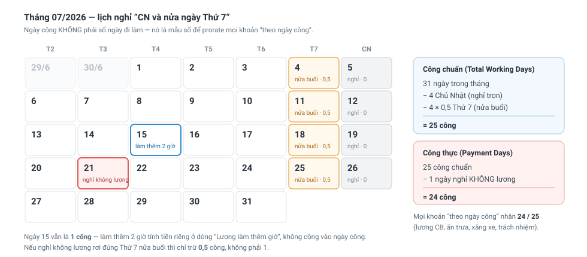
</a>

Hai con số phải phân biệt rạch ròi:

| Con số | Trên phiếu | Của chị Hồng | Nghĩa |
|---|---|---|---|
| **Công chuẩn** | *Working Days* | **25** | Mẫu số. = số ngày trong tháng − ngày nghỉ trọn − 0,5 × ngày nửa buổi |
| **Công thực** | *Payment Days* | **24** | Tử số. = công chuẩn − ngày nghỉ **không lương** (và − ngày ngoài biên chế) |

**Ngày Thứ 7 nửa buổi tính 0,5 công**, không phải 0 cũng không phải 1 — đây là phần Cobe vá
riêng cho khối văn phòng (HRMS gốc bỏ qua hoàn toàn cờ "nửa buổi", làm mẫu số ra 21 thay vì 23,5
ở tháng 8/2026, lệch ~12%).

### 2.2. Đơn nghỉ không lương → trừ ngày công

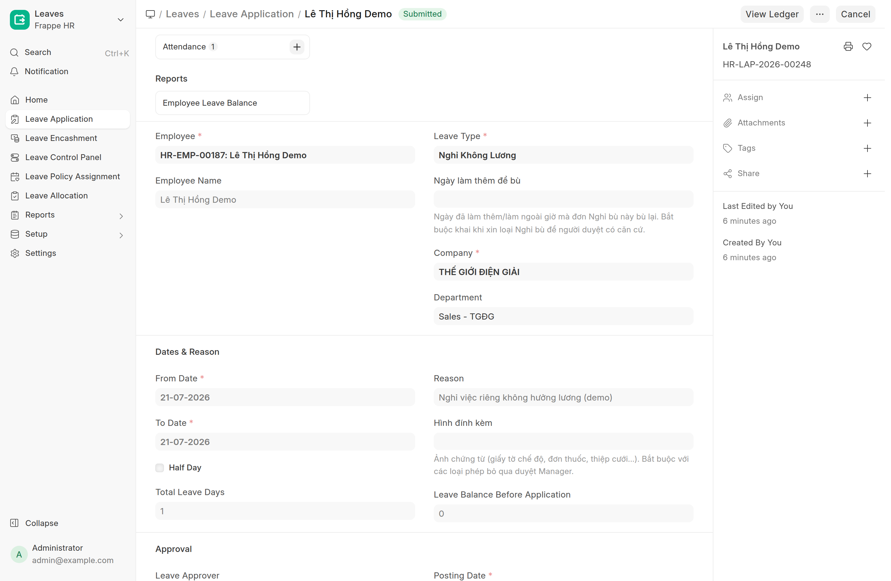

Chị Hồng nghỉ **không lương ngày 21/07**. Đơn đi đúng quy trình 2 bước (Quản lý → HR) và khi
được duyệt thì:

1. Hệ thống tự ghi một bản **chấm công "On Leave"** cho ngày đó.
2. Phiếu lương kỳ 07 đọc ra **Leave Without Pay = 1** → **Payment Days 25 → 24**.
3. Mọi khoản "theo ngày công" tự nhân **24/25**. Không ai phải sửa tay phiếu.

> Nghỉ **có** lương (phép năm, phép chế độ) **không** trừ ngày công — chỉ trừ số dư phép.
> Chỉ loại phép đánh dấu *không lương* (`is_lwp`) mới ăn vào lương.

### 2.3. Làm thêm giờ → Overtime Slip → tiền OT

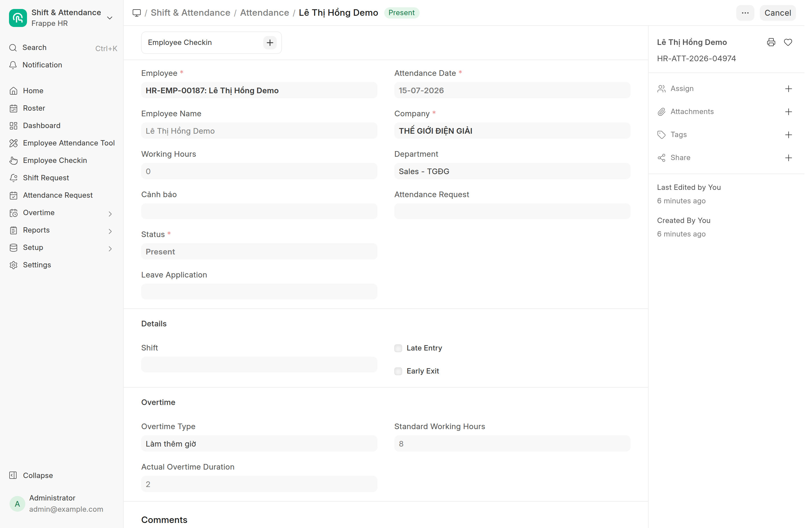

Chuỗi OT chạy như sau, hoàn toàn tự động sau khi đơn được duyệt:

```
Nhân viên khai OT (app)  →  Quản lý duyệt  →  đối chiếu với chấm công thực tế
   →  ghi giờ OT được công nhận vào Attendance (2 giờ, ngày 15/07)
   →  Overtime Slip gom cả kỳ  →  tự đẻ Additional Salary "Lương làm thêm giờ"
   →  vào phiếu lương kỳ đó
```

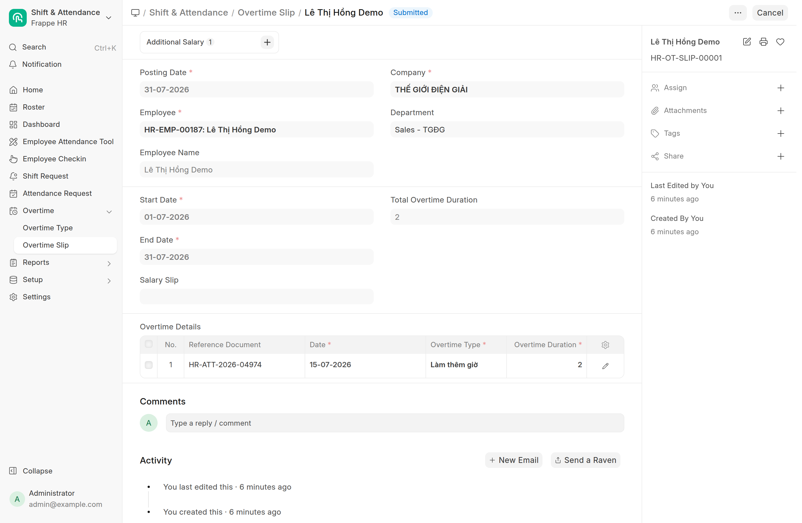

Tiền OT = **số giờ × đơn giá giờ × hệ số**, hệ số theo **loại ngày**:

| Ngày làm thêm | Hệ số | Ghi chú |
|---|---|---|
| Ngày thường | **×1,5** | trường hợp của chị Hồng (Thứ 4, 15/07) |
| Cuối tuần / ngày nửa buổi Thứ 7 | **×2,0** | mặc định Cobe, đổi được theo công ty trên HR Policy |
| Ngày lễ | **×3,0** | |

Đơn giá giờ = *lương cơ bản ÷ ngày công ÷ 8 giờ*. Ở đây: 30.000.000 ÷ 25 ÷ 8 = 150.000 đ/giờ
→ **2 giờ × 150.000 × 1,5 = 450.000 đ**.

> ℹ️ Ngày công dùng làm mẫu số là ngày công **của chính nhân viên đó** (đã trừ phần nửa buổi
> Thứ 7 — 25 chứ không phải 27), lấy theo Holiday List Assignment hiệu lực trong kỳ. Nhân viên
> chưa có Assignment riêng sẽ rơi về lịch công ty và ra đơn giá khác.

### 2.4. Thưởng / tạm ứng — kế toán nhập tay

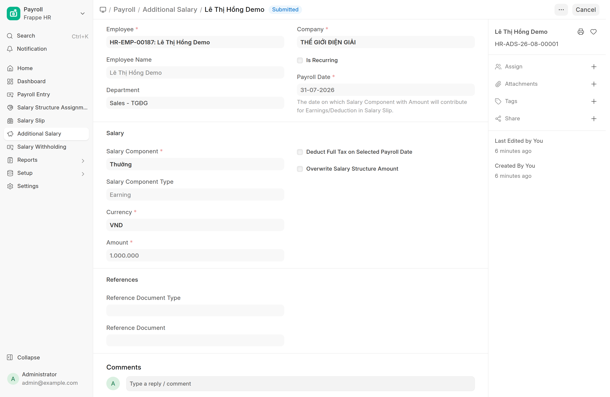

Mọi khoản phát sinh một lần đi qua **Additional Salary**: chọn nhân viên, chọn component
(**Thưởng** để cộng, **Tạm ứng** để trừ), số tiền, **Payroll Date rơi trong kỳ lương** → Submit.

> ⚠️ Sai lầm kinh điển: để **Payroll Date ngoài kỳ** (ví dụ 01/08 cho kỳ tháng 7) → phiếu tháng 7
> không có khoản đó, mà tháng 8 mới có.

### 2.5. Cái gì vào phiếu, cái gì không

| Việc xảy ra trong tháng | Có vào phiếu không? | Vào bằng đường nào |
|---|---|---|
| Đi làm bình thường | — | không sinh dòng nào, chỉ giữ nguyên ngày công |
| Nghỉ **có** lương (phép năm, chế độ) | ❌ không đổi lương | chỉ trừ số dư phép |
| Nghỉ **không** lương | ✅ | giảm *Payment Days* → prorate toàn bộ |
| Vắng không phép (Attendance **Absent**) | ❌ **không tự trừ** | hệ thống đang chạy *Payroll Based On = **Leave*** → phiếu chỉ đọc **đơn nghỉ**, không đọc trạng thái chấm công. Muốn trừ thì HR phải tạo **đơn nghỉ không lương** cho ngày đó |
| Quên chấm công | ❌ | *Consider Unmarked Attendance As = **Present*** → không bị trừ |
| Làm thêm giờ đã duyệt | ✅ | Overtime Slip → Additional Salary "Lương làm thêm giờ" |
| Nghỉ bù (đổi OT lấy ngày nghỉ) | ❌ | không ra tiền — đã quy đổi thành ngày nghỉ |
| Thưởng / hoa hồng | ✅ | Additional Salary (**Thưởng**) |
| Tạm ứng / thu hồi | ✅ | Additional Salary (**Tạm ứng**) |
| Tăng lương giữa tháng | ⚠️ **không** ăn vào tháng đó | phiếu chỉ nhận Assignment có **From Date ≤ ngày đầu kỳ**. Đặt From Date 15/08 → tháng 8 vẫn tính lương cũ, lương mới ăn từ tháng 9. Muốn ăn ngay thì để **From Date = ngày 01** |
| Đổi phụ cấp | ✅ | sửa ô trên Employee — **chỉ ăn cho phiếu tạo SAU đó** |

---

## ③ Chặng cuối tháng — kế toán bấm 4 nút

### 3.1. Trước khi bấm: dọn sạch đầu vào

| Kiểm tra | Vì sao |
|---|---|
| Đơn nghỉ còn treo? | Duyệt sau khi tạo phiếu là phiếu **không** tự trừ ngày công |
| Đơn OT còn treo? | Duyệt muộn thì tiền OT rơi sang kỳ sau |
| Thưởng / tạm ứng đã Submit, Payroll Date trong kỳ? | Chưa Submit là không vào phiếu |
| Nhân viên mới đã có Assignment? | Không có là **không được gom** |

### 3.2. Payroll Entry — chạy cả công ty một lượt

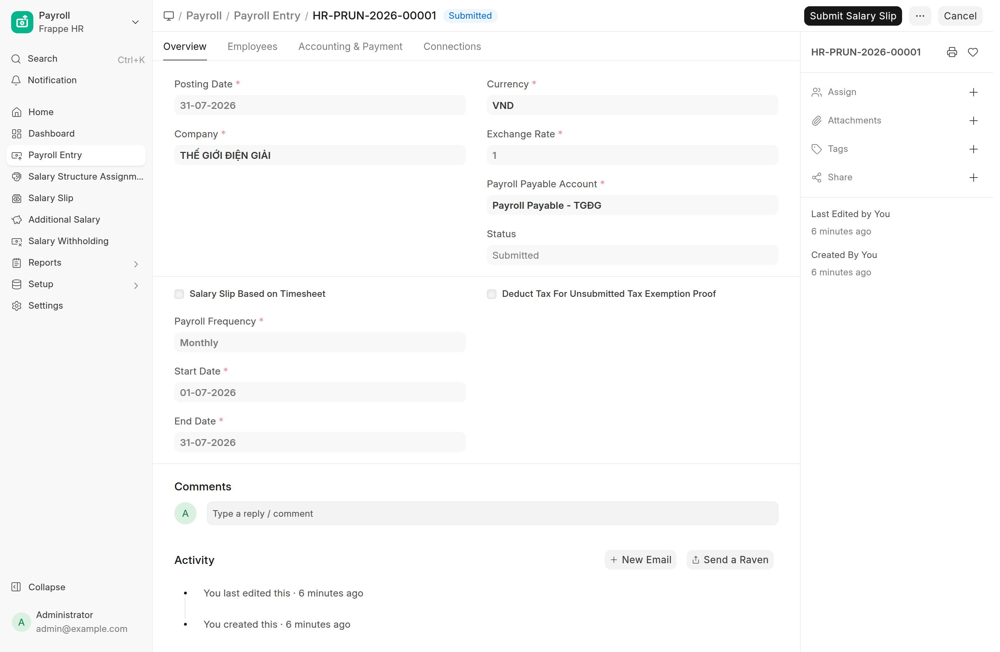

**Payroll → Payroll Entry → New**: chọn Công ty, *Payroll Frequency* = Monthly, kỳ **01/07 → 31/07**
→ bấm **Get Employees** → **Submit** → **Create Salary Slips** → sinh loạt phiếu **Nháp**.

> 🔧 Hai lỗi chặn hay gặp ở bước này (đã gặp thật, xem [Trục trặc](#trục-trặc--tra-nhanh)):
> *"No employees found"* (lệch tài khoản Payroll Payable) và
> *"Account type should be set Payable"* (tài khoản Payroll Payable chưa khai Account Type).

### 3.3. Phiếu nháp của chị Hồng

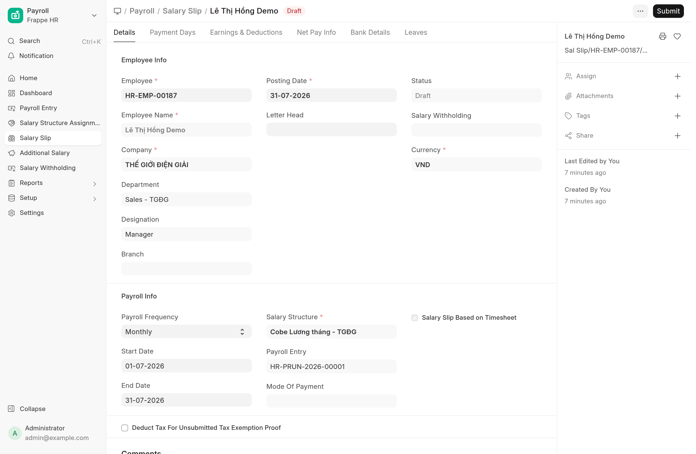

Phiếu ở trạng thái **Draft**, gắn với Payroll Entry đã chạy, dùng khung *Cobe Lương tháng - TGĐG*.

### 3.4. Tab **Payment Days** — soát ngày công trước tiên

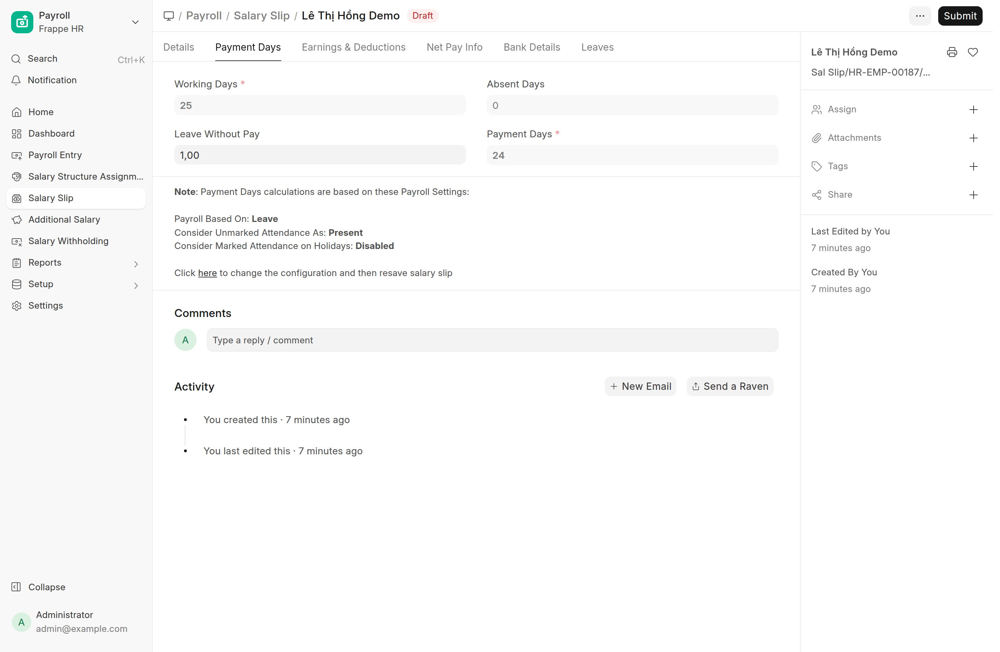

Đúng như sơ đồ lịch ở trên: **25 công chuẩn − 1 ngày nghỉ không lương = 24 công thực**.
Ghi chú ngay trên phiếu cũng nói rõ hệ thống đang chạy theo *Payroll Based On: **Leave***
và ngày chưa chấm công thì *coi như **Present***. Hệ quả phải nắm:

- Phiếu lương **chỉ đọc đơn nghỉ**, **không** đọc trạng thái chấm công từng ngày.
- Quên chấm công → **không** bị trừ lương.
- Ngày bị chấm **Absent** (vắng không phép) cũng **không tự trừ** — muốn trừ thì HR
  phải tạo **đơn nghỉ không lương** cho ngày đó.
- Muốn lương bám sát chấm công thật thì phải đổi *Payroll Based On* sang **Attendance**
  trong Payroll Settings — đây là quyết định lớn, đổi là đổi cho cả công ty.

### 3.5. Tab **Earnings & Deductions** — số tiền từng dòng

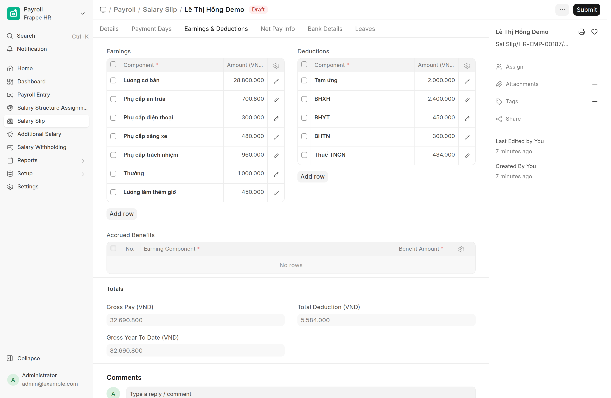

<a href="images/svg/payroll/03-dong-tien.svg" title="Bấm để phóng to">
  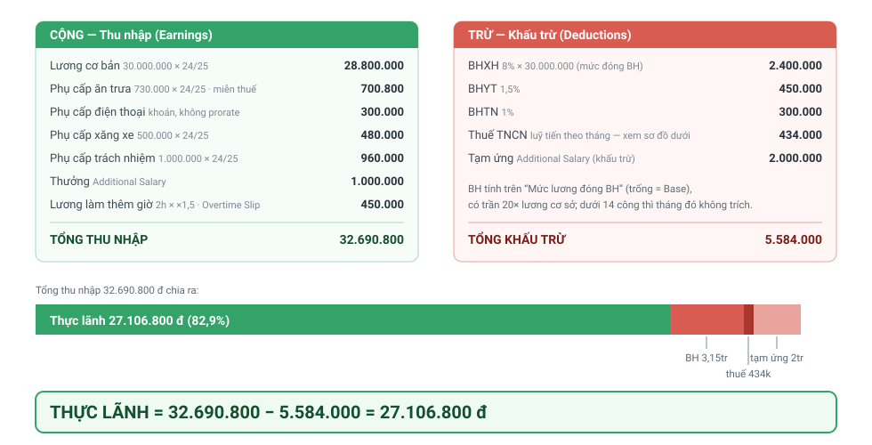
</a>

**Đối chiếu từng dòng — nguồn gốc và công thức:**

| Dòng trên phiếu | Số tiền | Đến từ đâu | Công thức |
|---|---:|---|---|
| Lương cơ bản | 28.800.000 | Assignment (Base 30tr) | 30.000.000 × 24/25 |
| Phụ cấp ăn trưa | 700.800 | ô Employee | 730.000 × 24/25 · **miễn thuế** |
| Phụ cấp điện thoại | 300.000 | ô Employee | khoán — **không** prorate · **miễn thuế** |
| Phụ cấp xăng xe | 480.000 | ô Employee | 500.000 × 24/25 · chịu thuế |
| Phụ cấp trách nhiệm | 960.000 | ô Employee | 1.000.000 × 24/25 · chịu thuế |
| Thưởng | 1.000.000 | Additional Salary | nguyên số, không prorate |
| Lương làm thêm giờ | 450.000 | Overtime Slip | 2h × 150.000 × 1,5 |
| **Tổng thu nhập** | **32.690.800** | | |
| BHXH | 2.400.000 | máy tự tính | 8% × 30.000.000 |
| BHYT | 450.000 | máy tự tính | 1,5% × 30.000.000 |
| BHTN | 300.000 | máy tự tính | 1% × 30.000.000 |
| Thuế TNCN | 434.000 | máy tự tính | luỹ tiến — xem dưới |
| Tạm ứng | 2.000.000 | Additional Salary | nguyên số |
| **Tổng khấu trừ** | **5.584.000** | | |
| **Thực lãnh** | **27.106.800** | | 32.690.800 − 5.584.000 |

> 💡 **Bảo hiểm tính trên "mức lương đóng BH" (ở đây = Base 30tr), KHÔNG prorate theo ngày công** —
> nghỉ không lương 1 ngày vẫn đóng đủ BH tháng đó. Chỉ khi công thực **dưới 14** thì cả tháng
> **không trích** đồng BH nào.

### 3.6. Thuế TNCN được tính ra sao

<a href="images/svg/payroll/04-thue-tncn.svg" title="Bấm để phóng to">
  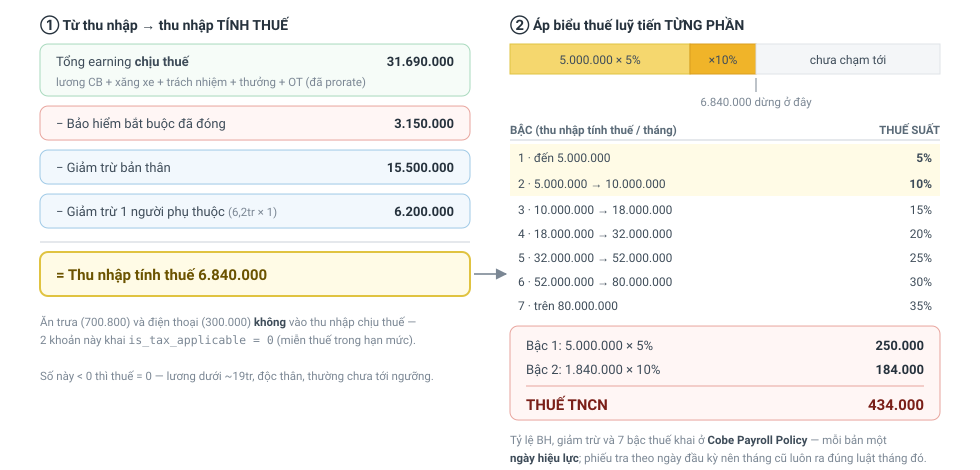
</a>

Ba điểm cần nhớ:

1. **Chỉ earning chịu thuế mới vào tử số** — ăn trưa 700.800 và điện thoại 300.000 **không** tính,
   nên thu nhập chịu thuế là 31.690.000 chứ không phải 32.690.800.
2. **Trừ đủ 3 khoản**: bảo hiểm bắt buộc 3.150.000 + giảm trừ bản thân 15.500.000 +
   giảm trừ người phụ thuộc 6.200.000 (1 người).
3. **Luỹ tiến từng phần theo THÁNG** (không quy năm kiểu HRMS gốc): 5tr đầu × 5% = 250.000,
   phần còn lại 1.840.000 × 10% = 184.000 → **434.000 đ**.

> Thuế = 0 hàng loạt là **bình thường**, không phải lỗi: giảm trừ 15,5tr + 6,2tr/người phụ thuộc
> nghĩa là lương dưới ~19tr (độc thân) chưa tới ngưỡng nộp thuế.

### 3.7. Tab **Net Pay Info** — con số cuối cùng

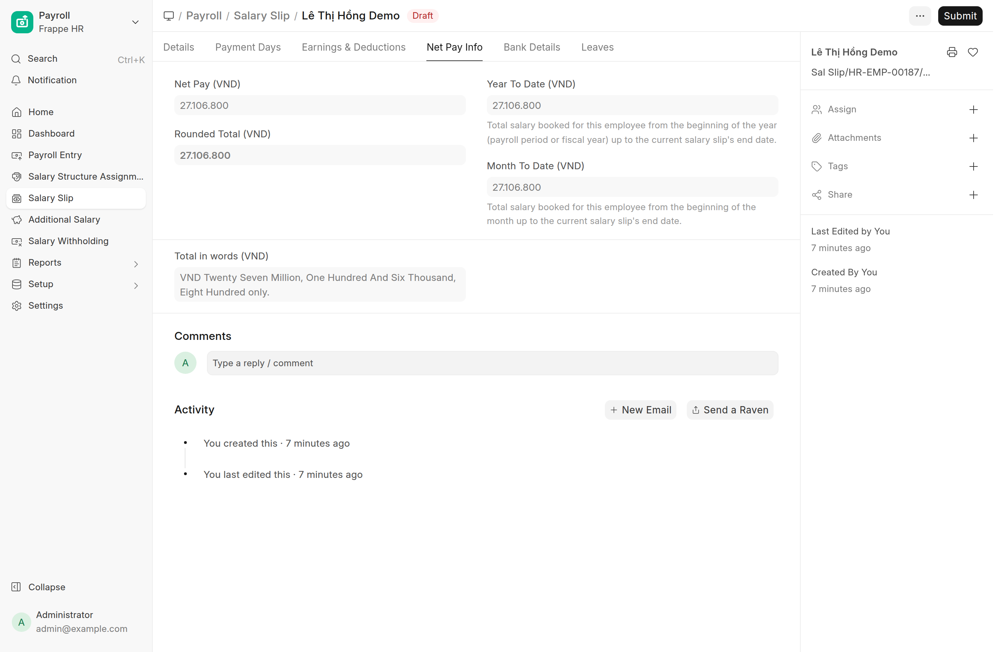

### 3.8. Submit — chốt phiếu

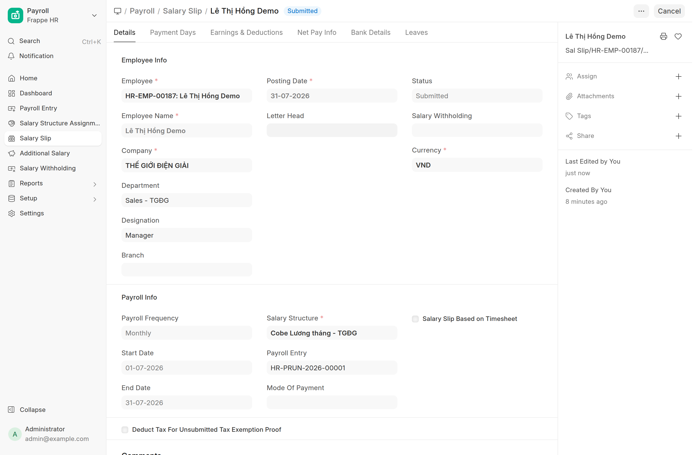

Chốt được từ **từng phiếu** hoặc bấm một phát **Submit Salary Slips** trên Payroll Entry. Sau khi chốt:

- Phiếu **khoá số**, không sửa trực tiếp được nữa.
- Nhân viên **tự nhận email phiếu lương** của mình (nếu Employee có email và site đã cấu hình
  Email Account gửi đi).
- Nhân viên đăng nhập chỉ xem được **phiếu của chính mình** — không thấy phiếu của ai khác.

### 3.9. Bảng lương tháng + xuất Excel

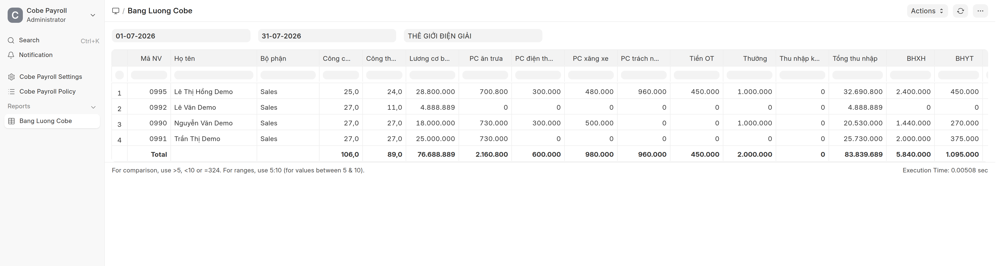

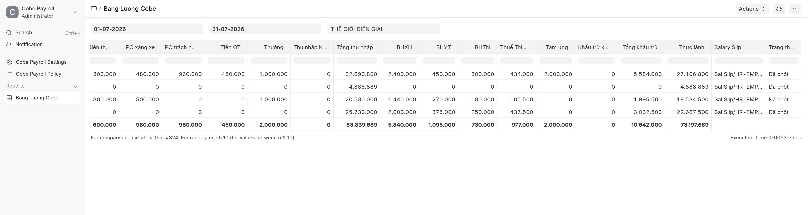

**Reports → Bang Luong Cobe**, chọn kỳ + công ty. Mỗi khoản một cột, có dòng **Total**, có cột
**Trạng thái** (Nháp / Đã chốt) để biết còn ai chưa chốt. Menu ⋮ → **Export** ra Excel để đối chiếu
và làm lệnh chuyển khoản.

Đọc ngang một dòng là thấy nguyên hành trình: chị Hồng — công 25,0 / 24,0 — lương cơ bản
28.800.000 — PC ăn trưa 700.800 — tiền OT 450.000 — thưởng 1.000.000 — tổng thu nhập 32.690.800 —
BH 3.150.000 — thuế 434.000 — tạm ứng 2.000.000 — **thực lãnh 27.106.800**.

> Component lạ (khoản mới HR tự thêm) tự gom vào cột **"Thu nhập khác" / "Khấu trừ khác"** nên
> bảng không bao giờ vỡ.

---

## Vòng đời một phiếu — và chỗ duy nhất sửa được

<a href="images/svg/payroll/05-vong-doi-phieu.svg" title="Bấm để phóng to">
  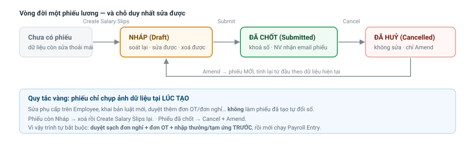
</a>

| Tình huống | Cách xử lý |
|---|---|
| Phát hiện sai khi phiếu còn **Nháp** | Sửa dữ liệu gốc (đơn nghỉ / OT / Additional Salary / Employee) → **xoá phiếu nháp** → Create Salary Slips lại |
| Phát hiện sai khi phiếu **Đã chốt** | Mở phiếu → **Cancel** → **Amend** → phiếu mới tự tính lại theo dữ liệu hiện tại → Submit |
| Luật đổi (giảm trừ, tỷ lệ BH, biểu thuế) | Tạo **Cobe Payroll Policy mới** với ngày hiệu lực tương ứng. Phiếu đã tạo giữ nguyên; chạy lại phiếu tháng cũ vẫn ra luật của tháng đó |

---

## Ai thấy gì — dữ liệu lương tách hẳn khỏi HR

| Vai trò | Thấy gì |
|---|---|
| **Payroll Officer** | Toàn quyền mọi chứng từ lương + Cobe Payroll Settings + report; đọc Employee/Attendance/Leave để chạy lương |
| **System Manager** | Chỉ phần **cấu hình** (Salary Component / Structure / Settings — không chứa tiền cá nhân). Không mở được phiếu lương/Assignment/Payroll Entry/report. Cần vào thật thì phải **tự gán role Payroll Officer** — thao tác này có log |
| **HR Manager / HR User** | **Không** mở được bất kỳ chứng từ lương nào; vẫn quản hồ sơ Employee nhưng mục "Lương & Thuế (Cobe)" bị ẩn |
| **Nhân viên** | Chỉ xem được **phiếu lương của chính mình** (+ email phiếu lương) |

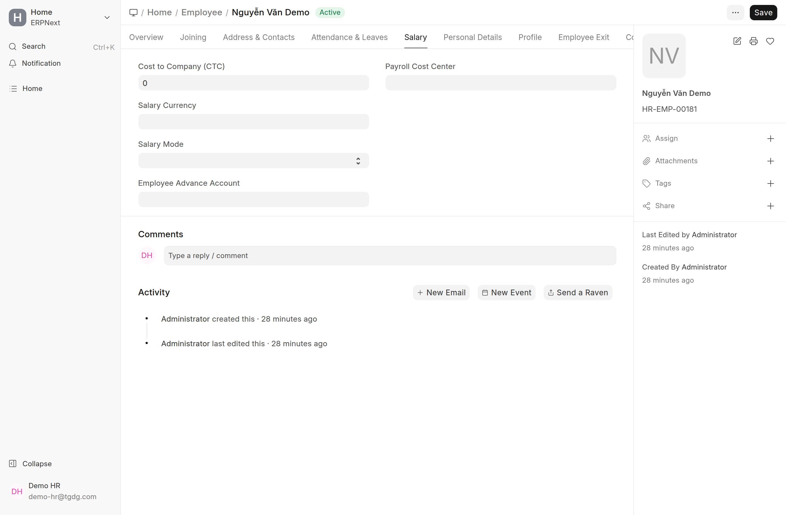

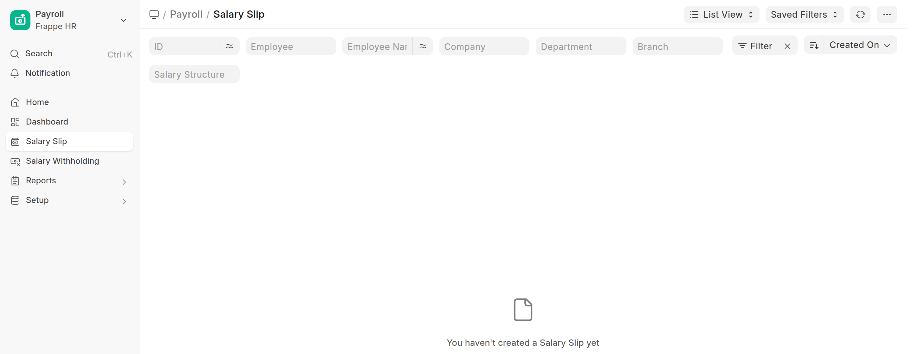

---

## Trục trặc — tra nhanh

| Triệu chứng | Nguyên nhân | Xử lý |
|---|---|---|
| Bấm **Get Employees** báo *"No employees found"* | Ô **Payroll Payable Account** trên Payroll Entry **lệch** với ô cùng tên trên Salary Structure Assignment (hai bên phải trùng khớp tuyệt đối) | Sửa cho trùng; hoặc để Payroll Entry tự điền theo mặc định công ty |
| Bấm **Get Employees** ra **thiếu người** | Nhân viên chưa có Assignment đã Submit, hoặc From Date **sau** kỳ lương | Tạo/sửa Assignment với From Date ≤ ngày đầu kỳ |
| Submit Payroll Entry báo *"Account type should be set **Payable**"* | Tài khoản **Payroll Payable - \<Cty\>** chưa khai **Account Type = Payable** | Kế toán mở Account đó → set Account Type = Payable → Submit lại |
| Tạo phiếu báo *"Please assign a Salary Structure for Employee…"* | Như trên — thiếu Assignment | Tạo Assignment rồi chạy lại |
| **Ngày công lạ** (27 thay vì 25, hoặc ngược lại) | Nhân viên **chưa có Holiday List Assignment riêng** → rơi về lịch của công ty | Tạo HLA cho nhân viên với đúng lịch nhóm mình, From Date ≤ đầu kỳ |
| Ngày công có **số lẻ 0,5** | Đúng — kỳ đó có ngày làm nửa buổi (Thứ 7) | Không phải lỗi |
| **BH = 0** bất thường | Công thực **dưới 14** ngày (đúng luật); hoặc công tắc "Tính bảo hiểm" đang tắt; hoặc Base và Mức đóng BH đều = 0 | Xem Payment Days trên phiếu + Cobe Payroll Settings |
| **Thuế = 0** hàng loạt | Bình thường — chưa tới ngưỡng sau giảm trừ 15,5tr (+6,2tr/người phụ thuộc) | Tính tay 1 ca đối chiếu trước khi nghi lỗi |
| **Không thấy tiền OT** trên phiếu | Đơn OT chưa duyệt xong / **Overtime Slip chưa Submit** trước khi tạo phiếu. Lưu ý: công tắc *Create Overtime Slip* trong **Payroll Settings** đang **TẮT** nên Payroll Entry **không tự tạo** Overtime Slip | Tạo + Submit Overtime Slip **trước**, rồi mới Create Salary Slips (phiếu lỡ tạo thì xoá nháp làm lại) |
| Tiền OT lệch so với tính tay | Đơn giá giờ = lương cơ bản ÷ **ngày công của nhân viên đó** ÷ 8, không phải ÷ số ngày trong tháng | Xem ngày công trên phiếu rồi tính lại — [mục 2.3](#23-làm-thêm-giờ--overtime-slip--tiền-ot) |
| Thưởng / tạm ứng không vào phiếu | Additional Salary chưa Submit, hoặc **Payroll Date ngoài kỳ** | Sửa Payroll Date rơi trong kỳ rồi Submit, tạo lại phiếu |
| Nghỉ không lương mà **không bị trừ** đồng nào | Đơn duyệt **sau** khi phiếu đã tạo | Xoá phiếu nháp → Create Salary Slips lại |
| Mở Salary Slip / Payroll Entry báo **Not permitted** hoặc list trống | Thiếu role `Payroll Officer` | System Manager mở User → thêm role. HR **cố tình** không có quyền này |
| Mở Employee **không thấy** mục "Lương & Thuế (Cobe)" | Thiếu role, hoặc mục nằm ở **tab Salary** và đang đóng | Kiểm tra role rồi bấm đúng tab Salary |
| NV **không nhận email** phiếu lương | Employee thiếu email, hoặc site chưa cấu hình Email Account gửi đi | Điền email cho Employee / báo System Manager |
| Chốt nhầm phiếu | Phiếu đã Submit không sửa trực tiếp | **Cancel → Amend → Submit** |
| Report Bang Luong Cobe báo Server Error | Sau khi deploy bản mới chưa clear cache | Báo System Manager chạy `bench clear-cache` |

---

## Liên quan

- 💰 [Tính lương tháng (Payroll VN)](Payroll-Tinh-Luong-Thang.html) — hướng dẫn thao tác đầy đủ từng màn hình
- ⏱️ [Hành trình OT](Hanh-Trinh-OT.html) · [Xin làm thêm giờ](Guide-NhanVien-LamThem.html) · [Duyệt đơn làm thêm](Duyet-Lam-Them.html)
- 🌴 [Hành trình một đơn nghỉ phép](Hanh-Trinh-Nghi-Phep.html) — nhánh đơn nghỉ ở mục ②
- 🗓️ [Lịch nghỉ & ca làm việc](HR-Holiday-Shift-Setup.html) — nguồn của Holiday List Assignment
- 🔧 [HR Payroll VN — Tech](../tech/HR-Payroll-Tech.html) — kiến trúc, công thức, phân quyền, triển khai
