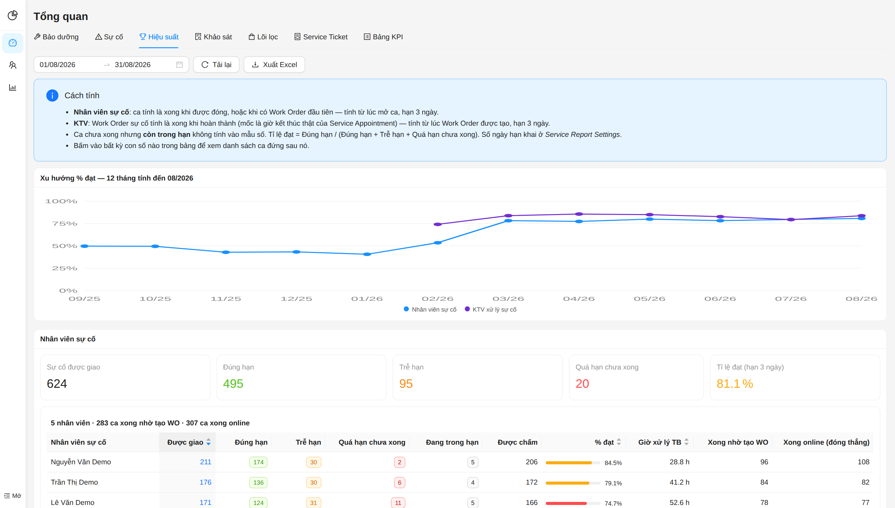
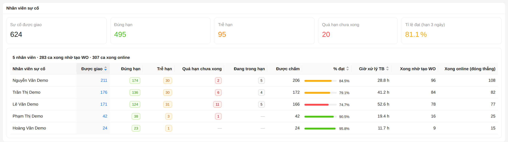
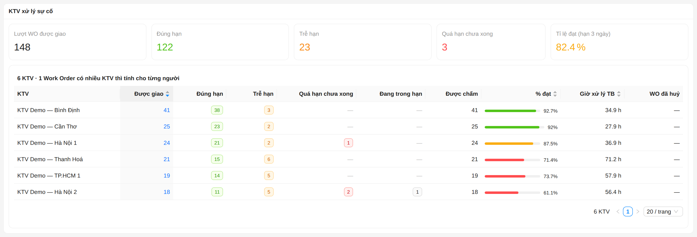
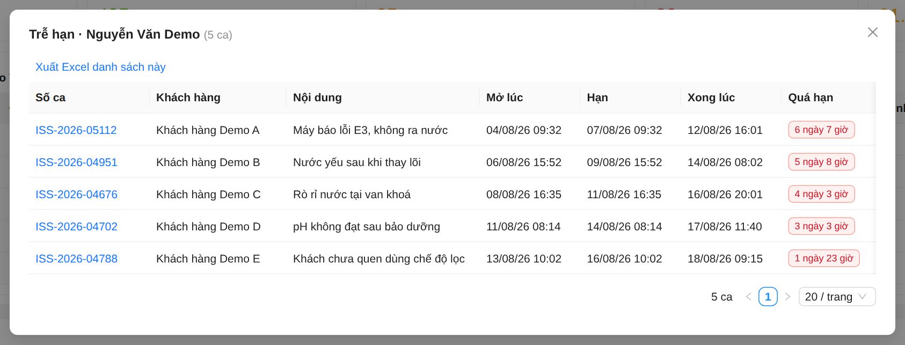
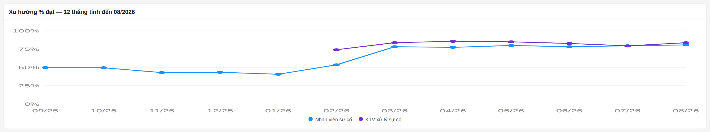

# Hiệu suất xử lý sự cố

> Dành cho **quản lý bộ phận dịch vụ** cần biết mỗi nhân viên sự cố và mỗi kỹ thuật viên
> hoàn thành được bao nhiêu phần việc được giao, đúng hạn hay không.
> Màn hình dùng trong bài: tab **Hiệu suất** của trang báo cáo dịch vụ — mở
> `/service-report`, vào mục *Tổng quan*, chọn tab *Hiệu suất*.

Trang trả lời đúng một câu hỏi cho mỗi bên: **trong tất cả những việc giao cho người này,
bao nhiêu phần trăm được làm xong trong hạn?**

---

## Mục lục

1. [Hai vế được đo](#1-hai-vế-được-đo)
2. [Bốn nhóm ca và công thức](#2-bốn-nhóm-ca-và-công-thức)
3. [Bảng nhân viên sự cố](#3-bảng-nhân-viên-sự-cố)
4. [Bảng kỹ thuật viên](#4-bảng-kỹ-thuật-viên)
5. [Bấm vào con số để xem từng ca](#5-bấm-vào-con-số-để-xem-từng-ca)
6. [Biểu đồ xu hướng theo tháng](#6-biểu-đồ-xu-hướng-theo-tháng)
7. [Chỉnh số ngày hạn](#7-chỉnh-số-ngày-hạn)
8. [Những chỗ con số không nói lên điều bạn tưởng](#8-những-chỗ-con-số-không-nói-lên-điều-bạn-tưởng)

---

## 1. Hai vế được đo



Hai bảng đo hai nhóm người khác nhau, theo hai mốc thời gian khác nhau, và **không cộng
chung được**.

| | Nhân viên sự cố | Kỹ thuật viên |
|---|---|---|
| **Là ai** | Người ghi ở ô *Handling Person* trên phiếu sự cố (`Issue`) | Người được gán vào Lịch hẹn (`FS Service Appointment`) của Phiếu công việc |
| **Bắt đầu đếm hạn từ** | Lúc mở ca sự cố | Lúc Phiếu công việc (`FS Work Order`) được tạo |
| **Được coi là xong khi** | Ca được đóng, **hoặc** có Phiếu công việc đầu tiên | Phiếu công việc chuyển sang *Completed* / *Closed* |
| **Phạm vi** | Mọi ca sự cố mở trong khoảng lọc | Chỉ Phiếu công việc có gắn sự cố |

Nhân viên sự cố có hai đường về đích, vì có ca xử lý xong ngay qua điện thoại (đóng thẳng),
có ca phải cử người xuống nhà khách (lập Phiếu công việc). Hệ thống lấy **mốc nào đến trước**.

Kỹ thuật viên được tính từ lúc Phiếu công việc sinh ra chứ không phải từ lúc khách báo hỏng,
để phần chậm ở khâu tiếp nhận không tính vào điểm của kỹ thuật viên.

---

## 2. Bốn nhóm ca và công thức

Mỗi ca rơi vào đúng một trong bốn nhóm:

| Nhóm | Nghĩa | Có vào mẫu số không |
|---|---|---|
| **Đúng hạn** | Xong trước hoặc đúng hạn | Có |
| **Trễ hạn** | Xong, nhưng quá hạn | Có |
| **Quá hạn chưa xong** | Chưa xong và đã quá hạn | Có |
| **Đang trong hạn** | Chưa xong nhưng vẫn còn hạn | **Không** |

```
Tỉ lệ đạt = Đúng hạn ÷ (Đúng hạn + Trễ hạn + Quá hạn chưa xong)
```

Ca **đang trong hạn** bị loại khỏi mẫu số có chủ đích: xem báo cáo của tháng đang chạy thì
luôn có một nắm ca vừa mở hôm qua, chưa tới lúc phán xét. Tính chúng là chưa đạt sẽ kéo tụt
tỉ lệ của mọi người một cách giả tạo. Cột *Đang trong hạn* vẫn hiện số để biết còn bao nhiêu
việc đang treo.

Cột **Được chấm** chính là mẫu số — luôn bằng tổng ba nhóm đầu.

---

## 3. Bảng nhân viên sự cố



Năm thẻ số phía trên là tổng của cả bộ phận trong khoảng lọc. Bảng bên dưới tách theo từng người,
mặc định xếp theo **Được giao** giảm dần — người gánh nhiều việc nhất đứng đầu.

Hai cột cuối cho biết công việc về đích bằng đường nào:

- **Xong nhờ tạo WO** — ca phải cử kỹ thuật viên xuống hiện trường.
- **Xong online (đóng thẳng)** — ca xử lý dứt điểm qua điện thoại, không phát sinh Phiếu công việc.

Bấm tiêu đề cột **% đạt** để xếp theo tỉ lệ. Lưu ý khi xếp kiểu này: người chỉ được giao vài ca
mà đạt 100% sẽ đứng trên người gánh hai trăm ca đạt 85%. Luôn đọc kèm cột *Được giao*.

Cột **Giờ xử lý TB** là số giờ trung bình từ lúc mở ca đến lúc xong, chỉ tính những ca đã xong.

---

## 4. Bảng kỹ thuật viên



Cách đọc giống bảng trên, khác ba điểm:

1. **Được giao đếm theo lượt, không phải theo Phiếu công việc.** Một Phiếu công việc có hai kỹ
   thuật viên cùng đi thì tính cho cả hai người, nên tổng của cột này lớn hơn số phiếu thật.
   Dữ liệu hiện không phân biệt được ai là người chính, ai đi phụ.
2. **Cả nhóm cùng nhận kết quả của phiếu.** Phiếu xong đúng hạn thì mọi người có mặt đều được
   tính đúng hạn.
3. **Phiếu đã huỷ không vào mẫu số**, chỉ đếm riêng ở cột *WO đã huỷ* — huỷ phiếu thường không
   phải lỗi của kỹ thuật viên.

Mốc "làm xong" lấy từ **giờ kết thúc thật của Lịch hẹn** (`FS Service Appointment`), không lấy
`end_date` trên Phiếu công việc vì ô đó là khung giờ hẹn với khách (thường 08:00–17:00) chứ
không phải giờ hoàn thành.

---

## 5. Bấm vào con số để xem từng ca

Mọi con số trong hai bảng đều bấm được. Bấm vào là ra danh sách những ca đã được đếm.



Danh sách cho biết đủ để đối chất: ca mở lúc nào, hạn tới đâu, xong lúc nào, **quá hạn bao lâu**,
và về đích bằng đường nào. Mã ca là đường dẫn — bấm vào mở thẳng phiếu sự cố (`Issue`) hoặc
Phiếu công việc (`FS Work Order`) trong Desk.

Danh sách xếp **ca nặng nhất lên trước** (trễ nhiều nhất). Liên kết *Xuất Excel danh sách này*
ở đầu bảng xuất riêng danh sách đang xem.

Nhân viên thắc mắc vì sao bị chấm thấp thì mở đúng con số đó ra rà từng ca, không phải tranh cãi
dựa trên cảm nhận.

---

## 6. Biểu đồ xu hướng theo tháng



Biểu đồ luôn vẽ **12 tháng tính ngược từ tháng cuối của khoảng lọc**, không phụ thuộc khoảng lọc
dài hay ngắn — chọn đúng một tháng thì hai bảng bên dưới đổi theo, còn biểu đồ vẫn đủ 12 điểm để
thấy đường đi. Rê chuột lên từng điểm để xem tỉ lệ và số ca của tháng đó.

> **Đừng so tỉ lệ trước và sau khi hệ Phiếu công việc chạy.** Trước năm 2026 gần như không ca nào
> sinh Phiếu công việc, nghĩa là nhân viên sự cố chỉ có một đường về đích là đóng ca thủ công.
> Từ khi hệ `FS Work Order` chạy, việc lập phiếu trở thành mốc "xong" thứ hai và đến sớm hơn nhiều.
> Bậc thang đi lên ở đầu năm 2026 phần lớn là do đổi cách làm việc, không phải do người làm nhanh
> gấp rưỡi.

---

## 7. Chỉnh số ngày hạn

Số ngày hạn khai ở **Service Report Settings** — vào Desk, gõ `Ctrl+K` rồi tìm
*Service Report Settings*, mục **Hiệu suất xử lý sự cố**:

| Ô | Áp cho | Mặc định |
|---|---|---|
| **Hạn xử lý sự cố (ngày)** | Nhân viên sự cố | 3 |
| **Hạn KTV đóng Work Order (ngày)** | Kỹ thuật viên | 3 |

Hai ô tách riêng để siết một vế mà không đụng vế kia. Để trống hoặc điền 0 thì hệ thống dùng 3 ngày.

Đổi số ngày là **tính lại toàn bộ lịch sử** ngay lần mở trang kế tiếp, kể cả các tháng đã qua —
tiện để thử "nếu hạn 2 ngày thì tỉ lệ còn bao nhiêu", nhưng cũng có nghĩa là báo cáo in ra tuần
trước sẽ không khớp báo cáo in ra hôm nay nếu ai đó vừa sửa ô này. Chốt một con số rồi giữ.

---

## 8. Những chỗ con số không nói lên điều bạn tưởng

**Ca do hệ thống tự đóng vẫn tính là đóng.** Hệ thống có tác vụ nền tự đóng những ca ở trạng thái
*Replied* sau một số ngày không ai đụng tới. Ca xử lý xong ngay trong ngày nhưng nhân viên không
bấm đóng, để tác vụ nền đóng giúp một tuần sau, sẽ bị tính là **trễ hạn**. Muốn con số phản ánh
đúng thì nhân viên phải tự đóng ca khi xong việc.

**Giờ mở ca lấy theo giờ tạo phiếu.** Phiếu sự cố không lưu giờ mở, chỉ lưu ngày. Nếu đếm từ 0h
thì ca mở lúc 16h bị mất gần một ngày hạn một cách vô lý, nên hệ thống lấy giờ tạo phiếu làm mốc.
Phiếu sự cố luôn được tạo đúng ngày mở nên hai mốc không lệch ngày.

**Người phụ trách là người đang ghi trên phiếu, không phải người từng xử lý.** Ca đổi người giữa
chừng thì toàn bộ ca tính cho người đang đứng tên. Không có lịch sử chia phần.

**Tỉ lệ trên mẫu số nhỏ không có ý nghĩa thống kê.** Người được giao dưới mười ca thì một ca trễ
đã kéo tỉ lệ xuống hơn mười điểm. Đọc cột *Được giao* trước khi kết luận.
