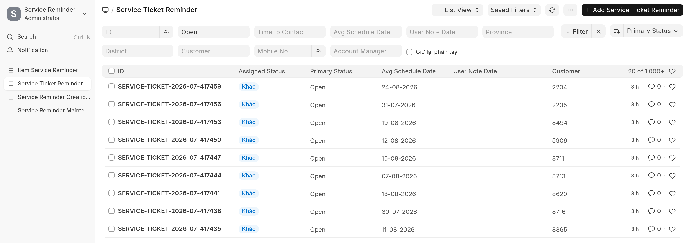
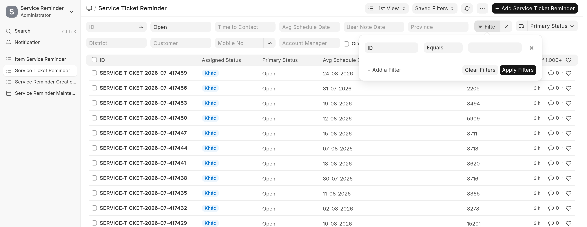
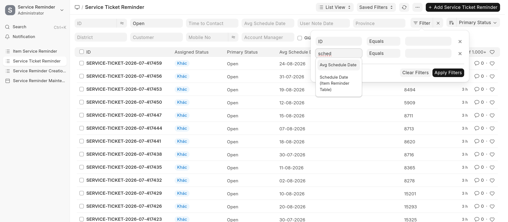
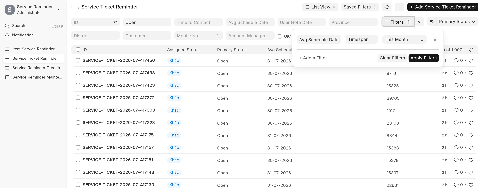
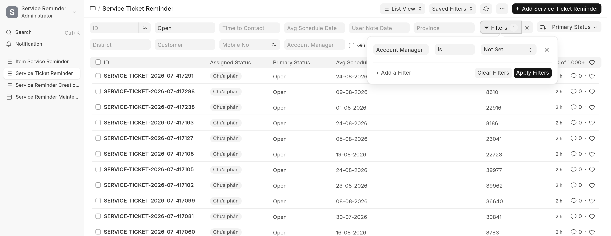
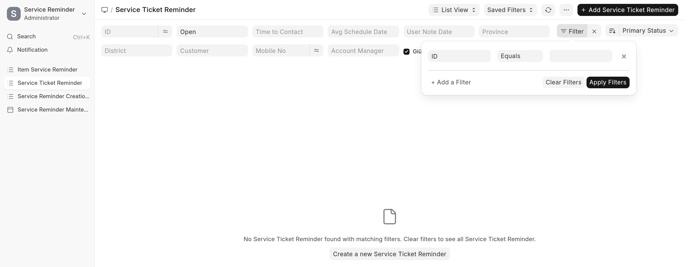
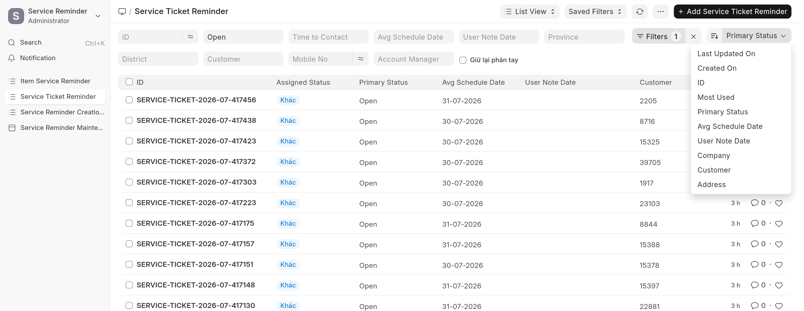
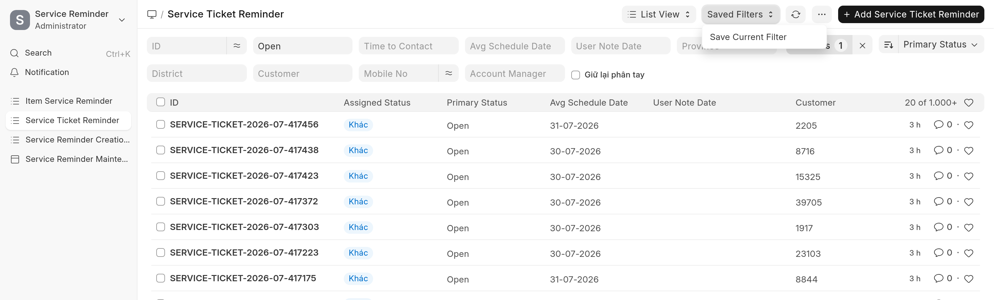

# Lọc & sắp xếp ticket bảo dưỡng

> Dành cho **nhân viên CSKH/Sales** gọi bảo dưỡng hằng ngày và **manager** theo dõi khối lượng.
> Màn hình dùng trong bài: **Service Ticket Reminder** — vào Desk, gõ `Ctrl+K` rồi tìm
> *Service Ticket Reminder*, hoặc mở thẳng `/app/service-ticket-reminder`.

Danh sách ticket có hơn 40.000 dòng. Không lọc thì mở ra chỉ thấy 20 dòng mới nhất, không
dùng để làm việc được. Bài này chỉ ra **chỗ bấm** và **các công thức lọc hay dùng nhất**.

---

## Mục lục

1. [Ba chỗ để lọc](#1-ba-chỗ-để-lọc)
2. [Lọc nhanh — một dòng, một điều kiện](#2-lọc-nhanh--một-dòng-một-điều-kiện)
3. [Bảng lọc đầy đủ](#3-bảng-lọc-đầy-đủ)
4. [Lọc theo thời gian](#4-lọc-theo-thời-gian)
5. [Lọc theo người phụ trách](#5-lọc-theo-người-phụ-trách)
6. [Lọc theo trạng thái & cờ giữ tay](#6-lọc-theo-trạng-thái--cờ-giữ-tay)
7. [Kết hợp nhiều điều kiện](#7-kết-hợp-nhiều-điều-kiện)
8. [Sắp xếp](#8-sắp-xếp)
9. [Lưu lại để dùng mỗi ngày](#9-lưu-lại-để-dùng-mỗi-ngày)
10. [Công thức bỏ túi](#10-công-thức-bỏ-túi)

---

## 1. Ba chỗ để lọc


Nhìn từ trái sang, có ba thứ khác nhau và hay bị lẫn:

| Chỗ | Là gì | Khi nào dùng |
|---|---|---|
| **Hàng ô trắng** (ID, Open, Time to Contact, Avg Schedule Date…) | Lọc nhanh, mỗi ô một trường | Điều kiện đơn giản, gõ phát ra ngay |
| **Nút `Filters`** | Bảng lọc đầy đủ — chọn trường, **toán tử**, giá trị | Khoảng ngày, "chưa gán", "khác…" |
| **Nút bên phải (`Primary Status ⌄`)** | Sắp xếp | Đổi thứ tự, không lọc |

Con số nhỏ trên nút `Filters` (vd `Filters 1`) là **số điều kiện đang áp dụng**. Thấy danh sách
ra ít hơn mong đợi thì nhìn con số này trước tiên — thường là còn sót bộ lọc cũ.

Dấu **`✕`** ngay cạnh nút `Filters` xoá sạch mọi điều kiện, về lại danh sách đầy đủ.

---

## 2. Lọc nhanh — một dòng, một điều kiện

Gõ hoặc chọn thẳng vào ô trắng. Ví dụ ô thứ hai chọn `Open`:



Ô lọc nhanh luôn là **bằng đúng giá trị đó**. Vì vậy ô **Avg Schedule Date** ở đây chỉ lọc được
**đúng một ngày** — muốn lọc cả tháng phải sang bảng lọc đầy đủ ở mục 4.

---

## 3. Bảng lọc đầy đủ

Bấm nút **`Filters`**:



Mỗi dòng gồm ba phần: **Trường** → **Toán tử** → **Giá trị**.

Bấm **`+ Add a Filter`** để thêm dòng. Ô trường có tìm kiếm — gõ vài chữ là ra:



> **Nhãn trường trong Desk là tiếng Anh.** Gõ `ngay` sẽ không ra gì; gõ `sched` mới ra
> *Avg Schedule Date*. Vài từ khoá hay dùng: `sched` (ngày hẹn), `manager` (người phụ trách),
> `status` (trạng thái), `company` (công ty), `customer` (khách).

Chọn xong nhớ bấm **`Apply Filters`**. Các điều kiện trên nhiều dòng luôn là **VÀ** — thoả hết
mới hiện.

---

## 4. Lọc theo thời gian

Trường dùng để lọc là **Avg Schedule Date** — ngày hẹn bảo dưỡng trung bình của ticket.

### Việc của tháng này *(nên dùng)*

Trường **Avg Schedule Date** → toán tử **`Timespan`** → giá trị **`This Month`**:



Ưu điểm: **sang tháng sau không phải sửa lại**, nó tự trượt theo. Đây là cách hợp nhất cho việc
lặp hằng tháng.

Toán tử `Timespan` còn có: `Today`, `Tomorrow`, `Yesterday`, `This Week`, `Next Week`,
`Next Month`, `This Quarter`, `This Year`, `Last Month`…

### Đúng một khoảng ngày

Toán tử **`Between`**, rồi chọn ngày đầu và ngày cuối:


Dùng khi cần đúng một đợt, ví dụ 01-08 đến 31-08.

### Ca đã quá hạn

Toán tử **`<`** với giá trị là ngày hôm nay:


Đây là nhóm cần xem lại: hẹn đã qua mà ticket vẫn còn `Open`.

---

## 5. Lọc theo người phụ trách

Trường **Account Manager**.

### Việc của một người


### Ticket chưa có người

Toán tử **`Is`** → giá trị **`Not Set`**:



Đây là hàng chờ — ticket chưa ai nhận. Manager nên xem nhóm này thường xuyên.

---

## 6. Lọc theo trạng thái & cờ giữ tay

**Primary Status** — trạng thái xử lý. `Open` là chưa xong; `Converted` là đã ra đơn;
`Reschedule Reminder Date` là đã dời hẹn; `Unable to Contact`, `Lost`, `Contact Later`…

**Giữ lại phân tay** — ô tick nằm ngay trên hàng lọc nhanh:



Ticket bật cờ này là **ca nợ được hồi phục hàng loạt**, cố tình để trống người phụ trách cho
quản lý tự chia, và **cron đêm sẽ không tự gán**. Xem thêm
[Auto-Assign Ticket & SIM](Service_Reminder_Auto_Assign.html).

Chia xong thì **tắt cờ** đi, ticket quay lại luồng bình thường.

**Company** — lọc theo công ty (THẾ GIỚI ĐIỆN GIẢI / DOCTOR NƯỚC / AKANWA). Trường này không có
sẵn trên hàng lọc nhanh, phải thêm qua bảng lọc đầy đủ.

---

## 7. Kết hợp nhiều điều kiện

Ví dụ hay dùng nhất — **việc của tôi, trong tháng này, chưa xử lý xong**:


```
Primary Status      Equals     Open
Account Manager     Equals     <email của bạn>
Avg Schedule Date   Timespan   This Month
```

Số ở góc phải danh sách (`... of 1.000+`) là **tổng số ticket khớp** — dùng để biết khối lượng
việc, không cần cuộn hết.

---

## 8. Sắp xếp

Bấm nút sắp xếp bên phải nút `Filters`:



Hay dùng nhất là **Avg Schedule Date** tăng dần — ca **đến hạn sớm nhất lên đầu**, gọi theo thứ
tự đó là không bỏ sót ai. Nút mũi tên bên trái đổi giữa tăng và giảm dần.

---

## 9. Lưu lại để dùng mỗi ngày

Lọc xong, mở **`Saved Filters`** trên thanh tiêu đề → **`Save Current Filter`**, đặt tên (vd
*"Việc tháng này"*). Lần sau chỉ cần chọn lại từ chính menu đó, khỏi dựng lại từ đầu.



Cách thứ hai: bộ lọc nằm luôn trong **địa chỉ trang**, nên có thể **đánh dấu trang (bookmark)**
hoặc gửi link cho đồng nghiệp. Ví dụ:

```
/app/service-ticket-reminder?primary_status=Open&avg_schedule_date=["Timespan","this month"]
```

---

## 10. Công thức bỏ túi

| Cần xem | Bộ lọc |
|---|---|
| Việc của tôi tháng này | `Primary Status = Open` + `Account Manager = tôi` + `Avg Schedule Date Timespan This Month` |
| Việc tuần này | `Avg Schedule Date` → `Timespan` → `This Week` |
| Ca quá hạn chưa xong | `Primary Status = Open` + `Avg Schedule Date <` hôm nay |
| Ticket chưa có người | `Primary Status = Open` + `Account Manager Is Not Set` |
| Ca nợ chờ chia tay | tick **Giữ lại phân tay** |
| Việc của một công ty | thêm trường `Company` |
| Đã ra đơn tháng này | `Primary Status = Converted` + `Avg Schedule Date Timespan This Month` |
| Khách hẹn gọi lại | `Primary Status = Contact Later` |

---

## Vướng ở đâu?

**Lọc xong không ra dòng nào.** Xem con số trên nút `Filters` — thường còn sót điều kiện cũ.
Bấm `✕` cạnh nút để xoá sạch rồi lọc lại.

**Gõ tên trường tiếng Việt không ra.** Nhãn trường là tiếng Anh, xem lại mục 3.

**Lọc ô Avg Schedule Date ở hàng nhanh mà chỉ ra vài dòng.** Ô đó khớp **đúng một ngày**. Muốn
cả tháng thì dùng `Timespan` trong bảng lọc đầy đủ (mục 4).

**Danh sách hiện `1.000+`.** Frappe chỉ đếm tới 1.000 cho nhanh. Cần con số chính xác thì lọc
hẹp lại, hoặc bấm vào chính con số đó để nó đếm đủ.
