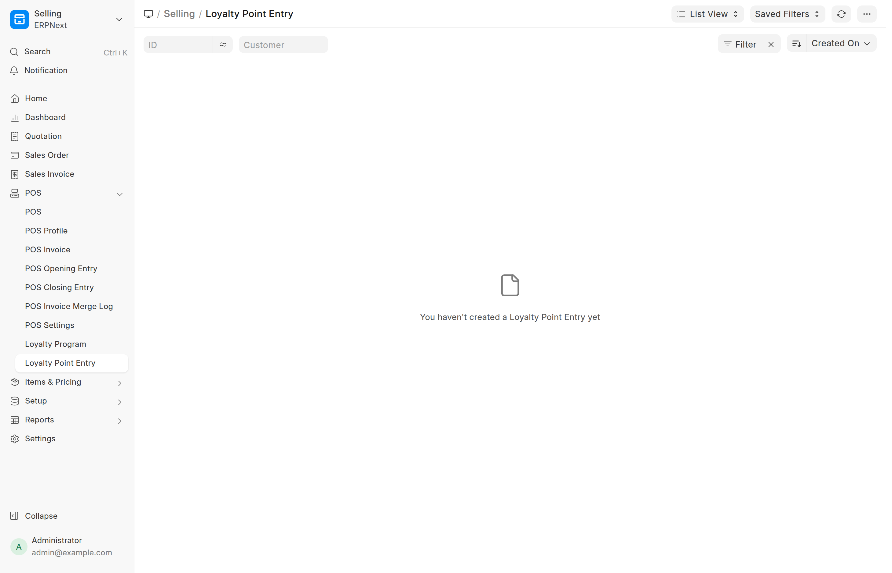

# Tích điểm khách hàng — Hướng dẫn cho Sales
{: .no_toc }

**Dành cho:** Nhân viên kinh doanh · Trưởng phòng kinh doanh · **Thời lượng đọc:** ~5 phút

Tài liệu này chỉ nói **những việc Sales cần làm** để khách hàng nhận đúng điểm và
người giới thiệu nhận đúng thưởng. Phần cấu hình hệ thống không thuộc phạm vi tài liệu này.

<details markdown="1">
<summary>Mục lục</summary>

1. TOC
{:toc}

</details>

---

## 1. Tóm tắt trong 30 giây

Sales chỉ cần nhớ **3 việc**:

| # | Việc | Làm ở đâu | Nếu quên thì sao |
|---|---|---|---|
| 1 | Khách phải có **Chương trình tích điểm** | Customer → tab *Loyalty Points* | Khách **không được điểm nào**, hệ thống **không báo lỗi** |
| 2 | Khai **người giới thiệu** ngay khi tạo Lead | Lead → *Source* = **Reference** → ô *From Customer* | Người giới thiệu **mất thưởng**, sửa sau rất phiền |
| 3 | Đơn phải có **Sales Order** và **xuất hoá đơn đủ 100%** | Sales Order → Sales Invoice | Chưa đủ 100% thì **chưa có điểm** |

---

## 2. Điểm được cộng khi nào?

Đây là câu hỏi khách hay hỏi nhất. Có **2 trường hợp**, khác nhau hoàn toàn:

### Trường hợp A — Bán qua Đơn hàng (Sales Order) ✅ *khuyến khích*

```
Sales Order  →  xuất hoá đơn  →  khi hoá đơn đạt ĐỦ 100% giá trị đơn  →  ✅ CỘNG ĐIỂM
```

- Điểm được cộng **đúng 1 lần cho mỗi đơn hàng**, tính trên **tổng giá trị đơn**.
- Nếu xuất hoá đơn **từng phần** (50% trước, 50% sau): **chưa có điểm** cho tới khi phần
  cuối cùng được xuất, đủ 100%.
- Đây là cách duy nhất để **người giới thiệu được thưởng** (xem [§3](#3-khai-người-giới-thiệu--việc-quan-trọng-nhất-của-sales)).

### Trường hợp B — Bán tiền mặt, không có Đơn hàng

```
Xuất hoá đơn thẳng (không có Sales Order)  →  ✅ CỘNG ĐIỂM ngay mỗi lần xuất
```

- Cộng ngay khi xuất hoá đơn.
- ⚠️ **KHÔNG** phát sinh thưởng giới thiệu, kể cả khi khách đó được người khác giới thiệu.

> 💡 **Quy tắc thực hành:** nếu khách đến từ giới thiệu, **hãy tạo Sales Order**, đừng bán
> thẳng bằng hoá đơn tiền mặt — nếu không người giới thiệu sẽ mất thưởng.

---

## 3. Khai người giới thiệu — việc quan trọng nhất của Sales

Hệ thống **không tự đoán** ai giới thiệu ai. Sales phải khai, và phải khai **ở bước Lead**.

### Cách khai (làm ngay khi tạo Lead)

1. Mở **Lead** của khách mới.
2. Trường **Source** → chọn **`Reference`**.
   *(Giá trị `Existing Customer` cũng được hệ thống chấp nhận, nhưng thực tế toàn công ty đang dùng `Reference` — hãy dùng cho thống nhất.)*
3. Ngay khi chọn xong, một ô mới hiện ra: **From Customer** — và ô này **bắt buộc phải điền**.
4. Ở ô đó, chọn **khách hàng cũ đã giới thiệu** người này.
5. Lưu.

> Nếu chọn Source khác (Hotline, Facebook, Cộng tác viên…) thì ô *From Customer* **không hiện**, và hệ thống hiểu là khách **không đến từ giới thiệu** → không có thưởng.

> ⏰ **Phải khai ở giai đoạn Lead, TRƯỚC khi chuyển thành Customer.** Hệ thống truy vết
> người giới thiệu theo đường: *Khách hàng → Lead gốc → Người giới thiệu*. Khai sau khi đã
> chuyển đổi thì liên kết không còn đúng, phải nhờ quản trị sửa tay.

### Người giới thiệu được thưởng khi nào?

Đủ **cả 4** điều kiện sau:

| # | Điều kiện |
|---|---|
| 1 | Lead đã khai đúng *Source = Reference* (hoặc *Existing Customer*) + *From Customer* |
| 2 | Khách mới có **Sales Order** (không phải bán tiền mặt) |
| 3 | Đó là **Đơn hàng ĐẦU TIÊN** của khách mới đó |
| 4 | Đơn đã xuất hoá đơn **đủ 100%**, và đạt **giá trị tối thiểu** công ty quy định |

Thưởng chỉ tính **1 lần cho mỗi khách được giới thiệu** — ở đơn đầu tiên. Các đơn sau
của khách đó **không** phát sinh thưởng thêm cho người giới thiệu.

---

## 4. Kiểm tra khách đã có Chương trình tích điểm chưa

Khách **không được gán Chương trình tích điểm** sẽ **không nhận điểm**, và hệ thống
**không báo lỗi gì cả**. Đây là nguyên nhân số 1 của khiếu nại "sao tôi không có điểm".

**Cách kiểm tra:** mở **Customer** → tab **Loyalty Points** → xem 2 ô:
- **Loyalty Program** — nếu **trống** ⇒ khách chưa được gán, sẽ không có điểm.
- **Loyalty Program Tier** — hạng hiện tại của khách (ô này hệ thống tự tính, không sửa được).

**Nếu trống:** báo quản trị viên gán chương trình cho khách (có công cụ gán hàng loạt).
Sau khi gán, các đơn **phát sinh sau đó** mới được tính điểm.

---

## 5. Tra cứu điểm & hạng của khách

| Muốn xem gì | Xem ở đâu |
|---|---|
| Khách đang ở **hạng** nào, thuộc **chương trình** nào | Customer → tab **Loyalty Points** |
| **Lịch sử** từng lần cộng/trừ điểm | Danh sách **Loyalty Point Entry**, lọc theo tên khách |
| Khách **tự tra** điểm của mình | **Zalo Mini App** (tra bằng số điện thoại) |

Trong danh sách Loyalty Point Entry, cột **Invoice Type** cho biết điểm đến từ đâu:



- `Sales Order` → điểm từ đơn hàng hoàn tất (hoặc thưởng giới thiệu).
- `Sales Invoice` → điểm từ hoá đơn bán tiền mặt.
- `COBE Loyalty Adjustment` → điểm do quản trị cộng/trừ tay.

Dòng có ghi chú bắt đầu bằng `[REVERSE]` là **điểm bị trừ lại** do trả hàng / huỷ hoá đơn.

---

## 6. Trả hàng, huỷ hoá đơn — điểm sẽ bị trừ lại

Khi khách **trả hàng** hoặc hoá đơn bị **huỷ**, nếu đơn không còn đủ 100% giá trị, hệ thống
**tự động trừ lại** số điểm đã cộng cho đơn đó — bao gồm cả **thưởng của người giới thiệu**.

- Sales **không cần thao tác gì**, hệ thống tự làm.
- Điểm cũ **không bị xoá**; hệ thống ghi thêm một dòng trừ để giữ lịch sử minh bạch.
- Cần giải thích với khách: *"đơn đã trả hàng nên phần điểm tương ứng được thu hồi"*.

---

## 7. Những việc Sales KHÔNG tự làm

| Việc | Ai làm |
|---|---|
| Cộng / trừ điểm bằng tay cho khách | Quản trị viên (System Manager / Kế toán trưởng) |
| Nâng hạng VIP cho khách | **Trưởng phòng kinh doanh** hoặc Quản trị viên |
| Gán Chương trình tích điểm hàng loạt | Quản trị viên |
| Sửa tỉ lệ quy đổi điểm, mức thưởng giới thiệu | Quản trị viên |

Nếu cần cộng điểm bù cho khách (ví dụ đơn cũ bị sót), **đừng tự xử lý** — gửi yêu cầu cho
quản trị viên kèm: tên khách, mã đơn, lý do.

---

## 8. Xử lý khiếu nại "Khách không thấy điểm"

Kiểm tra theo **đúng thứ tự** này, 90% trường hợp dừng ở bước 1 hoặc 2:

1. **Khách có Chương trình tích điểm chưa?**
   Customer → tab *Loyalty Points* → ô *Loyalty Program* có trống không? → Trống thì báo quản trị gán.

2. **Đơn đã xuất hoá đơn ĐỦ 100% chưa?**
   Mở Sales Order → xem tỉ lệ đã xuất hoá đơn. Chưa đủ 100% ⇒ **chưa tới lúc cộng điểm**, không phải lỗi.

3. **Đơn có bị trả hàng / huỷ hoá đơn không?**
   Nếu có, điểm đã bị thu hồi — đúng quy định.

4. **Đơn phát sinh trước ngày hệ thống bật tích điểm?**
   Các đơn cũ được nạp điểm theo đợt riêng. Báo quản trị viên kiểm tra.

5. **Vẫn không ra** → gửi quản trị viên: mã khách + mã đơn + mã hoá đơn để kiểm tra nhật ký hệ thống.

### Riêng khiếu nại "Người giới thiệu không được thưởng"

Kiểm tra lần lượt:
1. Lead của khách mới có khai *Source = Reference* + *From Customer* không? (thiếu ⇒ nguyên nhân phổ biến nhất)
2. Khách mới có **Sales Order** không, hay chỉ bán tiền mặt? (bán tiền mặt ⇒ không có thưởng)
3. Đó có phải **đơn đầu tiên** của khách mới không? (đơn thứ 2 trở đi ⇒ không có thưởng)
4. Đơn đã xuất hoá đơn đủ 100% và đạt giá trị tối thiểu chưa?

---

## 9. Quy trình chuẩn — khách mới đến từ giới thiệu

```
1. Tạo LEAD
   └─ Source = "Reference"
   └─ From Customer = <khách đã giới thiệu>        ← BẮT BUỘC, làm ngay

2. Chuyển đổi thành CUSTOMER
   └─ Kiểm tra tab Loyalty Points có Chương trình chưa
       └─ Trống → báo quản trị gán

3. Tạo SALES ORDER                                  ← đừng bán thẳng hoá đơn tiền mặt

4. Giao hàng + xuất HOÁ ĐƠN cho tới khi ĐỦ 100%

5. ✅ Hệ thống tự động:
      • Cộng điểm cho khách mới
      • Cộng thưởng cho người giới thiệu (nếu là đơn đầu tiên)
```

---

## Ghi nhớ cuối cùng

> - Khách **chưa có Chương trình tích điểm** = **không có điểm**, và hệ thống **im lặng**.
> - Muốn có **thưởng giới thiệu**: khai ở **Lead** + bán qua **Sales Order** + **đơn đầu tiên** + **hoá đơn đủ 100%**.
> - Chưa xuất hoá đơn đủ 100% thì **chưa có điểm** — không phải lỗi hệ thống.
