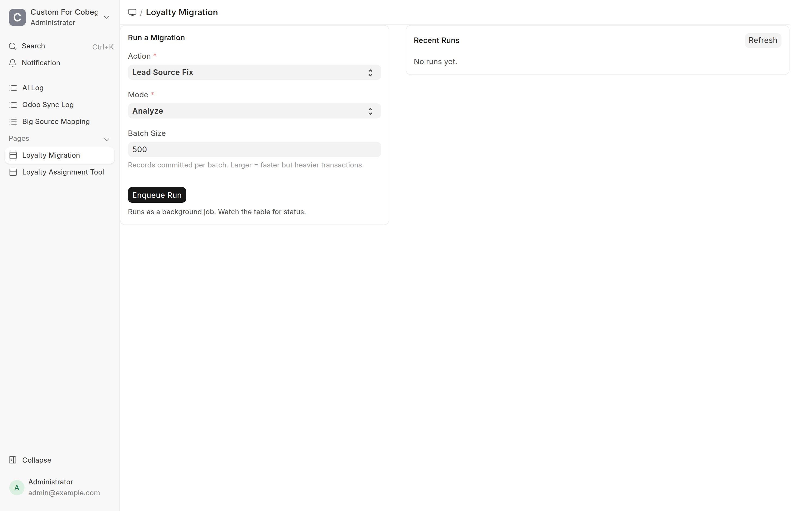
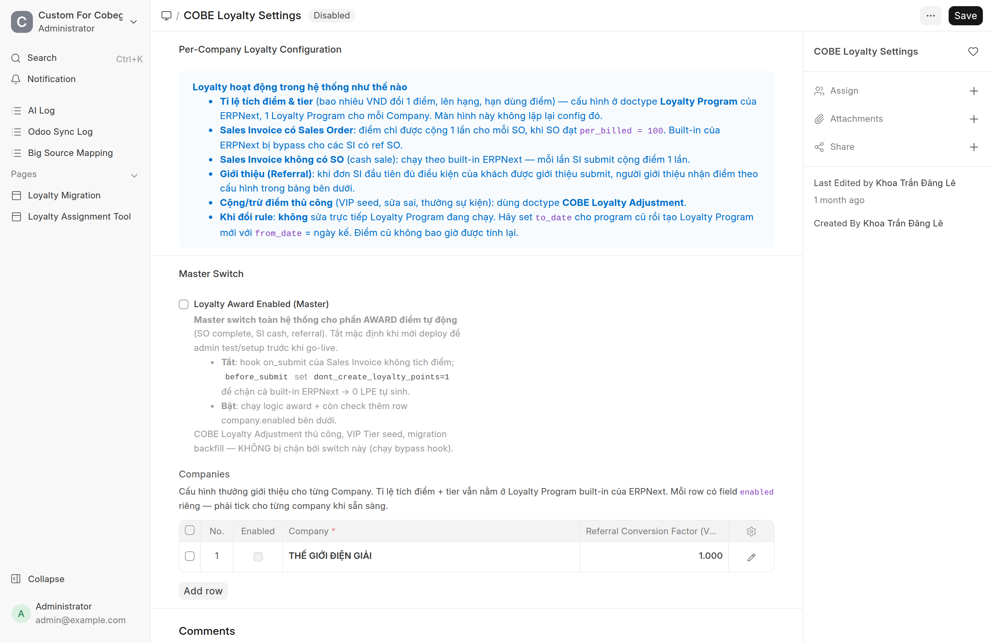
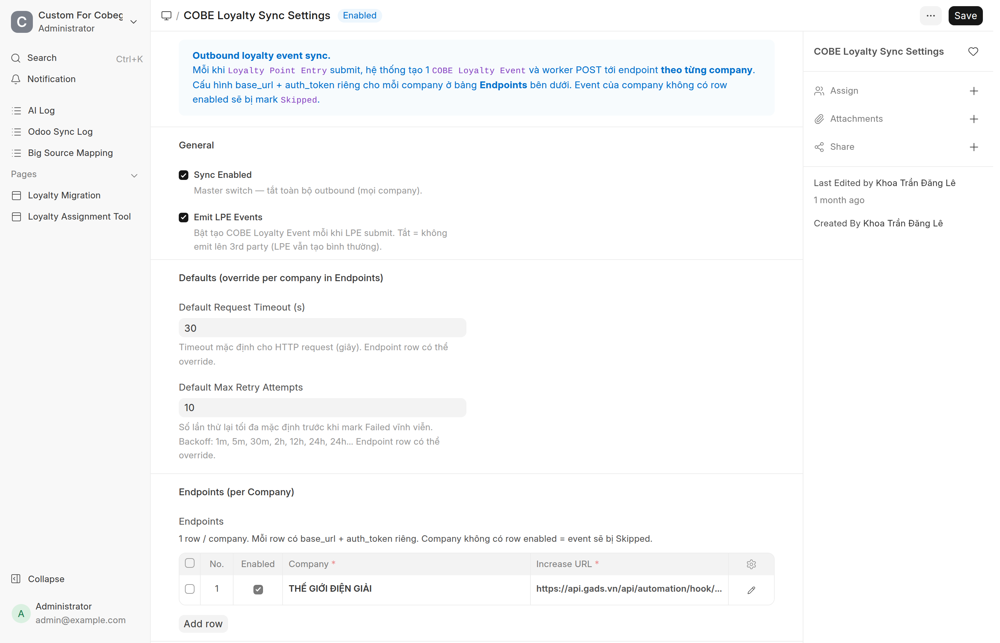
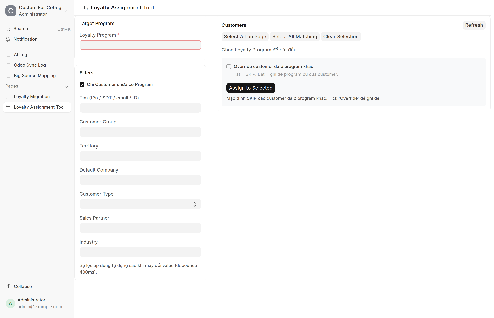
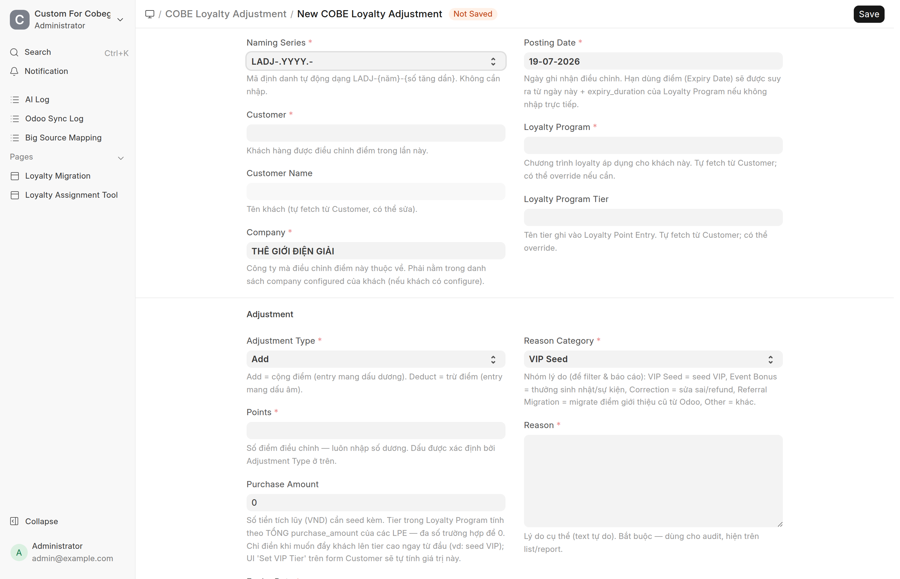

# Seed điểm loyalty cho đơn hàng cũ
{: .no_toc }

**Dành cho:** System Manager / Người vận hành loyalty · **Thời lượng:** ~30–60 phút (tuỳ khối lượng đơn)

Tài liệu này hướng dẫn **từng bước** cách nạp (seed) điểm loyalty cho **các đơn hàng
đã phát sinh TRƯỚC khi bật tính năng** — để khách không bị mất điểm lịch sử khi hệ
thống chính thức chạy. Kèm phần **go-live** (bật tích điểm tự động) và các **bẫy phải
tránh**.

> Tài liệu này là phần *thực hành*. Muốn hiểu sâu mô hình (điểm cộng/trừ khi nào,
> tier, outbound event…) xem [Loyalty — Tích điểm](Loyalty-Tich-Diem.html).

<details markdown="1">
<summary>Mục lục</summary>

1. TOC
{:toc}

</details>

---

## 0. Bức tranh tổng thể

Hệ thống có **2 công tắc lớn**, và **4 công cụ seed**. Nguyên tắc sống còn:

> 🔑 **Seed TOÀN BỘ đơn cũ trước → rồi mới bật tích điểm tự động.** Làm ngược lại sẽ
> **cộng đôi điểm** (xem [§7](#7-bẫy-cộng-đôi--đọc-kỹ)).

| Công cụ | Nạp điểm gì | Bắt buộc? |
|---|---|---|
| **Lead Source Fix** | Dựng lại quan hệ "ai giới thiệu ai" từ Odoo | Chỉ khi muốn seed referral |
| **SI Backfill** | Điểm mua hàng cho mọi hoá đơn (Sales Invoice) cũ | ✅ Cốt lõi |
| **Referral Backfill** | Điểm thưởng cho người giới thiệu | Chỉ khi seed referral |
| **VIP Seed (CSV)** | Điểm/hạng VIP nhập tay từ file | Tuỳ chọn |

Tất cả chạy trong **1 trang duy nhất**: **Loyalty Migration** (`/app/loyalty-migration`).

---

## 1. Trang Loyalty Migration — làm quen giao diện

Vào **Desk → tìm "Loyalty Migration"** (hoặc gõ thẳng địa chỉ `/app/loyalty-migration`).
Chỉ **System Manager** mới mở được.



Bên trái là khối **Run a Migration**:

| Ô | Ý nghĩa |
|---|---|
| **Action** | Chọn công cụ seed: *Lead Source Fix · SI Backfill · Referral Backfill · VIP Seed*. |
| **Mode** | Cách chạy: **Analyze** (chỉ xem), **Dry-run** (thử, không ghi), **Apply** (ghi thật), **Reset** (xoá/hoàn tác phần công cụ đó tạo). Mỗi Action có các Mode khác nhau. |
| **Batch Size** | Số bản ghi commit mỗi lượt (mặc định 500). Để nguyên là ổn. |
| **Enqueue Run** | Bấm để chạy. Chạy **nền** (background job) → không sợ treo trình duyệt với dữ liệu lớn. |

Bên phải **Recent Runs**: mỗi lần chạy là 1 dòng, hiện trạng thái realtime
**Queued → Running → Completed/Failed** + tiến độ. **Bấm vào một dòng** để xem kết
quả chi tiết (số điểm đã tạo, top khách…) hoặc log lỗi.

> ⚙️ **Luôn chạy Dry-run trước Apply.** Đọc kết quả Dry-run, thấy số hợp lý mới Apply.
> Mọi bước đều có **Reset** để lùi lại nếu sai.

---

## 2. Chuẩn bị — TẮT 2 công tắc trước khi seed

### 2.1. Tắt tích điểm tự động (Award)

Vào **COBE Loyalty Settings** (`/app/cobe-loyalty-settings`). Đảm bảo ô **Loyalty
Award Enabled (Master)** đang **BỎ TICK** (badge góc trên hiện *Disabled*).



Giải thích màn hình:
- **Loyalty Award Enabled (Master)**: công tắc tổng cho tích điểm tự động. Trong lúc
  seed để **TẮT** → đơn mới submit không cộng điểm runtime, tránh chồng lấn với backfill.
- **Companies** (bảng dưới): cấu hình thưởng giới thiệu **cho từng company**. Cột
  `Enabled`, `Referral Conversion Factor` (VND đổi 1 điểm thưởng), `Referral Max Points`,
  `Referral Min Invoice Amount`.

> ✅ **Bật `Enabled` ở dòng company là AN TOÀN** trong lúc seed — nó **không** kích hoạt
> tích điểm tự động (award tự động cần *Master* **VÀ** dòng company, mà Master đang tắt).
> Nhưng **Referral Backfill lại CẦN** dòng company được bật để lấy tham số. Nên cứ bật
> dòng company + điền `Referral Conversion Factor`.

### 2.2. Tắt đẩy điểm sang bên thứ 3 (Sync)

Vào **COBE Loyalty Sync Settings** (`/app/cobe-loyalty-sync-settings`). **BỎ TICK cả
hai** ô **Sync Enabled** và **Emit LPE Events**.



Vì sao? Khi seed, hệ thống tạo hàng ngàn bản ghi điểm. Nếu để Sync bật, mỗi bản ghi sẽ
sinh 1 event **đẩy toàn bộ lịch sử** sang Zalo/bên thứ 3 → xả rác, quá tải. Ta chỉ muốn
đồng bộ **các thay đổi từ nay về sau**, nên seed khi Sync **tắt**, xong xuôi mới bật lại
([§6.3](#63-bật-đồng-bộ-3rd-party)).

> Ảnh trên đang ở trạng thái *Enabled* (minh hoạ vị trí công tắc). Khi seed nhớ **bỏ tick**.

---

## 3. Cấu hình nền (làm 1 lần)

Trước khi seed, khách phải có **Loyalty Program** thì mới tính được điểm.

### 3.1. Tạo Loyalty Program

Mỗi Company 1 **Loyalty Program** (doctype chuẩn ERPNext). Trong đó set:
- `Collection Rules`: mỗi hạng (tier) 1 dòng — `min_spent` (ngưỡng lên hạng),
  `collection_factor` (**bao nhiêu VND = 1 điểm**), tên tier.
- `expiry_duration` (số ngày điểm còn hiệu lực). Để trống → mặc định 10 năm.
- `from_date` (để trống `to_date` cho chương trình đang chạy).

> **Muốn đổi tỉ lệ sau này:** ĐỪNG sửa Program đang chạy. Hãy set `to_date` cho cái cũ
> rồi tạo Program mới `from_date` = ngày kế. Điểm đã cộng không bao giờ bị tính lại.

### 3.2. Gán Program cho khách — Loyalty Assignment Tool

Vào **Loyalty Assignment Tool** (`/app/loyalty-assignment-tool`). Đây là công cụ gán
hàng loạt.



Cách dùng:
1. **Target Program**: chọn Loyalty Program muốn gán.
2. **Filters**: lọc khách theo `Customer Group`, `Territory`, `Default Company`… Ô
   **"Chỉ Customer chưa có Program"** (mặc định ✔) an toàn cho lần gán đầu.
3. Danh sách khách khớp hiện bên phải. Bấm **Select All on Page** / **Select All
   Matching** để chọn, hoặc tick từng khách.
4. Bấm **Assign to Selected** → xác nhận → hiện bảng kết quả (đã gán / bỏ qua…).

> Khách **không có** Loyalty Program sẽ bị **bỏ qua** khi seed (không báo lỗi). Nếu sau
> seed thấy "sao khách này không có điểm?", 90% là do chưa gán Program.

### 3.3. Cấu hình referral (nếu seed referral)

Quay lại **COBE Loyalty Settings** ([ảnh §2.1](#21-tắt-tích-điểm-tự-động-award)), ở bảng
**Companies**: tick `Enabled`, điền `Referral Conversion Factor` (> 0). Đây là điều kiện
để **Referral Backfill** ([§5.3](#53-referral-backfill--thưởng-người-giới-thiệu)) chạy.

### 3.4. Kiểm tra kết nối Odoo (nếu seed referral)

**Lead Source Fix** đọc dữ liệu "ai giới thiệu ai" trực tiếp từ database Odoo. Đảm bảo
**Odoo Connect** (`/app/odoo-connect`) đang cấu hình đúng host/port/user/password/database
và Odoo còn truy cập được. Không có Odoo sống thì bỏ qua nhánh referral.

---

## 4. Thứ tự chạy (bảng tổng)

```
Giai đoạn A — Khoá công tắc
  ├─ Master Award = OFF          (§2.1)
  └─ Sync + Emit LPE = OFF       (§2.2)

Giai đoạn B — Cấu hình nền
  ├─ Tạo Loyalty Program         (§3.1)
  ├─ Gán Program cho khách       (§3.2)
  ├─ Bật referral per-company    (§3.3, nếu có referral)
  └─ Kiểm tra Odoo Connect       (§3.4, nếu có referral)

Giai đoạn C — SEED (trang Loyalty Migration, luôn Dry-run trước)
  ├─ 1. Lead Source Fix   Analyze → Dry-run → Apply   (nếu có referral)
  ├─ 2. SI Backfill       Dry-run → Apply
  ├─ 3. Referral Backfill Dry-run → Apply             (nếu có referral)
  └─ 4. VIP Seed          Run (upload CSV)            (nếu có danh sách)

Giai đoạn D — GO-LIVE
  ├─ Chốt mốc thời gian ranh giới
  ├─ Bật Master Award + dòng company  (§6.2)
  └─ Bật Sync + cấu hình Endpoints    (§6.3)
```

---

## 5. Seed từng bước

### 5.1. Lead Source Fix *(chỉ khi seed referral)*

Dựng lại `Lead.source = "Existing Customer"` + `Lead.customer` để hệ thống biết ai giới
thiệu ai.

Trên trang Loyalty Migration, chọn **Action = Lead Source Fix**, rồi chạy lần lượt:

1. **Mode = Analyze** → Enqueue Run. Xem báo cáo tỉ lệ match được (theo SĐT, tên, email…).
2. **Mode = Dry-run** → xem trước từng thay đổi sẽ ghi (mẫu các nhóm).
3. **Mode = Apply** → ghi thật. **Không bao giờ đè** Lead đang trỏ tới người giới thiệu khác.

### 5.2. SI Backfill — điểm mua hàng *(cốt lõi)*

Quét **mọi Sales Invoice đã submit** (không phải đơn trả hàng), tạo điểm cho khách.

1. **Action = SI Backfill · Mode = Dry-run** → Enqueue Run. Mở dòng kết quả ở Recent Runs,
   đọc:
   - `would_create_entries` — số bản ghi điểm sẽ tạo.
   - `would_total_points` — tổng điểm.
   - `top_10_customers_by_points` — top khách (soi xem có bất thường không).
   - `skipped_no_loyalty_program` — số hoá đơn bị bỏ vì khách chưa có Program (nếu lớn →
     quay lại [§3.2](#32-gán-program-cho-khách--loyalty-assignment-tool) gán thêm).
2. Số hợp lý → đổi **Mode = Apply** → Enqueue Run. Mỗi hoá đơn được tạo 1 bản ghi điểm có
   đánh dấu `[MIGRATED:SI:...]`.
3. Muốn làm lại từ đầu → **Mode = Reset** (chỉ xoá đúng các bản ghi do backfill tạo).

### 5.3. Referral Backfill — thưởng người giới thiệu *(chỉ khi seed referral)*

Với mỗi khách được giới thiệu (đã có đơn hoàn tất), thưởng điểm cho người giới thiệu.

1. **Action = Referral Backfill · Mode = Dry-run** → xem `would_create_adjustments`,
   `top_10_referrers`.
2. **Mode = Apply** → tạo phiếu **COBE Loyalty Adjustment** (loại *Referral Migration*)
   cho từng người giới thiệu.
3. **Mode = Reset** → huỷ các phiếu đó (tự sinh bút toán bù, điểm rollback sạch).

### 5.4. VIP Seed — nhập tay từ CSV *(tuỳ chọn)*

Dùng khi có **danh sách VIP thủ công** (không suy ra từ đơn).

1. Chuẩn bị file CSV có dòng tiêu đề (tải mẫu:
   [loyalty-vip-seed-mau.csv](sample_data/loyalty-vip-seed-mau.csv)). Các cột **hệ thống
   đọc** (tên cột không phân biệt hoa/thường):
   - **Bắt buộc:** `customer` (ID khách), `points` (số nguyên dương), `reason`.
   - **Tuỳ chọn:** `adjustment_type` (Add/Deduct, mặc định Add), `expiry_date`
     (YYYY-MM-DD), `company`, `loyalty_program`.

   ```
   customer,points,reason,adjustment_type,expiry_date,company,loyalty_program
   CUST-2026-00001,5000,"Khach VIP chuyen tu he thong cu",Add,,,
   CUST-2026-00002,10000,"Thuong khai truong",Add,2027-12-31,THẾ GIỚI ĐIỆN GIẢI,
   ```

   > ⚠️ **CSV chỉ seed ĐIỂM, KHÔNG nâng hạng (tier).** Hạng tính theo *số tiền tích luỹ*
   > chứ không theo điểm — mà cột này CSV không nhận. Muốn đẩy khách **lên hạng ngay**,
   > dùng nút **"Set VIP Tier"** trên form Customer (menu **Loyalty → Set VIP Tier**) —
   > nút này tự tính & ghi số tiền tích luỹ cần thiết. Hoặc tạo phiếu **COBE Loyalty
   > Adjustment** tay và điền ô **Purchase Amount** ([§5.5](#55-cộngtrừ-điểm-lẻ-bằng-tay-không-qua-csv)).

2. **Action = VIP Seed · Mode = Run** → chọn file CSV → Enqueue Run. Mỗi dòng tạo 1 phiếu
   **COBE Loyalty Adjustment** đã submit. Kết quả trả về số dòng tạo thành công + danh
   sách dòng lỗi (thiếu customer, sai định dạng…).

### 5.5. Cộng/trừ điểm lẻ bằng tay (không qua CSV)

Cần tặng/trừ điểm cho **một** khách? Tạo thẳng **COBE Loyalty Adjustment**
(`/app/cobe-loyalty-adjustment/new`):



Điền `Customer`, `Company`, `Adjustment Type` (Add/Deduct), `Points` (luôn số dương),
`Reason Category` + `Reason` → **Submit**. Huỷ phiếu (Cancel) sẽ tự tạo bút toán bù ngược
→ giữ nguyên lịch sử, không mất dấu vết.

---

## 6. Go-live — bật hệ thống chạy thật

### 6.1. Chốt mốc thời gian ranh giới

Chọn 1 mốc (ví dụ **ngày go-live**). Quy ước: **đơn ≤ mốc = đã seed**, **đơn > mốc =
runtime tự cộng**. Ghi lại mốc này để về sau đối chiếu.

### 6.2. Bật tích điểm tự động

Vào **COBE Loyalty Settings** → **TICK** `Loyalty Award Enabled (Master)` → đảm bảo dòng
company cần chạy cũng `Enabled` → **Save**. Từ giờ đơn mới hoàn tất sẽ tự cộng điểm.

### 6.3. Bật đồng bộ 3rd party

Khi bên Zalo/đối tác đã lấy xong **số dư điểm ban đầu** (bằng snapshot/API riêng), mới
vào **COBE Loyalty Sync Settings** → TICK `Sync Enabled` + `Emit LPE Events` → cấu hình
bảng **Endpoints** (mỗi company: `url_increase`, `url_decrease` + token) → **Save**.

Từ đây **chỉ các thay đổi mới** mới được đẩy đi; điểm lịch sử đã seed **không** bị đẩy lại
— đúng như thiết kế.

---

## 7. Bẫy cộng-đôi — ĐỌC KỸ

> ⛔ **Tuyệt đối đừng bật Master Award ([§6.2](#62-bật-tích-điểm-tự-động)) TRƯỚC khi SI
> Backfill xong ([§5.2](#52-si-backfill--điểm-mua-hàng-cốt-lõi)).**

Lý do: SI Backfill ghi điểm theo **hoá đơn** (Sales Invoice), còn tích điểm tự động ghi
theo **đơn đặt hàng** (Sales Order). Đây là **2 khoá khác nhau**, nên cơ chế chống-trùng
**không thấy nhau**. Nếu một đơn cũ vẫn còn được xuất hoá đơn tiếp sau khi bạn đã bật
Master, khách sẽ **ăn điểm 2 lần** (1 từ backfill, 1 từ runtime).

**Cách tránh:** seed hết → chốt mốc → rồi mới bật Master. Đơn giản vậy thôi.

---

## 8. Kiểm tra sau khi seed

### 8.1. Xem sổ cái điểm

Vào **Loyalty Point Entry** (`/app/loyalty-point-entry`) — đây là sổ cái gốc, mỗi dòng
là 1 lần cộng/trừ điểm.


Nhìn cột `invoice_type` để biết điểm đến từ đâu:
- `Sales Invoice` → điểm hoá đơn (đơn cash **hoặc** do SI Backfill).
- `Sales Order` → điểm khi đơn hàng hoàn tất (runtime).
- `COBE Loyalty Adjustment` → cộng/trừ tay, VIP seed, referral migration.

Bản ghi bù trừ (return/cancel) có `discretionary_reason` bắt đầu bằng `[REVERSE]`.

### 8.2. Tra điểm theo số điện thoại

Muốn kiểm tra nhanh điểm 1 khách như phía Zalo thấy: gọi API
`get_loyalty_points(phone)` (xem [Loyalty — Tích điểm §9](Loyalty-Tich-Diem.html)). Trả về
điểm khả dụng + hạng theo từng cặp (khách, company).

---

## 9. Hoàn tác (nếu seed sai)

Mỗi công cụ có **Reset** riêng, chỉ đụng phần nó tạo. Chạy Reset **theo thứ tự NGƯỢC** với
lúc Apply:

```
1. Referral Backfill → Reset      (huỷ trước)
2. SI Backfill       → Reset
3. Lead Source Fix   → (không có Reset — chỉ sửa Lead, không tạo điểm)
```

Sau khi Reset, chỉnh lại `collection_factor` / `referral_conversion_factor` rồi Dry-run →
Apply lại. Lặp tới khi số đẹp.

---

## Tóm tắt 1 dòng

> Khoá 2 công tắc (Award + Sync) → gán Program → Dry-run rồi Apply lần lượt *Lead Source
> Fix · SI Backfill · Referral Backfill · VIP Seed* → chốt mốc → bật Award → (sau) bật
> Sync. **Không bao giờ bật Award trước khi seed xong.**

---

# Phụ lục — Checklist go-live đợt 07/2026

Thông số **đã chốt** cho lần triển khai đầu tiên (công ty **THẾ GIỚI ĐIỆN GIẢI**). Làm
đúng thứ tự, tick từng dòng.

## Bước 0 — Kiểm tra ngay sau khi deploy

- [ ] **COBE Loyalty Settings** → `Loyalty Award Enabled (Master)` vẫn **BỎ TICK**
- [ ] **COBE Loyalty Sync Settings** → `Sync Enabled` vẫn **BỎ TICK**
- [ ] **Loyalty Point Entry** (list) → vẫn **0 dòng**

> Nếu thấy có bản ghi điểm tự nhiên xuất hiện ⇒ **dừng lại**, có gì đó đang award ngoài ý muốn.

## Bước 0b — Xác minh cơ chế đẩy điểm *(2 phút, nên làm)*

Mục đích: chứng minh mỗi bút toán điểm có sinh ra `COBE Loyalty Event` — mà **không** gửi gì
sang bên thứ 3.

1. **COBE Loyalty Sync Settings**: tick `Sync Enabled` + `Emit LPE Events`, nhưng ở bảng
   **Endpoints** **BỎ TICK** `enabled` của dòng company → **Save**.
2. Tạo **COBE Loyalty Adjustment**: khách bất kỳ (đã có Program), Type = **Add**,
   Points = **1**, Reason Category = *Other*, Reason = "test" → **Submit**.
3. Mở list **COBE Loyalty Event** → phải thấy **1 dòng mới** (`loyalty.points_increased`,
   trạng thái *Pending*, sau đó thành *Skipped* vì endpoint đang tắt) ⇒ ✅ đạt.
4. **Dọn**: Cancel phiếu Adjustment vừa tạo → quay lại Sync Settings **BỎ TICK cả 2** công
   tắc, tick lại `enabled` cho endpoint.

> Không thấy dòng event nào ⇒ chưa `bench restart` sau deploy.

## Bước 1 — Cấu hình (4 ô)

| # | Màn hình | Ô | Giá trị |
|---|---|---|---|
| 1 | Loyalty Program *"Chương Trình Tích Điểm Khách Hàng - TGDG"* | `From Date` | **01/01/2023** |
| 2 | COBE Loyalty Settings → bảng **Companies**, dòng TGĐG | `Enabled` | **✔ tick** |
| 3 | ⟳ cùng dòng | `Referral Conversion Factor` | **10.000** |
| 4 | ⟳ cùng dòng | `Referral Minimum Invoice Amount` | **1.000.000** |

Giữ nguyên: `collection_factor` = **1.000** · `Referral Max Points` = **0** (không cap, vì đã
giảm bằng factor) · `Loyalty Program Type` = **Single Tier** (phân hạng để sau).

> ⚠️ `Loyalty Award Enabled (Master)` **vẫn để TẮT** ở bước này. Tick dòng company **không**
> làm hệ thống award, vì award cần **cả hai**.

## Bước 2 — Gán Loyalty Program cho khách

Vào **Loyalty Assignment Tool** → `Target Program` = *Chương Trình Tích Điểm Khách Hàng - TGDG*
→ giữ tick **"Chỉ Customer chưa có Program"** → chọn khách → **Assign to Selected**.

> 🔴 **Cẩn thận với ~25.000 khách.** Nút *Assign to Selected* xử lý **đồng bộ** trong 1 request.
> Gán cả 25.000 một lượt rất dễ **timeout giữa chừng**. Hãy **chia lô**:
> - Đặt page size **500**, dùng **Select All on Page** → Assign → sang trang kế; **hoặc**
> - Lọc theo `Customer Group` / `Territory` để mỗi lô vài nghìn.
>
> Tool **idempotent** — chạy lại không hỏng gì, khách đã gán sẽ bị bỏ qua. Cứ lặp tới khi hết.

- [ ] Kiểm tra lại: số Customer có `Loyalty Program` ≈ **24.933**

## Bước 3 — Dry-run *(an toàn, chạy được trong giờ hành chính)*

Trang **Loyalty Migration** (`/app/loyalty-migration`). Không ghi gì, chỉ đọc.

- [ ] **Lead Source Fix** · Mode **Analyze** → xem tỉ lệ khớp *(cần Odoo Connect sống)*
- [ ] **SI Backfill** · Mode **Dry-run** → ghi lại: `would_create_entries`,
      `would_total_points`, `skipped_no_loyalty_program`
- [ ] **Referral Backfill** · Mode **Dry-run** → ghi lại: `would_create_adjustments`

**Số kỳ vọng** (đo trên dữ liệu ngày 22/07/2026):

| Chỉ số | Kỳ vọng |
|---|---|
| Hoá đơn được quét | ~18.431 |
| `skipped_no_loyalty_program` | **≈ 0** — nếu còn lớn ⇒ bước 2 chưa xong |
| Tổng điểm mua hàng | ~160 triệu |
| Ứng viên referral | ~490 |

> Lệch nhiều so với bảng trên ⇒ dừng lại, soi trước khi Apply.

## Bước 4 — Apply *(NGOÀI GIỜ hành chính)*

Làm gọn trong **một cửa sổ liên tục**, vì trong lúc này hoá đơn phát sinh sẽ không được tính điểm.

- [ ] **Lead Source Fix** → Dry-run → **Apply** *(nếu seed referral từ Odoo)*
- [ ] **SI Backfill** → **Apply**
- [ ] **Referral Backfill** → **Apply**
- [ ] Kiểm tra: list **Loyalty Point Entry** đã có bản ghi, số điểm khớp Dry-run
- [ ] **Ghi lại mốc thời gian** bật hệ thống

## Bước 5 — Bật hệ thống

- [ ] **COBE Loyalty Settings** → tick `Loyalty Award Enabled (Master)` → **Save**
- [ ] Kiểm tra dòng company TGĐG vẫn `Enabled` ✔

Từ đây đơn hàng mới hoàn tất sẽ tự cộng điểm.

## Bước 6 — Bật đồng bộ 3rd party *(làm sau, khi bên Zalo sẵn sàng)*

- [ ] Bên Zalo đã lấy xong **số dư điểm ban đầu**
- [ ] **COBE Loyalty Sync Settings** → tick `Sync Enabled` + `Emit LPE Events`
- [ ] Bảng **Endpoints** → dòng company `Enabled` ✔, đủ `url_increase` / `url_decrease` + token
- [ ] Theo dõi list **COBE Loyalty Event**: trạng thái phải chuyển *Pending → Sent*

> Điểm lịch sử đã seed **không** bị đẩy sang bên thứ 3 (seed lúc sync đang tắt) — đúng thiết kế.

## Nếu cần làm lại từ đầu

Chạy **Reset** theo thứ tự **ngược**: *Referral Backfill* → *SI Backfill*. Sau đó chỉnh tham số
rồi Dry-run → Apply lại.
