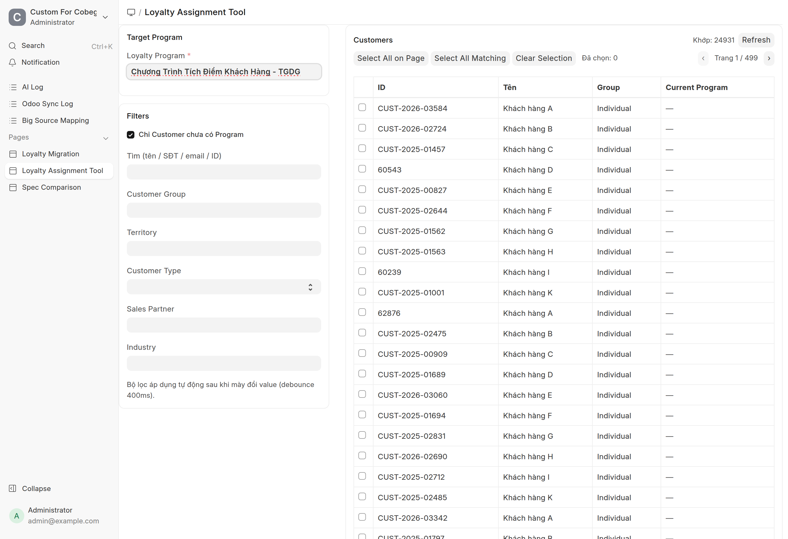
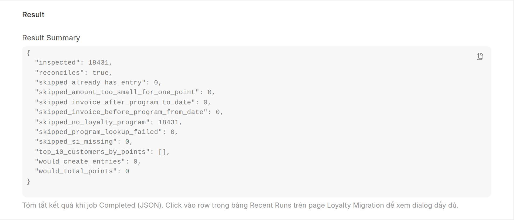
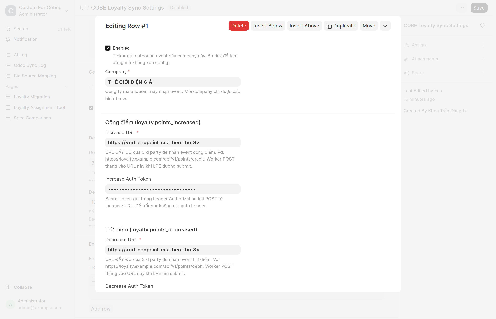
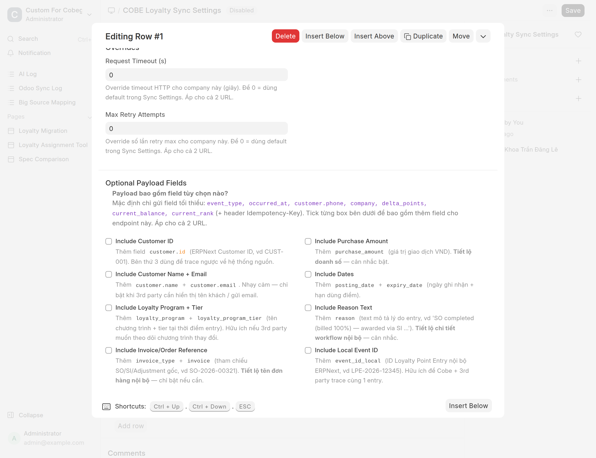

# COBE Loyalty — Tổng quan & vận hành

Tài liệu đầu-đến-cuối cho hệ thống loyalty xây trên `Loyalty Program` mặc định
của ERPNext. Mô tả phần nào dùng built-in, phần nào custom, cách setup, cách
điểm được cộng/trừ khi vận hành, và cách chạy migrate dữ liệu cũ sau khi
go-live.

Đối tượng: System Manager / Accounts Manager. Mọi đường dẫn nằm trong
`apps/custom_for_cobegroup/custom_for_cobegroup/custom_for_cobegroup/`.

## 📚 Bộ tài liệu Loyalty — đọc cái nào?

| Bạn là ai / cần gì | Đọc tài liệu |
|---|---|
| **Nhân viên kinh doanh** — khai người giới thiệu, trả lời khiếu nại "sao không có điểm" | [Loyalty — Hướng dẫn cho Sales](Loyalty-Cho-Sales.html) |
| **Người chạy go-live** — seed điểm cho đơn cũ, bật hệ thống lần đầu | [Loyalty — Seed điểm cho đơn cũ](Loyalty-Seed-Don-Cu.html) |
| **Quản trị hệ thống** — hiểu kiến trúc, đổi rule, xử lý sự cố, đấu nối 3rd party | **Tài liệu này** |

> 🔎 **Đang chuẩn bị go-live?** Đi thẳng tới
> [Phụ lục — Checklist go-live](Loyalty-Seed-Don-Cu.html#phụ-lục--checklist-go-live-đợt-072026),
> nó có bảng số kỳ vọng đo trên dữ liệu thật để đối chiếu từng bước.


---

## 1. Mô hình tư duy

| Mảng | Nguồn | Doctype liên quan |
|---|---|---|
| Tỉ lệ tích điểm (VND → điểm), hạng (tier), hạn dùng điểm | **ERPNext built-in** | `Loyalty Program`, `Loyalty Program Collection`, `Loyalty Point Entry` |
| Cấu hình thưởng giới thiệu theo từng company | Custom | `COBE Loyalty Settings` (Single) + `COBE Loyalty Settings Company` (child) |
| Cộng/trừ điểm thủ công (VIP seed, sửa sai, thưởng sự kiện) | Custom | `COBE Loyalty Adjustment` (submittable, có audit) |
| Logic trigger tích điểm (SI / SO / referral) | Custom hooks | `loyalty/sales_invoice_handlers.py` (đăng ký qua `hooks.py` doc_events) |
| Migrate dữ liệu lịch sử | Custom migration | Page `loyalty-migration` + `COBE Loyalty Migration Run` (log job) + `loyalty/api/*` |
| Outbound event lên 3rd party (mỗi lần điểm thay đổi) | Custom async queue | `COBE Loyalty Event` (queue) + `COBE Loyalty Sync Settings` (Single) + `loyalty/emitter.py` + `loyalty/sync_worker.py` |

> Tỉ lệ tích điểm (VND → điểm) và rule tier **luôn** nằm ở `Loyalty Program`.
> `COBE Loyalty Settings` **chỉ** chứa rule thưởng giới thiệu. Không config
> trùng ở 2 nơi.

---

## 1.1. Master switch — feature flag để rollout an toàn

Toàn bộ phần **AWARD điểm tự động** (SO complete, SI cash, referral) được
gate bởi 2 cấp switch trong `COBE Loyalty Settings`:

| Switch | Default | Tắt = |
|---|---|---|
| `enabled` (Master, Single) | **OFF** | Mọi SI submit không tích điểm. Hook `before_submit` set `dont_create_loyalty_points=1` cho TẤT CẢ SI → chặn cả built-in ERPNext. Khách bị return/cancel SI vẫn được reverse (chỉ chặn FORWARD award). |
| `enabled` (per-company row) | **OFF** | Riêng company đó không award (SO + SI cash + referral). Company khác không ảnh hưởng. Phải bật cả Master + row của company thì mới award. |

> Default OFF khi deploy mới — ZERO RISK. Admin tự bật từng cấp khi sẵn sàng.

**Các đường KHÔNG bị chặn bởi switch** (vẫn chạy ngay cả khi Master OFF):
- `COBE Loyalty Adjustment` thủ công (Add/Deduct)
- `Set VIP Tier` button trên Customer form
- Backfill / VIP Seed CSV qua page Loyalty Migration
- Reverse khi cancel/return SI (giữ audit trail)
- Outbound 3rd party event — gate bởi `Sync Settings.enabled` riêng

Workflow rollout production an toàn xem [§2.1](#21-workflow-rollout-production).

---

## 2. Checklist setup (làm trước khi bật tính năng)

1. **Tạo 1 Loyalty Program cho mỗi Company** (hoặc 1 program dùng chung —
   để trống field `company` — nếu cả 3 company có rule giống nhau).
   - Set `from_date` (để trống `to_date` cho program đang chạy).
   - Thêm ít nhất 1 row vào `Collection Rules`: `min_spent = 0`,
     `collection_factor` = "bao nhiêu VND đổi 1 điểm", và tên tier.
   - Set `expiry_duration` (tính bằng ngày). Để trống / 0 = "không hết hạn" →
     code sẽ default 10 năm khi tạo entry. Tốt nhất là set rõ ràng để tránh
     bất ngờ.

2. **Gán Loyalty Program cho từng Customer**.
   - Cách 1 (khuyên dùng): mở form Loyalty Program → menu **Actions → Assign
     to Customers** → mở page Loyalty Assignment Tool với filter + table chọn
     khách. Chi tiết: [§2.2](#22-loyalty-assignment-tool--bulk-gán-program-cho-customer).
   - Cách 2: Customer list → filter → tick → Actions → Edit → set field
     `Loyalty Program` (Frappe built-in Bulk Edit, ~500 row/lần).
   - Cách 3: Data Import → `Customer`, `Update Existing Records`, upload CSV
     2 cột `ID` + `Loyalty Program`.
   - Customer không có Loyalty Program sẽ **bị skip không cộng điểm** (đây là
     thiết kế cố ý — không báo lỗi).

3. **Cấu hình thưởng giới thiệu** trong `COBE Loyalty Settings`:
   - 1 row / company. Tick/bỏ tick `enabled` để bật/tắt referral cho từng
     company mà không cần xoá config.
   - `referral_conversion_factor` (VND/điểm) — **bắt buộc khi enabled**.
     Công thức: `điểm = floor(SI.grand_total / referral_conversion_factor)`.
     Vd: factor = 50,000 → SI 5tr → 100 điểm cho referrer.
     (Hệ số này độc lập với `collection_factor` của Loyalty Program — set
     riêng tuỳ chính sách thưởng giới thiệu.)
   - `referral_max_points` — cap điểm tối đa cho 1 lượt giới thiệu (0 = không cap).
   - `referral_min_invoice_amount` — ngưỡng SI tối thiểu để qualify (0 = không có ngưỡng).

4. **Phân quyền (Roles)**:
   - `System Manager` / `Accounts Manager` được tạo/submit/cancel
     `COBE Loyalty Adjustment` và chạy migration.
   - `Sales Master Manager` đọc/sửa `COBE Loyalty Settings`.
   - Chỉ `System Manager` được chạy **Reset** migration và **Apply** lead
     source fix (vì là các thao tác phá huỷ data).

5. **Restart** sau khi deploy:
   ```
   bench --site <site> migrate
   bench build
   bench --site <site> clear-cache
   bench restart
   ```

---

## 2.1. Workflow rollout production

Mỗi lần deploy production (hoặc rollout cho company mới):

```
Bước 1: bench migrate + restart
        → Master OFF, mọi company OFF, Sync OFF (default)
        → SI submit bình thường, KHÔNG tích điểm, KHÔNG báo 3rd party
        → ZERO RISK ngay sau deploy

Bước 2: Setup config
        - Tạo / gán Loyalty Program cho 1-2 customer test
        - Vào COBE Loyalty Settings → tick Master `enabled`
        - Tick row company test (`enabled = 1`)

Bước 3: Test award (offline với 3rd party)
        - Submit SI test với customer test trong company test
        - Verify LPE +N được tạo trong Loyalty Point Entry list
        - Cancel SI test, verify LPE -N bù trừ

Bước 4: Test outbound (riêng)
        - Vào COBE Loyalty Sync Settings → tick Sync Enabled
        - Thêm endpoint test cho company test trong Endpoints table
        - Submit SI mới, verify Event được POST tới 3rd party staging
          (xem COBE Loyalty Event list, status=Sent + response)

Bước 5: Rollout từng company production
        - Bật từng row company trong COBE Loyalty Settings
        - Thêm endpoint production cho từng row trong Sync Settings
        - Theo dõi Error Log + COBE Loyalty Event list

Bước EMERGENCY: phát hiện bug nghiêm trọng
        - Tắt Master `enabled` → toàn bộ award stop ngay lập tức
        - Hoặc tắt Sync Settings.enabled → ngắt outbound (giữ award local)
```

---

## 2.2. Loyalty Assignment Tool — bulk gán program cho Customer

UX kiểu Shift Assignment Tool: filter + bảng khách bên dưới, tick chọn, gán
một lượt.

**Mở tool**: Form **Loyalty Program** đang xem → menu **Actions → Assign to
Customers** (chỉ hiện cho System Manager + Sales Manager).

Hoặc vào trực tiếp `/app/loyalty-assignment-tool` rồi chọn program ở field
*Target Program*.



Số **"Khớp: N"** ở góc phải là tổng customer thoả bộ lọc (toàn bộ, không phải
riêng trang hiện tại) — dùng nó để biết `Select All Matching` sẽ chọn bao nhiêu.

### Bố cục

- **Bên trái — Target Program**: program sẽ được gán (đã preselect nếu mở từ
  form Loyalty Program).
- **Bên trái — Filters**:
  - `Chỉ Customer chưa có Program` (Check, default ✓) — an toàn cho lần seed
    đầu. Tắt nếu muốn ghi đè program cũ.
  - `Tìm (tên / SĐT / email / ID)` — search text.
  - `Customer Group`, `Territory`, `Customer Type`, `Sales Partner`,
    `Industry` — filter advanced. Bộ lọc auto reload sau 400ms khi đổi giá trị.

    > Trước đây tool có thêm filter *Default Company*. Đã **gỡ** — `Customer`
    > không hề có field `default_company` (chỉ có `represents_company`, mang
    > nghĩa khác hẳn), nên filter đó làm cả trang crash với lỗi
    > `Unknown column 'default_company'`.
- **Bên phải — Customer table**: hiển thị danh sách khớp, cột Current Program
  được highlight:
  - `—` (xám) = chưa có
  - `✓ <tên>` (xanh) = đã ở program đích → bị skip
  - `⚠ <tên>` (cam) = đang ở program khác → skip mặc định trừ khi bật Override
- **Selection controls**:
  - `Select All on Page` — tick toàn bộ trang hiện tại
  - `Select All Matching` — fetch full list (qua API, có confirm nếu > 2000)
  - `Clear Selection` — bỏ chọn

### Apply

Dưới bảng có:
- `Override customer đã ở program khác` (Check, default ✗) — bật khi cần ghi
  đè.
- Button **Assign to Selected** → confirm → POST → modal kết quả:

  | Counter | Ý nghĩa |
  |---|---|
  | Updated | Số customer đã gán thành công |
  | Skipped (đã ở program đích) | Customer đã ở `loyalty_program = target` |
  | Skipped (program khác, override OFF) | Customer đang ở program khác và mày không bật override |
  | Not found | Tên customer không còn trong DB (hiếm — race condition) |

### Lưu ý

- Backend (`loyalty/api/assignment_tool.py`) cũng check role — không bypass
  được qua REST trực tiếp.
- `frappe.db.set_value(... update_modified=True)` → có cập nhật `modified` +
  `modified_by` để audit.
- Tool **KHÔNG** tạo Loyalty Point Entry — chỉ set field `loyalty_program`.
  Điểm sẽ tự cộng khi customer có giao dịch tiếp theo (xem §3a/3b).
- Để seed luôn điểm khởi tạo (đẩy customer lên tier ngay), dùng §3g Set VIP
  Tier sau khi gán program.

---

## 3. Hành vi vận hành — điểm được cộng/trừ khi nào

### 3a. Sales Invoice có Sales Order

1. Hook `before_submit` phát hiện `SI.items[*].sales_order` có giá trị → set
   `dont_create_loyalty_points = 1` trên SI. Built-in skip tích điểm.
2. Hook `on_submit` reload từng SO được tham chiếu và kiểm tra `per_billed`.
   - Chỉ khi (và chỉ khi) SO đạt `per_billed = 100`, tạo **1** `Loyalty Point Entry`:
     - `invoice_type = "Sales Order"`, `invoice = <tên SO>`
     - `loyalty_points = SO.grand_total / collection_factor`
   - Idempotent: SI thứ 2 của cùng SO sẽ thấy entry đã có và skip.

### 3b. Sales Invoice không có Sales Order (đơn cash)

- Hành vi mặc định ERPNext. 1 `Loyalty Point Entry` cho mỗi lần submit SI,
  `invoice_type = "Sales Invoice"`, `invoice = <tên SI>`. Code custom không
  can thiệp case này.

### 3c. Giới thiệu (referral)

#### Tiêu chí để một lượt referral được tính

Một lượt referral **chỉ được phát điểm khi hội đủ TẤT CẢ** các điều kiện sau (thiếu
1 mắt là không tính). Áp dụng như nhau cho cả runtime lẫn backfill đơn cũ:

1. **Người được giới thiệu đã là Customer** — Lead đã convert thành khách
   (`Customer.lead_name` trỏ về Lead gốc). Lead chưa convert → không xét.
2. **Lead mang cờ referral + có người giới thiệu** — Lead có `utm_source ∈
   {Reference, Existing Customer, Khách giới thiệu}` HOẶC cột legacy `source =
   "Existing Customer"`, VÀ `Lead.customer` = người giới thiệu. Tự giới thiệu
   chính mình (referrer = chính khách đó) → bỏ qua.
3. **Khách được giới thiệu có đơn hoàn tất** — tồn tại ít nhất 1 Sales Order đã
   submit đạt **`per_billed = 100`** (đã xuất hoá đơn đủ 100%). Khách chỉ mua
   tiền mặt lẻ / chưa có SO bill đủ → **KHÔNG** phát referral.
4. **Company bật referral** — row của `SI.company` trong `COBE Loyalty Settings`
   có `enabled = 1` và `referral_conversion_factor > 0`.
5. **Qua ngưỡng + ra điểm** — `SO.grand_total ≥ referral_min_invoice_amount` và
   `points = floor(grand_total / referral_conversion_factor) > 0`. Người giới
   thiệu phải đang có `loyalty_program`.

> **Điểm tính thế nào:** lấy **SO hoàn tất ĐẦU TIÊN** của người được giới thiệu →
> `points = floor(SO.grand_total / referral_conversion_factor)` (cap bởi
> `referral_max_points` nếu > 0). Điểm cộng cho **NGƯỜI GIỚI THIỆU**, không phải
> người được giới thiệu. Mỗi khách được giới thiệu chỉ phát **1 lần** (theo đơn
> hoàn tất đầu tiên).

> **Vì sao neo vào `per_billed = 100`:** để khớp đúng luật runtime — referral
> kích hoạt đúng lúc đơn của người-được-giới-thiệu bill đủ 100%. Backfill mô
> phỏng lại y hệt mốc đó cho đơn cũ, nên số liệu hai bên không lệch.

#### Luồng kỹ thuật

Fire ở `Sales Invoice.on_submit` (sau bước SO award ở trên). Quy tắc neo vào
**trọn SO đầu tiên** của khách được giới thiệu, không phải SI đầu — để chính
xác khi 1 SO chia thành nhiều SI thanh toán.

1. Resolve người giới thiệu (`loyalty/referral.py::resolve_referrer` — dùng chung cho
   cả runtime lẫn backfill): `customer.lead_name → Lead → Lead.customer`, với điều kiện
   Lead được đánh dấu là referral qua **`utm_source` ∈ {Reference, Existing Customer,
   Khách giới thiệu}** (field Sales thực sự điền), HOẶC cột legacy `source == "Existing
   Customer"` (dữ liệu do `lead_source_fix` seed từ Odoo). Tự giới thiệu chính mình → bỏ qua.
   Không resolve được → bỏ qua.
2. Đọc `COBE Loyalty Settings` cho `SI.company`. Không có row hoặc `enabled = 0` → bỏ qua.
3. Loop từng SO được SI tham chiếu. Với mỗi SO:
   - SO chưa đạt `per_billed = 100` → bỏ qua.
   - SO này KHÔNG phải SO đầu tiên của customer (sort `transaction_date asc, creation asc`) → bỏ qua.
   - `SO.grand_total < referral_min_invoice_amount` → bỏ qua.
   - Đã có LPE referral cho `(Sales Order, SO name, referrer)` → bỏ qua (idempotent).
4. Tính số điểm: `points = floor(SO.grand_total / referral_conversion_factor)`,
   cap bởi `referral_max_points` (nếu > 0). Tạo `Loyalty Point Entry` cho
   **người giới thiệu**: `invoice_type = "Sales Order"`, `invoice = <tên SO>`,
   `discretionary_reason = "Referral reward — first SO <SO> of referred customer <X>"`.

> SI cash (không tham chiếu SO nào) sẽ KHÔNG trigger referral. Customer phải
> có ít nhất 1 SO đạt `per_billed = 100` mới được tính.

### 3d. Điều chỉnh thủ công

Mở `COBE Loyalty Adjustment`, điền: customer / company / points (luôn số dương)
/ adjustment_type (Add hoặc Deduct) / reason_category / reason. Submit.

- Khi submit: tạo 1 `Loyalty Point Entry`.
- Khi cancel: tạo **1 entry bù trừ** ngược dấu. Entry gốc không bị xoá → giữ
  được lịch sử audit đầy đủ.

Field `purchase_amount` (Currency, default 0) trên Adjustment cho phép cộng
thêm "số tiền tích lũy" — chỉ dùng khi cần đẩy khách lên tier cao (vd seed
VIP). UI "Set VIP Tier" ở §3g tự tính giá trị này, đa số trường hợp khác để 0.

`invoice_type` của entry sẽ là `"COBE Loyalty Adjustment"` và `invoice` là tên
của Adjustment — dễ trace ngược lại nguồn.

### 3e. Cancel Sales Invoice — reverse điểm

Khi SI bị cancel (`Sales Invoice.on_cancel`):

- **Reverse SO award + referral cùng lúc**: với mỗi SO ref, ERPNext đã tự
  tính lại `per_billed`. Nếu `per_billed` tụt dưới 100, code group tất cả LPE
  của SO này theo customer (customer mua + referrer nếu có) → tạo entry âm
  bù trừ net cho từng customer. Entry gốc KHÔNG bị xóa. Idempotent — net ≤ 0
  thì skip.
- **Legacy: reverse referral cũ qua SI**: với referral cũ (đã tạo trước
  refactor 2026-06-05) link qua `invoice_type=Sales Invoice, invoice=<SI này>`
  + customer != si.customer → cộng theo từng referrer, tạo entry âm bù trừ.
- **Event lên 3rd party**: mỗi LPE âm vừa tạo ra sẽ tự emit
  `loyalty.points_decreased` qua hook `Loyalty Point Entry.after_insert` (xem §10).

Entry bù trừ có `discretionary_reason` bắt đầu bằng `[REVERSE]` để dễ filter
trong báo cáo.

### 3f. Sales Invoice return (`is_return=1`)

Return SI = hoàn hàng partial. Khi submit, chạy cùng logic reverse SO như
mục 3e: nếu return làm SO tụt dưới `per_billed=100` thì SO award bị bù trừ.
Logic referral KHÔNG re-trigger cho return SI (return không bao giờ tạo
referral ban đầu).

### 3g. Set VIP tier khi tạo khách mới

Khách mới có thể đã là VIP ngay từ đầu (vd: khách cũ chuyển sang). Mở form
Customer → menu **Loyalty → Set VIP Tier** (chỉ hiện cho `System Manager`
và `Sales Manager`).

Dialog hiển thị:
- **Company** — chọn company (mặc định = Default Company của user).
- **Bảng tier** — fetch từ Loyalty Program của customer + tier hiện tại.
- **Target Tier** — chọn tier mong muốn (Select, options = tier_name).
- **Reason** — tuỳ chọn; để trống → hệ thống auto sinh chuỗi reason.

Khi nhấn **Seed Now**:
1. Resolve Loyalty Program của customer + tier rule có `tier_name == target_tier`.
2. Đọc trạng thái hiện tại qua `get_loyalty_program_details_with_points`
   (tổng `purchase_amount` + tier hiện tại).
3. Tính `needed_spent_delta = max(0, target.min_spent - current_total_spent)`.
4. Tính `points = floor(needed_spent_delta / target.collection_factor)`.
5. Tạo `COBE Loyalty Adjustment` với `reason_category = "VIP Seed"`,
   `purchase_amount = needed_spent_delta`, `points = points`. Submit ngay.

ERPNext re-resolve tier theo SUM(`purchase_amount`) → customer lên tier mong
muốn ngay sau khi submit. Cũng emit `loyalty.points_increased` lên 3rd party
như mọi LPE khác.

> Hoàn tác: mở Adjustment vừa tạo (Loyalty Adjustment list filter
> `reason_category = VIP Seed`) → **Cancel**. Hệ thống tự tạo entry bù trừ
> ngược dấu (cả `points` và `purchase_amount`) → khách rớt lại tier cũ.

---

## 4. Đổi rule Loyalty Program (mà không phá lịch sử)

**Không** sửa trực tiếp collection rules của Loyalty Program đang dùng. Thay vào đó:

1. Mở Loyalty Program đang active → set `to_date` = hôm nay (hoặc ngày cắt mày muốn).
2. Tạo Loyalty Program mới với `from_date` = ngày mai và rule mới.
3. Gán program mới cho customer (theo nhu cầu).

`Loyalty Point Entry` cũ **không bao giờ** được tính lại — nó lưu số điểm tại
thời điểm cộng. Tier hiển thị trên Customer thì recompute từ `Collection Rules`
của program hiện tại vs tổng tích lũy của customer, nên dự kiến tier sẽ shift
khi đổi `min_spent` thresholds; đây là behavior bình thường và là field "live"
duy nhất.

---

## 5. Quy trình migrate (chạy sau khi deploy production)

Mọi action chạy từ page **Loyalty Migration** (`/app/loyalty-migration`, chỉ
System Manager). Chọn Action + Mode, set `Batch Size`, bấm **Enqueue Run**.

Mỗi lần chạy là 1 **background job** (data lớn không bị timeout) và được ghi log
thành 1 record `COBE Loyalty Migration Run` — bảng "Recent Runs" trên page hiển
thị status realtime (Queued → Running → Completed/Failed) kèm bộ đếm tiến độ
processed/total. Bấm vào 1 dòng để xem full kết quả hoặc log lỗi.

`Batch Size` = số record commit mỗi lượt (mặc định 500). Lớn hơn = nhanh hơn
nhưng transaction nặng hơn.

Mỗi action idempotent. **Luôn Dry-run trước Apply**. Chạy theo thứ tự sau:

> ⚠️ **Trước khi Apply** (đặc biệt với backfill SI lịch sử có thể tạo hàng
> ngàn LPE): vào `COBE Loyalty Sync Settings` → **bỏ tick `Emit LPE Events`**.
> LPE được tạo trong lúc backfill sẽ không sinh outbound event (3rd party sẽ
> không nhận dữ liệu lịch sử — đúng ý đồ). Sau khi backfill xong → tick lại.
> Nếu quên tắt: hàng ngàn `COBE Loyalty Event` Pending sẽ bị flush dần lên
> 3rd party qua scheduler.

### 5.1. Lead Source Fix
Sửa `Lead.source` / `Lead.customer` để chain referral resolve đúng.

- **Analyze** — read-only. Báo cáo bao nhiêu Odoo `res_partner` có
  `referral_by` match được với ERPNext, chia theo strategy:
  - `1_custom_name_from_odoo` → `Lead.custom_name_from_odoo == partner.name`
  - `2_phone_field` → Odoo `phone`/`mobile` → ERPNext `mobile_no`/`phone`/`whatsapp_no`
  - `3_phone_from_display_name` → phone trích từ Odoo `display_name`
  - `4_clean_name` → tên đã clean (bỏ SĐT + brand prefixes, lowercase)
  - `5_email`
- **Dry-run** — list per-record các action sẽ làm + sample của từng nhóm:
  `no_lead_match`, `no_referrer_customer_match`, `skip_customer_differs`,
  `set_source_and_customer`, `set_customer_only`.
- **Apply** — ghi `Lead.source` / `Lead.customer`. Không bao giờ đè Lead đang
  có giá trị customer **khác** với referrer. **Trước khi ghi dòng đầu tiên**,
  chụp snapshot (source + customer cũ của mọi Lead sắp đụng) ra file riêng trong
  `private/files` và trả `rollback_file` trong kết quả run — job đứt giữa chừng
  vẫn còn đủ snapshot để hoàn tác. Ghi lại đường dẫn `rollback_file` này.
- **Reset** — hoàn tác lần Apply gần nhất: khôi phục `source` + `customer` của
  từng Lead đã đụng về đúng giá trị cũ (tự lấy snapshot mới nhất theo thời gian,
  hoặc chỉ định `file_url`). Vì ghi đè `source` là mất giá trị cũ, **đây là công
  cụ duy nhất** đưa Lead về nguyên trạng — không có snapshot thì không lùi được.
  Reset chỉ sửa metadata Lead, **không đụng điểm**.

### 5.2. Backfill điểm cho Sales Invoice cũ
- **Dry-run** — đếm số SI sẽ được tạo Loyalty Point Entry, tổng điểm,
  top 10 customer có điểm nhiều nhất. Trên ~18.400 hoá đơn mất ~30 giây.
- **Apply** — tạo 1 `Loyalty Point Entry` cho mỗi SI đủ điều kiện. Mỗi entry
  có `discretionary_reason` chứa marker `[MIGRATED:SI:<tên SI>]`.
- **Reset Migrated** — xoá **chỉ** các entry có marker. Dùng khi mày muốn đổi
  config rồi chạy lại.

**Đọc kết quả** — mỗi SI rơi vào đúng 1 rổ, và `reconciles` phải là `true`:



| Rổ | Nguyên nhân | Cách sửa |
|---|---|---|
| `would_create_entries` | sẽ tạo entry | — |
| `skipped_already_has_entry` | đã seed rồi | bình thường khi chạy lại |
| `skipped_no_loyalty_program` | `Customer.loyalty_program` trống | Assignment Tool (§2.2) |
| `skipped_invoice_before_program_from_date` | `posting_date` < `Loyalty Program.from_date` | lùi `from_date` |
| `skipped_invoice_after_program_to_date` | `posting_date` > `to_date` | nới/xoá `to_date` |
| `skipped_program_lookup_failed` | ERPNext không resolve được program | soi Error Log |
| `skipped_amount_too_small_for_one_point` | `eligible / collection_factor` < 1 | bình thường |
| `skipped_si_missing` | SI biến mất giữa chừng | hiếm, race condition |

> ⚠️ **Hai rổ đầu tiên rất dễ nhầm nhau.** `skipped_no_loyalty_program` là
> *chưa gán khách*; `skipped_invoice_before_program_from_date` là *sai khoảng
> ngày*. Đo trên dữ liệu Cobe: gán đủ program nhưng để `from_date=2026-06-01`
> thì **14.658/18.431** hoá đơn rơi vào rổ thứ hai — lùi về `2023-01-01` thì
> số entry tạo được nhảy từ **3.611 → 17.526**.

### 5.3. Backfill điểm giới thiệu
- Match logic runtime: chỉ tính các referrer có khách được giới thiệu đã có
  ít nhất 1 SO `per_billed=100`. Customer cash-only (chỉ có SI) bị skip.
- Tính điểm trên `SO.grand_total` của SO sớm nhất (transaction_date asc, creation asc).
- **Dry-run** — đếm số adjustment sẽ tạo, top 10 người giới thiệu.
- **Apply** — tạo 1 `COBE Loyalty Adjustment` đã submit cho mỗi cặp đã resolve
  (reason_category = `Referral Migration`, reason chứa `first_so=<SO name>`).
- **Reset Migrated** — cancel các Adjustment đó. Cancel sẽ tự sinh entry bù
  trừ → số điểm của customer rollback sạch.

Dry-run và Apply dùng **chung một hàm đánh giá** (`_evaluate`) nên preview không
bao giờ lệch kết quả thật, và **Apply cũng trả về đủ các rổ lý do**:

| Rổ | Nguyên nhân | Cách sửa |
|---|---|---|
| `skipped_no_referral_config` | row company trong `COBE Loyalty Settings` chưa `enabled` | tick enabled + set `referral_conversion_factor > 0` |
| `skipped_no_loyalty_program_for_referrer` | **người giới thiệu** chưa có program | Assignment Tool |
| `skipped_below_min_invoice` | SO đầu < `referral_min_invoice_amount` | hạ ngưỡng nếu muốn |
| `skipped_amount_too_small_for_one_point` | `grand_total / factor` < 1 | bình thường |
| `skipped_already_migrated` | đã seed cặp này rồi | bình thường khi chạy lại |

> 🔎 **Resolver người giới thiệu** (`loyalty/referral.py`) nhận **cả hai** tín
> hiệu: `Lead.utm_source ∈ {Reference, Existing Customer, Khách giới thiệu}`
> **hoặc** cột legacy `Lead.source == 'Existing Customer'`. Thực tế Sales khai
> bằng `utm_source = Reference`; cột `source` chỉ còn là **cột DB mồ côi** do
> ERPNext đã gỡ field đó khỏi DocType, và chỉ `lead_source_fix` (migrate từ
> Odoo) còn ghi vào. Code cũ chỉ đọc `source` nên bắt đúng **1/669** ca.

### 5.4. Seed VIP
- Upload file CSV có header.
- Cột bắt buộc: `customer`, `points`, `reason`.
- Cột tùy chọn: `adjustment_type` (default `Add`), `expiry_date` (YYYY-MM-DD),
  `company`, `loyalty_program` (fallback theo program của customer).
- **Thứ tự fallback của `company`** khi dòng CSV bỏ trống:
  `Party Account` của customer → **company của Loyalty Program** → default của
  session. Không resolve được thì **báo lỗi dòng đó**, không đoán bừa.

  > Trên site Cobe bảng `Party Account` **rỗng hoàn toàn**, nên nhánh thứ hai
  > (company của Loyalty Program) mới là nhánh thực sự được dùng. Trước đây
  > code nhảy thẳng vào default của session ⇒ company của phiếu phụ thuộc vào
  > **ai bấm chạy job**. Cứ điền sẵn cột `company` trong CSV cho chắc.
- Mỗi row → 1 `COBE Loyalty Adjustment` được submit, reason_category = `VIP Seed`.

**Tip lặp lại**: nếu dry-run cho ra số không ưng ý, đổi `collection_factor`
của Loyalty Program / `referral_conversion_factor` của settings → Reset → Apply lại.

---

## 6. Tác vụ vận hành thường gặp

| Việc | Cách làm |
|---|---|
| Tặng N điểm thưởng cho 1 customer | Tạo `COBE Loyalty Adjustment` mới, type Add, reason_category `Event Bonus` hoặc `Other`. |
| Trừ điểm (refund nhầm / phạt) | Như trên, chọn type Deduct. |
| Hủy 1 adjustment đã sai | Mở Adjustment → Cancel. Hệ thống tự tạo entry bù trừ. |
| Tạm tắt referral cho 1 company | `COBE Loyalty Settings` → bỏ tick `enabled` ở row của company đó. |
| Xem 1 `Loyalty Point Entry` đến từ đâu | Nhìn `invoice_type` + `invoice`. `Sales Invoice` = đơn cash, `Sales Order` = SO complete, `COBE Loyalty Adjustment` = manual, `Sales Invoice` cho 1 *referrer* (đối chiếu field `customer` với customer của SI). |
| Reset toàn bộ điểm đã migrate để chạy lại | Page Loyalty Migration → chạy Reset cho từng action, **theo thứ tự ngược**: Referral Backfill trước, rồi SI Backfill. |

---

## 7. Lưu ý quan trọng (Gotchas)

- **Customer không có Loyalty Program** sẽ không tích điểm và không báo lỗi.
  Đây là thiết kế cố ý — nhưng nếu mày thấy "tại sao không có điểm?" thì cách
  fix là gán program, không phải debug hook.
- **Field `Lead.source` vs `utm_source`** — bẫy đã từng làm referral sót ~99,8%:
  ERPNext đời mới đã **gỡ field `source` khỏi DocType Lead** (chỉ còn lại cột DB mồ côi,
  đọc được nhưng không sửa được từ form); `utm_source` (Link → UTM Source, label hiển thị
  là "Source") là field thay thế mà Sales thực sự điền. Ô **"From Customer"**
  (`Lead.customer`) hiện ra nhờ **Property Setter** `Lead-customer-depends_on` =
  `eval:doc.utm_source == 'Existing Customer' || doc.utm_source == 'Reference'` — nên
  **phải đọc runtime meta (`frappe.get_meta`), đọc thẳng `tabDocField` sẽ ra kết luận sai**.
  Từ 22/07/2026 code đọc **cả hai** field (xem §3c). Property Setter này chưa nằm trong
  `fixtures` — dựng site mới nhớ tạo lại.
- **Match theo thứ tự**; cái match đầu tiên thắng. Nếu strategy 4 (clean name)
  trùng tên giữa 2 customer khác nhau, cái nào được index trước sẽ thắng. Output
  sample của Dry-run là công cụ để mày soi case kiểu này.
- **Nhiều SI cho 1 SO**: theo thiết kế, điểm chỉ cộng 1 lần khi SO đạt
  `per_billed = 100`, không phải mỗi SI. Nếu SO bị over-billed hoặc có return
  làm `per_billed` xuống dưới 100 sau khi đã cộng điểm, **entry đã cộng không
  tự động rollback** — phải dùng `COBE Loyalty Adjustment` để sửa tay.
- **Hook fail không chặn submit SI**. SO award và referral award đều được bọc
  trong `try/except` → lỗi vào Error Log (`frappe.log_error`) và SI vẫn submit
  được. Nếu thiếu điểm bất thường, check Error Log.

---

## 8. Sơ đồ file

```
custom_for_cobegroup/custom_for_cobegroup/custom_for_cobegroup/
├── doctype/
│   ├── cobe_loyalty_settings/                  # Single (cấu hình referral)
│   ├── cobe_loyalty_settings_company/          # Child table (referral per company)
│   ├── cobe_loyalty_adjustment/                # Submittable (cộng/trừ điểm thủ công)
│   ├── cobe_loyalty_migration_run/             # 1 record / lần chạy migration
│   ├── cobe_loyalty_sync_settings/             # Single (cấu hình outbound 3rd party — general + endpoints)
│   ├── cobe_loyalty_sync_endpoint/             # Child table (endpoint 3rd party per company)
│   └── cobe_loyalty_event/                     # Queue 1 record / 1 event outbound
├── page/
│   ├── loyalty_migration/                      # Page admin để chạy migration
│   └── loyalty_assignment_tool/                # Page bulk gán program cho Customer
└── loyalty/
    ├── sales_invoice_handlers.py               # hook SI before_submit/on_submit/on_cancel
    ├── emitter.py                              # hook LPE.after_insert → tạo COBE Loyalty Event
    ├── sync_worker.py                          # scheduler all: gửi event Pending lên 3rd party
    ├── odoo_matcher.py                         # matcher 5 chiến lược
    └── api/
        ├── migration_runner.py                 # orchestrator enqueue + background job
        ├── lead_source_fix.py                  # analyze / dry_run / apply
        ├── backfill_si.py                      # dry_run / apply / reset
        ├── backfill_referral.py                # dry_run / apply / reset
        ├── seed_vip_csv.py                     # run (upload CSV)
        ├── vip_tier.py                         # get_tier_options + seed_vip_tier (button trên Customer)
        └── assignment_tool.py                  # get_customers + bulk_assign (page Loyalty Assignment Tool)
```

Đăng ký hook: `hooks.py` → `doc_events["Sales Invoice"]`.

Entry point migration (whitelisted, System Manager): `migration_runner.py` →
`enqueue_migration`, `get_runs`, `get_run_detail`, `get_action_modes`. Các
module theo từng action là hàm thường, được background job gọi, không whitelist
trực tiếp.

---

## 9. Webhook — tra điểm loyalty theo SĐT

Endpoint cho Zalo mini app (và tích hợp tương tự) nằm trong
`zalo_miniapp/api.py`, hàm `get_loyalty_points(phone)`.

- **Method**: `custom_for_cobegroup.custom_for_cobegroup.zalo_miniapp.api.get_loyalty_points`
- **Xác thực**: giống các endpoint Zalo khác — header `X-Api-Key` /
  `X-Api-Secret` cộng allow-list IP/domain, tất cả cấu hình trong
  `Zalo Miniapp Settings`.
- **Input**: `phone` (chấp nhận `0xxx`, `+84xxx`, `84xxx`).
- **Resolve**: reuse `find_customers_by_phone` (Customer.mobile_no → Lead →
  Contact). 1 SĐT có thể khớp nhiều customer.
- **Output**: breakdown theo từng cặp (customer, company) — không có tổng gộp.
  Số điểm là điểm khả dụng (đã trừ điểm hết hạn), tính qua hàm chuẩn
  `get_loyalty_details` của ERPNext.

```json
{
  "phone": "0902537814",
  "items": [
    {"customer": "CUST-001", "company": "COBE A", "points": 8000, "rank": "Gold"},
    {"customer": "CUST-001", "company": "COBE B", "points": 4500, "rank": "Silver"}
  ]
}
```

`items` rỗng nghĩa là SĐT không khớp customer nào, hoặc khớp customer nhưng
chưa có entry điểm. `rank` lấy từ tier của Loyalty Program (ERPNext tự tính
theo điểm vs ngưỡng tier); `null` nếu customer chưa thuộc tier nào.

---

## 10. Outbound event — báo 3rd party mỗi khi điểm thay đổi

Mỗi `Loyalty Point Entry` khi được tạo (built-in award, SO/referral award,
VIP seed, manual adjustment, return/cancel compensation) đều phát **đúng 1**
event lên hệ thống bên ngoài:

- `loyalty.points_increased` — khi `LPE.loyalty_points > 0`
- `loyalty.points_decreased` — khi `LPE.loyalty_points < 0`

### 10a. Kiến trúc

- Hook `Loyalty Point Entry.after_insert` → `loyalty/emitter.py::emit_lpe_event`
  → tạo 1 record `COBE Loyalty Event` (status=Pending, ghi `company` + `event_type` lấy từ LPE).
  (LPE không phải doctype submittable — chỉ được insert — nên emit chạy ở `after_insert`, không phải `on_submit`.)
- Scheduler `all` (~4 phút/lần) → `loyalty/sync_worker.py::flush_pending_events`:
  1. Pick các event `Pending` + `Failed` chưa quá `max_retry_attempts`.
  2. Với mỗi event: resolve endpoint theo `(event.company, event.event_type)`
     qua `get_endpoint_for_event()` — chọn URL + token tương ứng:
     - `loyalty.points_increased` → `url_increase` + `auth_token_increase`
     - `loyalty.points_decreased` → `url_decrease` + `auth_token_decrease`
  3. Không tìm thấy endpoint enabled (hoặc URL trống cho hướng đó) → mark `Skipped` (không retry).
  4. POST thẳng vào URL với headers:
     - `Idempotency-Key: <event_id>`
     - `Authorization: Bearer <token>` (nếu có)
- Backoff khi fail: 1m, 5m, 30m, 2h, 12h, 24h, 24h… đến `max_retry_attempts`
  của endpoint thì mark `Failed` vĩnh viễn.

> Mỗi company có **2 URL riêng** (1 cộng + 1 trừ) — vì 3rd party thiết kế 2
> endpoint khác nhau cho 2 chiều. 3 company → 6 URL độc lập, retry/timeout
> độc lập, payload includes chung.

### 10b. Cấu hình — `COBE Loyalty Sync Settings` (Single)

Mỗi company có 2 endpoint 3rd party RIÊNG: 1 cho cộng điểm, 1 cho trừ điểm.

**General** (toàn cục):

| Field | Ý nghĩa |
|---|---|
| `enabled` | Master switch toàn bộ outbound. Tắt = ngừng gửi tất cả company. |
| `event_emit_enabled` | Tắt riêng phần emit. Tắt khi chưa muốn báo 3rd party. |
| `request_timeout_seconds` | Default timeout HTTP (giây), default 30. Endpoint row có thể override. |
| `max_retry_attempts` | Default số lần thử tối đa, default 10. Endpoint row có thể override. |

> ⚠️ `enabled` và `event_emit_enabled` là **AND**, không phải OR. Tắt bất kỳ
> cái nào ⇒ không có event nào được sinh ra. Đây là cách tắt an toàn khi seed.

**Endpoints** (child table — 1 row / company). Lưới chỉ hiện vài cột, bấm bút
chì ✏️ để mở đầy đủ — phần đầu là 2 URL + 2 token:



Kéo tiếp xuống cuối dialog là nhóm **Optional Payload Fields**:



| Field | Ý nghĩa |
|---|---|
| `enabled` | Tick = gửi event của company này. Bỏ tick = tạm dừng. |
| `company` | Company nào dùng endpoint này (Link Company). Unique trong table. |
| `url_increase` | URL ĐẦY ĐỦ cho event `loyalty.points_increased`. Vd `https://loyalty.companyA.com/api/v1/points/credit`. Bắt buộc khi enabled. |
| `auth_token_increase` | Bearer token gửi kèm khi POST tới `url_increase`. Để trống = không gửi auth header. |
| `url_decrease` | URL ĐẦY ĐỦ cho event `loyalty.points_decreased`. Vd `https://loyalty.companyA.com/api/v1/points/debit`. Bắt buộc khi enabled. |
| `auth_token_decrease` | Bearer token gửi kèm khi POST tới `url_decrease`. Có thể giống `auth_token_increase` nếu 3rd party dùng chung. |
| `request_timeout_seconds` | Override timeout cho company này (áp cho cả 2 URL). 0 = lấy default. |
| `max_retry_attempts` | Override max retry cho company này (áp cho cả 2 URL). 0 = lấy default. |

> Event của company KHÔNG có row enabled (hoặc URL của chiều đó trống) sẽ
> bị mark `Skipped` ngay khi worker pick lên — không retry. Operator có thể
> đổi `status` về `Pending` thủ công nếu config sau đó.

**Optional Payload Fields** (per endpoint, mặc định TẮT hết):

Mặc định outbound payload chỉ chứa field tối thiểu để bảo vệ thông tin nhạy
cảm: `event_type, occurred_at, customer.phone, company, delta_points,
current_balance, current_rank`. Mỗi flag dưới đây thêm 1 nhóm field vào
payload, áp riêng cho endpoint này (company khác không bị ảnh hưởng):

| Flag | Field thêm vào payload | Cân nhắc |
|---|---|---|
| `include_customer_id` | `customer.id` | ID Customer nội bộ. |
| `include_customer_pii` | `customer.name`, `customer.email` | **PII** — chỉ bật khi 3rd party cần hiển thị/gửi email. |
| `include_loyalty_program` | `loyalty_program`, `loyalty_program_tier` | Tên chương trình + tier tại entry. |
| `include_invoice_ref` | `invoice_type`, `invoice` | **Tên đơn nội bộ** (vd `SO-2026-00321`). |
| `include_purchase_amount` | `purchase_amount` | **Doanh số giao dịch** (VND). |
| `include_dates` | `posting_date`, `expiry_date` | Ngày ghi nhận + hạn dùng điểm. |
| `include_reason` | `reason` | Chi tiết workflow nội bộ. |
| `include_local_id` | `event_id_local` | ID LPE nội bộ. |

> Filter happen ở worker (lúc send), KHÔNG ở emitter. Event row trong DB
> luôn lưu payload đầy đủ → đổi flag bất kỳ lúc nào không cần re-emit; các
> event Pending sau đó sẽ tự dùng flag mới. Event đã Sent không gửi lại.

Spec đầy đủ để gửi cho bên thứ 3: [Loyalty — API tích hợp 3rd party](../tech/Loyalty-3rd-Party-API.md).

### 10c. Payload mẫu

```json
{
  "event_type": "loyalty.points_increased",
  "event_id_local": "LPE-2026-12345",
  "occurred_at": "2026-06-04T10:15:32.123456",
  "customer": {
    "id": "CUST-001",
    "name": "Nguyễn Văn A",
    "phone": "0902537814",
    "email": "a@example.com"
  },
  "company": "COBE A",
  "loyalty_program": "COBE Loyalty A",
  "loyalty_program_tier": "Gold",
  "delta_points": 250,
  "purchase_amount": 5000000,
  "posting_date": "2026-06-04",
  "expiry_date": "2027-06-04",
  "invoice_type": "Sales Order",
  "invoice": "SO-2026-00321",
  "reason": "SO completed (billed 100%) — awarded via SI SI-2026-00500",
  "current_balance": 12750,
  "current_rank": "Gold"
}
```

`current_balance` + `current_rank` là snapshot sau khi LPE này được submit
(tính qua ERPNext `get_loyalty_details`). 3rd party có thể dùng để verify
hoặc bỏ qua tuỳ ý.

### 10d. Vận hành

- **Xem queue**: List view `COBE Loyalty Event`. Standard filter: `status`,
  `company`, `event_type`. Lọc `status=Skipped` để soi các event mất do
  thiếu endpoint config.
- **Flush thủ công**: gọi `flush_pending_events_now` (whitelisted, System Manager)
  hoặc bench console:
  ```python
  bench --site <site> execute custom_for_cobegroup.custom_for_cobegroup.loyalty.sync_worker.flush_pending_events_now
  ```
- **Re-emit 1 event đã `Failed` hoặc `Skipped`**: mở record, đổi `status` về
  `Pending`, clear `next_attempt_at` + `error_log`. Scheduler tick sau sẽ
  pick lại. Nếu Skipped do thiếu endpoint, nhớ cấu hình endpoint trước.
- **Thêm company mới**: vào `COBE Loyalty Sync Settings → Endpoints`, thêm 1
  row mới (company + `url_increase` + `url_decrease` + 2 token tương ứng),
  tick enabled, Save.
- **Đổi endpoint cho 1 company** (vd 3rd party đổi domain): sửa
  `url_increase` và/hoặc `url_decrease` của row tương ứng → Save. Các event
  Pending của company đó sẽ tự đi tới URL mới ở tick scheduler tiếp theo.
  Các event Sent đã xong không gửi lại.
- **Tạm dừng riêng 1 chiều** (vd chỉ tắt trừ điểm): xoá `url_decrease` cho
  row company đó → Save. Event tăng vẫn gửi bình thường; event trừ → Skipped.
- **Tạm tắt 1 company**: bỏ tick `enabled` của row đó. Event của company
  khác KHÔNG bị ảnh hưởng. Các event của company bị tắt sẽ Skipped.
- **Tắt toàn bộ outbound**: vào General → bỏ tick `Sync Enabled`. Worker
  không pick event nào (tất cả nằm Pending chờ bật lại).

### 10e. Trạng thái thực tế — kiểm chứng 22/07/2026

Kết quả chạy thật trên bản sao dữ liệu production. **Đọc trước khi bật sync.**

| Hạng mục | Trạng thái đo được | Việc cần làm |
|---|---|---|
| Đường emit `after_insert` | ✅ **Đã kiểm chứng** — submit 1 Adjustment sinh đúng 1 event `points_increased`, cancel sinh thêm 1 `points_decreased` | — |
| Endpoint 3rd party | 🔴 trả `HTTP 400` — `{"status":0,"message":"Workflow chưa ở trạng thái published."}` | Chờ đối tác publish workflow rồi mới bật `Sync Enabled` |
| Các ô `include_*` | 🟡 **tất cả đang tắt** → payload chỉ có `customer.phone` làm định danh | Tick tối thiểu `Include Customer ID` |
| Độ phủ số điện thoại | 🟡 **20.792 / 24.933** khách có SĐT — **16,6% không có** | Event của nhóm này bay đi với `phone: null` ⇒ bên kia không khớp được |
| `current_rank` | 🟡 luôn `null` vì chương trình đang **Single Tier** | Báo đối tác đừng chờ giá trị này |

> ⛔ **Đừng bật `Sync Enabled` khi endpoint còn trả 4xx.** Worker sẽ retry mỗi
> event theo backoff tới 24h/lần cho đủ `max_retry_attempts` (mặc định 10),
> tạo một đống record `Failed` phải dọn tay. Cứ để `Sync Enabled` tắt — event
> **không mất**, chúng nằm `Pending` chờ mày bật.
