# Tính lương tháng — BHXH/BHYT/BHTN + Thuế TNCN

> Đối tượng: **Payroll Officer** (kế toán phụ trách lương), **System Manager**.
>
> Hệ thống chạy trên **Payroll chuẩn của HRMS** (Salary Structure → Payroll Entry
> → Salary Slip). Phần Cobe bổ sung đúng 2 thứ HRMS không có cho Việt Nam:
> tự trích **BHXH 8% / BHYT 1,5% / BHTN 1%** và **thuế TNCN luỹ tiến từng phần
> theo tháng**. Mọi tỷ lệ, mức trần, giảm trừ, bậc thuế chỉnh được trên UI —
> luật đổi không cần sửa code.

*Ảnh trong bài chụp từ hệ thống thật với 3 nhân viên demo (Nguyễn Văn Demo /
Trần Thị Demo / Lê Văn Demo) — số liệu là số tính thật của máy, không vẽ tay.*

---

## 1. Bức tranh tổng thể

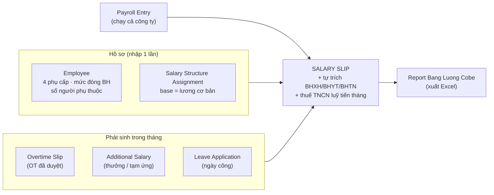

**Ai thấy gì** — dữ liệu lương tách hẳn khỏi HR:

| Vai trò | Quyền |
|---|---|
| **Payroll Officer** | Toàn quyền mọi chứng từ lương + Cobe Payroll Settings + report; đọc-only Employee/Attendance/Leave để chạy lương. |
| **System Manager** | Chỉ phần **cấu hình** (Salary Component, Salary Structure, Cobe Payroll Settings — không chứa tiền cá nhân). KHÔNG mở được phiếu lương/Assignment/Payroll Entry/report; cần vào thật thì tự gán thêm role Payroll Officer (có log). |
| **HR Manager / HR User** | KHÔNG mở được bất kỳ chứng từ lương nào; vẫn quản hồ sơ Employee nhưng mục "Lương & Thuế (Cobe)" bị ẩn. |
| **Nhân viên** | Chỉ xem được phiếu lương **của chính mình** (+ email phiếu lương). |

Gán quyền: mở **User** của người kế toán → thêm role `Payroll Officer`.

---

## 2. Các thành phần — mục đích & ý nghĩa

| Thành phần | Ở đâu | Để làm gì | Ai đụng |
|---|---|---|---|
| **Cobe Payroll Settings** | gõ tên vào Search | Chứa toàn bộ "luật": tỷ lệ BH, trần đóng, giảm trừ gia cảnh, biểu thuế 7 bậc | Kế toán, sửa khi luật đổi |
| **Employee → mục "Lương & Thuế (Cobe)"** (tab Salary) | form Employee | Thông số lương RIÊNG từng người: mức đóng BH, số người phụ thuộc, MST, 4 phụ cấp cố định | Kế toán nhập 1 lần |
| **Salary Structure** | Payroll → Setup | Khung công thức chung: lương cơ bản = `base`, phụ cấp đọc từ ô trên Employee. Đã dựng sẵn 1 khung/công ty, **không cần sửa** | Xem là chính |
| **Salary Structure Assignment** | Payroll | Gán khung + **mức lương cơ bản (Base)** cho từng NV, có ngày hiệu lực → giữ lịch sử tăng lương | Kế toán |
| **Additional Salary** | Payroll | Khoản phát sinh 1 lần: thưởng nóng, trừ tạm ứng | Kế toán |
| **Overtime Slip** | tự sinh từ đơn OT đã duyệt | Đổ tiền OT vào phiếu lương kỳ đó | Máy tự làm |
| **Payroll Entry** | Payroll | "Nút bấm" chạy lương cả công ty: gom NV → sinh loạt Salary Slip | Kế toán, mỗi tháng 1 lần |
| **Salary Slip** | Payroll | Phiếu lương từng người — sản phẩm cuối. Submit = chốt + tự email cho NV | Kế toán duyệt/chốt |
| **Report "Bang Luong Cobe"** | Reports | Bảng lương cả tháng kiểu VN, mỗi khoản 1 cột, xuất Excel | Kế toán |

### 2.1. Cobe Payroll Settings — nơi chứa "luật"

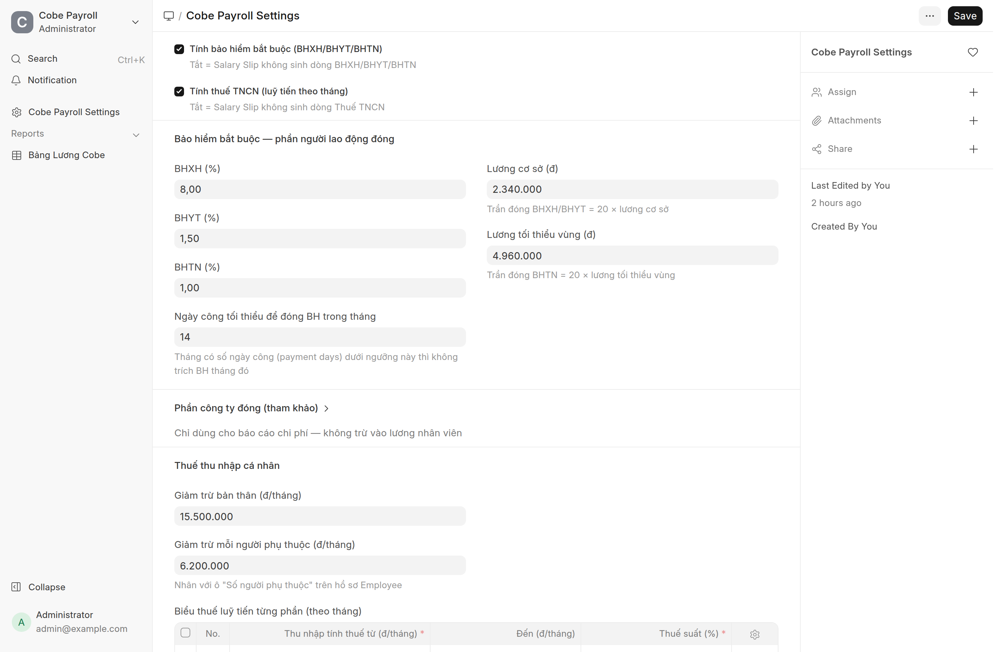

- **2 công tắc tổng**: tắt "Tính bảo hiểm" / "Tính thuế TNCN" thì phiếu lương
  không sinh dòng tương ứng (dùng khi muốn chạy thử hoặc công ty chưa áp dụng).
- **Tỷ lệ NLĐ đóng**: BHXH 8% · BHYT 1,5% · BHTN 1% (mặc định đúng luật).
- **Trần đóng**: BHXH/BHYT tối đa trên 20× lương cơ sở (2.340.000 → trần 46,8tr);
  BHTN tối đa trên 20× lương tối thiểu vùng (4.960.000 → trần 99,2tr).
- **Ngày công tối thiểu 14**: tháng nào NV làm dưới 14 công (vào/nghỉ giữa
  tháng) thì **không trích BH tháng đó** — đúng quy định BHXH.

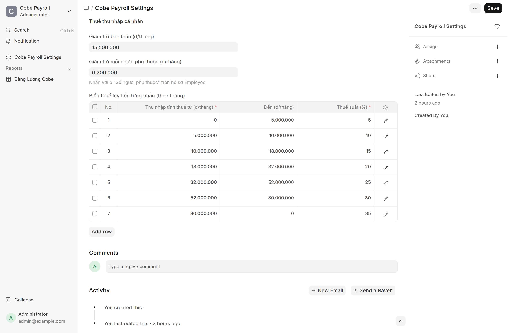

- **Giảm trừ bản thân 15,5tr/tháng + mỗi người phụ thuộc 6,2tr/tháng** (mức áp
  dụng từ kỳ tính thuế 2026).
- **Biểu thuế luỹ tiến từng phần** 7 bậc (5% → 35%): khi Quốc hội đổi biểu thuế,
  kế toán sửa **ngay tại bảng này**, phiếu lương tạo sau đó tự tính theo luật mới.

### 2.2. Hồ sơ lương trên Employee (tab Salary)

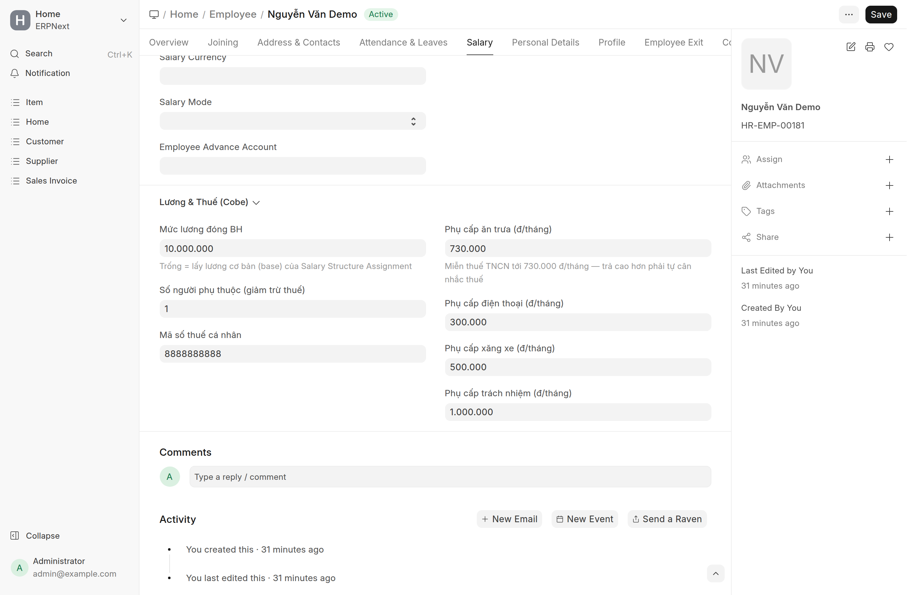

| Ô | Ý nghĩa |
|---|---|
| **Mức lương đóng BH** | Lương làm căn cứ trích BH (thường là lương ghi trên HĐLĐ). **Để trống = lấy đúng Base** của Salary Structure Assignment. |
| **Số người phụ thuộc** | Nhân với 6,2tr để giảm trừ thuế. Nhớ cập nhật khi NV đăng ký thêm/bớt người phụ thuộc. |
| **Mã số thuế cá nhân** | Chỉ để tra cứu / khai thuế, không tham gia tính toán. |
| **4 ô phụ cấp/tháng** | Ăn trưa (**miễn thuế tới 730k** — trả đúng 730k là tối ưu), điện thoại (khoán, miễn thuế), xăng xe + trách nhiệm (**chịu thuế**). Ô nào 0 thì phiếu lương tự ẩn dòng đó. |

> Mục này chỉ người có role **Payroll Officer** (hoặc System Manager) nhìn thấy.
> HR mở đúng form này sẽ **không có** mục "Lương & Thuế (Cobe)" — xem mục 6.

### 2.3. Salary Structure — khung công thức (đã dựng sẵn, chỉ cần hiểu)

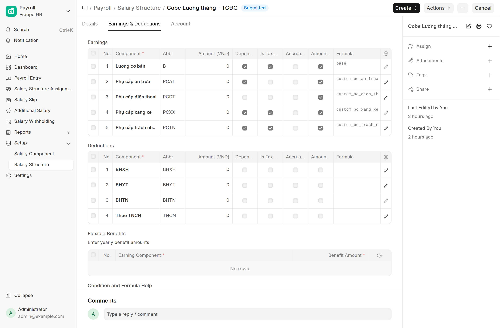

Mỗi công ty có sẵn khung **"Cobe Lương tháng - \<Cty\>"**:

- **Earnings**: `Lương cơ bản = base` (lấy từ Assignment, ✓ theo ngày công);
  4 phụ cấp đọc thẳng từ ô trên Employee (`custom_pc_an_trua`…). Cột
  "Depends on Payment Days" ✓ = khoản đó prorate theo ngày công (ăn trưa, xăng
  xe, trách nhiệm); điện thoại khoán nên không prorate.
- **Deductions**: BHXH/BHYT/BHTN/Thuế TNCN khai sẵn **amount 0** — số thật do
  máy tự tính lúc tạo phiếu (không phải công thức trong khung, nên đừng sửa ở đây).

---

## 3. Chuẩn bị một lần (setup)

1. **Gán role** `Payroll Officer` cho kế toán lương (form User).
2. **Rà Cobe Payroll Settings** — mặc định đã đúng luật 2026, chỉ xem lại.
3. **Nhập hồ sơ lương từng NV** (mục 2.2). Đông người → **Data Import** cho
   Employee với 4 cột phụ cấp + mức BH + số phụ thuộc.
4. **Gán lương**: tạo **Salary Structure Assignment** cho từng NV:

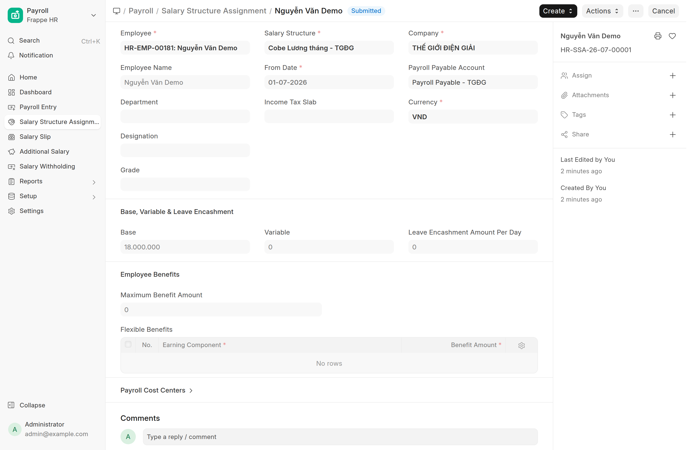

   - Employee + Salary Structure (chọn khung đúng công ty NV)
   - **From Date** = ngày bắt đầu áp dụng (NV cũ → ngày 1 tháng chạy lương đầu tiên; NV mới → ngày vào làm)
   - **Base** = lương cơ bản thoả thuận → **Submit**.
   - Cũng import hàng loạt được (Data Import → Salary Structure Assignment).

---

## 4. Chu trình chạy lương hàng tháng

| Thời điểm | Việc | Ai |
|---|---|---|
| Trước ngày cuối tháng | Duyệt sạch đơn nghỉ + đơn OT còn treo | HR / Manager |
| Ngày 1–3 tháng sau | Chạy Payroll Entry → soát phiếu → chốt | Kế toán |
| Sau khi chốt | Xuất Bảng Lương → đối chiếu → chuyển khoản | Kế toán |

### Bước 1 — Tạo Payroll Entry

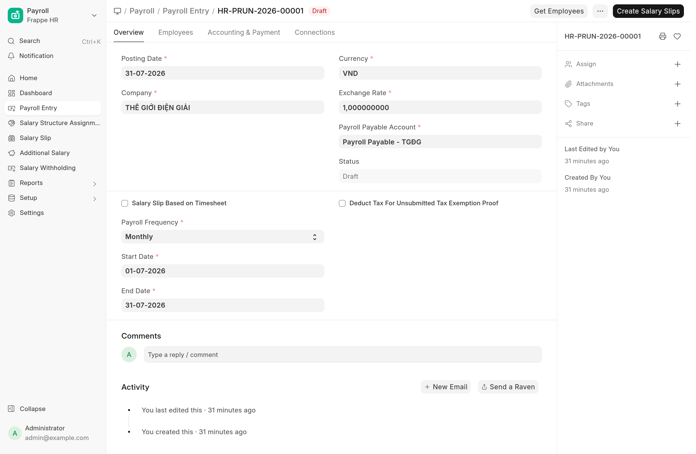

Payroll → **Payroll Entry** → New: chọn Công ty, Payroll Frequency = Monthly,
kỳ lương (01 → cuối tháng). Bấm **Get Employees** — hệ thống gom mọi NV đang có
Assignment hiệu lực. Rồi bấm **Create Salary Slips** → sinh loạt phiếu **Nháp**.

### Bước 2 — Soát vài phiếu

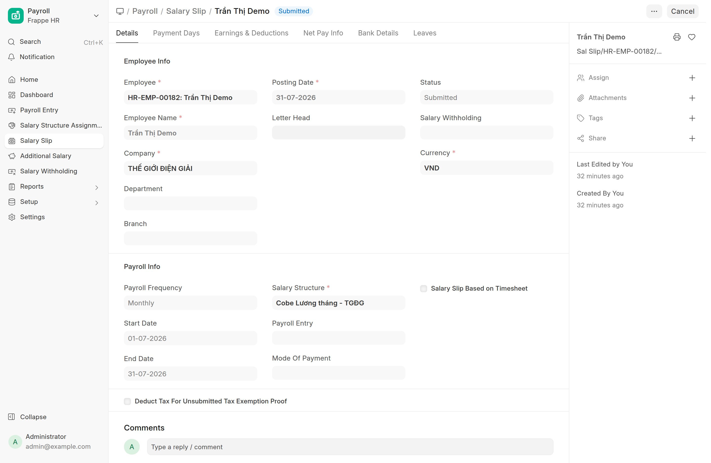

Mở phiếu bất kỳ, tab **Earnings & Deductions**:

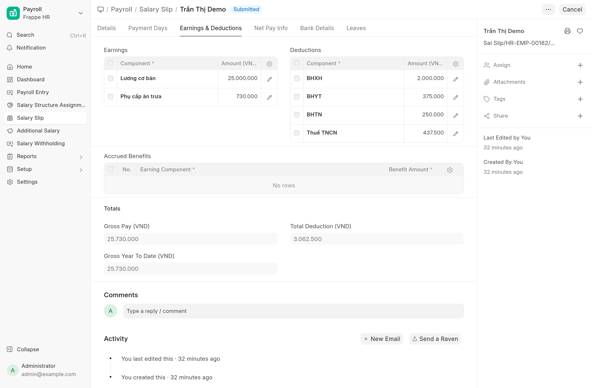

Phiếu demo của *Trần Thị Demo* (base 25tr, ăn trưa 730k, không người phụ thuộc):
máy tự trích BHXH 2.000.000 (8% × 25tr) + BHYT 375.000 + BHTN 250.000, thuế
TNCN 437.500 — đúng luỹ tiến: thu nhập tính thuế = 25tr − 2,625tr BH − 15,5tr
giảm trừ = 6,875tr → 5tr đầu × 5% + 1,875tr × 10%.

Tab **Net Pay Info** xem tổng khấu trừ + **thực lãnh**:

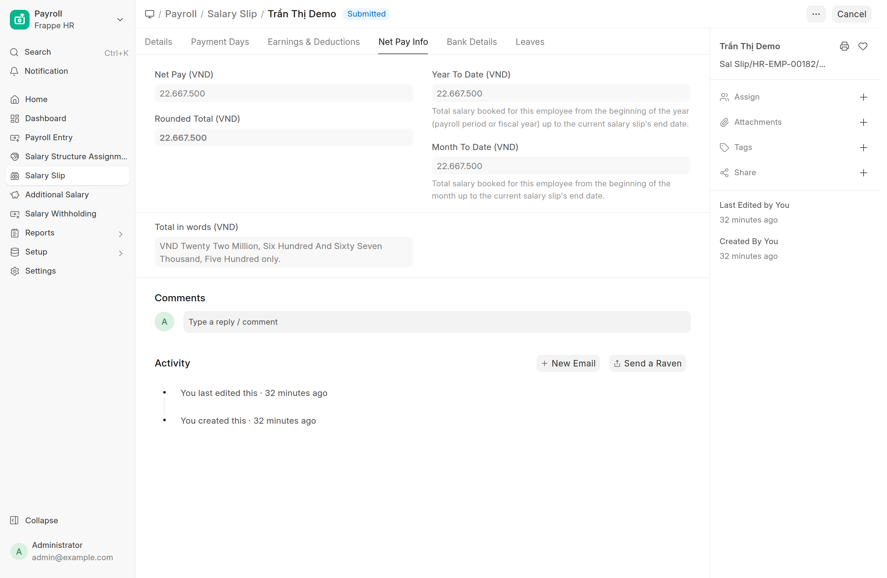

### Bước 3 — Chốt

Quay lại Payroll Entry → **Submit Salary Slips** (hoặc mở từng phiếu Submit).
Chốt xong NV tự nhận **email phiếu lương** và tự xem được phiếu của mình trong
hệ thống.

### Bước 4 — Bảng lương tổng + xuất Excel

Reports → **Bang Luong Cobe**, chọn kỳ + công ty:

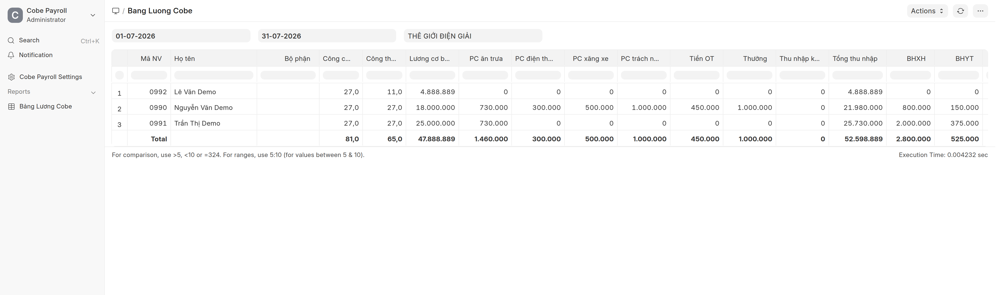

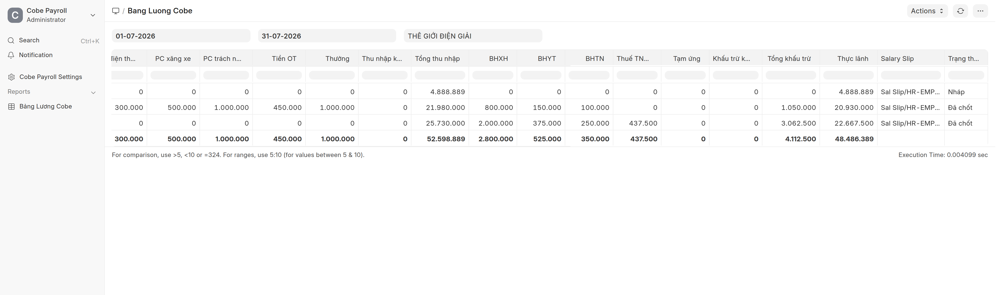

Mỗi khoản 1 cột (công chuẩn/thực, lương CB, từng phụ cấp, OT, thưởng, BH, thuế,
tạm ứng, **Thực lãnh**, trạng thái Nháp/Đã chốt) + dòng **Total**. Menu ⋮ →
Export để ra Excel. Component lạ tự gom vào "Thu nhập khác"/"Khấu trừ khác" nên
thêm khoản mới bảng không vỡ.

---

## 5. Flow từng trường hợp

### 5.1. Nhân viên mới vào làm
1. HR tạo Employee như bình thường (quy trình onboarding cũ).
2. Kế toán điền mục "Lương & Thuế (Cobe)" + tạo Assignment (From Date = ngày vào làm).
3. Hết — kỳ lương tới máy tự prorate theo ngày công. Vào sau ngày 15 (dưới 14
   công) thì tháng đó **tự không trích BH** (phiếu demo *Lê Văn Demo* vào 20/07:
   công 11/27, lương 12tr → nhận 4.888.889, BH = 0, đúng luật).

### 5.2. Tăng lương / đổi phụ cấp
- **Tăng Base**: tạo **Assignment MỚI** với From Date mới — đừng sửa cái cũ
  (mất lịch sử). Phiếu lương lấy Assignment có hiệu lực gần nhất.
- **Đổi phụ cấp**: sửa thẳng ô trên Employee — áp dụng từ phiếu tạo sau đó.

### 5.3. Thưởng nóng / trừ tạm ứng
Payroll → **Additional Salary** → New: chọn NV, component **Thưởng** (hoặc
**Tạm ứng** để trừ), số tiền, **Payroll Date rơi trong kỳ lương muốn gộp** → Submit.

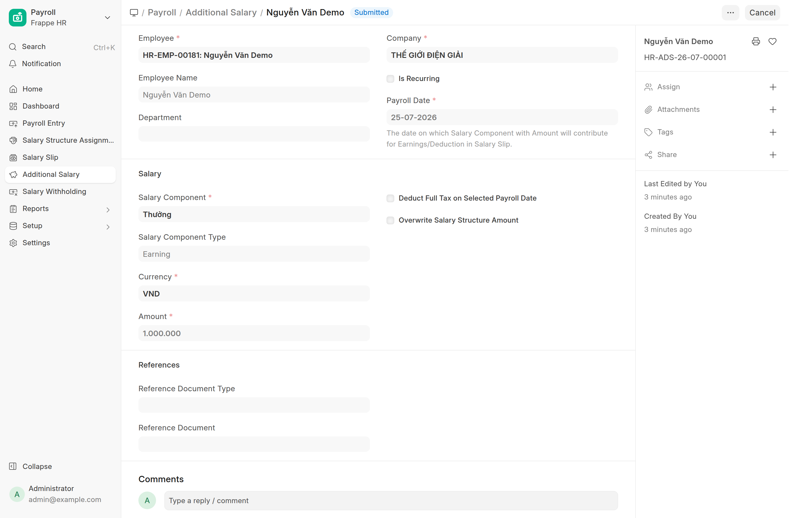

Phiếu lương kỳ đó tự có thêm dòng (demo: *Nguyễn Văn Demo* có Thưởng 1tr + OT
450k đổ vào phiếu tháng 7).

### 5.4. Làm thêm giờ (OT)
Không phải làm gì thủ công: NV khai OT trên my-workspace → duyệt → Overtime
Slip tự sinh tiền theo hệ số (150/200/300%) → tự vào phiếu lương kỳ đó, cột
"Tiền OT" trên bảng lương. *(Chi tiết: xem nhóm tài liệu Overtime.)*

### 5.5. Nghỉ không lương
Chỉ cần đơn nghỉ loại **không lương** được duyệt — ngày công của phiếu tự giảm,
các khoản "theo ngày công" tự prorate. Không sửa tay phiếu.

### 5.6. Nghỉ việc giữa tháng
HR cập nhật Relieving Date → phiếu kỳ cuối tự prorate; dưới 14 công thì không
trích BH tháng đó.

### 5.7. Luật đổi (biểu thuế, lương cơ sở, tỷ lệ BH…)
Kế toán sửa **Cobe Payroll Settings** → phiếu tạo từ đó áp luật mới. Phiếu đã
chốt không bị đụng.

---

## 6. Hành trình 1 phiếu lương (theo chân Trần Thị Demo, kỳ 07/2026)

| # | Ngày | Sự kiện | Chứng từ | Con số |
|---|---|---|---|---|
| 1 | 02/02 | Vào làm, kế toán nhập hồ sơ lương: ăn trưa 730k, 0 người phụ thuộc | Employee | — |
| 2 | 02/02 | Gán lương: Base **25.000.000**, mức đóng BH để trống (= Base) | Assignment (Submit) | 25tr |
| 3 | 01→31/07 | Đi làm đủ, không nghỉ không lương | (Leave/Attendance) | công 27/27 |
| 4 | 31/07 | Kế toán chạy Payroll Entry → Create Salary Slips | Payroll Entry | phiếu Nháp |
| 5 | 31/07 | Máy tính: gross = 25tr + 730k = **25.730.000**; BH = 2.000.000 + 375.000 + 250.000 = **2.625.000**; thu nhập tính thuế = 25tr − 2,625tr − 15,5tr = 6,875tr → thuế **437.500** | Salary Slip | tổng khấu trừ **3.062.500** |
| 6 | 01/08 | Kế toán soát tab Earnings & Deductions → **Submit** | Salary Slip (Đã chốt) | thực lãnh **22.667.500** |
| 7 | 01/08 | Trần Thị Demo nhận email phiếu lương; tự mở xem phiếu của mình (không thấy phiếu ai khác) | — | — |
| 8 | 01/08 | Kế toán mở Bang Luong Cobe → Export Excel → chuyển khoản | Report | dòng "0991" |

> Ghi chú ăn trưa: 730k **không** vào thu nhập chịu thuế (miễn tới 730k/tháng),
> nên thuế tính trên 25tr chứ không phải 25,73tr.

---

## 7. Phân quyền nhìn từ mắt HR (minh hoạ)

HR mở đúng form Employee, tab Salary — **không có** mục "Lương & Thuế (Cobe)":

HR mở danh sách Salary Slip — trống trơn, không thấy phiếu của ai:

---

## 8. Trục trặc & lỗi thường gặp

| Triệu chứng | Nguyên nhân | Xử lý |
|---|---|---|
| Mở Salary Slip / Payroll Entry báo **Not permitted**, hoặc list trống trơn | Thiếu role `Payroll Officer` | System Manager mở User → thêm role. HR **cố tình** không có quyền này. |
| Mở Employee **không thấy mục "Lương & Thuế (Cobe)"** | (1) Thiếu role Payroll Officer; (2) mục nằm ở **tab Salary** và đang **đóng** (bấm tiêu đề để mở) | Kiểm tra role rồi bấm đúng tab Salary. |
| Tạo phiếu báo *"Please assign a Salary Structure for Employee…"* | NV chưa có **Salary Structure Assignment** submit, hoặc From Date **sau** kỳ lương | Tạo/sửa Assignment với From Date ≤ ngày đầu kỳ. |
| Get Employees ra **thiếu người** | Như trên — chỉ NV có Assignment hiệu lực mới được gom | Rà danh sách Assignment. |
| **BH = 0** bất thường | NV dưới **14 ngày công** tháng đó (đúng luật, không phải lỗi); hoặc công tắc "Tính bảo hiểm" đang tắt; hoặc Base + Mức đóng BH đều = 0 | Xem Payment Days trên phiếu; xem Settings. |
| **Thuế = 0** hàng loạt | Bình thường! Giảm trừ 2026 là 15,5tr + 6,2tr/người phụ thuộc — lương < ~18tr độc thân là chưa tới ngưỡng | Tính tay 1 ca đối chiếu trước khi nghi lỗi. |
| **Không thấy tiền OT** trên phiếu | Đơn OT chưa duyệt xong / Overtime Slip chưa submit trước khi tạo phiếu | Duyệt OT xong **rồi mới** Create Salary Slips; phiếu lỡ tạo thì xoá phiếu nháp tạo lại. |
| Thưởng/tạm ứng không vào phiếu | Additional Salary chưa Submit, hoặc **Payroll Date ngoài kỳ** | Sửa Payroll Date rơi trong kỳ rồi Submit. |
| NV không nhận **email phiếu lương** | NV thiếu email (prefered email) hoặc site chưa cấu hình Email Account gửi đi | Điền email cho Employee / báo System Manager kiểm tra Email Account. |
| Chốt nhầm phiếu, cần sửa | Phiếu đã Submit không sửa trực tiếp được | Mở phiếu → **Cancel** → Amend (bản mới tự tính lại) → Submit. |
| Ngày công (total working days) trông "lạ" | Ngày công = ngày trong tháng trừ ngày nghỉ lễ/nghỉ tuần theo **Holiday List** gắn với NV | Kiểm tra Holiday List trên Employee/Company. |
| Report Bang Luong Cobe báo lỗi Server Error | Sau khi deploy bản mới chưa **clear cache** | Báo System Manager chạy clear-cache (đã xử lý từ bản 07/2026). |
| Sửa Settings xong phiếu cũ không đổi | Đúng thiết kế — Settings chỉ áp cho phiếu tạo **sau đó** | Muốn áp lại: Cancel + Amend phiếu. |

---

*Tài liệu kỹ thuật (kiến trúc, công thức, phân quyền chi tiết, triển khai):
xem [HR Payroll VN — Tech](../tech/HR-Payroll-Tech.html).*
