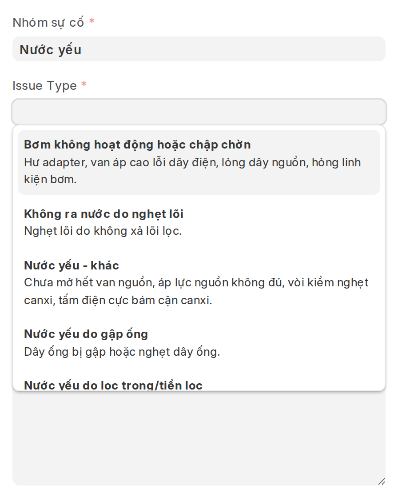
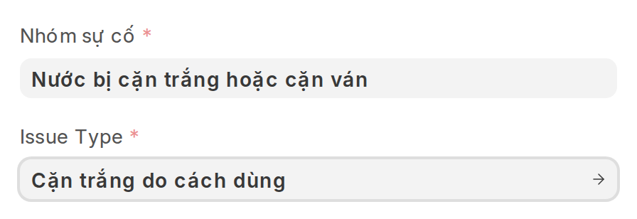
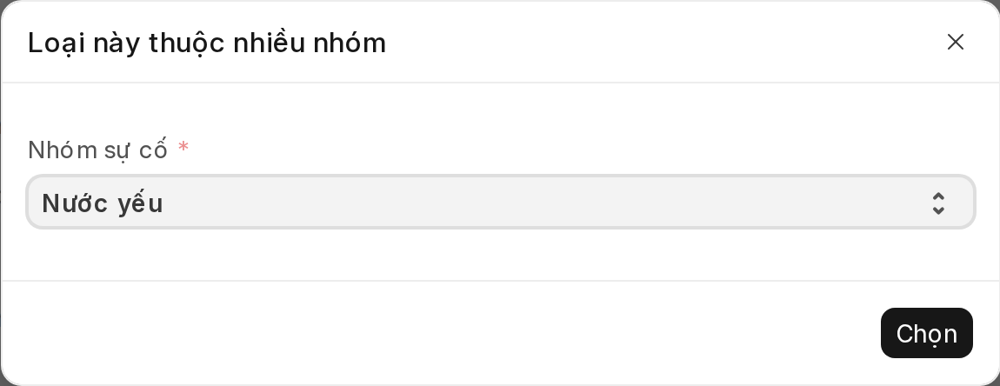
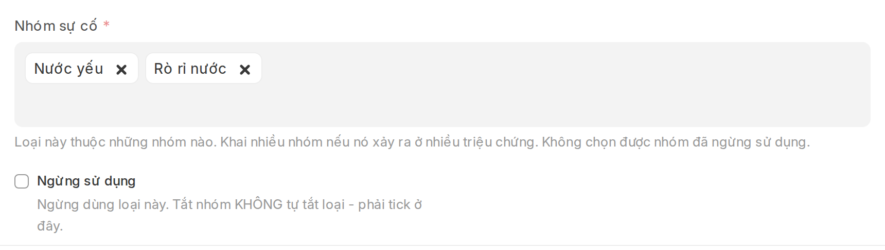
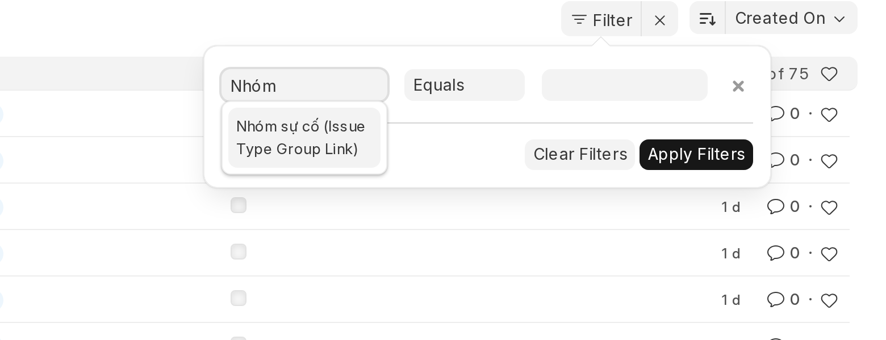
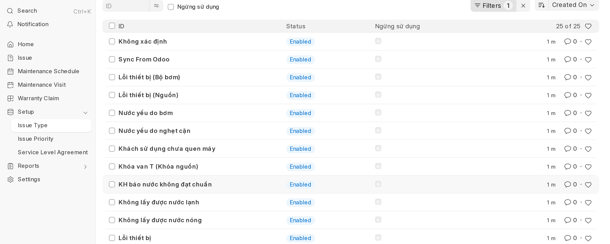

# Phân loại sự cố — Nhóm · Loại

Trang này gộp hai việc khác hẳn nhau, đọc phần của mình thôi:

| Phần | Cho ai | Màn hình |
|---|---|---|
| **[Phần 1 — Nhập ca](#phan-1--nhap-ca)** | CSKH, hằng ngày | Form **Issue** |
| **[Phần 2 — Quản trị danh mục](#phan-2--quan-tri-danh-muc)** | Người khai danh mục, thi thoảng | Danh sách **Issue Type**, form **Nhóm sự cố** |

---

## Phần 1 — Nhập ca
{: #phan-1--nhap-ca }

Mỗi ca sự cố được phân loại bằng **hai ô**, cả hai đều bắt buộc, điền ngay lúc tiếp nhận:

| Ô trên form | Trả lời câu hỏi | Điền khi nào |
|---|---|---|
| **Nhóm sự cố** | *Khách phàn nàn chuyện gì?* | Vừa nghe khách kể là biết |
| **Issue Type** | *Cụ thể hỏng ở đâu?* | Hỏi thêm vài câu là chốt được |

> Ô thứ hai trên form ghi nhãn tiếng Anh **Issue Type**; trong tài liệu này gọi là **Loại
> sự cố** cho dễ đọc. Cùng một ô.

Kết quả xử lý thực tế thì kỹ thuật viên vẫn ghi vào ô **Resolution Details** như trước.

Trước đây chỉ có một ô Loại sự cố với danh sách phẳng 60 giá trị, trộn nhiều tầng thông
tin vào cùng một cái tên (`Nước yếu`, `Nước yếu do bơm`, `Lỗi thiết bị`,
`Lỗi thiết bị (Màn hình)`…). Danh sách vừa dài vừa thiếu, và không gom nhóm để đọc báo cáo
được.

---

### Điền theo chiều nào cũng được

Không bắt buộc phải chọn Nhóm trước. Hệ thống đỡ cho cả hai chiều.

**Chiều 1 — chọn Nhóm trước.** Ô Loại sự cố chỉ còn hiện những loại thuộc nhóm đó: **7
dòng thay vì 75**. Mỗi dòng kèm sẵn gợi ý các nguyên nhân thường gặp.



**Chiều 2 — chọn Loại trước.** Khi ô Nhóm còn trống, ô Loại hiện **đủ cả 75 loại**. Chọn
xong, hệ thống **tự điền Nhóm**:



Nếu loại đó thuộc nhiều nhóm thì hệ thống **hỏi** chứ không tự đoán:



**Muốn đổi sang cặp khác hẳn?** Ô Nhóm luôn hiện đủ danh sách, không bao giờ bị Loại đang
chọn khoá lại. Đó là lối ra: đổi Nhóm rồi chọn lại Loại.

Đổi Nhóm trên một ca **đang nhập** mà Loại cũ không thuộc nhóm mới thì Loại bị xoá — chọn
lại là xong. Trên ca **đã lưu** thì hệ thống chỉ nhắc, không tự xoá, vì đó là dữ liệu
người ta đã nhập.

---

### Danh mục hiện có

**12 nhóm · 75 loại** — trong đó 50 loại đang dùng và 25 loại nằm trong nhóm *Danh mục cũ*
chờ ngừng.

| Nhóm | Số loại | Ca hiện có |
|---|---|---|
| Danh mục cũ | 25 | 21.266 |
| Khách chưa quen dùng máy | 2 | 2.296 |
| Nước yếu | 7 | 571 |
| Sự cố máy điện giải | 17 | 343 |
| Rò rỉ nước | 6 | 202 |
| Dịch vụ & kiểm tra | 3 | 168 |
| Nước bị mùi | 4 | 155 |
| Nước bị cặn trắng hoặc cặn ván | 4 | 111 |
| pH không đạt | 5 | 68 |
| Nước chuyển màu | 1 | 29 |
| Van khóa T (khóa nguồn) | 1 | 12 |
| Lỗi thiết bị | 0 | 0 |

Chín nhóm đầu (không tính *Danh mục cũ*) lấy đúng sơ đồ xử lý sự cố của bộ phận kỹ thuật.
*Dịch vụ & kiểm tra* thêm vào cho ba việc không phải sự cố nên sơ đồ đó không vẽ tới.

Danh sách loại lấy từ bảng rà soát của CSKH (`ISSUE TPYE.xlsx`): **35 loại đang dùng được
giữ nguyên tên** — nên ca lịch sử vẫn đọc liền mạch — và **15 loại khai thêm**.

Mỗi loại có ô **Description** ghi các nguyên nhân thường gặp, lấy từ mind map của bộ phận
kỹ thuật. Đây là gợi ý tra cứu hiện ngay trong ô chọn, không phải ô phải điền.

> **Nhóm `Lỗi thiết bị` đang trống**, chưa có loại nào. Chọn phải nó thì ô Loại sẽ rỗng
> trơn — hệ thống có cảnh báo đỏ, nhưng vẫn nên gán loại cho nó hoặc ngừng nó đi.

---

### Một Loại thuộc được NHIỀU Nhóm

Ô **Nhóm sự cố** trên form Loại sự cố là một bảng, khai được nhiều dòng:



Dùng khi một nguyên nhân gây ra nhiều triệu chứng khác nhau mà không muốn tách tên. Hiện
tại danh mục chưa dùng tới — mọi loại đều thuộc đúng một nhóm, vì CSKH đã tách sẵn theo
triệu chứng:

```
Nước yếu do lọc trong/tiền lọc     → Nước yếu
pH không đạt do lọc trong/tiền lọc → pH không đạt
Nước bị mùi do lọc trong/tiền lọc  → Nước bị mùi
Cặn trắng do tiền lọc/lọc tinh     → Nước bị cặn trắng
```

Cách tách này vẫn nên là lựa chọn mặc định: tên tự đủ nghĩa thì CSKH đọc phát hiểu ngay.

**Nhóm ghi trên ca là thứ CSKH chọn, không phải suy ra từ Loại.** Nhờ vậy hai ca cùng dùng
`Tiền lọc/lọc trong quá hạn` mà một ca là *Nước bị mùi*, ca kia là *pH không đạt*, thì vẫn
phân biệt được khi đọc báo cáo.

---

## Phần 2 — Quản trị danh mục
{: #phan-2--quan-tri-danh-muc }

Từ đây trở xuống là việc của người khai danh mục, làm trên **màn hình quản trị** chứ
không phải form nhập ca. CSKH không cần đọc.

### Sửa danh mục ở đâu

Menu **Support** → thẻ **Issues**:

- **Issue Type** — khai Loại sự cố
- **Nhóm sự cố** — khai các nhóm lớn

(Thanh bên trái cũng có **Setup → Issue Type**, nhưng *Nhóm sự cố* thì chỉ vào từ thẻ
**Issues** của trang Support.)

#### Thêm một Loại sự cố

**Issue Type** → **Add**. Ô **Nhóm sự cố** là **bắt buộc**: loại không thuộc nhóm nào sẽ
không bao giờ hiện ra ở ô chọn của CSKH.

Không chọn được nhóm đã ngừng sử dụng — hệ thống chặn ngay lúc chọn.

#### Hai công tắc, mỗi cái một việc

| Công tắc | Ở đâu | Tác dụng |
|---|---|---|
| **Ngừng sử dụng** | trên từng **Loại sự cố** | Loại đó biến khỏi ô chọn, ở mọi nhóm |
| **Ngừng sử dụng nhóm này** | trên từng **Nhóm sự cố** | Nhóm đó biến khỏi ô chọn |

**Không cái nào kéo theo cái nào.** Tắt một nhóm **không** tự tắt các loại thuộc nhóm đó —
đây là điểm khác với bản trước, khi một loại có thể thuộc nhiều nhóm thì "nhóm tắt kéo loại
tắt theo" không còn nghĩa gì rõ ràng.

Đổi lại, hệ thống giữ hai chốt chặn:

1. **Không ngừng được một Nhóm khi vẫn còn Loại thuộc nó** — nếu không sẽ sinh ra loại vô
   hình: còn sống nhưng không nhóm nào dẫn tới.
2. **Không gán được Nhóm đã ngừng cho một Loại.**

Cả hai công tắc đều bỏ tick là hiện lại, ca lịch sử không đổi.

---

### Tắt cụm *Danh mục cũ*

Đây là bước **cuối cùng**, làm sau khi đã tập huấn CSKH trên danh mục mới. 25 loại này
đang gánh **519 trong 1.332 ca của 60 ngày gần nhất (38%)** — tắt sớm là CSKH mở form ra
mất gần 4 trên 10 lựa chọn quen tay.

Vì tắt nhóm không còn kéo theo loại, phải tắt từng loại — nhưng làm được hàng loạt:

**Bước 1.** Vào **Issue Type** → **Filter** → gõ `Nhóm` vào ô chọn trường. Danh sách hiện
đúng một dòng: **Nhóm sự cố (Issue Type Group Link)** — chọn nó, để phép so sánh
**Equals**, giá trị `Danh mục cũ`, rồi **Apply Filters**.



> **Chỉ có đúng một lựa chọn này.** Trong danh sách chọn trường sẽ không thấy `Nhóm sự cố`
> đứng riêng, vì ô Nhóm trên form Loại sự cố là một **bảng** — giá trị nằm ở bảng con nên
> phải lọc qua đó. Thấy cái tên lạ `(Issue Type Group Link)` thì cứ chọn, đúng nó.
>
> Chuyện này **chỉ xảy ra ở màn hình quản trị này**. Ô Nhóm sự cố trên form nhập ca là ô
> thường, lọc và chọn bình thường như mọi ô khác.

Kết quả: 25 dòng.



**Bước 2.** Đổi số dòng mỗi trang lên **100** (nút ở cuối danh sách) để đủ cả 25 dòng, rồi
tick ô chọn ở đầu bảng để chọn tất cả.

**Bước 3.** **Actions** → **Edit** → chọn trường **Ngừng sử dụng** → tick → **Update 25
records**.

Sau đó ô Loại sự cố khi mở ca mới chỉ còn **50 loại**.

#### Kiểm lại

- Mở một ca mới, ô Loại sự cố không còn các loại vừa tắt
- Mở một **ca cũ** đang mang một loại vừa tắt: loại đó vẫn còn nguyên trên ca, và vẫn
  **chọn lại được** nếu lỡ xoá

#### Hoàn tác

Lọc y như bước 1, chọn tất cả, **Actions → Edit → Ngừng sử dụng → bỏ tick → Update**.

---

### Những điều cần biết

**Ca cũ không bị đụng tới.** 25.221 ca lịch sử giữ nguyên Loại sự cố của chúng. Tắt một
loại chỉ ẩn nó khỏi ô *chọn khi nhập ca mới* — không xoá, không sửa dữ liệu cũ.

**Ca cũ luôn chọn lại được giá trị của chính nó.** Loại đã tắt, hoặc loại đã bị chuyển
khỏi nhóm, vẫn hiện trong ô chọn khi mở đúng ca đang mang nó. Không có chuyện lỡ tay xoá
rồi kẹt không lưu được ca. Ngoại lệ này chỉ có **trên form nhập ca**, không có ở ô lọc —
xem mục ngay dưới.

**Loại đã tắt biến khỏi ô lọc luôn, không chỉ ô nhập liệu.** Đây là hành vi sẵn có của
Frappe: bản ghi `Ngừng sử dụng` bị loại khỏi **mọi** ô chọn, kể cả ô lọc của danh sách và
báo cáo. Nên sau khi tắt, gõ `Không xác định` vào ô lọc Issue Type sẽ **không ra gì**.

Vẫn lọc được, bằng một trong hai cách:

- **Lọc theo `Nhóm sự cố` = `Danh mục cũ`** — gọn nhất, gom hết 25 loại một lần. Nhóm dùng
  cờ riêng (`Ngừng sử dụng nhóm này`) chứ không phải cờ `Ngừng sử dụng` của Frappe, nên
  nhóm **vẫn hiện trong ô lọc** kể cả sau khi đã ngừng.
- **Đổi phép so sánh sang `Like`** rồi gõ tay tên loại. Với `Like` (và `In`) thì ô giá trị
  thành ô chữ tự do, không còn kiểm theo danh sách nữa.

Dữ liệu thì không suy suyển: ca cũ vẫn giữ nguyên loại của nó, chỉ là chọn lại tên đó
trong ô lọc thì phải đi đường vòng.

**`Không xác định` một mình mang 16.412 ca.** Đây là loại mặc định của dữ liệu nhập từ hệ
cũ, nằm trong *Danh mục cũ*. Báo cáo theo loại nên tách riêng nó ra kẻo lệch hẳn.

**Nhóm rỗng là ngõ cụt.** Chọn phải một nhóm chưa có loại nào thì ô Loại sự cố trống trơn,
mà ô đó lại bắt buộc — ca không lưu được. Hệ thống báo đỏ ngay lúc chọn, nhưng đừng để
nhóm rỗng nằm lại trong danh sách.
