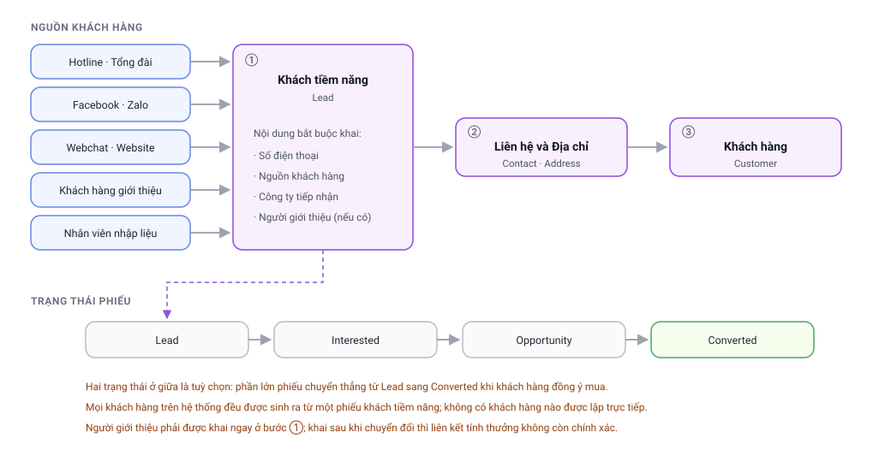

# Chặng 1 — Từ khách tiềm năng đến khách hàng
{: .no_toc }

**Ai làm:** Kinh doanh · Chăm sóc khách hàng · Quản trị bán hàng
{: .fs-3 .text-grey-dk-000 }

---

## Mục lục
{: .no_toc .text-delta }

1. TOC
{:toc}

---

## Sơ đồ chặng

---

## 1. Khách vào hệ thống bằng cách nào

Mỗi người lạ để lại thông tin đều được ghi thành một **phiếu khách tiềm năng** (`Lead`). Phiếu
này sinh ra theo hai cách:

| Cách | Ai tạo | Đặc điểm |
|---|---|---|
| **Tự động** | Hệ thống, qua kết nối với tổng đài, trang mạng xã hội, hộp trò chuyện trên trang web | Phiếu xuất hiện ngay khi khách gọi hoặc nhắn tin; nguồn được ghi sẵn |
| **Thủ công** | Nhân viên kinh doanh nhập trên Desk | Dùng khi khách đến trực tiếp, khách được giới thiệu, hoặc nhận danh sách từ hội chợ |

Ô **Nguồn** (`utm_source`) là ô quan trọng nhất trên phiếu, vì hai lẽ:

1. Nó quyết định **công ty** nào tiếp nhận khách. Tập đoàn có nhiều pháp nhân; mỗi nguồn được
   khai sẵn thuộc công ty nào. Với những nguồn chỉ gắn đúng một công ty, hệ thống **tự điền
   công ty** cho phiếu do luồng tự động tạo ra.
2. Nó quyết định khách có thuộc diện **giới thiệu** hay không, tức có phát sinh thưởng cho
   người giới thiệu hay không.

> ⚠️ Trong danh sách nguồn có vài giá trị mang tiền tố **“(Tuyệt đối không chọn!)”**. Đó là
> các nguồn cũ giữ lại để dữ liệu lịch sử không đứt liên kết. Nhân viên **không chọn** các
> giá trị này khi nhập phiếu mới.

---

## 2. Khai người giới thiệu — làm ngay, không để sau

Hệ thống **không tự đoán** ai giới thiệu ai. Phải khai, và phải khai **ngay ở bước khách tiềm
năng**, trước khi chuyển đổi thành khách hàng.

**Cách khai:** mở phiếu khách tiềm năng → ô **Nguồn** chọn `Reference` → một ô mới hiện ra tên
**From Customer**, bắt buộc điền → chọn khách hàng cũ đã giới thiệu người này → Lưu.

Lý do phải làm sớm: hệ thống truy vết người giới thiệu theo đường **khách hàng → phiếu khách
tiềm năng gốc → người giới thiệu**. Chuyển đổi xong mới khai thì mắt xích giữa đã đứt, phải
nhờ quản trị viên sửa thủ công.

> 📚 Chi tiết điều kiện được thưởng, mức thưởng và cách tra cứu: xem
> [Loyalty — Hướng dẫn cho Sales](Loyalty-Cho-Sales.html).

---

## 3. Bốn trạng thái của phiếu khách tiềm năng

| Trạng thái | Nghĩa | Số phiếu hiện có |
|---|---|---|
| **Lead** | Mới vào, chưa xác định nhu cầu | 78.059 |
| **Interested** | Có quan tâm, đang trao đổi | 45 |
| **Opportunity** | Đã dựng cơ hội bán hàng cụ thể | 304 |
| **Converted** | Đã chốt, đã thành khách hàng | 15.548 |

Hai trạng thái giữa gần như không được dùng: thực tế **phần lớn phiếu đi thẳng từ *Lead* sang
*Converted*** khi khách chốt mua. Việc dựng cơ hội bán hàng (`Opportunity`) là bước tuỳ chọn,
chỉ dùng cho những thương vụ cần theo dõi nhiều bước.

Con số 15.548 phiếu *Converted* so với 25.566 khách hàng có vẻ mâu thuẫn, nhưng không phải:
nhiều khách được đưa vào hệ thống trong đợt chuyển dữ liệu từ hệ thống cũ, phiếu gốc của họ
giữ nguyên trạng thái ban đầu.

---

## 4. Liên hệ và địa chỉ — hai hồ sơ đi kèm

Một khách cần thêm hai hồ sơ nữa mới bán được hàng:

| Hồ sơ | Tên hệ thống | Dùng để |
|---|---|---|
| **Liên hệ** | `Contact` | Gọi điện, nhắn tin, ghi lên chứng từ |
| **Địa chỉ** | `Address` | Lắp đặt, giao hàng, tính vùng của đơn vị vận chuyển |

Cả hai đều có bảng **Links** trong mục *Reference* — nơi gắn hồ sơ này về khách tiềm năng hay
khách hàng nào.

> 💡 **Hệ thống tự nối hai chiều.** Chỉ cần gắn **một** trong hai (ví dụ chỉ gắn Khách hàng),
> khi lưu là hệ thống tự kéo phiếu khách tiềm năng tương ứng vào — với điều kiện khách hàng
> đang trỏ **đúng** phiếu khách tiềm năng.

Nguyên tắc vàng khi thêm liên hệ hoặc địa chỉ: **tìm theo số điện thoại trước đã**. Khách
chuyển từ phiếu khách tiềm năng lên thường đã có sẵn liên hệ và địa chỉ; tạo mới sẽ sinh bản
trùng và về sau không biết bản nào đúng.

---

## 5. Chuyển đổi thành khách hàng

Khi khách đồng ý mua, nhân viên chuyển phiếu khách tiềm năng thành **khách hàng** (`Customer`).
Hồ sơ khách hàng giữ lại đường dẫn về phiếu gốc ở ô **Lead**.

Đường dẫn này không phải hình thức. Nó là thứ hệ thống dùng để:

- Truy vết người giới thiệu và tính thưởng.
- Tự nối liên hệ và địa chỉ giữa hai hồ sơ.
- Truy nguồn khách khi làm báo cáo hiệu quả marketing.

Thực tế trên hệ thống: **cả 25.566 khách hàng đều có đường dẫn về một phiếu khách tiềm năng**,
không có khách nào được lập trực tiếp. Đó là quy tắc vận hành cần giữ.

### Việc phải làm ngay sau khi chuyển đổi

| # | Việc | Nếu bỏ qua |
|---|---|---|
| 1 | Kiểm tra khách đã có **chương trình tích điểm** chưa | Khách không nhận điểm nào và hệ thống không báo gì |
| 2 | Đặt **liên hệ chính** và **địa chỉ chính** cho khách | Lập đơn phải chọn tay, dễ chọn nhầm địa chỉ cũ |
| 3 | Kiểm tra **công ty** trên hồ sơ đúng pháp nhân bán hàng | Đơn hàng, kho và hoá đơn sẽ lệch pháp nhân |

---

## 6. Ngoại lệ thường gặp ở chặng này

| Hiện tượng | Nguyên nhân | Cách xử lý |
|---|---|---|
| Lưu đơn báo `Could not find Row #2: Link Name: <tên người>` | Khách hàng đang trỏ tới một phiếu khách tiềm năng **đã bị đổi tên**, nên trỏ vào chỗ trống | Tìm lại phiếu đúng theo số điện thoại, sửa ô **Lead** trên hồ sơ khách. Chi tiết: [Sửa lỗi liên kết Khách hàng](Sua-Loi-Lien-Ket-Khach-Hang.html) |
| Một số điện thoại ra nhiều phiếu khách tiềm năng | Khách gọi lại nhiều lần qua nhiều kênh, mỗi lần sinh một phiếu | Chọn phiếu ở trạng thái **Converted** và có thông tin khớp nhất; các phiếu còn lại để nguyên làm lịch sử |
| Ô **Lead** trên hồ sơ khách bị khoá, không sửa được | Ô này chỉ mở cho vai trò quản trị | Gửi quản trị viên hai thông tin: mã khách đang lỗi và mã phiếu đúng |
| Khách rơi vào **sai công ty** | Nguồn được khai cho nhiều công ty, nên hệ thống không suy ra được | Sửa tay ô Công ty trên phiếu trước khi chuyển đổi |
| Không thấy ô **From Customer** dù đã chọn nguồn giới thiệu | Ô này chỉ hiện với nguồn `Reference` và `Existing Customer` | Kiểm tra lại giá trị đã chọn; vẫn không hiện thì báo quản trị |
| Đã chuyển đổi rồi mới nhớ ra khách được giới thiệu | Mắt xích truy vết đã đứt | Gửi quản trị viên: mã khách mới, mã khách giới thiệu, mã đơn hàng đầu tiên |
| Tạo trùng liên hệ hoặc địa chỉ | Không tìm theo số điện thoại trước khi tạo | Xoá bản vừa tạo, gắn lại bản cũ qua bảng **Links** |

---

## 7. Chặng tiếp theo

Khách đã thành khách hàng chính thức, có liên hệ và địa chỉ. Bước kế là lập đơn:
**[Chặng 2 — Đơn bán hàng](Quy-Trinh-02-Don-Hang.html)**.
