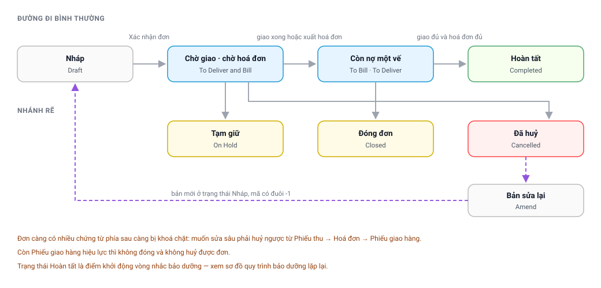

# Chặng 2 — Đơn bán hàng
{: .no_toc }

**Ai làm:** Kinh doanh · Chăm sóc khách hàng · Nhân viên dịch vụ · Kế toán
{: .fs-3 .text-grey-dk-000 }

| Nhận vào | Bàn giao ra |
|---|---|
| Khách hàng chính thức, hoặc phiếu nhắc bảo dưỡng, hoặc phiếu sự cố | Đơn bán hàng đã xác nhận → [Chặng 3](Quy-Trinh-03-Hien-Truong.html) và [Chặng 5](Quy-Trinh-05-Giao-Hang-Thu-Tien.html) |

Đơn bán hàng (`Sales Order`) là **trục chính**: phiếu công việc, yêu cầu vật tư, phiếu giao
hàng, hoá đơn, phiếu thu và cả lịch bảo dưỡng các năm sau đều tham chiếu về đơn.

---

## Mục lục
{: .no_toc .text-delta }

1. TOC
{:toc}

---

## Sơ đồ vòng đời đơn hàng

<div style="position:relative;width:100%;padding-bottom:48.08%">
  <object type="image/svg+xml" data="images/svg/quy-trinh/03-don-hang-vong-doi.svg" style="position:absolute;inset:0;width:100%;height:100%;border:0">
    
  </object>
</div>

👆 **Bấm vào từng ô** để mở phần giải thích.
{: .fs-3 }

---

## 1. Ba nguồn lập đơn
{: #nguon-don }

| Nguồn | Cách lập | Dùng cho |
|---|---|---|
| **Khách hàng liên hệ mua** | Lập trực tiếp trên Desk | Bán thiết bị mới, bán lẻ vật tư |
| **Từ phiếu nhắc bảo dưỡng** | **Tạo → Sales Order** ngay trên phiếu nhắc | Thay lõi, bảo dưỡng định kỳ |
| **Từ phiếu sự cố** | **Tạo → Sales Order** ngay trên phiếu sự cố | Thay linh kiện khi sửa chữa có tính phí |

Hai nguồn sau phải lập **bằng chức năng trên chứng từ gốc**, vì hệ thống ghi liên kết ngược.
Nhờ liên kết đó, phiếu gốc tự chuyển sang *Converted* khi đơn được xác nhận và tự sang
*Cancelled* nếu đơn bị huỷ — không ai phải cập nhật thủ công.

> ⚠️ Lập đơn mới trên Desk rồi nhập thủ công tên khách hàng là **mất liên kết ngược**: phiếu nhắc nằm
> lại ở *Open* dù khách hàng đã mua, và công của người chốt đơn không được ghi nhận.

---

## 2. Nội dung phải khai trên đơn
{: #khai-don }

### 2.1. Ba chỗ hệ thống chặn nếu sai

| Nội dung | Quy tắc | Báo lỗi |
|---|---|---|
| **Sales Team** | Tối thiểu một người, **không trùng người** | *“Bắt buộc phải có ít nhất 1 Sales Person…”* |
| **Payment Methods** | Tổng các dòng phải **bằng tổng giá trị đơn** (lệch tối đa 100 đồng) | *“Tổng tiền trong Payment Method phải bằng Grand Total…”* |
| **Khách hàng, địa chỉ, liên hệ** | Phải trỏ tới hồ sơ tồn tại, liên kết đúng | *“Could not find Row #…: Link Name: …”* |

> Đơn lập từ **phiếu sự cố** không bị kiểm tra tổng phương thức thanh toán.

### 2.2. Bốn chỗ nên rà trước khi xác nhận

- **Hàng hoá, số lượng, đơn giá, chiết khấu** — sửa sau vẫn được nhưng thủ tục phức tạp hơn nhiều.
- **Tài khoản ngân hàng nhận tiền** — đơn đã có phiếu thu là không đổi được nữa.
- **Thông tin xuất hoá đơn và biên bản bàn giao** — tên công ty, mã số thuế, người đại diện.
- **Loại đơn** (`Sales Order Type`) — thường tự suy ra từ đội bán hàng, ít khi phải sửa.

---

## 3. Tám trạng thái của đơn
{: #trang-thai }

Sau khi xác nhận, trạng thái do **tiến độ giao hàng và xuất hoá đơn** quyết định. Không ai đặt
trạng thái này bằng tay.

| Trạng thái | Nghĩa |
|---|---|
| **Draft** — Nháp | Chưa xác nhận, chưa có hiệu lực |
| **To Deliver and Bill** — Chờ giao, chờ hoá đơn | Đã xác nhận, chưa giao và chưa xuất hoá đơn |
| **To Bill** — Còn nợ hoá đơn | Đã giao đủ, chưa xuất hoá đơn đủ |
| **To Deliver** — Còn nợ hàng | Đã xuất hoá đơn đủ, chưa giao đủ |
| **Completed** — Hoàn tất | Đã giao đủ **và** xuất hoá đơn đủ |
| **Closed** — Đã đóng | Chủ động dừng phần còn lại |
| **On Hold** — Tạm giữ | Tạm dừng xử lý |
| **Cancelled** — Đã huỷ | Đã huỷ hiệu lực |

> 🔑 ***Hoàn tất* không phải là điểm kết thúc mà là điểm khởi động vòng sau.** Ngay khi đơn sang
> *Completed*, hệ thống sinh lịch bảo dưỡng cho từng vật tư trong đơn và cộng điểm tích luỹ cho
> khách hàng. Xem [Chặng 6](Quy-Trinh-06-Bao-Duong.html).

---

## 4. Sửa, đóng và huỷ đơn
{: #sua-don }

Chọn phương án theo thứ tự: cái nào ít tác động tới chứng từ phía sau thì làm trước.

| Cần sửa gì | Làm cách nào | Vướng ở đâu |
|---|---|---|
| Hàng hoá, số lượng, giá, chiết khấu | **Update Items** trên đơn | Đơn đã xuất kho hàng vật lý thì chỉ sửa được dòng *Giảm giá* và hàng không quản lý tồn |
| Loại đơn, tài khoản ngân hàng, phương thức thanh toán, thông tin hoá đơn | Sửa trên form rồi **Lưu** | Đơn đã có phiếu thu thì không đổi được tài khoản ngân hàng |
| Khách hàng, bảng giá, ngày đặt, hàng đã xuất kho | **Huỷ và lập lại** (Amend) | Phải huỷ ngược chứng từ phía sau trước |
| Dừng phần còn lại | **Actions → Close** | Không đóng được nếu còn phiếu giao hàng hiệu lực |
| Tạm dừng xử lý | **Actions → Hold** | Mở lại bằng **Actions → Re-open** |

**Trình tự huỷ ngược:**

```
1. Phiếu thu       (Payment Entry)   → Cancel
2. Hoá đơn         (Sales Invoice)   → Cancel
3. Phiếu giao hàng (Delivery Note)   → Cancel
4. Đơn bán hàng    (Sales Order)     → Cancel
5. Trên đơn đã huỷ → Amend → bản mới ở trạng thái Nháp, mã có hậu tố -1
```

> ⚠️ Sửa làm **đổi tổng giá trị đơn** mà đơn có **nhiều phương thức thanh toán** thì hệ thống
> không tự chia lại. Phải tự cập nhật bảng phương thức cho khớp tổng mới, nếu không biên bản
> bàn giao in ra sai số tiền.

📚 Thao tác từng tình huống kèm hình: [Sửa Sales Order](Sua-Sales-Order.html).

---

## 5. Đơn bàn giao cho những nhánh nào
{: #ban-giao }

| Nhánh | Chứng từ phát sinh | Ai làm | Đọc tiếp |
|---|---|---|---|
| Cần người xuống hiện trường | Phiếu công việc | Điều phối | [Chặng 3](Quy-Trinh-03-Hien-Truong.html) |
| Cần cấp vật tư | Yêu cầu vật tư | Kỹ thuật viên | [Chặng 4](Quy-Trinh-04-Vat-Tu.html) |
| Giao hàng và thu tiền | Phiếu giao hàng, hoá đơn, phiếu thu | Kỹ thuật viên · Kế toán | [Chặng 5](Quy-Trinh-05-Giao-Hang-Thu-Tien.html) |
| Gửi hàng đi xa | Vận đơn | Kho · Kinh doanh | [Quy trình vận đơn](Delivery_Partner-Quy-Trinh.html) |

Một đơn có thể **không có phiếu công việc nào**, hoặc có một, hoặc nhiều. Hệ thống không tự lập
phiếu công việc; luôn phải có người thao tác.

---

## 6. Khi gặp trục trặc
{: #truc-trac }

| Hiện tượng | Nguyên nhân | Cách gỡ |
|---|---|---|
| `Không cho phép thay đổi items…` | Hàng vật lý của đơn đã xuất kho | Huỷ phiếu xuất kho hoặc phiếu giao hàng trước |
| `Không thể Close Sales Order này vì đã có Delivery Note` | Còn phiếu giao hàng hiệu lực | Huỷ phiếu giao hàng trước khi đóng hoặc huỷ đơn |
| `Không cho phép thay đổi Bank Account…` | Đơn đã có phiếu thu | Huỷ phiếu thu → sửa tài khoản → lập lại phiếu thu |
| `Tổng tiền trong Payment Method phải bằng Grand Total` | Bảng phương thức lệch tổng | Sửa số tiền từng dòng cho khớp |
| Đơn đã xác nhận nhưng **phiếu nhắc vẫn Open** | Đơn lập thủ công, mất liên kết ngược | Nhờ quản trị viên gắn lại liên kết, hoặc đóng phiếu nhắc kèm ghi chú |
| Đơn hoàn tất nhưng **khách hàng không được cộng điểm** | Khách hàng chưa được gán chương trình tích điểm | Báo quản trị viên gán; chỉ đơn phát sinh **sau đó** mới được tính |
| Đơn nằm lâu ở **To Bill** | Đã giao nhưng chưa xuất đủ hoá đơn | Đơn chưa hoàn tất thì **chưa sinh lịch bảo dưỡng** và **chưa cộng điểm** |
| Ô dữ liệu bị khoá sau khi xác nhận | Ô không cho sửa sau xác nhận | Dùng phương án **Huỷ và lập lại** |

---

## 7. Câu hỏi thường gặp
{: #hoi-dap }

**Đơn đã xác nhận rồi, khách đổi ý thêm một món, làm sao?**

Dùng **Update Items** nếu hàng chưa xuất kho. Đã xuất kho rồi thì lập đơn mới cho món thêm,
nhanh hơn là huỷ ngược cả chuỗi.

**Khách trả trước một phần, có ghi được lên đơn không?**

Được. Khoản đặt cọc là một phiếu thu gắn với đơn. Đơn vẫn còn nợ phần chưa thu, xem
[Chặng 5](Quy-Trinh-05-Giao-Hang-Thu-Tien.html#ba-truong-hop).

**Đóng đơn và huỷ đơn khác nhau chỗ nào?**

**Đóng** giữ lại phần đã làm, chỉ dừng phần còn lại — dùng khi khách nhận một phần rồi thôi.
**Huỷ** xoá hiệu lực toàn bộ đơn — dùng khi đơn lập sai hoặc khách không mua nữa.

**Đơn bị huỷ nhầm, lấy lại được không?**

Không khôi phục được, nhưng **Amend** trên đơn đã huỷ sẽ tạo bản mới giữ nguyên nội dung, mã có
hậu tố `-1`.

**Bán một món lẻ gửi bưu điện, có cần lập phiếu công việc không?**

Không. Đơn đó đi thẳng sang vận đơn, xem [Chặng 5](Quy-Trinh-05-Giao-Hang-Thu-Tien.html#van-chuyen).

**Đơn của khách công ty, cần xuất hoá đơn đỏ, khai ở đâu?**

Ở phần thông tin xuất hoá đơn trên đơn, khai **trước khi** xuất hoá đơn. Sửa sau khi đã xuất
thì phải huỷ hoá đơn.

---

## Chặng tiếp theo

Đơn đã xác nhận. Cần bố trí người xuống hiện trường thì đọc tiếp:
**[Chặng 3 — Điều phối và hiện trường](Quy-Trinh-03-Hien-Truong.html)**.
