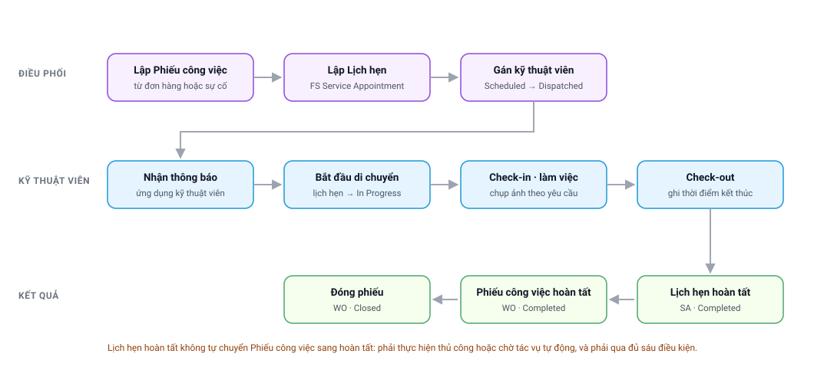
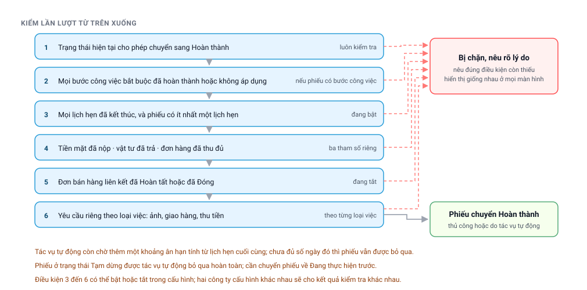

# Chặng 3 — Điều phối và hiện trường
{: .no_toc }

**Ai làm:** Điều phối · Kỹ thuật viên · Quản lý dịch vụ
{: .fs-3 .text-grey-dk-000 }

| Nhận vào | Bàn giao ra |
|---|---|
| Đơn bán hàng đã xác nhận, hoặc phiếu sự cố | Phiếu công việc và lịch hẹn → [Chặng 4](Quy-Trinh-04-Vat-Tu.html) và [Chặng 5](Quy-Trinh-05-Giao-Hang-Thu-Tien.html) |

---

## Mục lục
{: .no_toc .text-delta }

1. TOC
{:toc}

---

## Sơ đồ chặng

<div style="position:relative;width:100%;padding-bottom:47.17%">
  <object type="image/svg+xml" data="images/svg/quy-trinh/04-hien-truong.svg" style="position:absolute;inset:0;width:100%;height:100%;border:0">
    
  </object>
</div>

👆 **Bấm vào từng ô** để mở phần giải thích.
{: .fs-3 }

---

## 1. Ba chứng từ, ba việc khác nhau
{: #ba-chung-tu }

| Chứng từ | Gõ tìm bằng | Nói về |
|---|---|---|
| **Đơn bán hàng** | `Sales Order` | Bán cái gì, bao nhiêu tiền, ai chịu trách nhiệm doanh thu |
| **Phiếu công việc** | `FS Work Order` | Vụ việc kỹ thuật: làm gì, ở đâu, gồm những đầu việc nào |
| **Lịch hẹn dịch vụ** | `FS Service Appointment` | Một buổi có mặt tại hiện trường: ai đi, lúc nào, kết quả ra sao |

Quan hệ là **một–nhiều ở cả hai tầng**: một đơn có thể nhiều phiếu công việc, một phiếu công
việc có thể nhiều lịch hẹn. Ví dụ: lần một xuống khảo sát, lần hai xuống lắp — một phiếu công
việc, hai lịch hẹn.

> ⚠️ **Trạng thái ba chứng từ này độc lập với nhau.** Hoàn thành lịch hẹn không chuyển phiếu
> công việc sang hoàn thành. Đơn hàng hoàn tất không đóng phiếu công việc. Đây là thiết kế có
> chủ đích, và nó giải thích gần hết các trường hợp phiếu không tự đổi trạng thái.

---

## 2. Lập phiếu công việc
{: #lap-wo }

Phiếu công việc **không tự sinh**, luôn phải có người lập:

| Từ đâu | Thao tác | Dùng khi |
|---|---|---|
| **Đơn bán hàng** | Mở đơn đã xác nhận → **Create → FS Work Order** | Lắp đặt, bảo dưỡng, giao hàng kèm lắp đặt |
| **Phiếu sự cố** | Mở phiếu sự cố → **Create → FS Work Order** | Khách hàng báo hỏng, cần cử người kiểm tra |

Hệ thống tự điền công ty, khách hàng, địa chỉ, liên hệ và khoảng thời gian dự kiến. Phiếu mới
luôn ở trạng thái **New**.

**Chọn đúng loại việc.** Ô **Loại việc** (`Work Type`) quyết định hệ thống sẽ đòi những gì lúc
hoàn thành phiếu:

| Loại việc | Thường đòi thêm |
|---|---|
| **Bảo dưỡng** | Giao vật tư và thu tiền |
| **Sự cố** | Đính kèm ảnh hiện trường |
| **Lắp đặt** | Giao hàng, nghiệm thu, thu tiền |
| **Khảo sát** | Không giao hàng, không thu tiền |

⚠️ **Chọn sai loại việc thì hệ thống không cảnh báo**, chỉ lộ ra khi phiếu không hoàn thành được
hoặc khi bị đòi những thứ không liên quan.

---

## 3. Lập lịch hẹn và gán kỹ thuật viên
{: #lap-sa }

Từ phiếu công việc chưa đóng → **Create → Service Appointment**. Lịch hẹn tự gắn về phiếu cha.

Lịch hẹn **tự đổi trạng thái** theo dữ liệu được khai, không ai đặt bằng tay:

| Trạng thái | Khi nào chuyển sang |
|---|---|
| **None** | Chưa có lịch, chưa có người |
| **Scheduled** | Đã có khung giờ hẹn |
| **Dispatched** | Đã có khung giờ **và** đã gán kỹ thuật viên |
| **In Progress** | Kỹ thuật viên bắt đầu di chuyển hoặc đã check-in |
| **Completed** | Kết thúc buổi làm việc và đủ điều kiện |
| **Cannot Complete** | Không làm được, có ghi lý do |
| **Canceled** | Huỷ, **bắt buộc nhập lý do** |

Xếp lịch và gán người làm trên màn hình điều phối `/smart-scheduler`, kéo thả theo dòng thời
gian của cả đội.

> 🔒 **Khoá theo trạng thái:** lịch ở *Completed*, *Cannot Complete* hoặc *Canceled* không đổi
> được kỹ thuật viên; từ *In Progress* trở đi không đổi được khung giờ.

**Nhiều kỹ thuật viên một buổi:** gán được nhiều người, mỗi người một **tỉ lệ đóng góp**, tổng
phải bằng **100%** — đây là căn cứ tính công ca. Loại một người khỏi lịch thì hệ thống bắt phân
bổ lại tỉ lệ cho những người còn lại.

---

## 4. Thao tác tại hiện trường
{: #hien-truong }

Làm trên ứng dụng kỹ thuật viên `/technician`, **theo đúng thứ tự**:

| Bước | Thao tác | Hệ thống ghi nhận |
|---|---|---|
| 1 | Nhận thông báo công việc | Thông báo đẩy về điện thoại |
| 2 | **Bắt đầu di chuyển** | Lịch hẹn sang *In Progress*, ghi giờ bắt đầu |
| 3 | **Check-in** tại nhà khách hàng | Ghi vị trí và giờ có mặt |
| 4 | Làm các **bước công việc** | Đánh dấu từng đầu việc: xong, không xong, không áp dụng |
| 5 | **Đính kèm ảnh** nếu loại việc yêu cầu | Ảnh lưu vào lịch hẹn |
| 6 | Giao hàng và thu tiền nếu có | Xem [Chặng 5](Quy-Trinh-05-Giao-Hang-Thu-Tien.html) |
| 7 | **Check-out** | Ghi giờ kết thúc |
| 8 | **Hoàn thành lịch hẹn** | Hệ thống kiểm bốn điều kiện dưới đây |

**Bốn điều kiện hoàn thành lịch hẹn:**

| Điều kiện | Báo lỗi khi thiếu |
|---|---|
| Lịch đang ở *In Progress* | *“must transition to In Progress before completing”* |
| Đã có giờ bắt đầu thực tế | *“Cannot complete: no Actual Start”* |
| **Mọi** kỹ thuật viên đã check-out hoặc đã bị loại khỏi lịch | *“all resources must be Checked-out or Canceled. Pending: …”* |
| Đủ yêu cầu của loại việc, ví dụ đã đính ảnh | *“no photo attached (Work Type requires Photo)”* |

---

## 5. Sáu điều kiện hoàn thành phiếu công việc
{: #dieu-kien }

Đây là chỗ dễ hiểu nhầm nhất. Phiếu công việc sang **Completed** theo **một trong hai đường**,
và cả hai đều phải qua **cùng bộ sáu điều kiện**:

- **Thủ công:** người dùng chuyển trạng thái trên Desk, hoặc kỹ thuật viên chọn *Hoàn thành*
  trên ứng dụng.
- **Tự động:** một tác vụ chạy ban đêm rà các phiếu *New* và *In Progress*, đủ điều kiện thì
  hoàn thành giúp.

<div style="position:relative;width:100%;padding-bottom:49.50%">
  <object type="image/svg+xml" data="images/svg/quy-trinh/09-sau-dieu-kien-wo.svg" style="position:absolute;inset:0;width:100%;height:100%;border:0">
    
  </object>
</div>

👆 **Bấm vào từng điều kiện** để mở phần hướng dẫn xử lý.
{: .fs-3 }

| # | Điều kiện | Đang áp dụng |
|---|---|---|
| 1 | Trạng thái hiện tại cho phép chuyển sang *Completed* | Luôn kiểm |
| 2 | Mọi **bước công việc bắt buộc** đã xong hoặc đã đánh dấu không áp dụng | Luôn kiểm, nếu phiếu có bước công việc |
| 3 | Mọi **lịch hẹn** đã kết thúc, và phiếu có **ít nhất một** lịch hẹn | **Bật** |
| 4 | **Tiền mặt đã nộp** và **đơn hàng đã thu đủ** | **Bật** (riêng kiểm *vật tư đã trả* đang tắt) |
| 5 | **Đơn bán hàng** liên kết đã *Hoàn tất* hoặc *Đóng đơn* | **Bật** |
| 6 | Yêu cầu riêng theo **loại việc** | Theo cấu hình từng loại việc |

> ⛔ **Điều kiện 4 và 5 cộng lại tạo ra một trình tự bắt buộc:** phiếu công việc chỉ xong được
> **sau khi** đơn bán hàng đã *Hoàn tất*, mà đơn chỉ hoàn tất khi đã giao đủ, thu đủ và có hoá
> đơn. Vì vậy phần lớn phiếu không hoàn thành được là do chứng từ tiền, không phải do việc
> hiện trường. Cách đọc từng thông báo:
> [Chặng 5 — mục 6](Quy-Trinh-05-Giao-Hang-Thu-Tien.html#wo-bi-chan).

**Tác vụ tự động còn chờ thêm thời gian ân hạn** tính từ lịch hẹn cuối cùng, để kỹ thuật viên
kịp bổ sung chứng từ. Chưa đủ số ngày thì phiếu được bỏ qua, có ghi lý do trong nhật ký.

⚠️ Phiếu ở **On Hold** bị tác vụ tự động bỏ qua hoàn toàn. Muốn được xử lý phải chuyển về
*In Progress*.

---

## 6. Đóng, mở lại và huỷ phiếu
{: #dong-mo }

| Việc cần làm | Thao tác | Lưu ý |
|---|---|---|
| Đóng phiếu công việc | **Close** | Trạng thái cuối; chức năng tạo lịch hẹn bị ẩn |
| Mở lại phiếu đã đóng | **Re-open** | Về đúng trạng thái trước khi đóng |
| Sửa lịch hẹn đã hoàn tất | Chuyển *Completed → In Progress* | Dữ liệu thực tế **giữ nguyên** |
| Làm lại lịch hẹn đã huỷ | Chuyển về *Scheduled* | ⚠️ **Xoá sạch** dữ liệu check-in, check-out, thời gian |
| Cần thêm một buổi cho cùng vụ việc | Lập **lịch hẹn mới** | An toàn hơn mở lại lịch cũ |

**Trình tự huỷ:**

```
1. Huỷ lịch hẹn   (bắt buộc nhập lý do)
2. Huỷ phiếu công việc
3. Huỷ đơn bán hàng
```

| Huỷ cái gì | Bị từ chối khi | Báo lỗi |
|---|---|---|
| Đơn bán hàng | Còn phiếu công việc chưa huỷ | *“Cannot cancel this Sales Order because it is linked to FS Work Order …”* |
| Phiếu công việc | Còn lịch hẹn chưa huỷ | *“Cannot cancel this Work Order because it is linked to Service Appointment …”* |
| Lịch hẹn | Đang ở *Completed*, *Cannot Complete* hoặc *Canceled* | *“Cannot hủy Service Appointment when in status …”* |

> ⚠️ **Huỷ phiếu công việc không tự trả hàng về kho.** Vật tư đã nhận vẫn phải hoàn trả bằng
> phiếu trả — xem [Chặng 4](Quy-Trinh-04-Vat-Tu.html#tra-ve).

---

## 7. Khi gặp trục trặc
{: #truc-trac }

| Hiện tượng | Nguyên nhân | Cách gỡ |
|---|---|---|
| Lịch hẹn và đơn đã xong nhưng **phiếu công việc vẫn New** | Thiếu một trong sáu điều kiện, hoặc chưa hết ân hạn | Bấm hoàn thành thủ công để hệ thống nói rõ thiếu gì. Xem [Tự xử lý sự cố dịch vụ](FSMNext-Xu-Ly-Su-Co.html) |
| Đủ điều kiện nhưng **tác vụ tự động vẫn bỏ qua** | Phiếu đang *On Hold*, hoặc chưa hết ân hạn | Chuyển về *In Progress*, hoặc chờ đủ ngày |
| Báo *“SO … còn nợ …”* | Đơn chưa thu đủ, tính trên phiếu thu **đã chính thức** | Xem còn phiếu thu nào đang nháp: [Chặng 5](Quy-Trinh-05-Giao-Hang-Thu-Tien.html#wo-bi-chan) |
| Báo *“thu tiền mặt nhưng chưa có Internal Transfer”* | Chưa nộp tiền về công ty, hoặc phiếu nộp không gắn đúng khoản thu | [Chặng 5 — Nộp tiền](Quy-Trinh-05-Giao-Hang-Thu-Tien.html#nop-tien) |
| Báo *“Sales Order not completed”* | Đơn chưa *Hoàn tất*, thường do chưa có hoá đơn | [Chặng 5 — Hoá đơn](Quy-Trinh-05-Giao-Hang-Thu-Tien.html#hoa-don) |
| **Không thấy chức năng tạo lịch hẹn** | Phiếu đã ở **Closed** | Dùng **Re-open** |
| Báo phiếu **không có lịch hẹn nào** | Điều kiện 3 đang bật | Lập một lịch hẹn phản ánh đúng việc đã làm |
| Hoàn thành lịch hẹn báo còn người *Pending* | Còn kỹ thuật viên chưa check-out | Người đó check-out, hoặc điều phối loại khỏi lịch và chia lại tỉ lệ |
| Mở lại lịch hẹn làm **mất dữ liệu check-in** | Mở lại từ *Canceled* hoặc *Cannot Complete* là xoá dữ liệu thực tế | Lập lịch hẹn mới thay vì mở lại |

---

## 8. Câu hỏi thường gặp
{: #hoi-dap }

**Một lần đi không xong việc, phải làm gì?**

Lập **lịch hẹn mới** trên cùng phiếu công việc. Đừng mở lại lịch cũ đã huỷ, vì thao tác đó xoá
dữ liệu check-in.

**Khách hẹn lại ngày khác thì sửa lịch hay huỷ lịch?**

Lịch chưa *In Progress* thì sửa khung giờ. Đã *In Progress* rồi thì huỷ kèm lý do và lập lịch mới.

**Đi hai người thì ghi công thế nào?**

Gán cả hai vào lịch hẹn, chia **tỉ lệ đóng góp** cộng lại bằng 100%.

**Phiếu công việc đã Completed, phát hiện làm thiếu thì sao?**

Dùng **Re-open**, hoặc lập lịch hẹn mới trên phiếu đó nếu phiếu chưa bị đóng.

**Đóng phiếu công việc có đóng luôn đơn hàng không?**

Không. Hai chứng từ độc lập, xem [mục 1](#ba-chung-tu).

**Khảo sát xong khách không mua, xử lý phiếu thế nào?**

Hoàn thành lịch hẹn, rồi **Close** phiếu công việc. Đơn hàng nếu đã lập thì dùng **Close** trên
đơn, xem [Chặng 2](Quy-Trinh-02-Don-Hang.html#sua-don).

---

## Chặng tiếp theo

Kỹ thuật viên cần vật tư để làm việc. Đọc tiếp:
**[Chặng 4 — Vật tư của kỹ thuật viên](Quy-Trinh-04-Vat-Tu.html)**.
