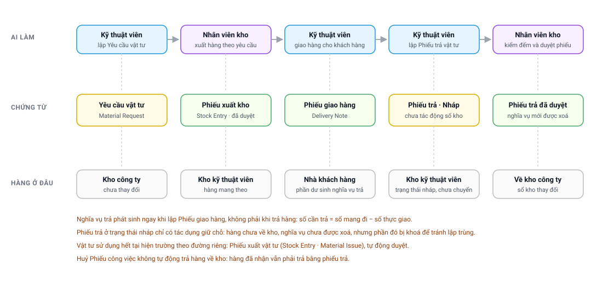

# Chặng 4 — Vật tư của kỹ thuật viên
{: .no_toc }

**Vai trò thực hiện:** Kỹ thuật viên · Nhân viên kho · Điều phối
{: .fs-3 .text-grey-dk-000 }

---

## Mục lục
{: .no_toc .text-delta }

1. TOC
{:toc}

---

## Sơ đồ chặng

---

## 1. Mô hình kho của kỹ thuật viên

Vật tư kỹ thuật viên mang theo **không nằm ngoài sổ sách**. Mỗi nhân sự được cấp một **kho
riêng** (`Warehouse`) cho từng công ty. Hàng chuyển sang kho đó vẫn thuộc tài sản công ty,
nhưng được ghi nhận theo người đang giữ.

| Quy tắc | Nội dung |
|---|---|
| Một kỹ thuật viên, một công ty | Chỉ **một** kho |
| Một kỹ thuật viên, nhiều công ty | Nhiều kho, mỗi công ty một kho |
| Kho hoàn trả mặc định | Khai riêng, **không được trùng** với kho của chính kỹ thuật viên |
| Chưa khai kho cho một công ty | Mọi thao tác vật tư tại công ty đó đều báo lỗi |

Nhờ mô hình này, hệ thống luôn xác định được vị trí của từng món hàng: kho công ty, kho của
một kỹ thuật viên cụ thể, hoặc đã bàn giao cho khách hàng.

---

## 2. Bốn luồng vật tư

| # | Luồng | Chứng từ | Người xác nhận | Trạng thái khi lập |
|---|---|---|---|---|
| ① | **Yêu cầu cấp vật tư** | Yêu cầu vật tư (`Material Request`), sau đó phiếu xuất kho (`Stock Entry`) | Kỹ thuật viên gửi yêu cầu, **kho xuất hàng** | Yêu cầu tự xác nhận, phiếu xuất do kho xác nhận |
| ② | **Sử dụng hết tại hiện trường** | Phiếu xuất vật tư (`Stock Entry` · *Material Issue*) | Kỹ thuật viên | Tự xác nhận ngay |
| ③ | **Chuyển kho giữa hai công ty** | Cặp phiếu xuất và phiếu nhập | Kỹ thuật viên | Tự xác nhận ngay, theo cặp |
| ④ | **Hoàn trả vật tư về kho** | Phiếu trả (`Stock Entry` · *Material Transfer*) | **Kho duyệt** | **Nháp**, chờ kho kiểm tra |

Điểm khác biệt quan trọng nhất nằm ở cột cuối: **chỉ luồng ④ giữ phiếu ở trạng thái nháp**.
Hàng rời kho công ty cần kho xác nhận, và hàng quay về kho công ty cũng cần kho kiểm đếm lại.

---

## 3. Luồng ① — Yêu cầu cấp vật tư

### 3.1. Yêu cầu theo một lịch hẹn

Kỹ thuật viên mở màn hình kho trên ứng dụng, chọn chức năng **Yêu cầu hàng**, sau đó chọn lịch
hẹn sắp thực hiện. Hệ thống **tổng hợp sẵn danh sách vật tư** từ ba nguồn:

| Nguồn | Nội dung lấy về |
|---|---|
| Vật tư khai trên **phiếu công việc** | Từng món kèm số lượng yêu cầu |
| Vật tư khai trên **từng dòng việc** của phiếu | Bỏ qua món đã có ở nguồn trên |
| Hàng trên **đơn bán hàng** liên kết | Số còn phải giao = số đặt − số đã giao |

Danh sách còn được xử lý thêm hai nội dung:

- **Khai triển bộ sản phẩm.** Với món là bộ, dòng cha chỉ hiển thị để tham khảo; các món thành
  phần hiển thị bên dưới với số lượng đã nhân theo bộ.
- **Trừ phần đã yêu cầu trước đó.** Số được phép yêu cầu = số cần − số đã có trong các yêu cầu
  trước. Món đã yêu cầu đủ vẫn hiển thị nhưng không chọn được, kèm mã yêu cầu cũ để tra cứu.

> Tồn kho hiện có của kỹ thuật viên **chỉ hiển thị để tham khảo**, không dùng làm căn cứ tính
> số lượng được phép yêu cầu.

### 3.2. Yêu cầu không gắn lịch hẹn

Áp dụng cho vật tư tiêu hao hoặc hàng dự phòng mang theo phương tiện. Kỹ thuật viên tìm món
theo tên, nhập số lượng, chọn kho đích nếu có nhiều kho, sau đó gửi yêu cầu. Yêu cầu loại này
**không gắn với phiếu công việc hay đơn hàng nào**.

### 3.3. Kho xử lý yêu cầu

Nhân viên kho tiếp nhận yêu cầu trên **màn hình kho** `/master-stock` hoặc trên Desk, sau đó
lập phiếu xuất kho chuyển hàng từ kho công ty sang kho kỹ thuật viên.

| Nội dung kho thực hiện được | Chi tiết |
|---|---|
| Xuất từ **nhiều kho khác nhau** | Món A từ kho này, món B từ kho khác |
| Xuất **nhiều lần** cho một yêu cầu | Hệ thống theo dõi: chưa xuất, xuất một phần, xuất đủ |
| Từ chối hoặc điều chỉnh | Trao đổi lại với kỹ thuật viên trước khi xuất |

Kỹ thuật viên theo dõi tiến độ trực tiếp trên ứng dụng.

---

## 4. Luồng ④ — Hoàn trả vật tư về kho

Đây là luồng phát sinh sai sót nhiều nhất và cũng là luồng có nhiều chốt kiểm soát nhất.

### 4.1. Thời điểm phát sinh nghĩa vụ trả

Nghĩa vụ trả **không phát sinh khi trả hàng, mà phát sinh khi lập phiếu giao hàng**. Với mỗi
dòng của đơn bán hàng:

> **Số cần trả = số kỹ thuật viên mang đi − số thực giao cho khách hàng**

Phần chênh lệch là hàng đã rời kho công ty nhưng khách hàng không tiếp nhận. Mỗi phần chênh
lệch được cấp một **mã nghĩa vụ** riêng, ghi vào đơn bán hàng kèm các thông tin: số cần trả,
thời điểm, người khai, kho của người đó tại thời điểm khai, và phiếu giao hàng làm phát sinh
nghĩa vụ.

### 4.2. Thông tin hiển thị trên ứng dụng

Màn hình *Trả vật tư* gồm hai danh sách. Danh sách nghĩa vụ hiển thị **ba con số** cho mỗi dòng:

| Con số | Ý nghĩa |
|---|---|
| **Cần trả** | Phần còn lại sau khi trừ các phiếu **đã duyệt** |
| **Đang chờ kho** | Phần đang nằm trong phiếu **nháp**, kho chưa duyệt |
| **Còn chọn được** | Cần trả − Đang chờ kho |

Danh sách thứ hai là **hàng không gắn nghĩa vụ còn trong kho**, bằng tồn kho thực tế trừ phần
đã giữ chỗ cho các nghĩa vụ và phần đang nằm trong phiếu nháp. Hai danh sách trừ chéo nhau để
cùng một món không bị tính hai lần.

### 4.3. Bốn chốt kiểm soát khi lập phiếu trả

| # | Chốt kiểm soát | Nội dung kiểm tra | Xử lý khi không đạt |
|---|---|---|---|
| 0 | **Phạm vi** | Kho nguồn là kho của chính kỹ thuật viên; kho đích cùng công ty; có tối thiểu một dòng số lượng lớn hơn 0 | **Từ chối** |
| 1 | **Đã hoàn trả đủ** | Nghĩa vụ đã có phiếu duyệt bù đủ | **Từ chối**, kèm thông báo *“đã được trả về kho rồi”* |
| 2 | **Vượt phần còn lại** | Số trả không vượt quá *số nợ − đã duyệt − đang chờ kho* | **Từ chối**, nêu rõ con số và mã phiếu đang giữ chỗ |
| 3 | **Tự gắn mã nghĩa vụ** | Hàng không gắn nghĩa vụ có khớp nghĩa vụ đang nợ tại kho này hay không | **Không từ chối** — gắn được đến đâu thì gắn, ưu tiên nghĩa vụ khai sớm nhất |
| 4 | **Đủ tồn khả dụng** | Tồn kho trừ phần đã cam kết trong các phiếu nháp khác | **Cảnh báo**, hoặc từ chối nếu tham số kiểm soát chặt đang bật |

### 4.4. Kho duyệt phiếu

Phiếu trả ở trạng thái **nháp không làm thay đổi sổ kho**. Hàng vẫn được ghi nhận tại kho kỹ
thuật viên cho tới khi kho duyệt. Tại thời điểm duyệt, hệ thống kiểm tra lại tồn kho một lần
nữa và từ chối nếu không đủ.

> 📌 Chốt kiểm tra tồn kho **khi lập phiếu chặt hơn** khi duyệt, vì có trừ thêm phần đã cam kết
> ở các phiếu nháp khác. Nhờ đó kỹ thuật viên được cảnh báo từ sớm thay vì để kho phát hiện
> thiếu hàng vào thời điểm cuối.

Phiếu nháp **luôn hiển thị ở đầu danh sách** trên ứng dụng, không phụ thuộc khoảng ngày đang
lọc, vì đây là phiếu cần được xử lý. Kỹ thuật viên xoá được phiếu nháp **do chính mình lập**;
sau khi xoá, nghĩa vụ được mở lại ngay.

📚 Nội dung chi tiết theo từng tình huống: [Trả vật tư về kho (FSMNext)](FSMNext-Tra-Vat-Tu.html).

---

## 5. Huỷ phiếu giao hàng sau khi đã hoàn trả

| Trạng thái nghĩa vụ | Cách hệ thống xử lý |
|---|---|
| Chưa được hoàn trả | Gỡ khỏi đơn bán hàng và hoàn lại số lượng của dòng đơn |
| **Đã hoàn trả bằng phiếu đã duyệt** | **Giữ lại làm dấu vết**: không yêu cầu trả nữa, đồng thời ghi rõ số đã trả và mã phiếu; số lượng dòng đơn vẫn được hoàn lại |

Người thực hiện huỷ nhận được cảnh báo liệt kê từng món, kèm lưu ý rằng hàng đang nằm tại kho
công ty và cần được lấy lại trước khi giao lại. Dấu vết này hiển thị thành một khối riêng trên
ứng dụng, tách khỏi bảng sản phẩm hoàn trả, và **mọi chốt kiểm soát khác đều bỏ qua khối này**
nên không phát sinh yêu cầu hoàn trả lần thứ hai.

---

## 6. Ngoại lệ thường gặp

| Hiện tượng | Nguyên nhân | Hướng xử lý |
|---|---|---|
| Dòng nghĩa vụ hiển thị mờ và bị khoá | Phần đó đang nằm trong một phiếu nháp chờ kho duyệt | Tra mã phiếu ghi trên dòng; chờ kho duyệt hoặc xoá phiếu nháp |
| Đã hoàn trả nhưng **nghĩa vụ vẫn còn** | Phiếu trả còn ở trạng thái nháp | Đề nghị kho duyệt; chỉ phiếu **đã duyệt** mới xoá nghĩa vụ |
| Không xoá được phiếu nháp | Phiếu do người khác lập | Đề nghị người lập phiếu hoặc quản trị viên xoá |
| Nghĩa vụ trỏ tới **mã vật tư không còn tồn tại** | Nghĩa vụ là bản ghi tại thời điểm giao hàng; việc đổi tên mã vật tư về sau không cập nhật bản ghi này | Cần tác vụ xử lý dữ liệu, không khắc phục được trên ứng dụng |
| Nghĩa vụ là **bộ sản phẩm** nhưng thành phần không khớp | Hệ thống khai triển bộ theo cấu hình **hiện tại**, không theo cấu hình tại thời điểm giao | Đối chiếu thủ công với phiếu giao hàng gốc |
| Nghĩa vụ **không ghi kho nguồn** | Dữ liệu cũ, phát sinh trước khi hệ thống ghi nhận nội dung này | Nghĩa vụ hiển thị ở mọi kho của nhân sự đó; chọn đúng kho đang giữ hàng |
| Phiếu trả **được ghi nhận vào kho của nhân sự khác** | Nghĩa vụ không khai kho đích nên hệ thống chọn kho đầu danh sách | Kiểm tra kho đích trước khi gửi; đề nghị quản trị viên khai kho hoàn trả mặc định |
| Kho kỹ thuật viên **âm tồn** | Xuất hoặc giao vượt số lượng thực nhận | Kiểm kê lại kho đó; chưa xử lý xong thì không bật tham số kiểm soát chặt |
| Duyệt nhầm **phiếu nháp tồn đọng** | Phiếu tồn từ trước, trỏ vào nghĩa vụ đã được hoàn trả bằng phiếu khác | Các phiếu này cần được **xoá**, không duyệt; duyệt sẽ trừ kho lần thứ hai |
| Hàng được cấp **ngoài phiếu yêu cầu** | Hệ thống chỉ theo dõi phần tiếp nhận qua phiếu yêu cầu | Phần ngoài luồng phải kiểm kê thủ công |

---

## 7. Chặng tiếp theo

Kỹ thuật viên đã có vật tư. Bước kế tiếp là bàn giao cho khách hàng và thu tiền:
**[Chặng 5 — Giao hàng và thu tiền](Quy-Trinh-05-Giao-Hang-Thu-Tien.html)**.
