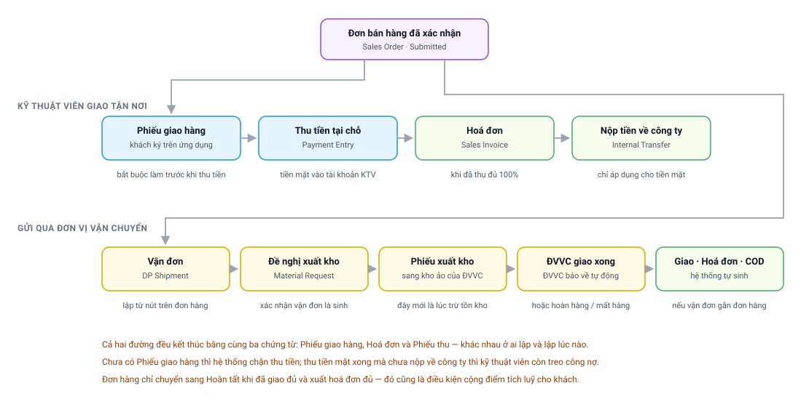

# Chặng 5 — Giao hàng và thu tiền
{: .no_toc }

**Ai làm:** Kỹ thuật viên · Kho · Kế toán · Kinh doanh
{: .fs-3 .text-grey-dk-000 }

| Nhận vào | Bàn giao ra |
|---|---|
| Vật tư đã ở kho kỹ thuật viên, gắn với một đơn bán hàng | Đơn đã giao đủ, thu đủ, có hoá đơn → [Chặng 6](Quy-Trinh-06-Bao-Duong.html) |

---

## Mục lục
{: .no_toc .text-delta }

1. TOC
{:toc}

---

## Sơ đồ chặng

  <object type="image/svg+xml" data="images/svg/quy-trinh/06-giao-hang-thu-tien.svg" style="position:absolute;inset:0;width:100%;height:100%;border:0">
    
  </object>

👆 **Bấm vào từng ô** để mở phần giải thích.
{: .fs-3 }

Hai đường giao hàng khác nhau ở **ai lập chứng từ và lập lúc nào**, nhưng cùng kết thúc bằng
**ba chứng từ giống nhau**: phiếu giao hàng (`Delivery Note`), hoá đơn (`Sales Invoice`) và
phiếu thu (`Payment Entry`).

---

## 1. Lập phiếu giao hàng
{: #giao-hang }

Trên ứng dụng: mở lịch hẹn → tab **Đơn hàng** → **Giao hàng**. Hệ thống nạp các dòng còn phải
giao của những đơn gắn với lịch hẹn.

| Điều kiện | Nội dung |
|---|---|
| Trạng thái đơn | Không thuộc *Closed*, *Cancelled*, *On Hold* |
| Dòng hàng | Còn ít nhất một dòng chưa giao hết |
| Kho | Kỹ thuật viên phải được khai kho cho công ty của đơn |
| Mỗi đơn | Phải giao ít nhất một món; không cho hoàn trả toàn bộ đơn |

**Giao đủ hay giao một phần:**

| Thao tác | Nghĩa |
|---|---|
| Giữ nguyên số lượng | Giao đủ |
| Giảm số lượng | Giao một phần; phần chênh thành **hàng hoàn trả** |
| Đặt về 0 | Không giao món đó; cả món thành hàng hoàn trả |

Màn hình xác nhận tách hai khối: **hàng hoàn trả** nền đỏ và **hàng giao** nền xanh. Khách hàng
**ký trên màn hình**; chưa ký thì nút xác nhận không bật.

> 🔗 Phần hàng hoàn trả chính là **nghĩa vụ trả vật tư** ở [Chặng 4](Quy-Trinh-04-Vat-Tu.html#tra-ve).
> Giao một phần không có nghĩa là bỏ qua phần còn lại: đó là một khoản nợ hàng.

---

## 2. Điều kiện và thao tác thu tiền
{: #dieu-kien-thu }

> ⛔ **Phải có phiếu giao hàng trước đã.** Chưa có thì hệ thống từ chối:
> *“Chưa tạo phiếu giao hàng cho … Vui lòng tạo phiếu giao hàng trước khi thanh toán.”*

Ngoài ra kỹ thuật viên phải được khai **tài khoản thu tiền** cho công ty của đơn; chưa khai thì
màn hình thu tiền không cho thao tác.

**Màn hình thu tiền làm việc theo từng dòng**, mỗi dòng gồm: thu cho đơn nào, bằng hình thức
nào, bao nhiêu tiền.

| Nội dung | Hệ thống xử lý |
|---|---|
| Dòng mặc định | Mỗi đơn còn nợ được nạp sẵn một dòng |
| Số tiền mặc định | Bằng đúng số còn nợ |
| Hình thức mặc định | **Chuyển khoản** nếu đơn có khai sẵn tài khoản ngân hàng, ngược lại **tiền mặt** |
| Thêm dòng | Được, dùng khi một đơn trả bằng hai hình thức |
| Giới hạn | Một đơn **không được hai dòng cùng hình thức** trong một lần thu |
| Số tiền | Nhỏ hơn số còn nợ cũng được; phần còn lại thu lần sau |
| Kiểm tra cuối | Tổng các dòng không lớn hơn **tổng** số còn nợ của các đơn đang xử lý |

> ⚠️ **Chốt cuối kiểm trên tổng, không kiểm từng đơn.** Thu cho nhiều đơn một lúc mà ghi dư đơn
> này, thiếu đơn kia thì vẫn lọt. Đọc lại số tiền từng dòng trước khi xác nhận.

**Dòng chuyển khoản** bắt buộc chọn tài khoản ngân hàng nhận tiền; đổi tài khoản đã chọn thì hệ
thống hỏi lại kèm cảnh báo *chỉ đổi khi có yêu cầu từ công ty*. Chọn xong, ứng dụng hiện **mã
QR** đúng tài khoản và đúng số tiền của dòng đó.

---

## 3. Ba trường hợp thu tiền
{: #ba-truong-hop }

  <object type="image/svg+xml" data="images/svg/quy-trinh/11-thu-tien.svg" style="position:absolute;inset:0;width:100%;height:100%;border:0">
    
  </object>

👆 **Bấm vào từng ô** để mở phần giải thích.
{: .fs-3 }

### 3.1. Tiền mặt và chuyển khoản khác nhau thế nào

| | Tiền mặt | Chuyển khoản |
|---|---|---|
| **Phiếu thu sau khi lập** | Chính thức ngay, không ai phải duyệt | **Nháp** |
| **Tiền vào đâu** | Tài khoản của chính kỹ thuật viên | Tài khoản ngân hàng công ty |
| **Sinh nghĩa vụ cá nhân** | **Có** — kỹ thuật viên đang giữ tiền công ty | Không |
| **Ai phải làm tiếp** | Kỹ thuật viên nộp tiền, kế toán xác nhận | Kế toán đối chiếu sao kê rồi xác nhận |
| **Đơn được tính đã thu từ lúc** | Ngay khi lập phiếu | Chỉ khi kế toán xác nhận |
| **Hoá đơn phát sinh khi** | Tác vụ tự động chạy hằng ngày, sớm nhất một ngày sau phiếu giao hàng | **Ngay lập tức** khi kế toán xác nhận phiếu thu |
| **Hỗ trợ trên ứng dụng** | Không có bước trung gian | Mã QR đúng tài khoản, đúng số tiền |

### 3.2. Khách trả bằng cả hai hình thức

Trường hợp này hệ thống hỗ trợ sẵn: **lập hai dòng thu trên cùng một đơn**, một dòng tiền mặt,
một dòng chuyển khoản. Kết quả là **hai phiếu thu riêng**, mỗi phiếu đi theo đúng đường của nó:

| Nội dung | Diễn biến |
|---|---|
| Phần tiền mặt | Chính thức ngay; kỹ thuật viên có công nợ cá nhân, phải nộp về công ty |
| Phần chuyển khoản | Nằm ở nháp cho tới khi kế toán đối chiếu sao kê |
| Đơn được coi là thu đủ | Chỉ khi **cả hai** phiếu đều chính thức |
| Hoá đơn | Phát sinh lúc phiếu sau cùng được xác nhận |
| Nghĩa vụ nộp tiền | Tính trên **phần tiền mặt**, không chờ phần chuyển khoản |

### 3.3. Ba sai sót hay gặp

| Sai sót | Hậu quả |
|---|---|
| Chọn nhầm **tiền mặt** cho khoản khách đã chuyển khoản | Kỹ thuật viên bị ghi công nợ cá nhân không có thật, phải nộp khoản tiền mình không giữ |
| Chọn nhầm **chuyển khoản** cho khoản thu bằng tiền mặt | Tiền mặt nằm ngoài sổ sách; phiếu thu nằm lại ở nháp vì kế toán không thấy giao dịch trong sao kê |
| Thu gộp nhiều đơn rồi chia sai tiền giữa các dòng | Một đơn thừa, một đơn thiếu; đơn thiếu không xuất được hoá đơn và phiếu công việc bị chặn |

---

## 4. Nộp tiền mặt về công ty
{: #nop-tien }

### 4.1. Mỗi khoản thu một phiếu nộp

Tiền mặt ở tài khoản kỹ thuật viên là **công nợ của người đó với công ty**. Nộp về bằng một
phiếu riêng (`Payment Entry` loại *Internal Transfer*).

| Nội dung | Quy tắc |
|---|---|
| Phạm vi một phiếu nộp | Gắn **đúng một khoản thu**, số tiền bằng đúng khoản đó |
| Nộp gộp nhiều khoản | Ứng dụng không hỗ trợ; lập lần lượt từng phiếu |
| Nộp một phần | Không hỗ trợ |
| Ảnh chứng từ | Đính kèm được khi lập phiếu |
| Trạng thái sau khi lập | **Nháp** — kế toán phải xác nhận |

Hai chốt bảo vệ quỹ: **không nộp trùng** một khoản thu, và **không nộp quá** số đang giữ.

### 4.2. Hệ thống đối chiếu theo liên kết, không theo số dư

Đây là chỗ hay hiểu sai nhất. Khi xét một khoản tiền mặt đã nộp về hay chưa, hệ thống **không
nhìn số dư tài khoản** mà nhìn **liên kết giữa phiếu nộp và khoản thu**.

⛔ Phiếu nộp lập thẳng trên Desk, không gắn khoản thu cụ thể, thì tiền về công ty trên sổ kế
toán nhưng **dấu nợ của khoản thu vẫn còn**. Phiếu công việc liên quan tiếp tục bị chặn, dù tiền
đã về từ lâu.

> ✅ **Quy tắc:** lập phiếu nộp **từ ứng dụng** và chọn đúng khoản thu. Không lập thủ công trên
> Desk, kể cả khi số tiền và tài khoản đều đúng.

---

## 5. Hoá đơn
{: #hoa-don }

**Điều kiện:** đơn đã thu đủ **100%**, tính trên phiếu thu **đã chính thức**. Phiếu còn nháp
không được tính.

**Ba đường hoá đơn phát sinh:**

| Đường | Ai làm | Lúc nào |
|---|---|---|
| **Lập trên ứng dụng** | Kỹ thuật viên chọn phiếu giao hàng rồi lập | Ngay tại hiện trường, sau khi thu đủ |
| **Tự phát sinh khi xác nhận phiếu thu** | Hệ thống | Ngay khi kế toán xác nhận một phiếu thu **chuyển khoản** |
| **Tác vụ tự động hằng ngày** | Hệ thống | Đơn đã giao đủ, thu đủ, và qua ít nhất một ngày kể từ phiếu giao hàng cuối |

Hệ thống lập **một hoá đơn cho mỗi phiếu giao hàng**; đơn giao nhiều lần sẽ có nhiều hoá đơn.

> 🔑 Hoá đơn đủ 100% quyết định cùng lúc ba việc: đơn sang **Hoàn tất**, khách hàng được **cộng
> điểm tích luỹ**, và hệ thống **sinh lịch bảo dưỡng** cho kỳ sau.

---

## 6. Phiếu công việc bị chặn vì lý do thanh toán
{: #wo-bi-chan }

Hệ thống luôn nói rõ lý do. Bảng dưới dịch từng thông báo sang việc cần làm.

| Thông báo | Nghĩa | Cần làm |
|---|---|---|
| *“SO …: còn nợ …”* | Tổng phiếu thu **đã chính thức** chưa bằng giá trị đơn | Xem còn phiếu thu chuyển khoản nào đang nháp; đề nghị kế toán xác nhận |
| *“SO …: thu tiền mặt nhưng chưa có Internal Transfer về công ty”* | Khoản tiền mặt chưa có phiếu nộp được xác nhận, **hoặc** đã nộp nhưng phiếu không gắn liên kết | Lập phiếu nộp từ ứng dụng, chọn đúng khoản thu. Đã nộp trên Desk thì nhờ kế toán lập lại phiếu có liên kết |
| *“SO …: đã trả về … nhưng thu … (thiếu …)”* | Tổng đã nộp nhỏ hơn tổng đã thu | Nộp nốt phần chênh. **Không có dung sai**: lệch một đồng cũng chặn |
| *“Sales Order not completed: …”* | Đơn chưa *Hoàn tất* hoặc *Đóng đơn* | Xử lý phần hoá đơn theo [mục 5](#hoa-don) |
| *“Số dư tài khoản KTV … không đủ”* | Số định nộp lớn hơn số dư đang có | Đối chiếu lại; nhiều khả năng khoản này đã nộp bằng một phiếu khác |
| *“Công nợ … đã được trả qua …”* | Khoản thu này đã có phiếu nộp, kể cả phiếu còn nháp | Không lập thêm; tra phiếu đang tồn theo mã ghi trong thông báo |

---

## 7. Sửa và huỷ phiếu thu
{: #huy-phieu }

| Nội dung | Quy định |
|---|---|
| Thời hạn huỷ trên ứng dụng | **24 giờ** kể từ lúc lập |
| Ai được huỷ | Chỉ người đã lập phiếu |
| Không huỷ được khi | Khoản thu đã có phiếu nộp đối ứng, kể cả phiếu nộp còn nháp |
| Quá hạn | Kế toán xử lý trên Desk |
| Đơn đã có hoá đơn | Huỷ ngược: hoá đơn trước, phiếu thu sau |

---

## 8. Gửi qua đơn vị vận chuyển
{: #van-chuyen }

Dùng khi khách ở xa, hàng không cần lắp đặt, hoặc chỉ gửi vật tư lẻ.

| Bước | Nội dung | Chứng từ | Tồn kho đổi |
|---|---|---|---|
| 1 | Lập vận đơn từ đơn bán hàng | Vận đơn (`DP Shipment`) | Chưa |
| 2 | Xác nhận vận đơn | Đề nghị xuất kho tự phát sinh | Chưa |
| 3 | Kho xuất hàng cho đơn vị vận chuyển | Phiếu xuất kho | **Có** — trừ kho nguồn, cộng kho đơn vị vận chuyển |
| 4 | Đẩy đơn sang đơn vị vận chuyển, nhận mã vận đơn | Ghi mã vào vận đơn | Không |
| 5 | Đơn vị vận chuyển cập nhật hành trình | Trạng thái vận đơn tự cập nhật | Không |
| 6 | Giao thành công | Phiếu giao hàng, hoá đơn và phiếu thu hộ **tự phát sinh** | **Có** — xuất khỏi kho đơn vị vận chuyển |

**Ba kết cục khác:**

| Kết cục | Hệ thống xử lý |
|---|---|
| **Hoàn về kho** | Phát sinh phiếu đảo, hàng từ kho đơn vị vận chuyển về lại kho nguồn |
| **Mất hàng** | Ghi nhận thất thoát để kế toán xử lý, **không** tự hoàn tồn kho |
| **Giao không thành công, đang hoàn** | Chỉ cập nhật trạng thái, chờ kết cục cuối |

> ⚠️ Đơn vị vận chuyển huỷ đơn **khi hàng đã lấy đi** thì **chưa huỷ vận đơn ngay**. Chờ kho
> nhận lại hàng thật rồi mới huỷ, nếu không sổ kho sai lệch.

📚 Chi tiết: [Quy trình vận đơn và giao nhận](Delivery_Partner-Quy-Trinh.html).

---

## 9. Ba kiểu “trả hàng” cần phân biệt
{: #hoan-tra }

| Cách gọi thông dụng | Thực chất là | Chứng từ |
|---|---|---|
| **Khách không nhận khi giao** | Giảm số trên phiếu giao hàng; phần chênh thành nghĩa vụ trả vật tư | Ghi trong đơn bán hàng |
| **Kỹ thuật viên trả vật tư về kho** | Chuyển hàng từ kho cá nhân về kho công ty | Phiếu trả (`Stock Entry`) |
| **Khách trả hàng sau khi đã nhận** | Đảo ngược nghiệp vụ bán đã xong | Phiếu giao hàng trả lại và hoá đơn trả lại |

Chỉ kiểu thứ ba mới **giảm doanh thu** và **thu hồi điểm tích luỹ**. Hai kiểu đầu là chuyện kho,
không phải chuyện doanh thu.

---

## 10. Khi gặp trục trặc
{: #truc-trac }

| Hiện tượng | Nguyên nhân | Cách gỡ |
|---|---|---|
| Báo *“Chưa tạo phiếu giao hàng”* khi thu tiền | Chưa lập phiếu giao hàng | Lập phiếu giao hàng trước |
| Màn hình thu tiền không cho thao tác | Chưa được khai tài khoản thu tiền cho công ty của đơn | Đề nghị quản trị viên khai |
| Không xác nhận được phiếu giao hàng | Có đơn bị hoàn trả toàn bộ số món | Mỗi đơn phải giao ít nhất một món; tách đơn nếu thực tế không giao gì |
| Nút xác nhận ở màn hình ký không bật | Khách hàng chưa ký | Đề nghị khách ký, hoặc xoá chữ ký lỗi rồi ký lại |
| Báo *“… đã có dòng Tiền mặt”* khi thêm dòng | Một đơn không được hai dòng cùng hình thức | Sửa số tiền dòng đã có, hoặc thu lần thứ hai |
| Đã thu tiền nhưng đơn **vẫn hiện còn nợ** | Phiếu thu chuyển khoản còn nháp | Đề nghị kế toán đối chiếu sao kê và xác nhận |
| Đã thu tiền mặt nhưng **vẫn còn công nợ cá nhân** | Chưa lập phiếu nộp, hoặc phiếu nộp còn nháp | Lập phiếu nộp; đề nghị kế toán xác nhận |
| Đã nộp tiền nhưng hệ thống **vẫn báo chưa nộp** | Phiếu nộp lập trên Desk, không gắn khoản thu | Xem [mục 4.2](#nop-tien); nhờ kế toán lập lại phiếu có liên kết |
| Không huỷ được phiếu thu vừa lập | Quá 24 giờ, hoặc đã có phiếu nộp đối ứng | Chuyển kế toán xử lý |
| Đơn đã giao đủ nhưng **chưa Hoàn tất** | Chưa xuất hoá đơn đủ 100% | Kế toán xuất nốt; chưa đủ thì chưa cộng điểm và chưa sinh lịch bảo dưỡng |
| Vận đơn đã xác nhận nhưng **tồn kho chưa đổi** | Đúng thiết kế: xác nhận chỉ sinh đề nghị xuất kho | Kho phải lập phiếu xuất kho thật ở bước 3 |
| Vận đơn *Delivered* nhưng **không thấy chứng từ tự sinh** | Vận đơn không gắn đơn bán hàng, hoặc kết nối trạng thái chưa bật | Kiểm bảng chứng từ nguồn trên vận đơn; vẫn không có thì báo bộ phận kỹ thuật |
| Đơn vị vận chuyển tính **sai cước, sai số kiện** | Tab kiện hàng và người trả cước khai sai trước khi đẩy đơn | Sửa **trước khi** đẩy đơn; đã đẩy rồi thì làm việc với đơn vị vận chuyển |
| Hoá đơn đã xuất nhưng khách trả hàng | Trả hàng sau bán | Lập phiếu giao trả lại và hoá đơn trả lại; hệ thống **tự thu hồi điểm tích luỹ** |

---

## 11. Câu hỏi thường gặp
{: #hoi-dap }

**Khách đưa một nửa tiền mặt, một nửa chuyển khoản, ghi thế nào?**

Lập hai dòng thu trên cùng đơn, mỗi hình thức một dòng. Xem [mục 3.2](#ba-truong-hop).

**Thu tiền mặt xong bao giờ phải nộp về công ty?**

Càng sớm càng tốt, vì chưa nộp thì phiếu công việc không hoàn thành được. Nộp từ ứng dụng và
chọn đúng khoản thu.

**Khách chuyển khoản rồi, sao hệ thống vẫn nói chưa thu?**

Phiếu thu chuyển khoản nằm ở **nháp** cho tới khi kế toán đối chiếu sao kê. Đó là bước bắt buộc.

**Thu nhầm hình thức thanh toán thì sửa sao?**

Trong **24 giờ** và chưa có phiếu nộp đối ứng thì huỷ phiếu rồi lập lại. Quá hạn thì chuyển kế toán.

**Khách chỉ nhận một phần hàng, có thu tiền được không?**

Được. Thu theo phần đã giao. Phần không giao thành nghĩa vụ trả vật tư, xem
[Chặng 4](Quy-Trinh-04-Vat-Tu.html#tra-ve).

**Đã thu đủ tiền, sao chưa thấy hoá đơn?**

Hoá đơn tiền mặt do tác vụ tự động lập, sớm nhất là một ngày sau phiếu giao hàng. Cần ngay thì
lập tay trên ứng dụng.

**Khách đòi trả lại hàng sau một tuần thì làm gì?**

Đó là trả hàng sau bán: lập phiếu giao trả lại và hoá đơn trả lại. Không dùng chức năng trả vật
tư của kỹ thuật viên, xem [mục 9](#hoan-tra).

---

## Chặng tiếp theo

Đơn đã hoàn tất. Đây là lúc hệ thống bắt đầu tính lịch chăm sóc cho kỳ sau:
**[Chặng 6 — Bảo dưỡng định kỳ](Quy-Trinh-06-Bao-Duong.html)**.
