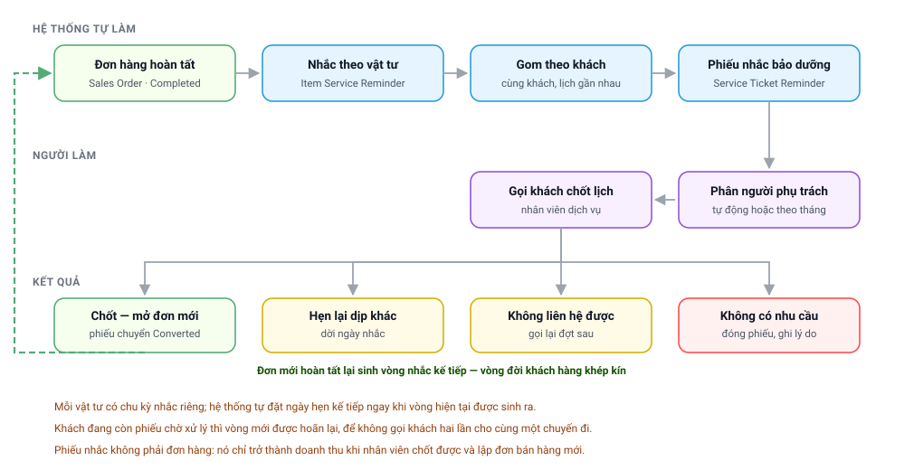

# Chặng 6 — Bảo dưỡng định kỳ và vòng lặp
{: .no_toc }

**Ai làm:** Nhân viên dịch vụ · Quản lý dịch vụ · Hệ thống tự động
{: .fs-3 .text-grey-dk-000 }

Đây là chặng khép vòng. Khách đã mua máy thì vài tháng nữa sẽ cần thay lõi, một năm nữa sẽ cần
bảo dưỡng. Hệ thống ghi nhớ điều đó ngay từ lúc đơn hàng hoàn tất, và tự nhắc đúng hạn.

---

## Mục lục
{: .no_toc .text-delta }

1. TOC
{:toc}

---

## Sơ đồ chặng

---

## 1. Hai loại “nhắc” — đừng nhầm

| Loại | Tên hệ thống | Là gì | Ai đụng tới |
|---|---|---|---|
| **Nhắc theo vật tư** | `Item Service Reminder` | Lịch của **một món** trên **một đơn**: món này bao lâu thay một lần, lần kế vào ngày nào | Hệ thống tự quản; người dùng hầu như không mở |
| **Phiếu nhắc bảo dưỡng** | `Service Ticket Reminder` | **Việc phải làm**: gọi khách này, chốt chuyến này | Nhân viên dịch vụ làm việc hằng ngày trên đây |

Quan hệ: nhiều dòng nhắc theo vật tư được **gom lại** thành một phiếu nhắc bảo dưỡng. Gom
lại để **một cuộc gọi, một chuyến đi** giải quyết được nhiều món, thay vì gọi khách ba lần
trong một tuần.

---

## 2. Bước 1 — Đơn hoàn tất sinh lịch nhắc

Ngay khi đơn bán hàng chuyển sang **Completed**, hệ thống duyệt từng món trong đơn:

| Món | Xử lý |
|---|---|
| Có khai **chu kỳ nhắc** | Sinh một dòng nhắc theo vật tư, đặt sẵn ngày hẹn kế tiếp |
| Là **bộ sản phẩm** | Nở ra từng món thành phần rồi mới xét |
| Không khai chu kỳ | Bỏ qua |

Chu kỳ khai ở danh mục cấu hình theo từng mã hàng, thường từ vài tháng tới hai năm tuỳ loại lõi.

> 🔑 **Điều kiện bắt buộc là đơn phải *Completed*.** Đơn đã giao hàng nhưng kế toán chưa xuất
> đủ hoá đơn thì vẫn đứng ở *To Bill*, và **không sinh lịch nhắc nào**. Đây là lý do phổ biến
> nhất của việc *“khách mua rồi mà không thấy hệ thống nhắc bảo dưỡng”*.

### Luật rút bớt phiếu lắt nhắt

Một cái máy gồm thân máy và nhiều lõi. Nếu nhắc cả thân máy lẫn từng lõi thì cùng một chuyến
đi lại sinh ra mấy phiếu. Hệ thống áp hai chiều luật để tránh việc đó:

- Đơn có bán **lõi lọc có chu kỳ nhắc** thì **không sinh nhắc cho thân máy** — vì đằng nào
  cũng phải xuống nhà khách thay lõi.
- Ngược lại, khi một nhắc lõi lọc vừa ra đời, các nhắc kết cấu đang chờ của cùng cái máy đó
  sẽ **được tắt đi**.

Đơn bán **máy trần**, không kèm lõi, thì vẫn sinh nhắc cho thân máy — lúc đó đó là điểm chạm
duy nhất với khách.

---

## 3. Bước 2 — Gom thành phiếu nhắc bảo dưỡng

Khi một dòng nhắc mới ra đời, hệ thống tìm xem khách đó đã có phiếu nhắc nào **đang mở** chưa:

| Tình huống | Hệ thống làm |
|---|---|
| Khách chưa có phiếu đang mở | **Lập phiếu mới** |
| Có phiếu đang mở, **cùng địa chỉ**, và ngày hẹn **gần nhau** trong khoảng cho phép | **Nối thêm** vào phiếu đó, ghi thêm mã đơn vào danh sách đơn tham chiếu |
| Có phiếu đang mở nhưng khác địa chỉ hoặc ngày cách xa | **Lập phiếu mới** |

Khoảng ngày được coi là “gần nhau” là một tham số cấu hình chung.

Phiếu nhắc mang theo: khách hàng, địa chỉ, người liên hệ, số điện thoại, tỉnh và quận, danh
sách món cần thay, **ngày hẹn trung bình** của các món, và **doanh thu ước tính**.

---

## 4. Bước 3 — Phân người phụ trách

Hệ thống chọn người gọi khách theo **sáu yếu tố cộng điểm**:

| # | Yếu tố | Ý nghĩa |
|---|---|---|
| 1 | **Người đã chăm khách trước đây** | Trọng số áp đảo — khách quen giữ đúng người |
| 2 | **Chuyên môn** | Am hiểu dòng sản phẩm của phiếu |
| 3 | **Hiệu suất** | Tỉ lệ chốt đơn trong thời gian gần đây |
| 4 | **Tương tác** | Đã trao đổi trên phiếu này gần đây |
| 5 | **Địa lý** | Phụ trách đúng tỉnh hoặc quận của khách |
| 6 | **Cân bằng tải** | Đang ít việc thì cộng, đang quá tải thì trừ |

Khi nhân viên cũ nghỉ việc, khách quen **không bị đứt liên lạc**: hệ thống truy theo số điện
thoại công ty người đó từng giữ, tìm ra người đang tiếp quản số ấy và chuyển phiếu sang.

Song song còn một cơ chế **phân việc theo tháng**, chia đều khối lượng cho từng người trong
từng tháng. Hai cơ chế loại trừ nhau bằng công tắc cấu hình.

> Người dùng **luôn sửa tay được** sau khi hệ thống gán. Mọi lần gán đều được ghi lại kèm lý do,
> tra được trong tab quản lý của phiếu.

---

## 5. Bước 4 — Gọi khách và ghi kết quả

Nhân viên dịch vụ làm việc trên danh sách phiếu nhắc, mặc định lọc theo ngày hẹn sắp tới. Sau
cuộc gọi, ghi kết quả vào ô trạng thái.

| Trạng thái | Nghĩa | Số phiếu hiện có |
|---|---|---|
| **Open** | Chưa xử lý | 43.322 |
| **Converted** | Đã chốt, đã lập đơn mới | 16.046 |
| **Reschedule Reminder Date** | Khách hẹn dịp khác, dời ngày nhắc | 12.802 |
| **Disable** | Ngừng nhắc chuỗi này | 8.725 |
| **Unable to Contact** | Không liên hệ được | 568 |
| **Lost** | Khách không có nhu cầu, có ghi lý do | 425 |
| **Contact Later** | Gọi lại sau | 356 |
| **Under Care** | Đang chăm, chưa chốt | 214 |
| **Cancelled** | Đơn đã lập bị huỷ | 78 |

Khi ghi **Lost**, hệ thống bắt chọn **lý do**: không có nhu cầu, đợi khách kiểm tra, chưa sắp
xếp được thời gian, mua bên ngoài, hẹn lại nhiều lần, không đồng ý đổi loại lõi khác. Đây là
dữ liệu đầu vào để cải thiện kịch bản bán hàng.

---

## 6. Bước 5 — Chốt thành đơn mới

Chốt được thì bấm **Create → Sales Order** ngay trên phiếu nhắc. Hệ thống mang sẵn khách hàng,
địa chỉ, liên hệ và ghi **đường dẫn ngược** về phiếu nhắc.

Khi đơn được xác nhận, phiếu nhắc **tự chuyển sang Converted**. Khi đơn bị huỷ, phiếu nhắc
**tự chuyển sang Cancelled**. Nhân viên không phải cập nhật tay.

> ⚠️ Lập đơn bằng cách tạo mới trên Desk rồi gõ tay tên khách sẽ mất đường dẫn ngược: phiếu
> nhắc nằm im ở *Open*, và công chốt đơn không được ghi cho ai.

Đơn mới này rồi cũng sẽ hoàn tất, và lại sinh lịch nhắc cho kỳ sau. **Vòng khép lại.**

---

## 7. Vòng kế tiếp và cơ chế hoãn

Ngay khi một vòng nhắc được sinh ra, hệ thống đã đặt sẵn **ngày hẹn của vòng kế tiếp** theo
chu kỳ của món hàng. Một tác vụ chạy hằng đêm sẽ quét các chuỗi tới hạn và sinh vòng mới.

Hai cơ chế bảo vệ:

| Cơ chế | Vì sao cần |
|---|---|
| **Cửa sổ vét bù** | Tác vụ quét cả vài ngày gần đây chứ không chỉ đúng ngày hôm nay. Đêm nào tác vụ chết thì đêm sau vẫn vớt được, chuỗi không bị đứt vĩnh viễn |
| **Hoãn khi khách còn phiếu chờ** | Khách đang còn phiếu chưa xử lý thì khoan sinh vòng mới, để không gọi khách hai lần cho cùng một chuyến đi. Mỗi lần hoãn dời ngày hẹn kế đi một khoảng ngắn rồi xét lại |

Cơ chế hoãn có một cửa van: phiếu chờ **đã quá hạn quá lâu** là tồn đọng chứ không phải chuyến
đi sắp tới. Để nó chặn mãi thì chuỗi khoá vĩnh viễn, nên cấu hình được ngưỡng bỏ qua.

---

## 8. Ngoại lệ thường gặp ở chặng này

| Hiện tượng | Nguyên nhân | Cách xử lý |
|---|---|---|
| Khách mua rồi nhưng **không thấy phiếu nhắc** | Đơn chưa ở trạng thái *Completed* | Kiểm tiến độ giao hàng và xuất hoá đơn của đơn đó |
| Khách mua rồi, đơn đã hoàn tất, vẫn không có nhắc | Món hàng **chưa khai chu kỳ nhắc** | Báo quản trị khai chu kỳ cho mã hàng đó |
| Một khách có **nhiều phiếu trùng nhau** | Địa chỉ khác nhau, hoặc ngày hẹn cách xa nên không gom được; hoặc dữ liệu cũ sinh trước khi có cơ chế hoãn | Gộp thủ công, đóng bớt phiếu thừa kèm ghi chú |
| Phiếu tồn đọng quá hạn rất lâu | Tồn từ đợt vét bù dữ liệu cũ | Tác vụ đêm mặc định **không đụng tới backlog quá hạn**; dọn theo đợt có kiểm soát |
| Phiếu về tay người không phù hợp | Chưa khai chuyên môn hoặc khu vực phụ trách cho nhân sự | Khai bổ sung; các phiếu sau tự đúng, phiếu cũ thì gán lại tay |
| Nhân viên nghỉ mà khách quen **không chuyển sang ai** | Số điện thoại công ty người đó giữ chưa được bàn giao | Bàn giao số theo đúng quy trình, khách quen sẽ tự chuyển |
| Đã chốt đơn nhưng **phiếu vẫn Open** | Đơn lập tay, mất đường dẫn ngược | Nhờ quản trị gắn lại, hoặc đóng phiếu thủ công kèm ghi chú |
| Cần **ngừng nhắc hẳn** cho một khách hoặc một món | Khách chuyển nhà, bỏ máy, mua nơi khác | Ghi trạng thái **Disable** kèm lý do — chuỗi dừng, không sinh vòng mới |
| Phiếu cần tách ra làm hai | Khách chỉ đồng ý thay một phần | Dùng chức năng **Tách phiếu** ngay trên form |

---

## 9. Chặng còn lại

Vòng bảo dưỡng là đường đi bình thường. Khi máy hỏng giữa chừng, khách đi cửa khác:
**[Chặng 7 — Sự cố](Quy-Trinh-07-Su-Co.html)**.
