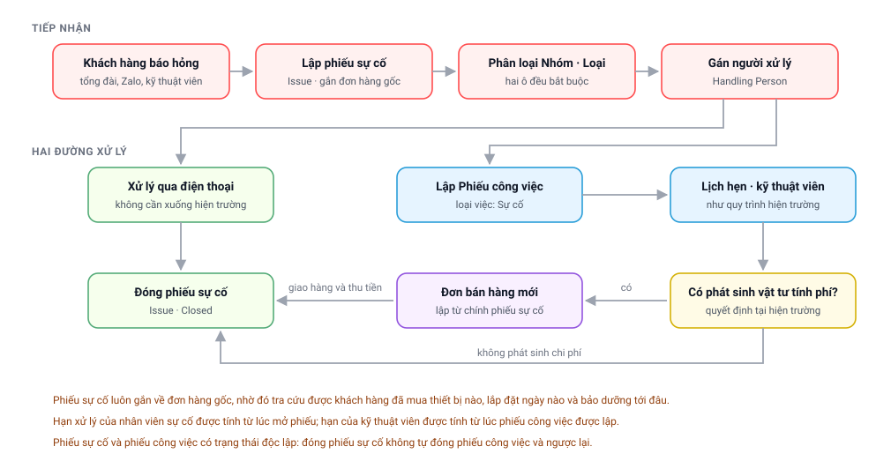

# Chặng 7 — Sự cố
{: .no_toc }

**Vai trò thực hiện:** Chăm sóc khách hàng · Điều phối · Kỹ thuật viên · Quản lý dịch vụ
{: .fs-3 .text-grey-dk-000 }

Sự cố là **đầu vào thứ hai** của hệ thống: khách hàng đã mua thiết bị, thiết bị phát sinh vấn
đề và khách hàng liên hệ lại. Từ đầu vào này có thể phát sinh một lần đến hiện trường, và
trong nhiều trường hợp phát sinh thêm một đơn hàng mới.

---

## Mục lục
{: .no_toc .text-delta }

1. TOC
{:toc}

---

## Sơ đồ chặng

---

## 1. Tiếp nhận và lập phiếu sự cố

Mỗi lượt khách hàng báo hỏng được ghi nhận thành một **phiếu sự cố** (`Issue`). Hệ thống hiện
có **25.944 phiếu**.

Nội dung quan trọng nhất khi lập phiếu là **gắn phiếu về đơn hàng gốc** — đơn hàng khách hàng
đã mua thiết bị. Trên thực tế **25.940 trên tổng số 25.944 phiếu** đều có liên kết này.

Nhờ liên kết đó, người xử lý mở phiếu là nắm được ngay:

- Khách hàng đã mua thiết bị nào và lắp đặt ngày nào.
- Tình trạng bảo dưỡng và lần thay lõi gần nhất.
- Lịch sử các lần báo hỏng trước đó của cùng khách hàng.

Phiếu cũng ghi sẵn số điện thoại và tên khách hàng, đồng thời liên kết được với nhật ký cuộc
gọi của tổng đài.

---

## 2. Phân loại hai tầng

Mỗi phiếu được phân loại bằng **hai ô, cả hai đều bắt buộc**, khai ngay khi tiếp nhận:

| Ô | Nội dung phản ánh | Thời điểm khai |
|---|---|---|
| **Nhóm sự cố** (`Issue Group`) | Nội dung khách hàng phản ánh | Ngay khi tiếp nhận thông tin |
| **Loại sự cố** (`Issue Type`) | Vị trí hoặc bộ phận phát sinh lỗi | Sau khi trao đổi thêm để xác định |

Danh mục hiện có **12 nhóm và 75 loại**. Trình tự khai linh hoạt theo cả hai chiều:

- **Chọn nhóm trước**, ô loại chỉ hiển thị các loại thuộc nhóm đó, khoảng bảy dòng thay vì bảy
  mươi lăm.
- **Chọn loại trước**, hệ thống **tự điền nhóm**. Loại thuộc nhiều nhóm thì hệ thống hiển thị
  hộp thoại để người dùng lựa chọn thay vì tự xác định.

Mỗi loại có phần mô tả liệt kê các nguyên nhân thường gặp, trích từ sơ đồ xử lý của bộ phận kỹ
thuật. Đây là nội dung tham khảo, không phải ô bắt buộc điền.

📚 Hướng dẫn quản trị danh mục: [Phân loại sự cố (Nhóm · Loại)](Phan-Loai-Su-Co.html).

---

## 3. Hai hướng xử lý

Sau khi gán **người xử lý** (`Handling Person`), phiếu đi theo một trong hai hướng.

### Hướng 1 — Xử lý dứt điểm qua điện thoại

Nhiều trường hợp chỉ do khách hàng chưa quen sử dụng thiết bị hoặc thao tác chưa đúng. Nhân
viên hướng dẫn qua điện thoại là xử lý xong, ghi kết quả vào ô **Resolution Details** rồi đóng
phiếu.

Riêng nhóm *Khách chưa quen dùng máy* hiện có **2.296 trường hợp**, đủ để thấy đây không phải
hướng ngoại lệ.

### Hướng 2 — Cử kỹ thuật viên xuống hiện trường

Chọn **Create → FS Work Order** ngay trên phiếu sự cố. Hệ thống điền sẵn khách hàng, mô tả sự
cố và ghi liên kết ngược về phiếu. Loại việc được chọn là ***Sự cố***.

Từ đây, phiếu công việc vận hành theo đúng [Chặng 3](Quy-Trinh-03-Hien-Truong.html): lập lịch
hẹn, gán kỹ thuật viên, thực hiện tại hiện trường và hoàn thành.

Hệ thống hiện có **3.350 phiếu công việc loại *Sự cố***, phân bố như sau:

| Trường hợp | Số phiếu | Ý nghĩa |
|---|---|---|
| Gắn phiếu sự cố, **không** gắn đơn hàng | 1.444 | Sửa chữa không phát sinh chi phí, hoặc còn trong thời hạn bảo hành |
| Gắn **đồng thời** phiếu sự cố và đơn hàng | 1.943 | Có thay vật tư tính phí |

---

## 4. Trường hợp sự cố phát sinh đơn hàng mới

Khi đến hiện trường mới xác định được cần thay linh kiện có tính phí, nhân sự lập **đơn bán
hàng mới** ngay từ phiếu sự cố bằng chức năng **Create → Sales Order**. Hệ thống hiện ghi nhận
**3.321 đơn** phát sinh theo hướng này.

Đơn mới vận hành đầy đủ các chặng như mọi đơn khác: giao hàng, xuất hoá đơn, thu tiền. Do đơn
cũng sẽ chuyển sang trạng thái **Hoàn tất**, đơn này đồng thời **phát sinh lịch bảo dưỡng cho
kỳ kế tiếp**. Như vậy một trường hợp sự cố có thể đưa khách hàng quay lại vòng chăm sóc định kỳ.

> 💡 Đây là lý do cần lập đơn **từ chức năng trên phiếu sự cố** thay vì tạo mới trên Desk: liên
> kết được giữ lại giúp xác định doanh thu này phát sinh từ trường hợp sự cố nào.

---

## 5. Trạng thái phiếu sự cố

| Trạng thái | Ý nghĩa | Số phiếu |
|---|---|---|
| **Closed** | Đã đóng | 19.864 |
| **On Hold** | Đang tạm dừng, chờ khách hàng hoặc chờ linh kiện | 5.738 |
| **Resolved** | Đã xử lý, chờ xác nhận | 232 |
| **Replied** | Đã phản hồi khách hàng | 109 |
| **Open** | Đang mở | 1 |

Khối **On Hold** với 5.738 phiếu là nội dung cán bộ quản lý cần theo dõi: đây là phần tồn đọng
thực tế, không phải phiếu đang được xử lý.

> ⚠️ **Phiếu sự cố và phiếu công việc có trạng thái độc lập.** Đóng phiếu sự cố không đóng
> phiếu công việc và ngược lại. Hai chứng từ phải được kết thúc riêng.

---

## 6. Đo hiệu suất theo hai mốc thời gian

Hệ thống đo hai nhóm nhân sự theo hai cách khác nhau, và **kết quả không cộng chung được**:

| Nội dung | Nhân viên sự cố | Kỹ thuật viên |
|---|---|---|
| **Đối tượng** | Người được ghi tại ô *Handling Person* trên phiếu sự cố | Người được gán vào lịch hẹn của phiếu công việc |
| **Mốc bắt đầu tính hạn** | Thời điểm mở phiếu sự cố | Thời điểm **phiếu công việc được lập** |
| **Điều kiện coi là hoàn thành** | Phiếu được đóng, **hoặc** có phiếu công việc đầu tiên | Phiếu công việc chuyển sang *Completed* hoặc *Closed* |

Kỹ thuật viên được tính từ thời điểm phiếu công việc phát sinh chứ không phải từ thời điểm
khách hàng báo hỏng, nhằm bảo đảm phần chậm trễ ở khâu tiếp nhận không tính vào kết quả của
kỹ thuật viên.

Công thức: `Tỉ lệ đạt = Đúng hạn ÷ (Đúng hạn + Trễ hạn + Quá hạn chưa xong)`. Các trường hợp
**còn trong hạn** được loại khỏi mẫu số một cách có chủ đích, để những trường hợp vừa mở không
làm sai lệch tỉ lệ của cả kỳ báo cáo.

📚 Nội dung chi tiết: [Hiệu suất xử lý sự cố](Hieu-Suat-Xu-Ly-Su-Co.html).

---

## 7. Ngoại lệ thường gặp

| Hiện tượng | Nguyên nhân | Hướng xử lý |
|---|---|---|
| Không xác định được khách hàng đã mua thiết bị nào | Phiếu chưa gắn về đơn hàng gốc | Tra đơn hàng của khách hàng và gắn vào ô chứng từ tham chiếu |
| Ô **Loại sự cố** không có giá trị nào sau khi chọn nhóm | Nhóm đó chưa được khai loại nào | Chọn nhóm khác, hoặc đề nghị quản trị viên khai loại cho nhóm |
| Thay đổi nhóm làm mất loại đang chọn | Loại cũ không thuộc nhóm mới | Chọn lại loại. Trên phiếu **đã lưu**, hệ thống chỉ cảnh báo chứ không tự xoá |
| Phiếu công việc đã hoàn thành nhưng **phiếu sự cố vẫn mở** | Hai chứng từ có trạng thái độc lập | Đóng phiếu sự cố riêng, kèm ghi nhận kết quả |
| Phiếu sự cố đã đóng nhưng **phiếu công việc vẫn ở New** | Cùng nguyên nhân trên | Xem [Chặng 3, mục 5](Quy-Trinh-03-Hien-Truong.html#5-sáu-điều-kiện-hoàn-thành-phiếu-công-việc) |
| Đơn hàng sửa chữa không truy được về trường hợp sự cố | Đơn lập thủ công trên Desk thay vì lập từ chức năng trên phiếu | Đề nghị quản trị viên gắn lại liên kết |
| Phiếu tồn đọng ở **On Hold** trong thời gian dài | Chờ linh kiện, chờ khách hàng sắp xếp, hoặc chưa được theo dõi | Rà soát định kỳ danh sách *On Hold*; đóng các trường hợp đã xử lý xong nhưng chưa cập nhật |
| Tỉ lệ đạt của một nhân sự giảm bất thường | Có trường hợp quá hạn chưa hoàn thành nằm trong mẫu số | Chọn vào con số trên báo cáo để xem chi tiết từng trường hợp |

---

## 8. Trang còn lại

Toàn bộ tình huống bất thường của cả tám chặng được tập hợp thành một bảng tra cứu:
**[Ngoại lệ, lỗi và bất thường](Quy-Trinh-08-Ngoai-Le.html)**.
