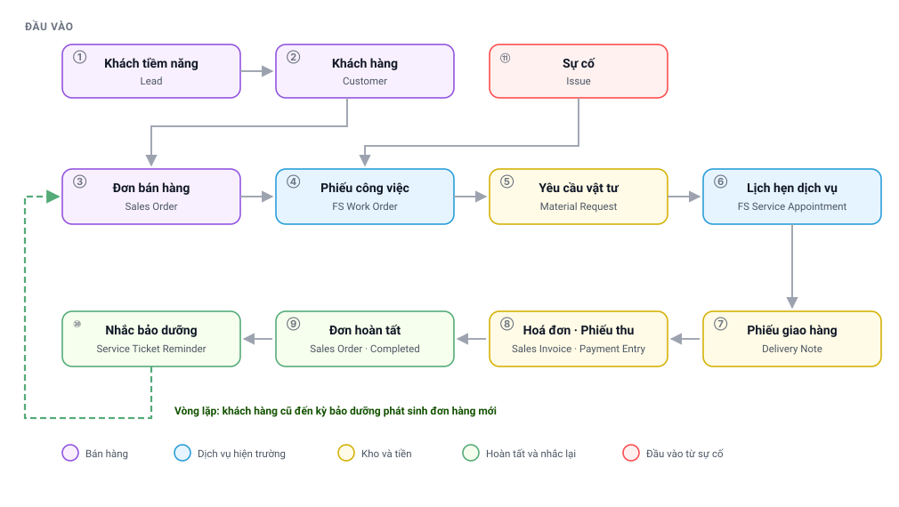

# Tổng quan toàn chuỗi
{: .no_toc }

Trang tra cứu: tên chứng từ, ai làm trên màn hình nào, và bốn nguyên tắc giải thích hầu hết
các trường hợp hệ thống từ chối thao tác.
{: .fs-3 .text-grey-dk-000 }

---

## Mục lục
{: .no_toc .text-delta }

1. TOC
{:toc}

---

## 1. Bản đồ toàn chuỗi
{: #ban-do }

<div style="position:relative;width:100%;padding-bottom:56.44%">
  <object type="image/svg+xml" data="images/svg/quy-trinh/01-toan-canh.svg" style="position:absolute;inset:0;width:100%;height:100%;border:0">
    
  </object>
</div>

👆 **Bấm vào từng ô trong sơ đồ** để mở phần giải thích.
{: .fs-3 }

Điều quan trọng nhất trên sơ đồ là **vòng khép kín**: máy lọc nước phải thay lõi và bảo dưỡng
theo chu kỳ, nên mỗi đơn hoàn tất đều tự sinh lịch chăm sóc cho kỳ sau, và lịch đó lại mở ra
một đơn hàng mới.

---

## 2. Hai đầu vào, một dây chuyền
{: #dau-vao }

| Đầu vào | Chứng từ mở đầu | Ai lập | Khi nào |
|---|---|---|---|
| Khách hàng mới muốn mua | Khách tiềm năng (`Lead`) | Kinh doanh · Chăm sóc khách hàng | Khách gọi tổng đài, nhắn tin, để lại thông tin trên website, hoặc được giới thiệu |
| Khách hàng cũ báo hỏng | Phiếu sự cố (`Issue`) | Chăm sóc khách hàng | Thiết bị đã mua phát sinh vấn đề |

Luồng thứ ba — phiếu nhắc bảo dưỡng — **không phải đầu vào mà là vòng quay lại**: hệ thống tự
lập từ đơn hàng cũ, chỉ dành cho khách hàng đã từng mua.

Cả ba luồng sau đó đi chung một dây chuyền: **đơn bán hàng → phiếu công việc → hiện trường →
giao hàng → thu tiền**.

---

## 3. Tên chứng từ: tiếng Việt và tên trên hệ thống
{: #chung-tu }

Tài liệu gọi tên tiếng Việt cho dễ đọc. Khi tìm trên hệ thống, phải gõ **tên ở cột giữa**.

| Tên trong tài liệu | Gõ tìm bằng | Dùng để |
|---|---|---|
| Khách tiềm năng | `Lead` | Hồ sơ khách chưa phát sinh giao dịch |
| Khách hàng | `Customer` | Hồ sơ khách hàng chính thức |
| Liên hệ · Địa chỉ | `Contact` · `Address` | Người liên hệ; địa điểm lắp đặt và giao hàng |
| Đơn bán hàng | `Sales Order` | Cam kết bán: hàng hoá, giá trị, người phụ trách |
| Phiếu công việc | `FS Work Order` | Hồ sơ trung tâm của một vụ việc kỹ thuật |
| Lịch hẹn dịch vụ | `FS Service Appointment` | Một buổi kỹ thuật viên có mặt tại hiện trường |
| Yêu cầu vật tư | `Material Request` | Đề nghị cấp hàng từ kho công ty |
| Phiếu kho các loại | `Stock Entry` | Mọi lần hàng đổi kho: xuất, nhập, chuyển, trả |
| Phiếu giao hàng | `Delivery Note` | Xác nhận khách hàng đã nhận hàng |
| Hoá đơn | `Sales Invoice` | Ghi nhận doanh thu và công nợ |
| Phiếu thu · phiếu nộp tiền | `Payment Entry` | Mọi lần phát sinh dòng tiền |
| Vận đơn | `DP Shipment` | Lô hàng gửi qua đơn vị vận chuyển |
| Phiếu sự cố | `Issue` | Trường hợp khách hàng báo hỏng |
| Nhắc theo vật tư | `Item Service Reminder` | Lịch nhắc của một vật tư trên một đơn |
| Phiếu nhắc bảo dưỡng | `Service Ticket Reminder` | Việc liên hệ khách hàng, gom nhiều lịch nhắc |
| Kho các loại | `Warehouse` | Kho công ty, kho kỹ thuật viên, kho đơn vị vận chuyển |

> ⚠️ **Hai chỗ hay nhầm.** Phiếu xuất kho, nhập kho, chuyển kho và trả vật tư là **cùng một
> loại chứng từ** (`Stock Entry`), chỉ khác ô *Mục đích*. Phiếu thu và phiếu nộp tiền cũng là
> **cùng một loại** (`Payment Entry`), chỉ khác ô *Loại thanh toán*.

---

## 4. Ai làm việc trên màn hình nào
{: #vai-tro }

| Vai trò | Màn hình | Phần việc |
|---|---|---|
| Kinh doanh · Chăm sóc khách hàng | Desk | Khách tiềm năng, khách hàng, đơn bán hàng, phiếu sự cố |
| Nhân viên dịch vụ | Desk · `/service-report` | Phiếu nhắc bảo dưỡng, liên hệ khách hàng, lập đơn mới |
| Điều phối | `/smart-scheduler` | Lập lịch hẹn, gán kỹ thuật viên, theo dõi lịch toàn đội |
| Kỹ thuật viên | `/technician` | Nhận việc, check-in, yêu cầu vật tư, giao hàng, thu tiền |
| Kho | `/master-stock` · Desk | Xuất hàng theo yêu cầu, duyệt phiếu trả vật tư |
| Kế toán | Desk | Hoá đơn, phiếu thu, đối chiếu công nợ |
| Quản lý dịch vụ | `/service-report` · `/fsm-report` | Theo dõi tồn đọng, hiệu suất, doanh thu dịch vụ |

> Hệ thống dịch vụ hiện trường đã **đổi sang nền tảng mới từ tháng 03/2026**. Vụ việc cũ hơn
> mốc này nằm trên nền tảng cũ và chỉ để tra cứu.

---

## 5. Bốn loại việc tại hiện trường
{: #loai-viec }

| Loại việc | Thường phát sinh từ |
|---|---|
| **Bảo dưỡng** | Phiếu nhắc bảo dưỡng được khách hàng đồng ý, lập thành đơn |
| **Sự cố** | Khách hàng báo hỏng |
| **Lắp đặt** | Đơn bán thiết bị mới |
| **Khảo sát** | Đo mẫu nước, khảo sát mặt bằng trước khi ký hợp đồng |

⚠️ Loại việc quyết định **yêu cầu khi hoàn thành phiếu**: loại thì bắt buộc đính kèm ảnh, loại
thì bắt buộc lập phiếu giao hàng, loại thì bắt buộc thu tiền. Chọn sai loại việc là bị hỏi
những thứ không liên quan, hoặc bỏ sót thứ lẽ ra phải kiểm.

---

## 6. Bốn nguyên tắc vận hành
{: #nguyen-tac }

### 6.1. Chứng từ đi một chiều; muốn quay lại phải huỷ ngược

Mỗi chứng từ sinh ra chứng từ sau và **khoá chứng từ trước**. Muốn sửa chứng từ ở giữa chuỗi,
phải huỷ ngược từ cuối về:

```
Phiếu thu  →  Hoá đơn  →  Phiếu giao hàng  →  Đơn bán hàng
  huỷ 1       huỷ 2         huỷ 3           mới sửa được
```

### 6.2. Trạng thái các chứng từ độc lập với nhau

Đây là chỗ dễ hiểu nhầm nhất:

- Lịch hẹn hoàn tất **không** tự chuyển phiếu công việc sang hoàn tất.
- Đơn hàng hoàn tất **không** tự đóng phiếu công việc.
- Đóng phiếu sự cố **không** đóng phiếu công việc.

Mỗi chứng từ có bộ điều kiện riêng và phải được kết thúc riêng. Đây là thiết kế có chủ đích:
một vụ việc có thể cần nhiều lần xuống hiện trường, một đơn hàng có thể chỉ giao được một phần.

### 6.3. Chứng từ nháp chưa làm thay đổi gì

Nháp mới chỉ là dự kiến: sổ kho chưa đổi, công nợ chưa đổi, nghĩa vụ chưa được xoá. Phải
**xác nhận** thì hệ thống mới ghi nhận.

Ngoại lệ duy nhất: phiếu trả vật tư ở trạng thái nháp có **giữ chỗ** phần hàng tương ứng để
không lập trùng, dù sổ kho chưa đổi.

### 6.4. Có những thiếu sót hệ thống không cảnh báo

| Khai thiếu | Hậu quả, phát hiện muộn |
|---|---|
| Khách hàng chưa được gán chương trình tích điểm | Không được cộng điểm, thường chỉ lộ ra khi khách hàng khiếu nại |
| Không khai người giới thiệu ngay ở phiếu khách tiềm năng | Người giới thiệu không được tính thưởng, về sau rất khó sửa |
| Chọn sai loại việc trên phiếu công việc | Bỏ sót yêu cầu bắt buộc, hoặc bị hỏi nội dung không liên quan |
| Kho nguồn chưa khai điểm gửi hàng | Đơn vị vận chuyển đến lấy hàng sai địa điểm |

---

## 7. Câu hỏi thường gặp
{: #hoi-dap }

**Tìm một chứng từ trên hệ thống thế nào?**

Gõ `Ctrl+K` rồi nhập **tên tiếng Anh** ở [bảng mục 3](#chung-tu). Gõ tên tiếng Việt thường
không ra.

**Đơn đã xong hết việc mà phiếu công việc vẫn chưa đóng, có phải lỗi không?**

Không. Xem [nguyên tắc 6.2](#nguyen-tac): hai chứng từ kết thúc riêng. Cách đóng phiếu công
việc xem [Chặng 3](Quy-Trinh-03-Hien-Truong.html#dieu-kien).

**Đã lập phiếu rồi mà số liệu không đổi?**

Nhiều khả năng phiếu còn ở trạng thái **nháp**. Xem [nguyên tắc 6.3](#nguyen-tac).

**Lỡ sai ở đơn hàng đã giao hàng và xuất hoá đơn, sửa thế nào?**

Phải huỷ ngược theo đúng thứ tự ở [nguyên tắc 6.1](#nguyen-tac). Trình tự chi tiết nằm ở
[Chặng 2](Quy-Trinh-02-Don-Hang.html#sua-don).

**Công ty có nhiều pháp nhân, làm sao biết đơn thuộc pháp nhân nào?**

Theo ô **Công ty** trên hồ sơ khách hàng, được suy ra từ nguồn khách hàng lúc tiếp nhận. Xem
[Chặng 1](Quy-Trinh-01-Khach-Hang.html#nguon).

---

## 8. Đọc tiếp
{: #doc-tiep }

| Bạn cần | Mở trang |
|---|---|
| Nắm mạch chung theo một đơn hàng cụ thể | [Vòng đời một đơn hàng](Quy-Trinh-Vong-Doi-Don-Hang.html) |
| Làm đúng phần việc của mình | [Danh sách các chặng](00-quy-trinh.html) |
| Gỡ một tình huống đang bị chặn | [Khi gặp trục trặc](Quy-Trinh-08-Ngoai-Le.html) |
