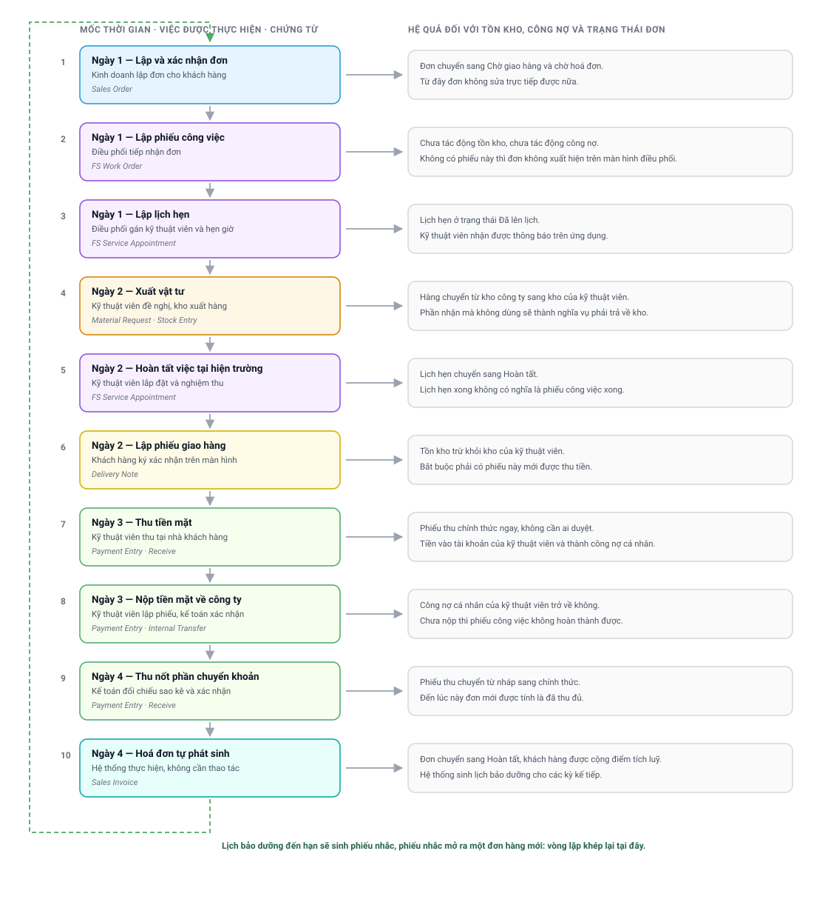

# Vòng đời một đơn hàng
{: .no_toc }

**Đối tượng:** mọi vai trò · **Thời lượng đọc:** khoảng 12 phút
{: .fs-3 .text-grey-dk-000 }

Các chặng từ 1 đến 8 được trình bày theo từng bộ phận: mỗi trang mô tả trọn vẹn phần việc của
một nhóm người dùng. Cách tổ chức đó thuận tiện khi tra cứu, nhưng không cho thấy các phần việc
nối vào nhau như thế nào.

Trang này đi theo hướng ngược lại. Tài liệu chọn **một đơn hàng có thật** và bám theo đơn đó từ
lúc được lập cho tới lúc hệ thống sinh lịch bảo dưỡng cho kỳ kế tiếp, nêu rõ tại mỗi mốc: ai
thao tác, chứng từ nào phát sinh, tồn kho và công nợ thay đổi ra sao, và nếu mốc đó bị bỏ sót
thì chặng phía sau bị chặn ở đâu.

---

## Mục lục
{: .no_toc .text-delta }

1. TOC
{:toc}

---

## 1. Toàn bộ vòng đời trên một sơ đồ

Sơ đồ có ba nội dung cần đọc:

1. **Cột trái là trình tự bắt buộc.** Không mốc nào được phép đứng trước mốc trên nó. Hệ thống
   kiểm soát trình tự này bằng các chốt chặn, không phụ thuộc vào thói quen làm việc.
2. **Cột phải cho biết mốc đó đã làm thay đổi cái gì.** Nhiều mốc không làm thay đổi tồn kho
   hay công nợ; các mốc đó chỉ ghi nhận thông tin điều hành.
3. **Đường đứt nét bên trái là vòng lặp.** Đơn hàng kết thúc không có nghĩa là quan hệ với
   khách hàng kết thúc: mốc cuối cùng sinh ra lịch chăm sóc cho các năm tiếp theo.

---

## 2. Đơn hàng được dùng làm ví dụ

Toàn bộ mốc thời gian dưới đây được trích từ dữ liệu vận hành thực tế. Mã chứng từ và tên khách
hàng đã được che; tên mặt hàng được ghi theo chủng loại thay cho tên thương mại.

| Nội dung | Giá trị |
|---|---|
| Mã đơn | `SO-26-3447xx` |
| Giá trị đơn | 65.550.000 đồng |
| Mặt hàng | Một hệ thống lọc tổng, kèm bộ lõi lọc, vỏ cốc, phụ kiện lắp đặt và thiết bị theo dõi |
| Loại việc tại hiện trường | Lắp đặt |
| Hình thức thanh toán | Đặt cọc chuyển khoản, phần lớn thu tiền mặt tại nhà khách hàng, phần còn lại chuyển khoản |
| Thời gian từ lúc lập đơn tới lúc đơn hoàn tất | 2 ngày 21 giờ |
| Số chứng từ phát sinh | 11 chứng từ thuộc 8 loại khác nhau |

Đơn này được chọn vì có đủ các tình huống thường gặp: có đặt cọc trước, có xuất vật tư cho kỹ
thuật viên, có thu tiền mặt tại hiện trường và có phần thu bằng chuyển khoản. Một đơn chỉ thanh
toán bằng một hình thức sẽ có ít mốc hơn, nhưng thứ tự các mốc không thay đổi.

---

## 3. Mười mốc và diễn giải từng mốc

### Mốc 1 — Lập và xác nhận đơn bán hàng

**Ngày 1, 11:48. Người thực hiện: nhân viên kinh doanh.**

Nhân viên kinh doanh lập đơn bán hàng (`Sales Order`) cho khách hàng và xác nhận đơn ngay trong
cùng buổi làm việc. Ngay sau đó, kế toán ghi nhận khoản đặt cọc 5.500.000 đồng khách hàng đã
chuyển khoản.

Việc xác nhận đơn là mốc pháp lý đầu tiên: từ thời điểm này đơn không sửa trực tiếp được nữa,
mọi điều chỉnh phải đi qua thao tác riêng. Công nợ còn lại của đơn là 60.050.000 đồng.

> 📖 Chi tiết: [Chặng 2 — Đơn bán hàng](Quy-Trinh-02-Don-Hang.html)

### Mốc 2 — Lập phiếu công việc

**Ngày 1, 11:54. Người thực hiện: điều phối.**

Sáu phút sau khi đơn được xác nhận, điều phối lập phiếu công việc (`FS Work Order`) gắn với đơn.
Phiếu công việc mô tả phần việc phải làm tại hiện trường; phiếu **không** làm thay đổi tồn kho
và **không** làm thay đổi công nợ.

Đây là điểm bàn giao giữa bộ phận kinh doanh và bộ phận dịch vụ. Đơn không có phiếu công việc
thì không xuất hiện trên màn hình điều phối, và không kỹ thuật viên nào nhìn thấy đơn đó.

> 📖 Chi tiết: [Chặng 3 — Điều phối và hiện trường](Quy-Trinh-03-Hien-Truong.html)

### Mốc 3 — Lập lịch hẹn và gán kỹ thuật viên

**Ngày 1, 14:33. Người thực hiện: điều phối.**

Điều phối lập lịch hẹn (`FS Service Appointment`) cho 08:00 sáng hôm sau và gán kỹ thuật viên
phụ trách. Kỹ thuật viên nhận được thông báo trên ứng dụng.

Một phiếu công việc có thể có nhiều lịch hẹn, ví dụ khi công việc phải chia làm nhiều buổi hoặc
phải quay lại lần thứ hai. Trạng thái của lịch hẹn và trạng thái của phiếu công việc là hai
trạng thái độc lập.

### Mốc 4 — Đề nghị vật tư và kho xuất hàng

**Ngày 2, 15:53 đến 16:09. Người thực hiện: kỹ thuật viên đề nghị, nhân viên kho xuất.**

Kỹ thuật viên lập đề nghị cấp vật tư (`Material Request`) lúc 15:53, kho xuất hàng bằng phiếu
xuất kho (`Stock Entry`) lúc 16:09. Hàng chuyển từ kho công ty sang **kho riêng của kỹ thuật
viên**.

Trong đơn ví dụ, hai chứng từ này được lập vào cuối buổi làm việc, sau khi công việc đã xong
trên thực tế. Đây là cách làm phổ biến và hệ thống chấp nhận, nhưng cần lưu ý: chừng nào phiếu
xuất kho chưa được lập thì trên sổ sách hàng vẫn nằm ở kho công ty, và kỹ thuật viên chưa lập
được phiếu giao hàng.

Hàng nằm ở kho của kỹ thuật viên vẫn là tài sản của công ty. Kể từ mốc này, kỹ thuật viên có
một nghĩa vụ mới: phần hàng nhận mà không giao cho khách hàng phải được hoàn trả về kho.

> 📖 Chi tiết: [Chặng 4 — Vật tư của kỹ thuật viên](Quy-Trinh-04-Vat-Tu.html)

### Mốc 5 — Hoàn tất công việc tại hiện trường

**Ngày 2, 16:08. Người thực hiện: kỹ thuật viên.**

Kỹ thuật viên lắp đặt, nghiệm thu với khách hàng và kết thúc lịch hẹn trên ứng dụng. Lịch hẹn
chuyển sang trạng thái Hoàn tất.

Lịch hẹn hoàn tất **không** kéo theo phiếu công việc hoàn tất. Phiếu công việc còn phải thoả
thêm các điều kiện về giao hàng, thanh toán và hoàn trả vật tư.

### Mốc 6 — Lập phiếu giao hàng

**Ngày 2, 16:11. Người thực hiện: kỹ thuật viên, khách hàng ký xác nhận.**

Kỹ thuật viên lập phiếu giao hàng (`Delivery Note`) ngay tại nhà khách hàng, ba phút sau khi kết
thúc công việc. Khách hàng ký xác nhận trên màn hình điện thoại; khi chưa có chữ ký, chức năng
xác nhận không được kích hoạt.

Tồn kho được trừ khỏi kho của kỹ thuật viên tại mốc này. Đơn chuyển sang trạng thái Đã giao đủ.

> ⛔ **Đây là điều kiện bắt buộc để được thu tiền.** Chưa có phiếu giao hàng thì thao tác thu
> tiền bị hệ thống từ chối.

### Mốc 7 — Thu tiền mặt tại hiện trường

**Ngày 3, 06:46. Người thực hiện: kỹ thuật viên.**

Kỹ thuật viên thu 60.000.000 đồng tiền mặt và lập phiếu thu (`Payment Entry`). Phiếu thu tiền
mặt được ghi nhận chính thức ngay lập tức, không cần ai duyệt.

Tiền được ghi vào **tài khoản của chính kỹ thuật viên**, nghĩa là từ thời điểm này kỹ thuật viên
đang giữ tiền của công ty và có một khoản công nợ cá nhân tương ứng.

> 📖 Chi tiết: [Chặng 5 — Giao hàng và thu tiền](Quy-Trinh-05-Giao-Hang-Thu-Tien.html#3-ba-trường-hợp-thu-tiền-và-hệ-quả-của-từng-trường-hợp)

### Mốc 8 — Nộp tiền mặt về công ty

**Ngày 3, 08:11. Người thực hiện: kỹ thuật viên lập phiếu, kế toán xác nhận.**

Một giờ hai mươi lăm phút sau khi thu, kỹ thuật viên lập phiếu nộp tiền và kế toán xác nhận.
Công nợ cá nhân của kỹ thuật viên trở về không.

Khi khoản tiền mặt chưa được nộp, hệ thống **không cho phép hoàn thành phiếu công việc**. Đây là
một trong những nguyên nhân phổ biến nhất khiến phiếu công việc không hoàn thành được.

### Mốc 9 — Thu nốt phần chuyển khoản

**Ngày 4, 08:51. Người thực hiện: kế toán.**

Phần còn lại 50.000 đồng được khách hàng chuyển khoản. Khác với tiền mặt, **phiếu thu chuyển
khoản được lập ở trạng thái nháp** và chỉ chính thức khi kế toán đối chiếu sao kê ngân hàng rồi
xác nhận.

Trong suốt thời gian phiếu còn nháp, hệ thống vẫn tính đơn là chưa thu đủ.

### Mốc 10 — Hoá đơn phát sinh và đơn hoàn tất

**Ngày 4, 08:55. Người thực hiện: hệ thống.**

Bốn phút sau khi kế toán xác nhận phiếu thu cuối cùng, hệ thống **tự lập hoá đơn**
(`Sales Invoice`) 65.550.000 đồng. Không ai phải thao tác.

Hoá đơn kéo theo ba hệ quả cùng lúc:

| Hệ quả | Nội dung |
|---|---|
| Trạng thái đơn | Đơn chuyển sang **Hoàn tất** |
| Điểm tích luỹ | Khách hàng được cộng điểm theo giá trị hoá đơn |
| Lịch chăm sóc | Hệ thống sinh **bốn lịch bảo dưỡng** cho các kỳ kế tiếp |

---

## 4. Ba nghĩa vụ chạy song song trong suốt vòng đời

Điểm khiến người dùng mới khó theo dõi nhất là trong cùng một đơn hàng có **ba nghĩa vụ khác
nhau** cùng tồn tại. Ba nghĩa vụ này phát sinh ở ba thời điểm khác nhau, do ba nhóm người khác
nhau thực hiện, và được xoá bằng ba chứng từ khác nhau.

| | Nghĩa vụ giao hàng | Nghĩa vụ hoàn trả vật tư | Nghĩa vụ nộp tiền |
|---|---|---|---|
| **Phát sinh khi** | Đơn được xác nhận (mốc 1) | Kho xuất vật tư cho kỹ thuật viên (mốc 4) | Kỹ thuật viên thu tiền mặt (mốc 7) |
| **Người gánh** | Bộ phận dịch vụ | Kỹ thuật viên | Kỹ thuật viên |
| **Nội dung** | Còn bao nhiêu món chưa giao cho khách hàng | Còn bao nhiêu món đã nhận mà chưa dùng, chưa trả | Còn bao nhiêu tiền của công ty đang giữ |
| **Xoá bằng** | Phiếu giao hàng (`Delivery Note`) | Phiếu trả vật tư (`Stock Entry`) được kho duyệt | Phiếu nộp tiền (`Payment Entry` loại *Internal Transfer*) được kế toán xác nhận |
| **Chưa xoá thì bị chặn gì** | Không được thu tiền, không xuất được hoá đơn | Phiếu công việc không hoàn thành được khi chốt kiểm soát đang bật | Phiếu công việc không hoàn thành được |
| **Chứng từ nháp có tính không** | Không áp dụng | **Không** — phiếu trả còn nháp thì nghĩa vụ vẫn còn nguyên | **Không** — phiếu nộp còn nháp thì công nợ vẫn còn nguyên |

> ⚠️ **Hai dòng cuối là nguyên nhân của phần lớn các trường hợp chứng từ không kết thúc được.** Kỹ thuật viên
> đã lập phiếu trả vật tư và phiếu nộp tiền, nhìn trên ứng dụng thấy việc đã xong, nhưng cả hai
> phiếu vẫn ở trạng thái nháp vì chưa ai duyệt. Hệ thống chỉ ghi nhận chứng từ đã được xác nhận.

---

## 5. Ba trạng thái của đơn và cách đọc

Trên một đơn bán hàng có ba ô trạng thái. Người dùng thường chỉ nhìn ô cuối và kết luận sai.

| Ô trạng thái | Phản ánh nội dung gì | Thay đổi bởi |
|---|---|---|
| **Tình trạng giao hàng** (`delivery_status`) | Đã giao hết số món trên đơn hay chưa | Phiếu giao hàng được xác nhận |
| **Tình trạng hoá đơn** (`billing_status`) | Đã xuất hoá đơn hết giá trị đơn hay chưa | Hoá đơn được xác nhận |
| **Trạng thái đơn** (`status`) | Kết luận chung, tổng hợp từ hai ô trên | Hệ thống tự tính |

Đơn chỉ chuyển sang **Hoàn tất** khi cả hai ô đầu đều đủ. Vì vậy một đơn đã giao hàng đầy đủ và
khách hàng đã nhận đủ vẫn có thể nằm ở trạng thái *Chờ giao hàng và chờ hoá đơn* chỉ vì phiếu
thu chuyển khoản còn ở trạng thái nháp.

---

## 6. Khoảng cách thời gian giữa các mốc

Bảng dưới đây đo trên toàn bộ chứng từ phát sinh từ đầu năm 2026, cho biết nhịp làm việc thực tế
của công ty chứ không phải thời gian dự kiến.

| Khoảng cách | Qui mô đo | Kết quả |
|---|---|---|
| Từ lúc lập đơn tới lúc có phiếu công việc | 13.602 phiếu | **96%** ngay trong ngày |
| Từ lúc lập phiếu công việc tới ngày hẹn khách hàng | 13.323 lịch hẹn | 17% trong ngày · **70%** trong vòng 3 ngày · 3% sau hơn một tuần |
| Từ lúc lập phiếu giao hàng tới lúc lập phiếu thu | 12.240 phiếu thu | **84%** trong vòng một giờ |
| Từ lúc thu tiền mặt tới lúc nộp về công ty | 4.554 phiếu nộp | 32% trong ngày · **99%** trong vòng một tuần |
| Từ lúc giao hàng tới lúc có hoá đơn | 13.503 hoá đơn | 40% trong ngày · **90%** trong vòng một tuần |

Hai con số đáng chú ý: phần lớn phiếu thu được lập **ngay tại nhà khách hàng** trong vòng một
giờ sau khi giao hàng, và hai phần ba số tiền mặt được nộp về công ty **sau ngày thu** chứ không
phải trong ngày.

---

## 7. Khi đơn đi lệch khỏi mạch chuẩn

Không phải đơn nào cũng đi đủ mười mốc. Bảng dưới đây đo trên **11.629 đơn được xác nhận trong
sáu tháng đầu năm 2026**.

| Nội dung | Số đơn | Tỉ lệ |
|---|---|---|
| Có phiếu công việc | 7.885 | 68% |
| Có phiếu giao hàng | 10.240 | 88% |
| Có hoá đơn | 9.969 | 86% |
| Đã chuyển sang Hoàn tất | 9.964 | 86% |
| Đã đóng đơn, không thực hiện tiếp | 692 | 6% |
| Còn ở trạng thái *Chờ giao hàng và chờ hoá đơn* | 696 | 6% |

Ba nội dung cần giải thích:

**Một phần ba số đơn không có phiếu công việc.** Đây không phải là thiếu sót. Các đơn chỉ bán
hàng, không cần người xuống hiện trường, thì không cần phiếu công việc.

**Số đơn có hoá đơn thấp hơn số đơn có phiếu giao hàng.** Khoảng cách này chính là nhóm đơn đã
giao hàng nhưng chưa thu đủ tiền, nên chưa được phép xuất hoá đơn.

**Đơn chưa hoàn tất phần lớn dừng ở khâu hiện trường, không dừng ở khâu chứng từ.** Trong 696
đơn còn lại, **678 đơn chưa có phiếu giao hàng nào**, nghĩa là hàng chưa ra khỏi kho. Chỉ 18 đơn
đã giao hàng nhưng chưa thu được tiền. Khi rà soát nhóm đơn này, cần bắt đầu từ bộ phận dịch vụ
chứ không phải từ kế toán.

Các nhánh rẽ thường gặp khác:

| Tình huống | Đơn đi theo hướng nào | Đọc ở đâu |
|---|---|---|
| Khách hàng chỉ nhận một phần hàng | Phiếu giao hàng ghi số lượng thực giao; phần chênh lệch thành nghĩa vụ hoàn trả vật tư | [Chặng 4](Quy-Trinh-04-Vat-Tu.html) |
| Khách hàng trả tiền làm nhiều lần | Mỗi lần một phiếu thu; đơn chỉ hoàn tất khi tổng các phiếu đủ 100% | [Chặng 5](Quy-Trinh-05-Giao-Hang-Thu-Tien.html) |
| Khách hàng đổi ý, không mua nữa | Đóng đơn hoặc huỷ đơn, theo trình tự huỷ ngược | [Chặng 2](Quy-Trinh-02-Don-Hang.html#trình-tự-huỷ-ngược) |
| Kỹ thuật viên tới nơi nhưng không làm được | Lịch hẹn chuyển sang *Không thực hiện được*, điều phối lập lịch hẹn mới | [Chặng 3](Quy-Trinh-03-Hien-Truong.html) |
| Đơn phát sinh từ phiếu nhắc bảo dưỡng | Mốc 1 do nhân viên chăm sóc khách hàng lập từ phiếu nhắc, các mốc sau không đổi | [Chặng 6](Quy-Trinh-06-Bao-Duong.html) |
| Đơn phát sinh từ phiếu sự cố | Mốc 1 và mốc 2 có thể đảo thứ tự: phiếu công việc lập trước, đơn lập sau khi xác định được nội dung phải bán | [Chặng 7](Quy-Trinh-07-Su-Co.html) |

---

## 8. Đơn hàng này sinh ra đơn hàng sau

Tại mốc 10, cùng lúc với hoá đơn, hệ thống sinh **bốn lịch bảo dưỡng** (`Item Service Reminder`)
cho các hạng mục của đơn:

| Hạng mục | Kỳ chăm sóc kế tiếp | Khoảng cách kể từ ngày lắp đặt |
|---|---|---|
| Lõi lọc thô | Tháng 9 năm 2026 | 3 tháng |
| Vỏ cốc lọc | Tháng 6 năm 2027 | 12 tháng |
| Thân máy | Tháng 6 năm 2028 | 24 tháng |
| Lõi lọc tổng kèm theo máy | Tháng 6 năm 2028 | 24 tháng |

Khi tới hạn, mỗi lịch bảo dưỡng sinh ra một phiếu nhắc (`Service Ticket Reminder`), phiếu nhắc
được giao cho nhân viên chăm sóc khách hàng, và nếu khách hàng đồng ý thì một đơn bán hàng mới
được lập. Đơn mới đó lại đi đúng mười mốc trên.

Đây là cơ chế tạo doanh thu lặp lại của công ty, và qui mô của nó không nhỏ: trong tổng số
**51.152 đơn bán hàng**, có **19.056 đơn phát sinh từ phiếu nhắc bảo dưỡng** — nhiều hơn một
phần ba. Chu kỳ chăm sóc phổ biến nhất là **12 tháng** (35% số lịch) và **6 tháng** (22%).

> 📖 Chi tiết cơ chế nhắc và phân công: [Chặng 6 — Bảo dưỡng định kỳ và vòng lặp](Quy-Trinh-06-Bao-Duong.html)

---

## 9. Nội dung đọc tiếp

Sau khi đã nắm mạch chung, có thể đi sâu vào từng chặng theo phần việc của mình:

| Nếu bạn phụ trách | Đọc trang |
|---|---|
| Tiếp nhận khách hàng, lập đơn | [Chặng 1](Quy-Trinh-01-Khach-Hang.html) và [Chặng 2](Quy-Trinh-02-Don-Hang.html) |
| Điều phối, kỹ thuật hiện trường | [Chặng 3](Quy-Trinh-03-Hien-Truong.html) và [Chặng 4](Quy-Trinh-04-Vat-Tu.html) |
| Kho, kế toán | [Chặng 4](Quy-Trinh-04-Vat-Tu.html) và [Chặng 5](Quy-Trinh-05-Giao-Hang-Thu-Tien.html) |
| Chăm sóc khách hàng, xử lý sự cố | [Chặng 6](Quy-Trinh-06-Bao-Duong.html) và [Chặng 7](Quy-Trinh-07-Su-Co.html) |
| Xử lý trường hợp bất thường | [Chặng 8 — Ngoại lệ, lỗi và bất thường](Quy-Trinh-08-Ngoai-Le.html) |
