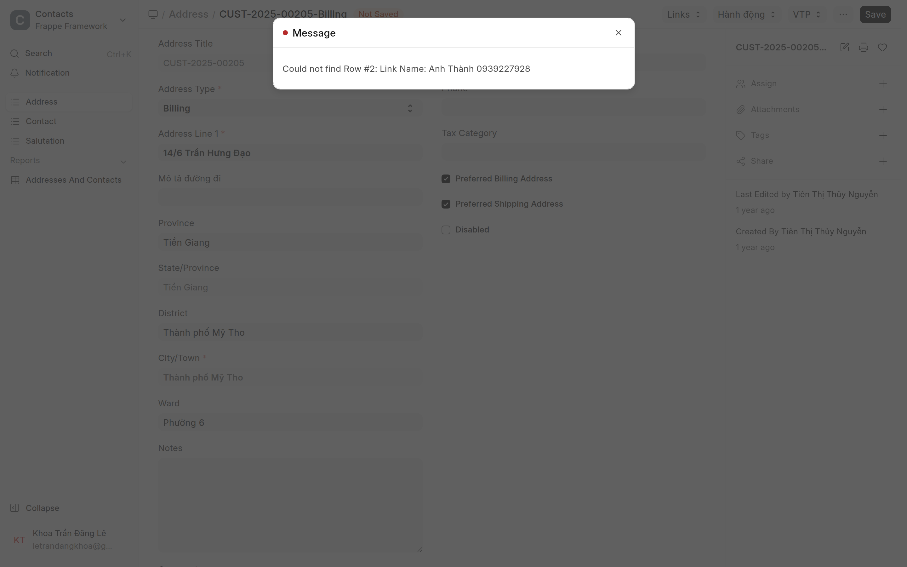
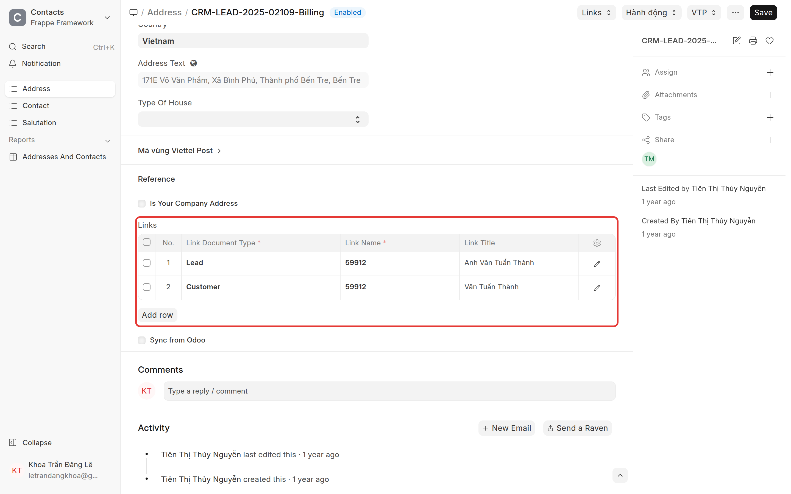
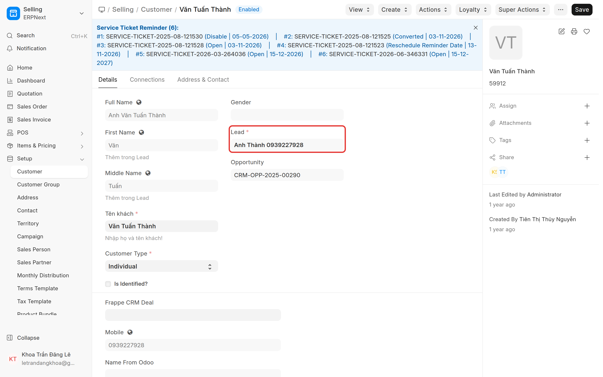
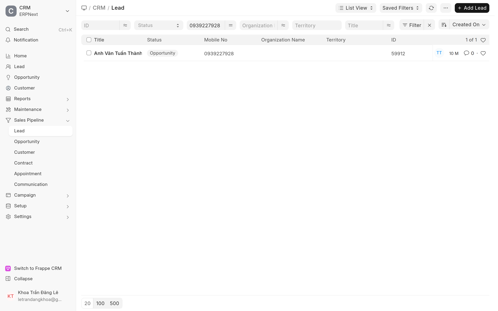
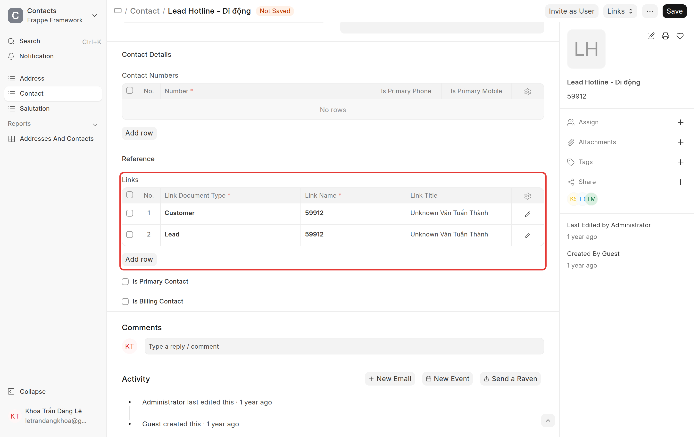

# Sửa lỗi liên kết Khách hàng (Lead / Contact / Address)
{: .no_toc }

**Dành cho:** CSKH / Quản trị bán hàng / System Manager · **Doctype:** Customer, Lead, Contact, Address
{: .fs-3 .text-grey-dk-000 }

> Khi tạo / lưu / xác nhận **Sales Order** (hoặc lưu Contact, Address) hệ thống báo lỗi đỏ kiểu:
>
> **`Could not find Row #2: Link Name: <một cái tên>`**
>
> Đây **không phải lỗi của đơn hàng**, mà do **dữ liệu liên kết của Khách hàng bị sai/thiếu**: Khách hàng đang trỏ tới một **Lead không còn tồn tại**, hoặc thiếu **Contact / Address**. Tài liệu này hướng dẫn tự xử lý trên Desk.

---

## Nguyên nhân gốc (đọc 30 giây)

Khách hàng (**Customer**) có một field **Lead** (một số bản hiển thị nhãn "From Lead") trỏ tới Lead nguồn. Trong quá trình đồng bộ, **Lead bị đổi tên** (ví dụ từ "Anh Thành 0939227928" → mã số "59912") nhưng field **Lead** trên Customer vẫn giữ **tên cũ** → trỏ vào Lead **không còn tồn tại**.

Khi lưu đơn (hoặc lưu Address/Contact), hệ thống tự liên kết lại Khách – Lead, gặp cái tên cũ này → báo `Could not find ... : <tên cũ>`.

Cái tên xuất hiện sau chữ **`Link Name:`** trong thông báo lỗi chính là **giá trị sai** cần sửa.

---

## Cơ chế tự liên kết: Lead ⇄ Customer

Trên **Address** và **Contact** có bảng **Links** (nằm trong mục **Reference**) — nơi gắn Khách hàng / Lead vào địa chỉ, liên hệ.

Hệ thống **tự nối Lead ⇄ Customer** cho nhau: **chỉ cần gắn 1 trong 2** (ví dụ chỉ link **Customer**), khi **Save** nó **tự kéo Lead tương ứng vào** — và ngược lại. *Điều kiện: Khách hàng đã trỏ **đúng** Lead.*

> Đây cũng chính là lý do sinh lỗi: nếu **Customer trỏ sai Lead**, lúc tự kéo Lead vào sẽ vớ phải Lead không tồn tại → `Could not find...`. Vì vậy **sửa đúng Lead trên Customer** (Tình huống 1) là cách trị tận gốc.

---

## Tình huống 1 — Customer trỏ sai Lead

> Dấu hiệu: lỗi `Could not find ... Link Name: <tên>`, trong đó `<tên>` **không phải** mã Lead chuẩn (thường là tên người + số điện thoại).

### Bước 1. Ghi lại cái tên sai

Đọc thông báo lỗi, copy phần sau `Link Name:` — ví dụ `Anh Thành 0939227928`.

### Bước 2. Mở Khách hàng đang lỗi

- Trên Sales Order, xem field **Customer** (mã) và **Customer Name** (tên).
- Mở Khách hàng: Desk → ô tìm kiếm gõ **"Customer"** → mở đúng khách. URL: `/app/customer`.
- Ghi lại **số điện thoại** của khách (field **Mobile** trên Customer, hoặc số ghi trong đơn).

### Bước 3. Tìm lại Lead ĐÚNG qua số điện thoại

- Mở danh sách Lead: Desk → gõ **"Lead"** → **Lead List**. URL: `/app/lead`.
- Bấm **Filter** → **Mobile No** = số điện thoại của khách (hoặc gõ thẳng số vào ô lọc cột **Mobile No**).
- Đối chiếu để chắc đúng người: **Tên + Số điện thoại** trùng khớp với khách.
- Ghi lại **mã Lead đúng** ở cột **ID** (ví dụ `59912` hoặc `CRM-LEAD-2025-02109`).

> 💡 Nếu một số điện thoại ra **nhiều Lead**, chọn Lead có **trạng thái đã chuyển đổi (Converted / Opportunity)** và thông tin trùng khớp nhất với khách.

### Bước 4. Trỏ lại cho đúng

- Quay lại **Customer** → field **Lead**.
- **Xoá** giá trị sai → chọn lại **Lead đúng** vừa tìm ở Bước 3.
- Bấm **Save** (⌘/Ctrl + S).

> ⚠️ Nếu field **Lead** bị **khoá (read-only)**, không sửa được trực tiếp → báo **System Manager / Quản trị** sửa giúp (xem mục [Khi không sửa được trên form](#khi-không-sửa-được-trên-form)).

### Bước 5. Lưu lại đơn hàng

Quay lại Sales Order → **Save / Submit** lại. Lỗi sẽ hết.

---

## Tình huống 2 — Customer thiếu / chưa liên kết Contact, Address

> Dấu hiệu: đơn báo thiếu **Contact Person / Address**, hoặc khách không hiện thông tin liên hệ — dù khách này thực ra **đã có** Contact/Address từ trước (tạo theo Lead).

Nguyên tắc: **tìm xem Contact/Address đã tồn tại chưa** (qua SĐT / tên) rồi **liên kết lại** về Khách hàng — **không tạo trùng**.

### Bước 1. Kiểm tra Khách hàng đang có gì

- Mở **Customer** → kéo xuống phần **Contact & Address Details** (hoặc sidebar **Connections**).
- Xem **Customer Primary Contact** / **Customer Primary Address** đã có chưa.

### Bước 2. Tìm Contact đã tồn tại

- Desk → **"Contact"** → **Contact List**. URL: `/app/contact`.
- Tìm theo **số điện thoại** hoặc **tên khách**.
- **Nếu tìm thấy đúng Contact:**
  - Mở Contact → bảng **Links** (trong mục **Reference**) → **Add Row**.
  - **Link Document Type** = `Customer` · **Link Name** = chọn đúng Khách hàng.
  - **Save**.

> 💡 **Chỉ cần thêm Customer** — khi Save, **Lead sẽ tự được kéo vào** (xem mục **Cơ chế tự liên kết** ở trên).

### Bước 3. Tìm Address đã tồn tại

- Desk → **"Address"** → **Address List**. URL: `/app/address`.
- Tìm theo **số điện thoại / tên / đường**.
- **Nếu tìm thấy đúng Address:**
  - Mở Address → bảng **Links** (mục **Reference**) → **Add Row** → **Link Document Type** = `Customer`, **Link Name** = Khách hàng → **Save**.
  - Cũng vậy: chỉ cần thêm **Customer**, **Lead tự vào** khi Save (ảnh minh hoạ ở mục **Cơ chế tự liên kết**).

### Bước 4. Nếu chưa thấy — tìm qua Lead đã liên kết

- Mở Khách hàng → field **Lead** → mở **Lead** đó.
- Lead nguồn thường **đã có sẵn Contact/Address**. Vào các Contact/Address của Lead → thêm **Link = Customer** như Bước 2–3.

> 💡 Nếu **Lead** đang sai → xử lý **Tình huống 1** trước, rồi quay lại bước này.

### Bước 5. Nếu thật sự chưa có — tạo mới từ Customer

- Mở Customer → menu **Create** (góc trên) → **Contact** / **Address**.
- Điền **tên + số điện thoại** (và địa chỉ với Address) → **Save**. Cách này **tự động liên kết** về Khách hàng.

### Bước 6. Đặt liên hệ / địa chỉ chính

- Quay lại Customer → chọn **Customer Primary Contact** và **Customer Primary Address** → **Save**.
- Mở lại Sales Order → chọn lại **Contact Person / Address** nếu cần → **Save / Submit**.

---

## Khi không sửa được trên form

Nếu field **Lead** bị **khoá (xám / read-only)**, hoặc bạn không chắc thao tác — **đừng cố sửa**. Gửi cho **bộ phận kỹ thuật / Quản trị** kèm 2 thông tin:

- **Mã Khách hàng** đang lỗi (ví dụ `59912`),
- **Mã Lead đúng** (tìm được ở **Tình huống 1 — Bước 3**).

Bộ phận kỹ thuật / Quản trị sẽ chỉnh lại giúp.

---

## ⚠️ Lỗi thường gặp

| Hiện tượng | Cách xử |
|---|---|
| `Could not find Row #2: Link Name: <tên người + SĐT>` | Customer **Lead** trỏ Lead đã đổi tên → **Tình huống 1** |
| Tìm SĐT ra **nhiều Lead** | Chọn Lead **đã chuyển đổi** + thông tin khớp nhất |
| Sửa **Lead** không được (xám/khoá) | Field read-only → nhờ **System Manager** (mục [Khi không sửa được](#khi-không-sửa-được-trên-form)) |
| Lưu xong vẫn lỗi cái tên khác | Còn Customer/Contact/Address khác cùng khách bị sai → lặp lại quy trình cho từng cái |
| Lỡ tạo **trùng** Contact/Address | Xoá cái mới tạo, dùng lại cái cũ đã liên kết |

---

## Phòng ngừa

- Khi **gộp / đổi tên** Lead, kiểm tra lại field **Lead** trên các Customer liên quan.
- Trước khi tạo Contact/Address mới, **luôn tìm theo số điện thoại** để tránh trùng.
- Gặp khách bị lỗi lặp lại nhiều lần → báo bộ phận kỹ thuật rà soát hàng loạt (đây là tồn dư từ đợt đồng bộ dữ liệu).
